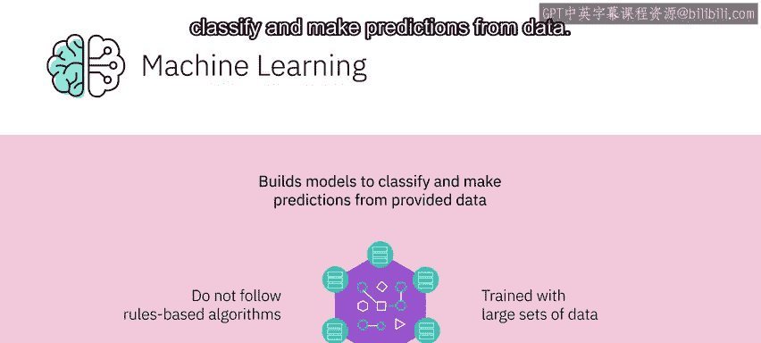
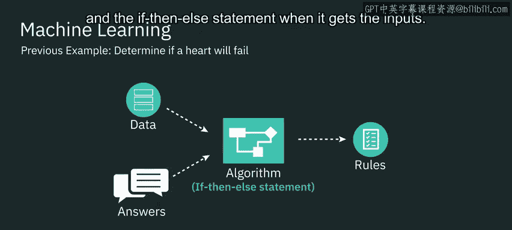
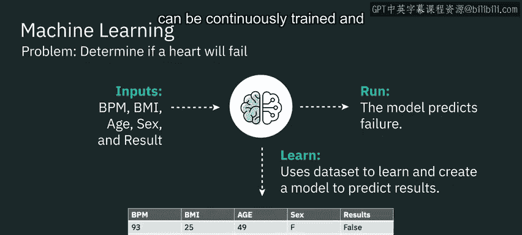
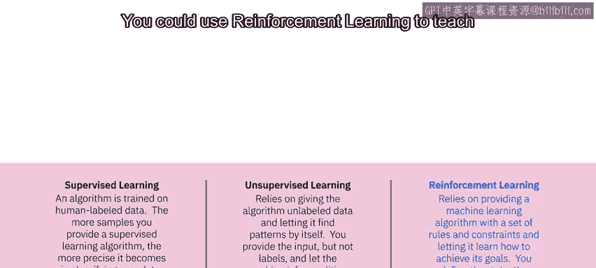
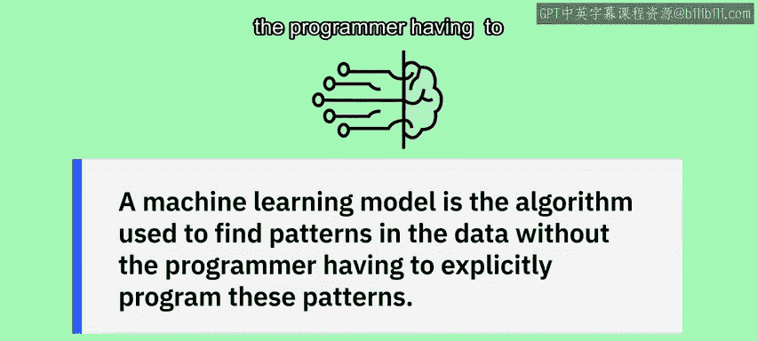

# 013：机器学习核心概念 🧠

在本节课中，我们将要学习机器学习的基本概念，了解它与传统编程的区别，并认识三种主要的机器学习类型。

---

## 什么是机器学习？

机器学习是人工智能的一个子集。它使用计算机算法分析数据，并基于学习到的信息做出智能决策，而不是遵循基于规则的算法。机器学习通过构建模型来对数据进行分类和预测。

为了理解这个概念，我们可以探索一个可能用机器学习解决的问题。

假设我们想判断心脏是否会衰竭。这是否能用机器学习解决？答案是肯定的。假设我们拥有一些数据，例如每分钟心跳次数、身体质量指数、年龄、性别，以及结果——心脏是否衰竭。

利用机器学习，给定这些数据，我们能够学习并创建一个模型。该模型在给定输入后可以预测结果。

---

## 机器学习与传统编程的区别

那么，这与使用统计分析创建算法有何不同？

算法是一种数学技术。在传统编程中，我们获取**数据**和**规则**，并用它们来开发一个能给出答案的算法。

在上一个例子中，如果使用传统算法，我们会获取如每分钟心跳次数和身体质量指数等数据，并用这些数据创建一个算法来判断心脏是否会衰竭。本质上，这将是一个 `if-then-else` 语句。当我们提交输入时，会根据我们确定的算法得到答案，而这个算法本身不会改变。

**传统编程流程：**
`数据 + 规则 -> 算法 -> 答案`

另一方面，机器学习则采用**数据**和**答案**来创建算法。我们最终得到的不是答案，而是一组决定机器学习模型形态的规则。模型在获得输入时，会自行确定规则和 `if-then-else` 逻辑。

**机器学习流程：**
`数据 + 答案 -> 算法（模型）`

本质上，模型所做的是确定传统算法中的参数。我们不是武断地决定“每分钟心跳次数 + 身体质量指数 = 某个结果”，而是使用模型来确定逻辑是什么。与传统算法不同，这个模型可以持续训练，并在未来用于预测新值。

机器学习依赖于通过检查和比较大型数据集来发现共同模式，从而定义行为规则。

---

## 机器学习的三种主要类型

机器学习主要分为三种类型：监督学习、无监督学习和强化学习。

### 1. 监督学习 👁️

例如，我们可以向机器学习程序提供大量鸟类图片，并训练模型在提供鸟类图片时返回标签“鸟”。我们也可以为“猫”创建一个标签，并提供猫的图片进行训练。

当机器学习模型看到一张猫或鸟的图片时，它会以一定的置信度给图片贴上标签。这种类型的机器学习被称为**监督学习**，即算法在人类标记的数据上进行训练。

你为监督学习算法提供的样本越多，它在分类新数据时就变得越精确。

### 2. 无监督学习 🔍

另一种机器学习类型是**无监督学习**。它依赖于向算法提供未标记的数据，并让它自行发现模式。你提供输入，但不提供标签，让机器推断特征。

算法接收未标记的数据，进行推断并发现模式。这种学习对于数据聚类很有用，即根据数据与邻近数据的相似性以及与其他所有数据的差异性进行分组。

数据聚类后，可以使用不同的技术来探索这些数据并寻找模式。例如，你可以向机器学习算法提供持续的网络流量数据流，让它独立学习基线正常网络活动，以及网络上可能发生的异常和恶意行为。

### 3. 强化学习 🎮

第三种机器学习算法是**强化学习**。它依赖于向机器学习算法提供一组规则和约束，并让它学习如何实现目标。你定义状态、期望目标、允许的动作和约束。

算法通过尝试不同的允许动作组合来找出如何实现目标，并根据决策的好坏获得奖励或惩罚。算法在提供的约束范围内尽力最大化其奖励。你可以使用强化学习来教机器下国际象棋或穿越障碍路线。

---

## 总结

本节课中，我们一起学习了机器学习的核心概念。我们了解到机器学习是让计算机从数据中学习并做出决策，这与传统基于固定规则的编程有本质区别。我们重点探讨了三种主要的机器学习范式：

*   **监督学习**：使用带标签的数据进行训练，用于分类和预测。
*   **无监督学习**：使用未标记的数据自行发现模式和结构，如聚类。
*   **强化学习**：通过与环境的交互和奖惩机制来学习达成目标的最佳策略。

机器学习模型就是用于发现数据中模式的算法，而无需程序员显式地编程这些模式。理解这些基础是进一步探索人工智能应用的重要一步。