# 014：机器学习技术与训练 🧠

在本节课中，我们将学习机器学习的基本分类、核心概念以及模型训练与评估的过程。我们将探讨监督学习、无监督学习和强化学习的区别，并深入了解分类、回归等具体任务。

---

机器学习是一个广泛的领域，我们可以将其分为三个不同的类别：监督学习、无监督学习和强化学习。我们可以用这些技术解决许多不同的任务。

监督学习指的是数据中包含类别标签，我们利用这些标签来构建分类模型。这意味着当我们接收数据时，数据带有说明其含义的标签。

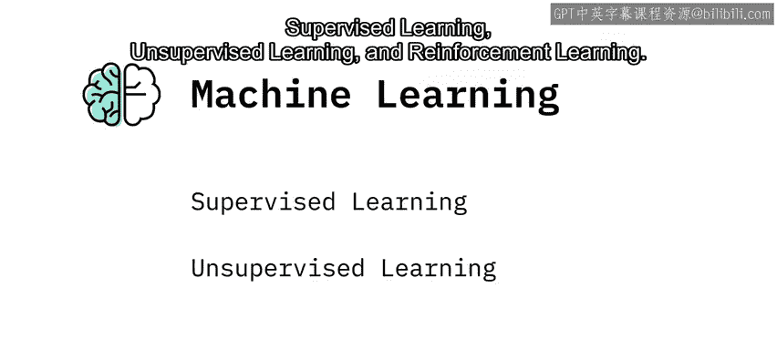

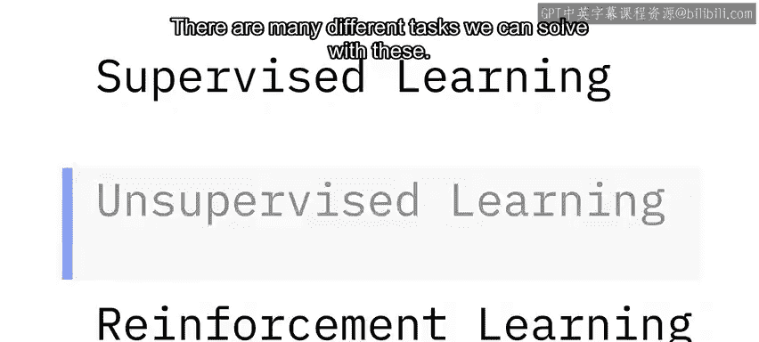

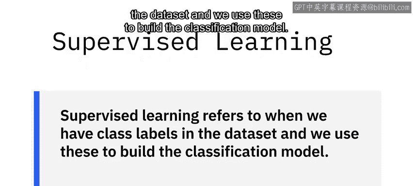

在之前的例子中，我们有一个包含“年龄”或“性别”等标签的表格。

对于无监督学习，我们没有类别标签，必须从非结构化数据中发现类别标签。这可能涉及深度学习等技术，例如通过查看图片来训练模型。

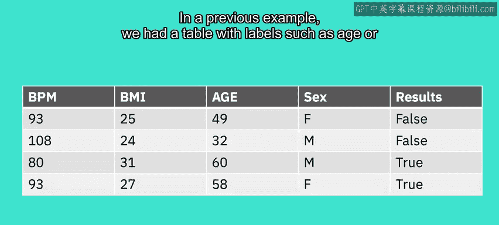

这类任务通常通过一种称为“聚类”的方法来完成。

强化学习是另一个子集，它使用奖励函数来惩罚不良行为或奖励良好行为。

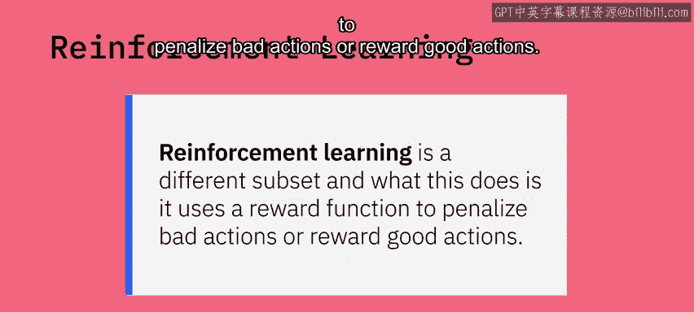

---

## 监督学习的细分 📊

上一节我们介绍了机器学习的三大类别，本节中我们来看看监督学习的具体细分。

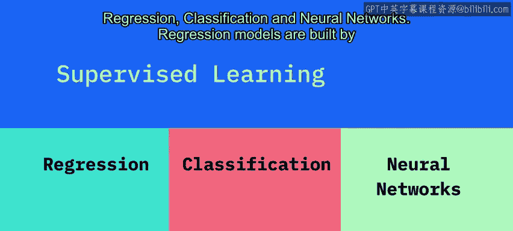

监督学习可以进一步分为三个类别：回归、分类和神经网络。

回归模型通过观察特征 **X** 与结果 **Y** 之间的关系来构建，其中 **Y** 是一个连续变量。

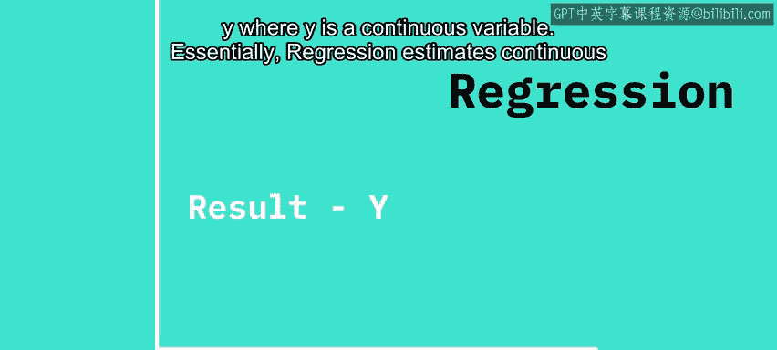

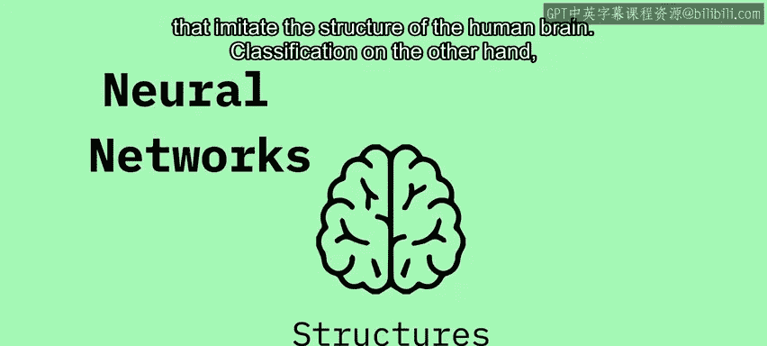

本质上，回归用于估计连续值。

神经网络指的是模仿人脑结构的模型。

---

## 理解分类任务 🏷️

了解了回归之后，我们来看看分类任务。

分类则侧重于离散值。它根据许多输入特征 **X** 来分配离散的类别标签 **Y**。

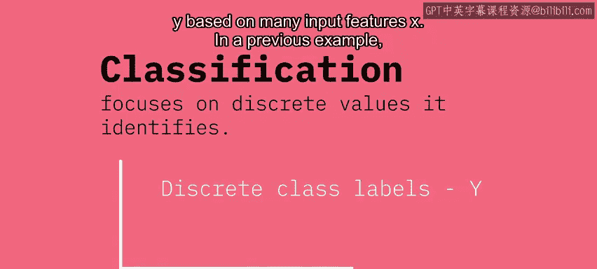

在之前的例子中，给定一组特征 **X**，如每分钟心跳次数、身体质量指数、年龄和性别，算法将输出 **Y** 分类为两个类别：真或假，以预测心脏是否会衰竭。

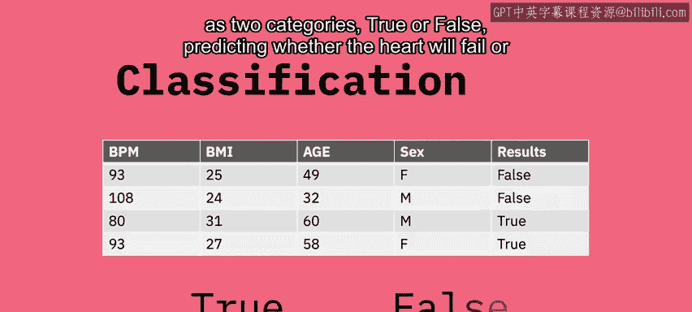

在其他分类模型中，我们可以将结果分为两个以上的类别。例如，预测一个食谱是属于印度菜、中国菜、日本菜还是泰国菜。

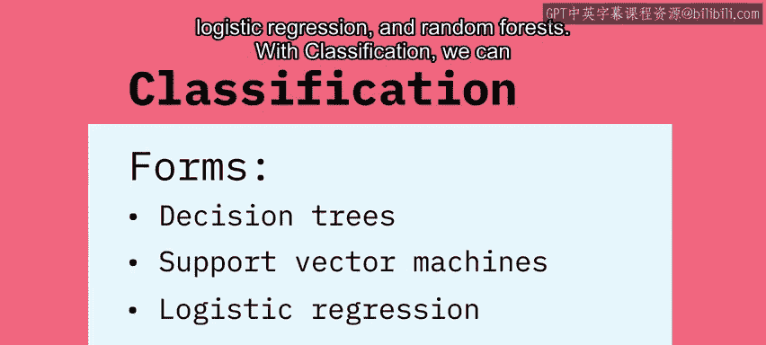

以下是几种常见的分类形式：
*   决策树
*   支持向量机
*   逻辑回归
*   随机森林

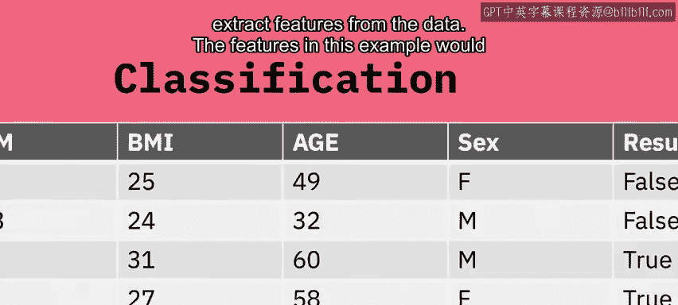

---

## 特征与训练过程 ⚙️

在分类中，我们可以从数据中提取特征。在这个例子中，特征就是每分钟心跳次数或年龄。

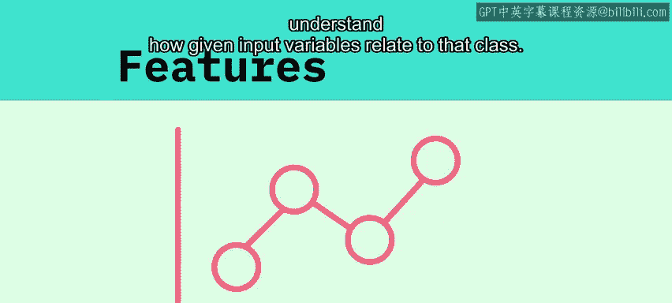

特征是输入模式的独特属性，有助于确定输出的类别。每一列是一个特征，每一行是一个数据点。

分类是预测给定数据点类别的过程。我们的分类器使用一些训练数据来理解给定的输入变量与该类别之间的关系。

那么“训练”具体指什么呢？训练指的是使用学习算法来确定和开发模型的参数。虽然有许多算法可以实现这一点，通俗地说，如果你正在训练一个模型来预测心脏是否会衰竭（即真或假值），你会向算法展示一些标记为“真”的真实数据，然后再向算法展示一些标记为“假”的数据，并重复这个过程，数据带有真或假值（即心脏是否真的衰竭了）。

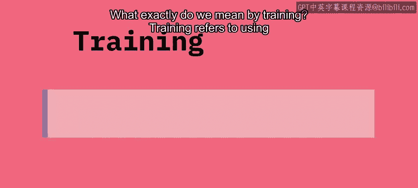

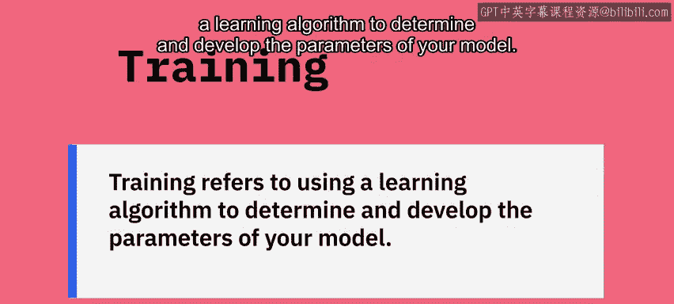

算法会修改其内部值，直到学会从指示心脏衰竭（真）或未衰竭（假）的数据中进行区分。

---

## 数据集划分与模型评估 📈

在机器学习中，我们通常将一个数据集分成三个部分：训练集、验证集和测试集。

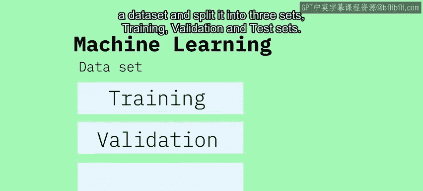

以下是每个部分的作用：
*   **训练子集**：用于训练算法的数据。
*   **验证子集**：用于验证我们的结果并微调算法的参数。
*   **测试数据**：模型从未见过的数据，用于评估我们的模型有多好。

然后，我们可以使用准确率、精确率和召回率等术语来表明模型的好坏。

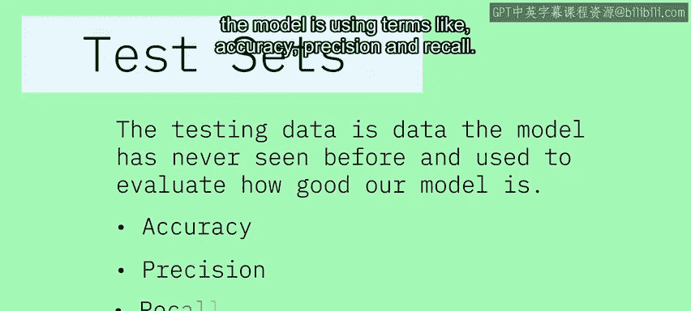

---

## 总结 ✨

本节课中，我们一起学习了机器学习的主要分类：监督学习、无监督学习和强化学习。我们深入探讨了监督学习下的回归与分类任务，理解了特征的含义以及模型训练的基本过程。最后，我们了解了如何将数据集划分为训练集、验证集和测试集，并利用测试集来评估模型的性能。掌握这些基础概念是构建有效AI模型的第一步。