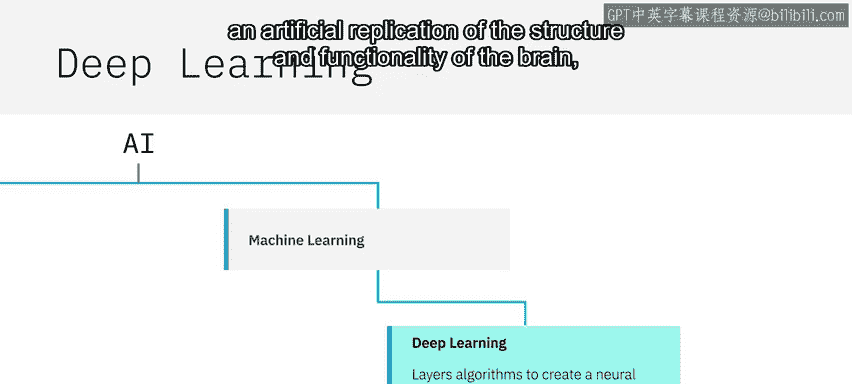
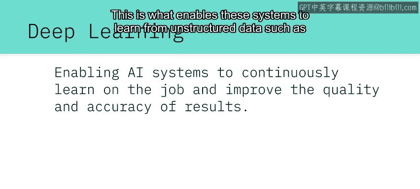
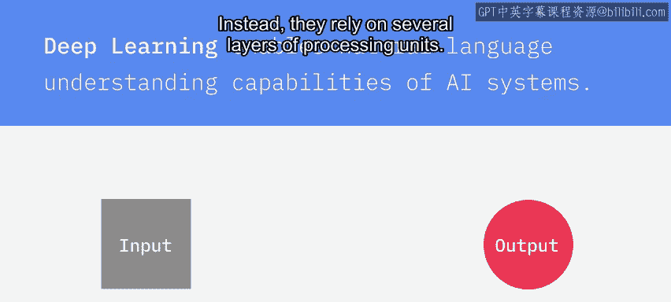
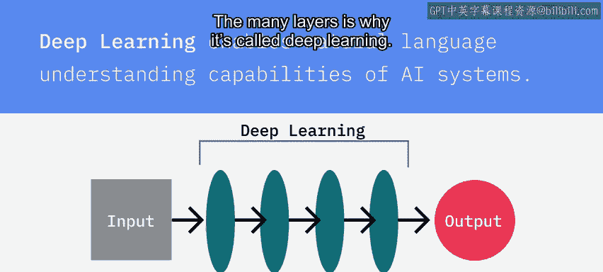
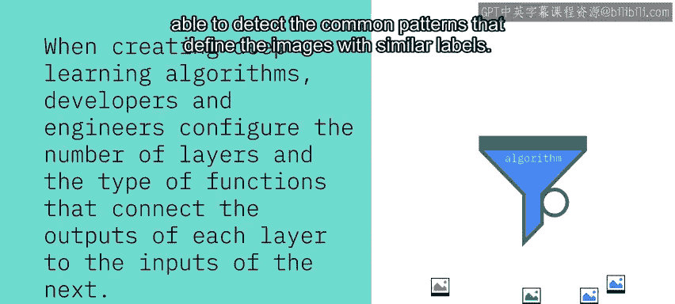
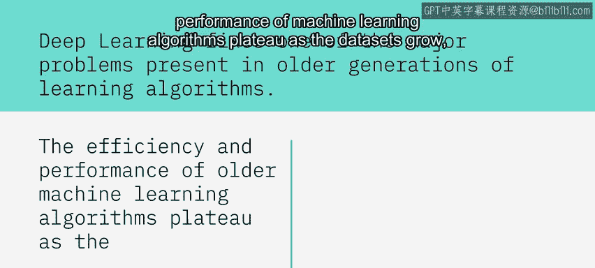

# 015：深度学习 🧠

在本节课中，我们将要学习深度学习的核心概念、工作原理及其在人工智能领域的重要应用。深度学习是机器学习的一个专门子集，它通过模拟人脑的神经网络结构，使AI系统能够从非结构化数据中持续学习并提升性能。

---

## 什么是深度学习？

机器学习是人工智能的一个子集，而深度学习是机器学习的一个专门子集。

深度学习通过分层算法构建神经网络，这是一种对大脑结构和功能的人工模拟。这种结构使得AI系统能够在工作中持续学习，并提高结果的质量与准确性。

正是这种能力，使得系统能够从照片、视频和音频文件等非结构化数据中学习。

---

## 深度学习如何工作？

上一节我们介绍了深度学习的基本定义，本节中我们来看看它的工作原理。

深度学习算法并非直接将输入映射到输出。相反，它们依赖于多层处理单元。每一层将其输出传递给下一层，由下一层进行处理后再继续传递。正是由于存在许多层，它才被称为“深度”学习。

在创建深度学习算法时，开发者和工程师需要配置网络的层数以及连接各层输入与输出的函数类型。

其核心结构可以抽象为以下公式：
`输出 = 层_n( ... 层_2( 层_1(输入) ) ... )`

然后，他们通过提供大量带标注的示例来训练模型。例如，如果你给一个深度学习算法成千上万张图片以及对应每张图片内容的标签，该算法会将这些示例通过其分层的神经网络运行，并调整神经网络每一层中变量的权重，以便能够识别出具有相似标签的图片所共有的模式。

以下是深度学习训练过程的简要步骤：
1.  **准备数据**：收集并标注大量数据。
2.  **构建网络**：确定层数、每层的神经元数量及激活函数。
3.  **前向传播**：输入数据通过网络层层传递，得到预测输出。
4.  **计算损失**：比较预测输出与真实标签，计算误差（损失）。
5.  **反向传播**：将误差从输出层向输入层反向传播，计算各层参数的梯度。
6.  **更新权重**：使用优化算法（如梯度下降）根据梯度调整网络权重。

---

## 深度学习的优势

深度学习解决了一个存在于早期学习算法中的主要问题。当数据集增长时，传统机器学习算法的效率和性能会达到瓶颈，而深度学习算法随着被喂入更多数据，性能会持续提升。

这一点可以直观地理解为：**更多的数据 → 更准确的模型**。

---

## 深度学习的应用

深度学习已被证明在各种任务中非常高效，其应用广泛。

以下是深度学习的一些主要应用领域：
*   **图像标注**：自动为图片生成描述性文字。
*   **语音识别与转录**：将语音转换为文本。
*   **人脸识别**：识别和验证个人身份。
*   **医学影像分析**：辅助诊断疾病（如分析X光片、MRI图像）。
*   **语言翻译**：实现高质量、上下文相关的机器翻译。

此外，深度学习也是无人驾驶汽车的主要技术组件之一。

---

## 总结

本节课中我们一起学习了深度学习。我们了解到深度学习是机器学习的一个强大分支，它利用多层神经网络结构来模拟人脑的学习过程。这种结构使其能够处理复杂的非结构化数据，并随着数据量的增加而不断改进性能。从图像识别到自动驾驶，深度学习正在推动人工智能技术在许多领域取得突破性进展。