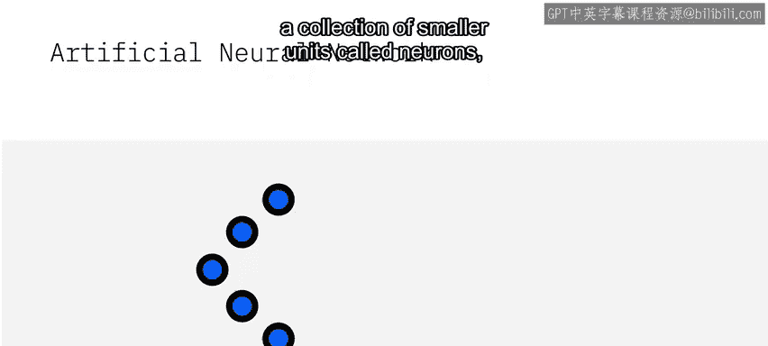
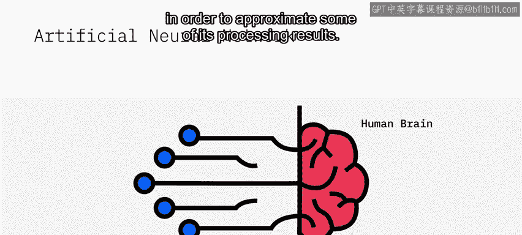
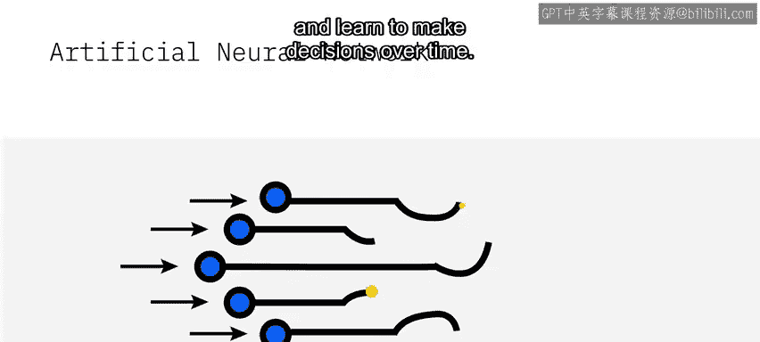
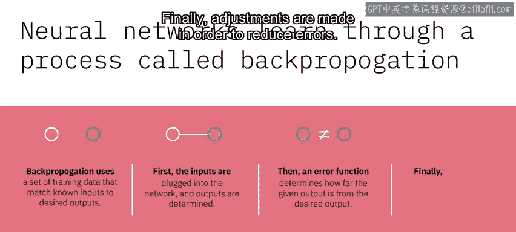
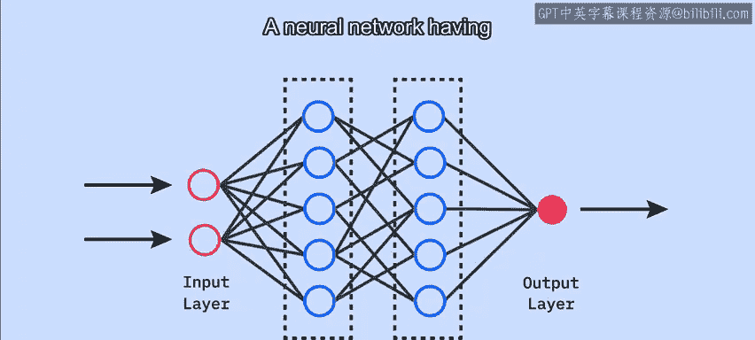
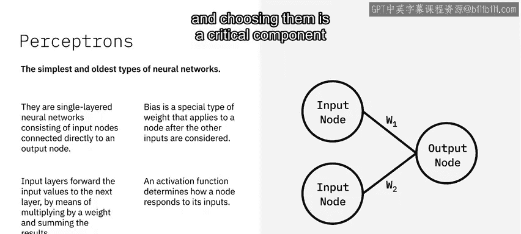
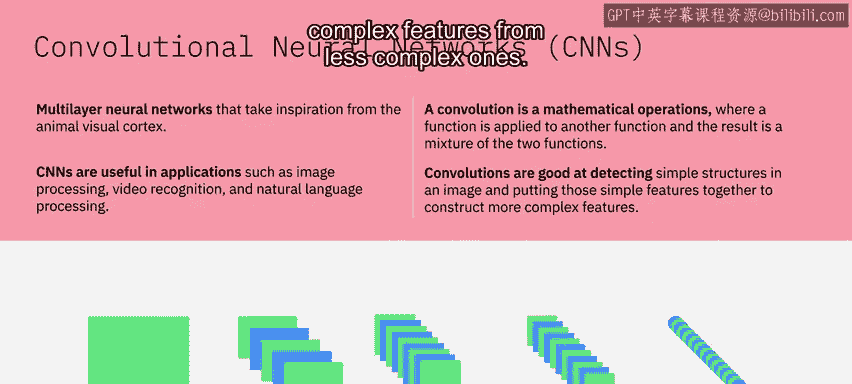
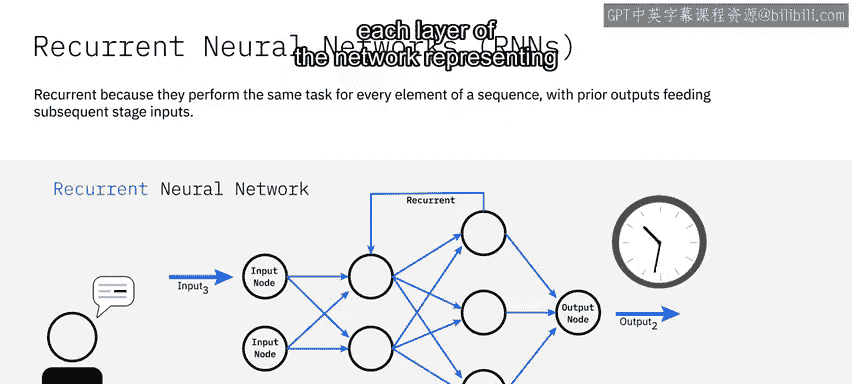

# 016：神经网络 🧠

在本节课中，我们将要学习人工智能的核心技术之一——神经网络。我们将了解它的基本构成、工作原理以及几种重要的网络类型。

---

## 什么是人工神经网络？ 🎼

人工神经网络是由许多被称为“神经元”的小型计算单元组成的集合。这些神经元模仿人脑处理信息的方式进行建模。人工神经网络借鉴了生物大脑神经网络的一些思想，以近似实现其部分处理结果。

这些神经元像生物神经网络一样接收输入数据，并随着时间学习如何做出决策。

---

## 神经网络如何学习？ 🔄

神经网络通过一个称为“反向传播”的过程进行学习。反向传播使用一组训练数据，这些数据将已知输入与期望输出相匹配。

以下是反向传播的基本步骤：

1.  **前向传播**：首先，将输入数据输入网络，并确定输出。
2.  **计算误差**：然后，一个误差函数会计算当前输出与期望输出之间的差距。
3.  **调整参数**：最后，对网络内部的参数（如权重）进行调整，以减少误差。

这个过程会不断重复，直到网络的预测达到可接受的准确度。

---

## 神经网络的层结构 🏗️

上一节我们介绍了神经元如何工作，本节中我们来看看它们是如何组织起来的。

一组神经元被称为一个“层”。一个层接收输入并提供输出。任何神经网络都会有一个输入层和一个输出层。它还会有一个或多个“隐藏层”，这些隐藏层模拟了人脑中进行的活动类型。

隐藏层接收一组加权的输入，并通过一个“激活函数”产生输出。拥有多个隐藏层的神经网络被称为**深度神经网络**。

以下是神经网络中不同层的功能：

*   **输入层**：将输入值乘以权重并求和，然后将结果传递给下一层。
*   **隐藏层与输出层**：接收来自其他节点的输入，并将输出传递给其他节点。它们具有一个称为“偏置”的属性，这是一种特殊的权重，在其他输入被考虑后应用于节点。
*   **激活函数**：决定节点如何响应其输入。该函数对输入和偏置的总和进行计算，然后将结果作为输出转发。激活函数可以有不同的形式（如Sigmoid, ReLU），选择何种激活函数是神经网络成功的关键组成部分。

---

## 卷积神经网络（CNN） 🖼️

了解了基础的网络结构后，我们来看看一种专门用于处理图像等网格状数据的网络——卷积神经网络。

卷积神经网络（CNN）是一种多层神经网络，其灵感来源于动物的视觉皮层。CNN在图像处理、视频识别和自然语言处理等应用中非常有用。

“卷积”是一种数学运算，其中一个函数应用于另一个函数，结果是两个函数的混合。在卷积网络中，这个过程发生在一系列层上，每一层都对前一层的输出进行卷积操作。

CNN擅长从简单的结构中检测特征，并将这些简单特征组合起来构建更复杂的特征。

---

## 循环神经网络（RNN） ⏳

最后，我们来看一种用于处理序列数据的网络——循环神经网络。

循环神经网络（RNN）之所以是“循环”的，是因为它对序列中的每个元素执行相同的任务，并且将先前的输出作为后续阶段的输入。

在普通的神经网络中，输入通过若干层处理，然后产生输出，并假设两个连续的输入是彼此独立的。但在某些场景下，这种假设可能不成立。例如，当我们需要考虑一个单词被说出时的上下文时，就必须依赖之前的观察结果来产生输出。

RNN可以利用长序列中的信息。网络的每一层都代表了在某个特定时间的观察。

---

## 总结 📝

本节课中我们一起学习了神经网络的基础知识。我们首先了解了人工神经网络的基本单元——神经元，以及它通过反向传播进行学习的过程。接着，我们探讨了神经网络的层状结构，包括输入层、隐藏层和输出层，并介绍了激活函数的作用。最后，我们学习了两种重要的专门化网络：用于图像处理的卷积神经网络（CNN）和用于序列数据的循环神经网络（RNN）。理解这些概念是构建更复杂AI应用的基础。