# 018：人工智能的三大应用领域 🧠

在本节课中，我们将学习人工智能最常见的三个应用领域：**自然语言处理**、**语音技术**和**计算机视觉**。我们将了解它们的基本概念、工作原理以及它们如何改变我们与数字世界的交互方式。

---

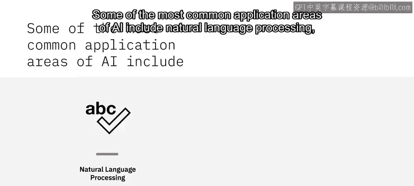

## 自然语言处理 📝

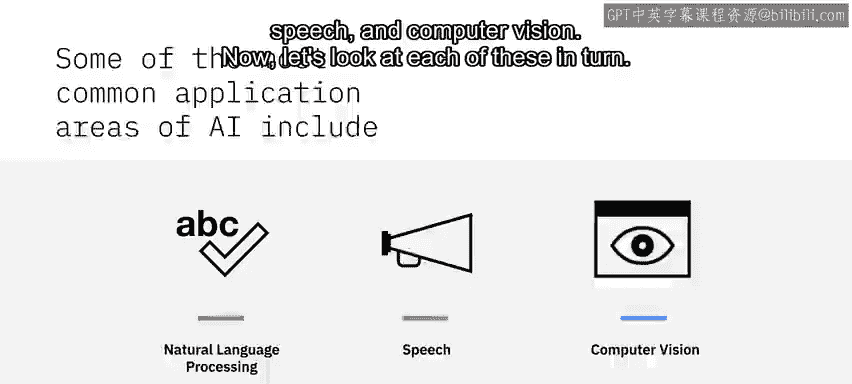

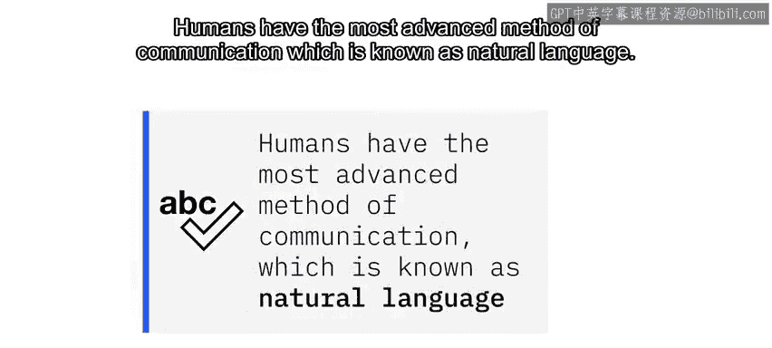

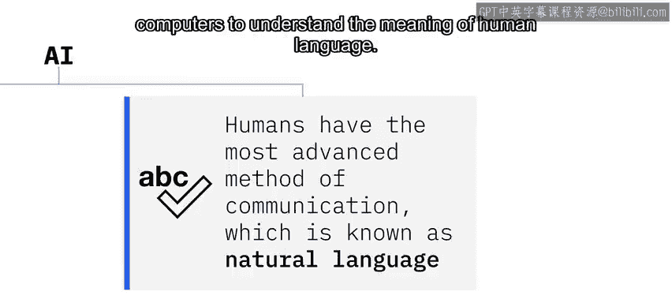

人工智能最常见的应用领域包括自然语言处理、语音和计算机视觉。现在，让我们逐一了解它们。

人类拥有最先进的交流方式，即自然语言。虽然人类可以使用计算机互相发送语音和文本消息，但计算机本身并不知道如何处理自然语言。

**自然语言处理**是人工智能的一个子集，它使计算机能够理解人类语言的含义。自然语言处理使用机器学习和深度学习算法来辨别词语的语义。

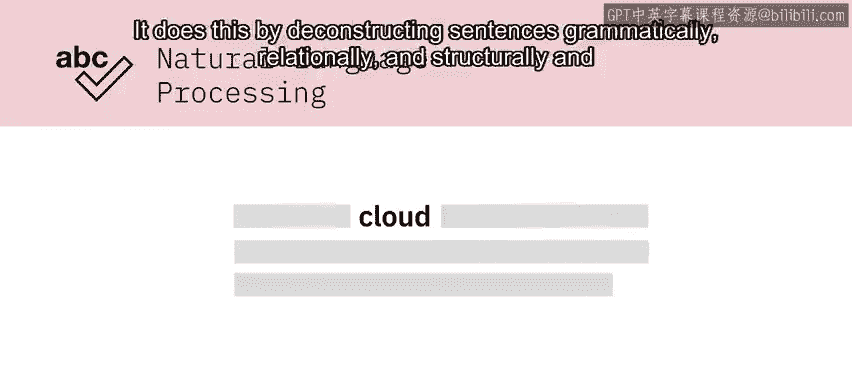

它通过语法、关系和结构上解构句子，并理解其使用语境来实现这一点。例如，根据对话的上下文，NLP可以判断“cloud”一词是指云计算，还是指天空中漂浮的大量凝结水蒸气。

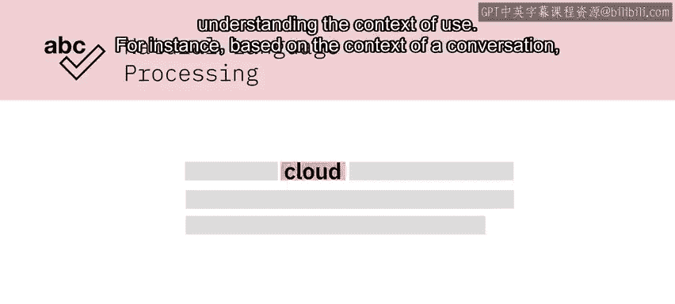

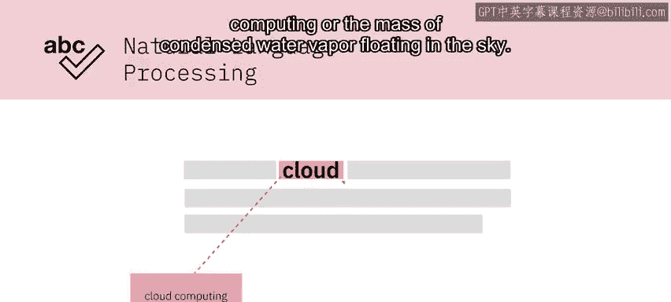

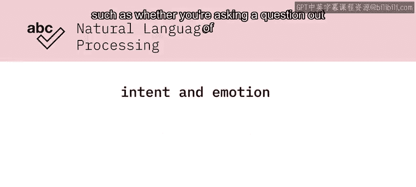

NLP系统还可能理解意图和情感，例如判断你的提问是出于沮丧、困惑还是恼怒。为了理解用户语言的真实意图，NLP系统通过一系列广泛的语言学模型和算法进行推断。

---

## 语音技术 🎤

上一节我们介绍了自然语言处理，本节中我们来看看语音技术。自然语言处理被分解为许多与音频和视觉任务相关的子类别。

为了让计算机用自然语言交流，它们需要能够将语音转换为文本，从而使交流更自然、更容易处理。它们还需要能够将文本转换为语音，使用户无需盯着屏幕即可与计算机交互。

以下是语音转文本技术的发展历程：

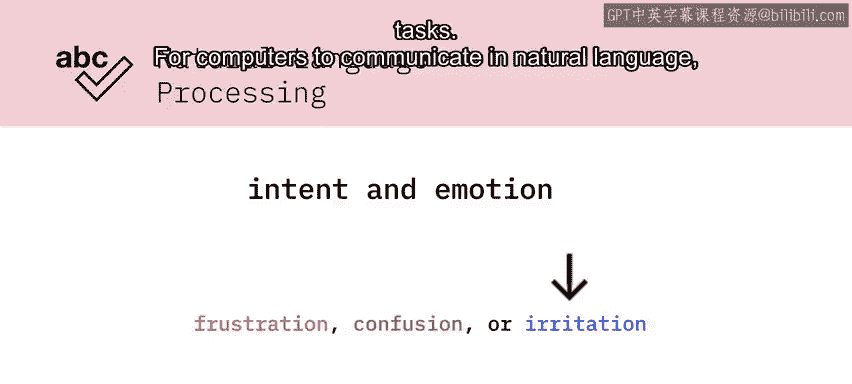

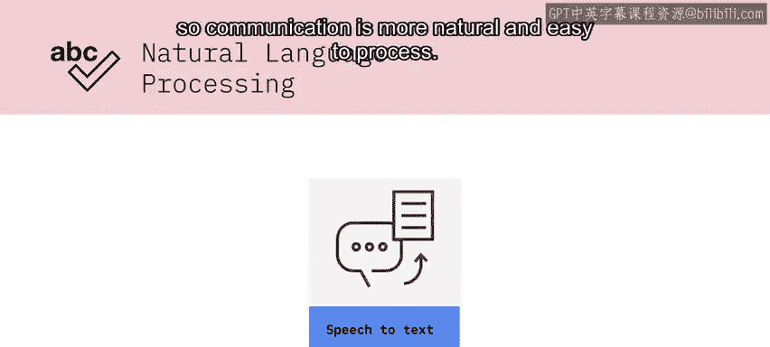

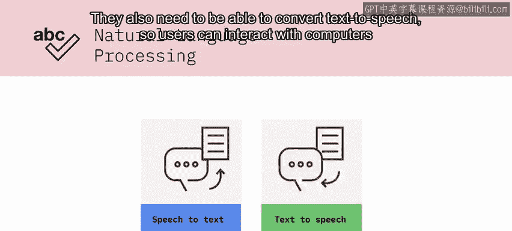

*   **传统方法**：早期的语音转文本技术需要程序员经历一个繁琐的过程，即发现并编码规则，以对语音样本进行分类并将其转换为文本。
*   **神经网络方法**：使用神经网络时，无需编码规则。你只需提供语音样本及其对应的文本。神经网络会找出单词发音之间的共同模式，然后学习将新的语音录音映射到其对应的文本。

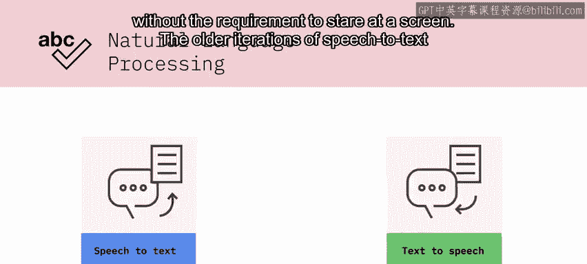

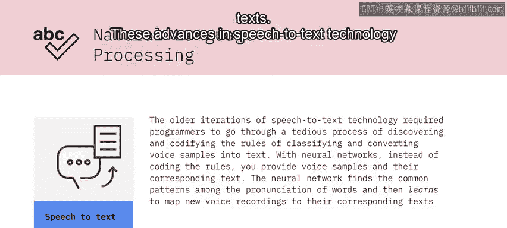

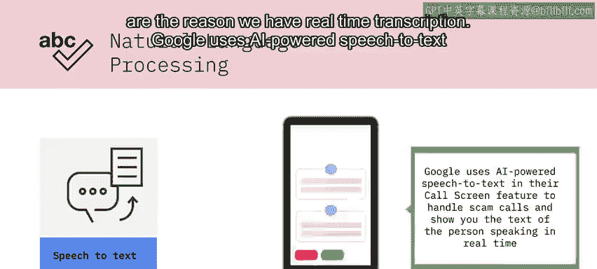

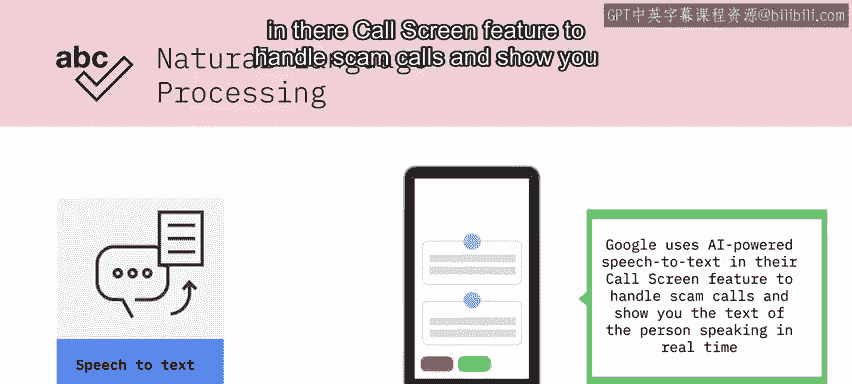

语音转文本技术的这些进步，是我们能够实现实时转录的原因。谷歌在其“来电筛选”功能中使用AI驱动的语音转文本技术来处理诈骗电话并向你显示通话内容文本。YouTube也使用此技术来提供自动字幕。

语音转文本的另一面是文本转语音，也称为语音合成。

以下是文本转语音技术的发展：

*   **过去**：创建一个语音模型需要数百小时的编码工作。
*   **现在**：在神经网络的帮助下，合成人声已成为可能。其过程通常涉及两个神经网络：
    1.  第一个神经网络（分类器）摄入一个人的大量语音样本，直到它能够判断一个新的语音样本是否属于同一个人。
    2.  第二个神经网络（生成器）生成音频数据，并将其通过第一个网络，以查看其是否验证该音频属于目标人物。如果不通过，生成器会修正其样本并再次通过分类器运行。

这两个网络重复此过程，直到生成听起来自然的样本。公司使用AI驱动的语音合成来增强客户体验，并赋予其品牌独特的声音。在医学领域，这项技术正在帮助肌萎缩侧索硬化症患者重获他们真实的声音，而不是使用计算机合成的声音。

---

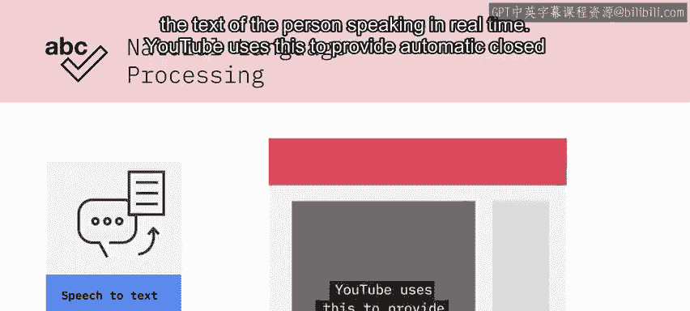

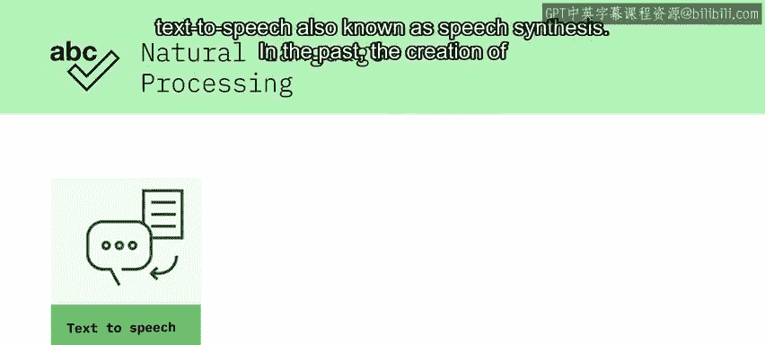

## 计算机视觉 👁️

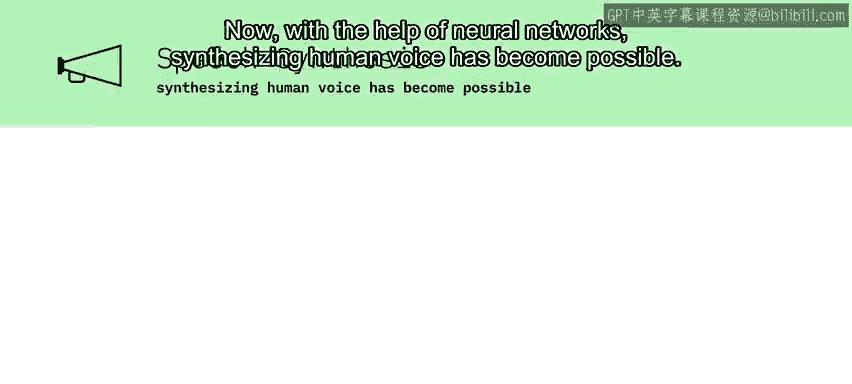

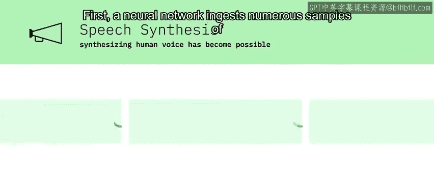

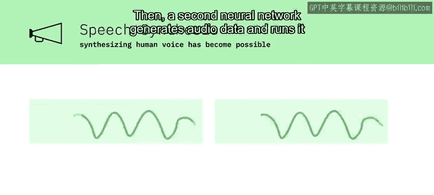

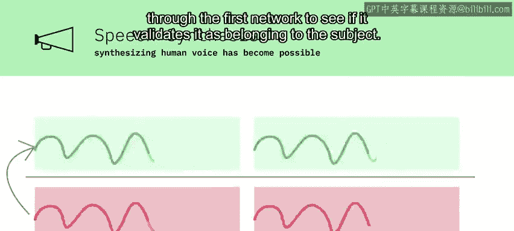

上一节我们探讨了语音技术，本节我们将聚焦于计算机视觉。

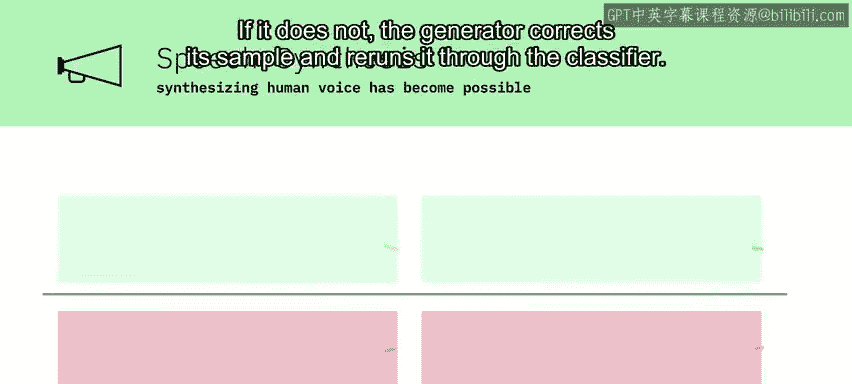

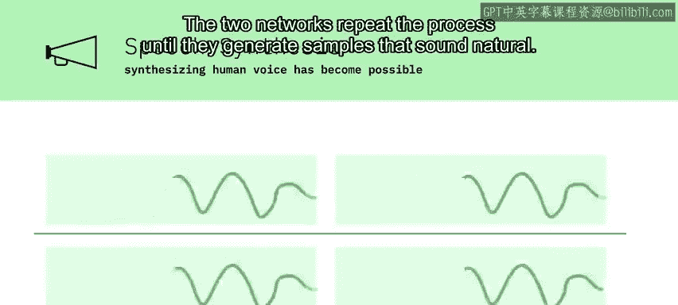

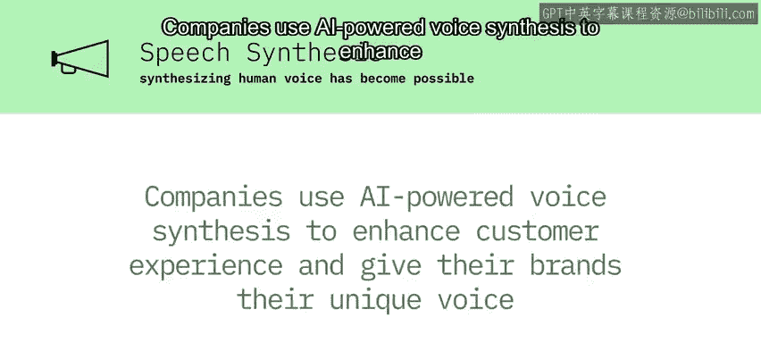

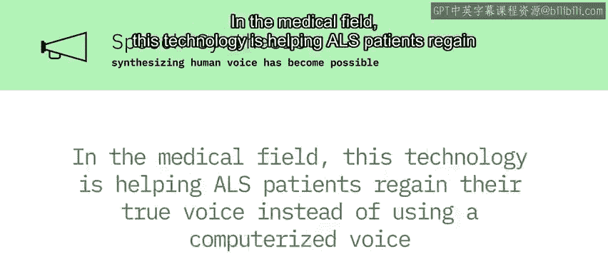

**计算机视觉**领域专注于复制人类视觉系统的部分复杂性，并使计算机能够像人类一样识别和处理图像及视频中的物体。计算机视觉是使数字世界能够与物理世界交互的技术之一。

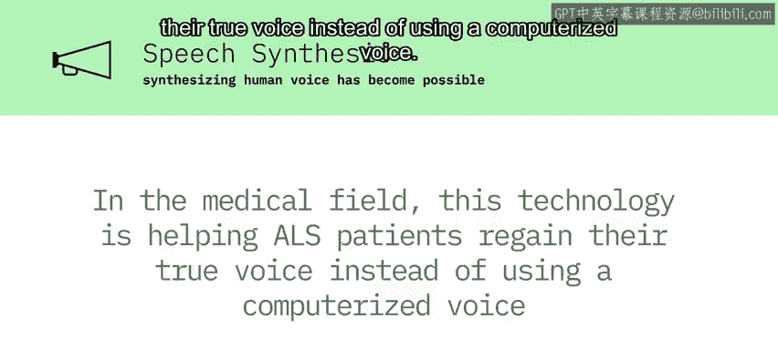

近年来，由于深度学习和神经网络的进步，计算机视觉领域取得了巨大飞跃，在检测和标记物体等相关任务上甚至超越了人类。

这项技术使自动驾驶汽车能够理解周围环境。它在人脸识别应用中扮演着至关重要的角色，使计算机能够将人脸图像与其身份匹配。它也在增强现实和混合现实中发挥着关键作用，这项技术允许智能手机、平板电脑和智能眼镜等计算机设备在真实世界图像上叠加和嵌入虚拟物体。

像谷歌相册这样的在线照片库使用计算机视觉来检测物体，并根据其包含的内容类型对图像进行分类。

---

## 总结 📚

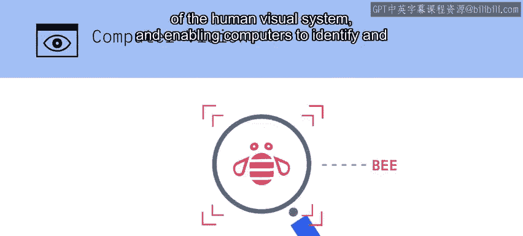

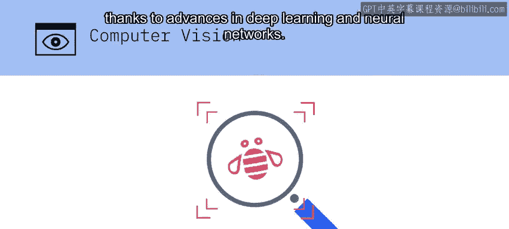

本节课中，我们一起学习了人工智能的三大核心应用领域。

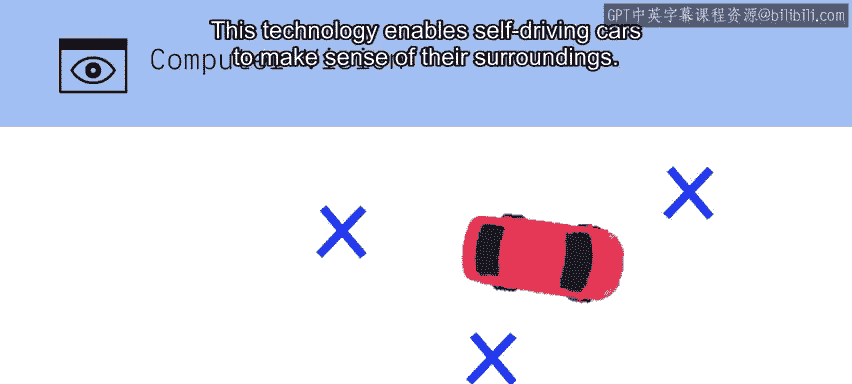

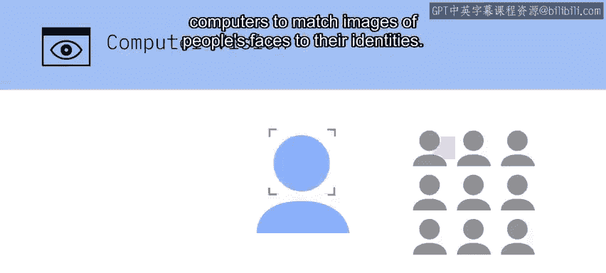

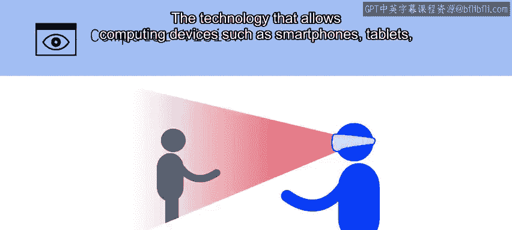

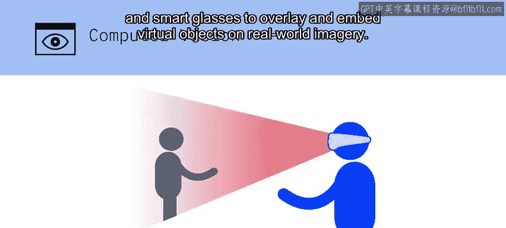

1.  **自然语言处理**：使计算机能够理解、解释和生成人类语言，关键在于理解语境和意图。
2.  **语音技术**：包括**语音转文本**和**文本转语音**，它们让人机交互更加自然便捷，其核心进步源于神经网络。
3.  **计算机视觉**：赋予计算机“看”和理解视觉世界的能力，广泛应用于自动驾驶、人脸识别和增强现实等领域。

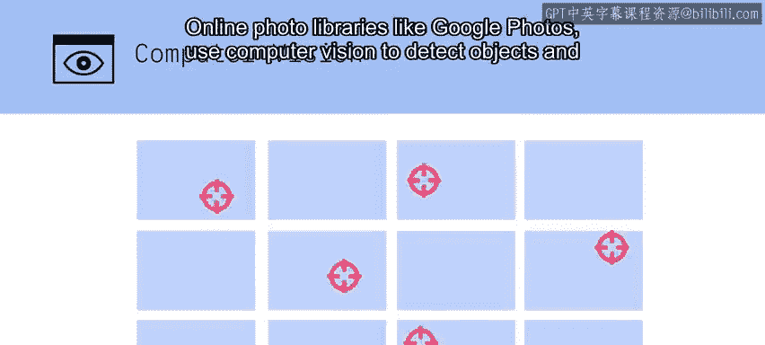

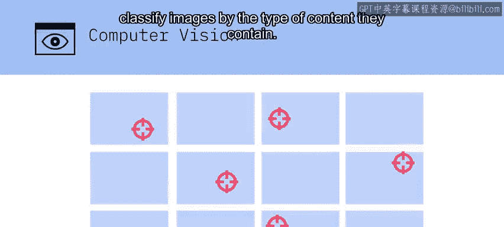

这些技术共同构成了现代AI应用的基础，正在深刻地改变我们的生活和工作方式。