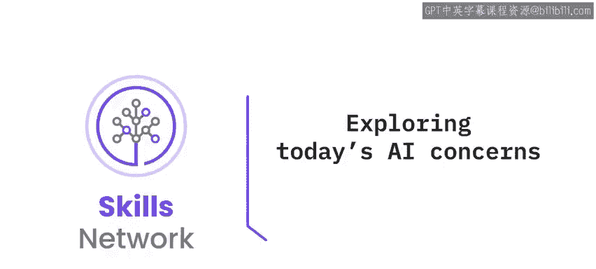
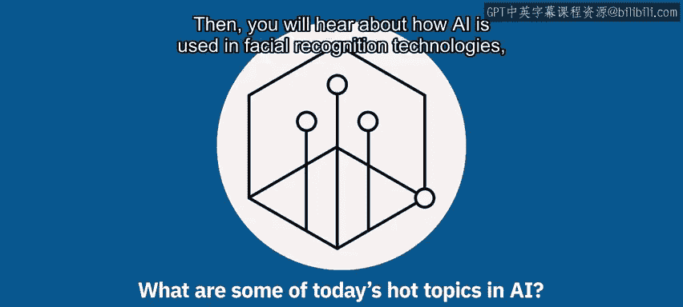
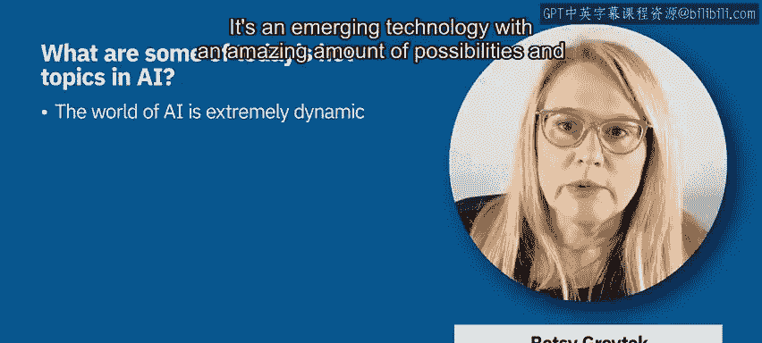
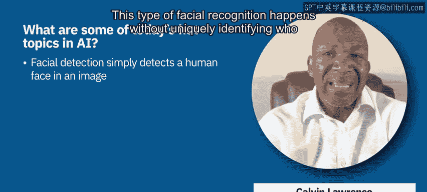
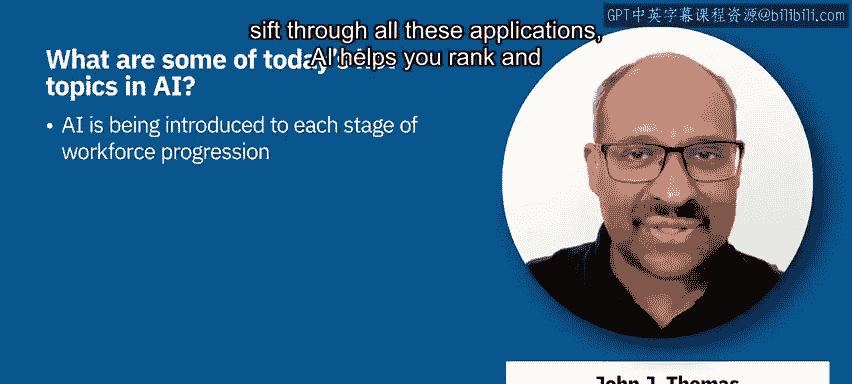
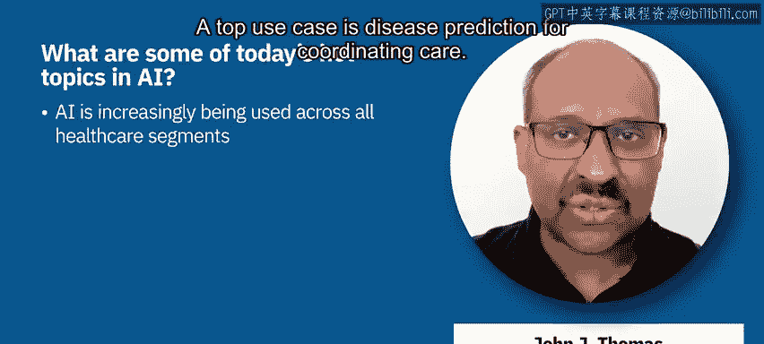

# 020：探索当今的AI关注点 🔍

在本节课中，我们将探讨当前人工智能领域的热点话题。我们将了解可信AI的重要性，并考察AI在面部识别、招聘、社交媒体营销以及医疗保健等具体领域的应用与挑战。

---

## 可信AI：当今的核心议题

上一节我们介绍了课程概述，本节中我们来看看当前AI领域的核心议题。人们常问我AI的当前热点是什么，我的回答是，今天所说的内容很可能在下周甚至明天就会有所不同。AI世界极具活力，这是一件好事。它是一项新兴技术，拥有惊人的可能性，并有潜力以前所未有的速度解决众多问题。

然而，正如我们所见，在某些情况下，AI也可能产生有害后果。因此，我认为AI的热点议题是：我们如何负责任地运用它？IBM提出了五大支柱来应对这一问题，概括了负责任AI的理念，即可解释性、透明度、稳健性、隐私和公平性。我们可以更深入地探讨这些主题。

但我想在此强调两点：
第一，这不是一项一劳永逸的工作。如果你打算使用AI，如果我们打算将其应用于社会，这不是你仅在开始或结束时才需要处理的事情，而是必须在AI的整个生命周期中持续关注的问题。无论你是在规划阶段、设计AI、训练AI、部署AI，还是作为与AI交互的最终用户，都需要不断思考这五大支柱。

第二，我认为更重要的是，这是一项团队运动。我们都需要意识到AI带来的潜在好处和潜在危害，并鼓励每个人提出问题，为人们保持对AI工作原理及其行为的好奇心留出空间。只有这样，我们才能真正利用它来解决有益的问题，取得巨大成果，并减轻任何潜在的危害。所以，请保持好奇心。

---

## AI在面部识别技术中的应用

在围绕人工智能设计解决方案时，面部识别已成为一个永久性的用例。目前设计和应用的模型与算法主要有三种典型类别。

以下是三种主要的面部识别类别：

1.  **面部检测**：仅检测一个物体是否是人脸，而不是狗或猫等其他物体。这种识别不涉及唯一识别该面孔属于谁。
2.  **面部认证**：你可能使用这种面部识别来解锁iPhone或安卓设备。在这种情况下，我们通过将面部图像特征与预先存储的单一图像进行比较，提供一对一的身份验证。这意味着你实际上只将图像与设备所有者的特定图像进行比较。
3.  **面部匹配**：在这种情况下，我们将图像与其他图像或照片数据库进行比较。这与前一种类别的不同之处在于，模型试图在包含属于其他人的图像或照片的数据库中，确定与个体身份相匹配的面部。

面部识别有许多不同的例子，其中许多无疑是你日常活动中正在体验的。有些已被证明是有益的，而另一些则被证明不那么有益，甚至还有一些被证明具有犯罪性质，因为某些人群因这些系统的使用而受到伤害。

我们看到，AI系统中的面部识别技术和解决方案在诸如机场导航、通过安检线，或者我们之前讨论过的使用面部识别解锁iPhone、家门或汽车门等场景中提供了重要价值。这些都是面部识别技术的有益用途。

但是，也存在一些必须禁止的明确示例和用例。这些可能包括在未经本人明确许可的情况下在人群中识别个人，或对个人或群体进行大规模监控。这类技术使用方式，如果被错误的人以错误的方式使用，会引发严重的隐私、公民权利和人权问题。面部识别技术无疑可能被用来压制异议、侵犯少数群体权利，或者仅仅剥夺你对隐私的基本期望。

---

## AI在招聘中的应用

AI正越来越多地被引入到劳动力发展的各个阶段，包括招聘、入职、职业发展（如晋升和奖励）以及处理人员流失等。以招聘为例，考虑一个收到成千上万份职位申请的组织，申请人应聘各种职位，包括前台、后台、季节性、永久性等。

AI可以帮助你对申请者进行排名和优先级排序，针对目标职位空缺，向招聘经理呈现一份顶级候选人名单。AI解决方案可以处理简历中的文本，并将其与其他结构化数据结合，以辅助决策。

现在，我们需要谨慎地设置防护措施。我们需要确保AI在招聘中的使用不会在性别、种族等敏感属性上产生偏见。即使这些属性没有被AI直接使用，也可能通过代理属性（如邮政编码或之前从事的工作类型）悄然渗入。

---

## AI在社交媒体营销中的应用

当今AI的一个热点话题是其在社交媒体营销中的应用。它彻底改变了品牌在TikTok、LinkedIn、Twitter、Instagram、Facebook等社交媒体平台上与受众互动的方式。

以下是AI在社交媒体营销中的主要应用：

*   AI可以为你创建广告。
*   AI可以为你创建社交媒体帖子。
*   AI可以帮助你精准定位这些广告。
*   AI可以使用情感分析为你识别新的受众。

所有这些都为营销人员带来了惊人的效果，提高了营销活动的有效性，同时降低了运营这些活动的成本。

然而，AI为在社交媒体平台上进行营销所提供的技术和能力也引发了一些伦理问题。营销之所以成功，很大程度上归功于社交媒体平台从其用户那里收集的所有数据。表面上，收集这些数据是为了给终端用户提供更个性化的体验。但平台并不总是明确告知收集了哪些数据，以及你是否同意他们使用这些数据。

现在，那些对品牌营销活动非常有效的技术，同样可以用于生成错误信息、阴谋论，无论是政治上的还是科学上的错误信息。这对我们的整个社会产生了可怕的影
响。这就是为什么所有企业都必须遵守一些明确的原则，围绕透明度、可解释性、信任和隐私，来规范他们如何使用AI或将AI构建到他们的解决方案和平台中。

---

## AI在医疗保健中的应用

AI的使用正在所有医疗保健领域（如医疗服务提供者、支付方、生命科学等）不断增加。支付方组织正在使用利用理赔数据的AI和机器学习解决方案，并经常将其与社会健康决定因素等其他数据集相结合。

一个顶级的用例是用于协调护理的疾病预测。例如，预测会员群体中谁可能在未来三个月内出现不良状况（如急诊就诊），然后提供正确的干预和预防形式。在这种情况下，公平护理变得非常重要。我们需要确保AI在年龄、性别、种族等所有敏感属性上没有偏见。

当然，在所有领域中，对话式AI（包括虚拟代理以及帮助人类更好地服务会员群体的系统）已成为标配。在医疗保健中所有这些AI用例中，我们看到了一些共同点：能够从组织拥有的丰富数据集中解锁洞察、改善会员或患者体验，以及设置防护措施以确保AI是可信的。

---

## 总结

本节课中，我们一起探索了当前人工智能领域的几个关键关注点。我们了解到，构建**可信赖的AI**（涵盖可解释性、透明度、稳健性、隐私和公平性）是贯穿AI生命周期的核心议题。我们具体考察了AI在**面部识别**、**招聘**、**社交媒体营销**和**医疗保健**等领域的应用，认识到AI在带来效率提升和全新可能性的同时，也伴随着偏见、隐私和伦理等方面的挑战。负责任地开发和使用AI，需要持续的关注、团队的协作以及明确的原则与防护措施。