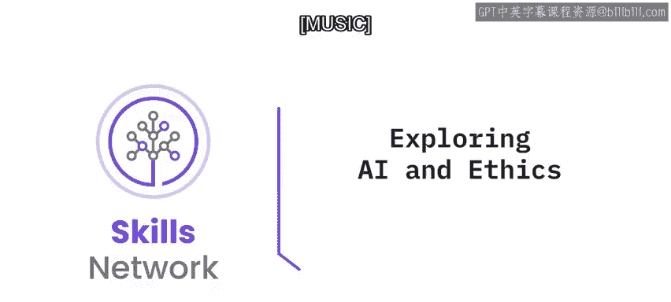
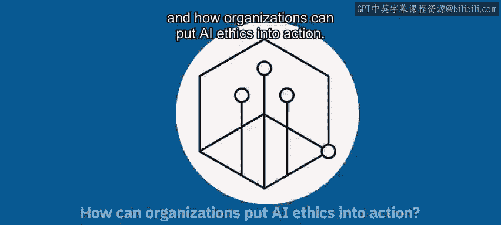
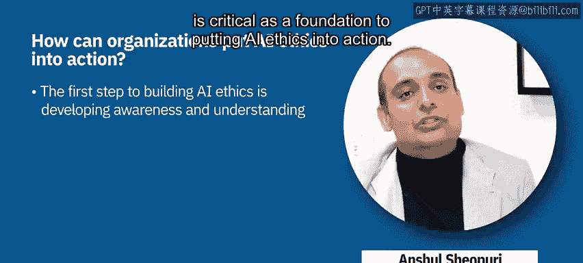

# 021：探索人工智能与伦理 🤖⚖️

在本节课中，我们将要学习人工智能伦理的概念、重要性以及如何在实践中应用它。我们将探讨为何AI伦理是一个社会技术挑战，以及组织如何通过原则、治理和具体操作来构建和使用合乎伦理的人工智能。

***

## 人工智能的普遍性与社会影响

人工智能在我们的生活中无处不在，即使我们常常没有意识到它。当我们使用信用卡在线购物、在网络上搜索信息、在社交平台上发布内容或关注他人，甚至是在使用基于AI的导航支持和驾驶辅助功能时，我们都在使用人工智能。

这种普遍性给我们的生活以及社会的结构和公平性带来了快速而重大的转变。正因如此，人工智能除了是一门技术和科学学科外，还具有非常重要的社会影响力。这引发了许多关于AI应如何被设计、开发、部署、使用和监管的伦理问题。

***

## 人工智能的社会技术维度与包容性

人工智能的社会技术维度要求我们努力识别所有利益相关者，这远远超出了技术专家的范畴，还包括社会学家、哲学家、经济学家、政策制定者以及受这项技术部署影响的所有社群。

在定义生态系统、在AI开发和部署的所有阶段、以及在AI对部署场景的影响中，包容性都是必要的。没有包容性，我们就有风险创造出只为少数人服务的AI，而将许多其他人抛在后面，使其处于不利地位。每个人都需要参与定义我们想要利用AI和其他技术（作为手段而非目的）构建的未来愿景。

为了实现这一愿景，需要适当的指导方针来引导AI的创造和使用朝着正确的方向发展。技术工具是必要且有用的，但它们应该辅以原则、保障措施、定义明确的流程和有效的治理。我们不应认为所有这些会减缓创新。

***

## 伦理作为创新的加速器

我们可以将AI伦理比作交通规则。交通信号灯、停车标志和速度限制看似让我们慢下来。然而，如果没有它们，我们并不会开得更快，反而会因为对其他车辆和行人的状态完全不确定而开得更慢。

AI伦理识别并解决了这项技术引发的社会技术问题，确保支持并促进正确的创新，从而使通往我们期望的未来的道路更加顺畅。

正如IBM首席执行官所言，信任是我们运营的许可证。我们通过我们的政策、计划、合作伙伴关系以及对技术负责任使用的倡导赢得了这种信任。一百多年来，IBM一直处于创新的前沿，为我们的客户和社会带来利益。

这种方法无疑适用于人工智能的开发、使用和部署。因此，伦理应嵌入到设计和开发流程的生命周期中。

***

## 构建伦理基础：原则与支柱

伦理决策不仅仅是一种技术问题解决方法。相反，应基于原则、价值观、标准、法律和对社会的益处，采取一种伦理、社会学、技术和以人为本的方法。因此，建立这个基础是重要且必要的，但从哪里开始呢？

一个很好的起点是一套指导原则。在IBM，我们将我们的原则称为“信任与透明原则”，共有三条：
1.  AI的目的是增强而非取代人类智能。
2.  数据和洞察力属于其创造者。
3.  包括AI系统在内的新技术必须是透明且可解释的。

最后一条原则建立在我们的五大支柱之上：
*   **透明**：通过分享AI的用途和运作方式来增强信任。
*   **可解释**：系统能够解释其决策过程。
*   **公平**：当系统经过适当校准时，它应能协助做出更好的选择，并确保公平性。
*   **稳健**：系统应该是安全的。
*   **隐私保护**：保障隐私和权利。

我们知道，仅有原则和支柱是不够的。我们拥有一套广泛的工具和才华横溢的从业者，他们可以帮助诊断、监控、促进我们所有的支柱，并进行持续监控，以减轻风险和意外后果。

***

## 将AI伦理付诸实践的三步法

上一节我们介绍了AI伦理的原则与支柱，本节中我们来看看如何将它们付诸实践。将AI伦理付诸行动可以分为三个关键步骤。

### 第一步：建立理解与意识

将AI伦理付诸实践的第一步，与任何事情一样，是建立理解和意识。这意味着要让你的团队具备思考AI伦理的能力，并理解将其付诸实践意味着什么。

无论你正在构建和部署什么解决方案，都需要持续反思伦理问题。以下是一个思考示例，假设你正在公司内部构建和部署一个学习解决方案：
*   这个解决方案是否以用户为中心进行设计？
*   我们是否与用户共同创建了这个解决方案？
*   它如何确保不同群体的所有员工都能平等地获得机会？

对AI伦理的深刻理解，并持续反思这些问题，是至关重要的基础。

### 第二步：建立治理结构

在建立了理解和意识，并且每个人都在反思这个主题之后，付诸实践的第二步骤是建立治理结构。这里的关键在于，这是一个旨在规模化推广AI伦理实践的治理结构，而不是在某个市场或业务单元中孤立地进行。

因此，我们讨论了作为基础的“理解与意识”，第二步是“治理”，这是领导者建立结构的责任。

### 第三步：实现规模化运营

一旦具备了前两个要素，第三步就是实现运营化。你如何确保在马来西亚或波兰的开发人员、数据科学家或供应商知道如何将AI伦理付诸实践，以及这对他们意味着什么？

在全球层面建立结构是一回事，但如何确保它在各个市场以及每个用户、每个数据科学家、每个开发人员那里都能规模化地运营，让他们知道自己需要做什么？

这完全取决于对可信AI支柱的清晰理解。对IBM而言，这些支柱是：透明、可解释、公平、稳健和隐私保护。回到我们的学习解决方案例子，每个数据科学家、开发人员和供应商都需要以非常具体、可操作的方式理解这些支柱的含义。

***

## 总结

本节课中，我们一起学习了人工智能伦理的核心概念。我们了解到AI的普遍性带来了重大的社会影响和伦理挑战，解决这些挑战需要包容性的社会技术方法。我们探讨了IBM的信任与透明原则及其五大支柱（透明、可解释、公平、稳健、隐私保护），并学习了将AI伦理付诸实践的三个步骤：建立理解与意识、建立治理结构以及实现规模化运营。记住，合乎伦理的AI不仅是技术需求，更是构建可信、可持续未来的基石。