# 022：定义AI伦理 🤖⚖️

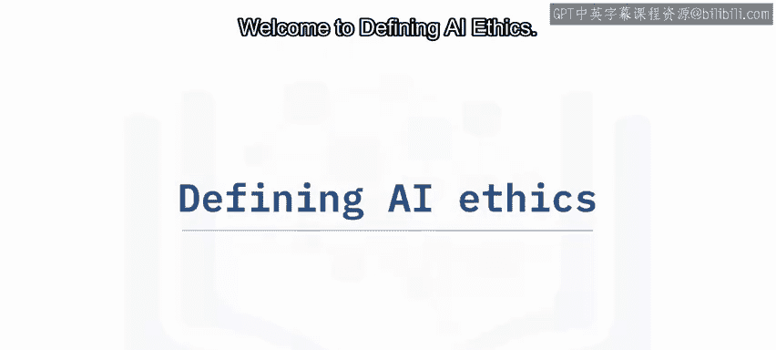

在本节课中，我们将要学习人工智能伦理的定义及其重要性。我们将探讨为什么在构建和使用AI时，必须将伦理置于核心位置，并详细介绍构成AI伦理的五大支柱。

人类依赖文化上公认的道德和行为标准（即伦理）来指导其决策，尤其是那些影响他人的决策。

随着人工智能越来越多地被用于自动化和增强决策过程，将伦理置于AI构建的核心变得至关重要，以确保其结果符合人类的伦理和期望。

---

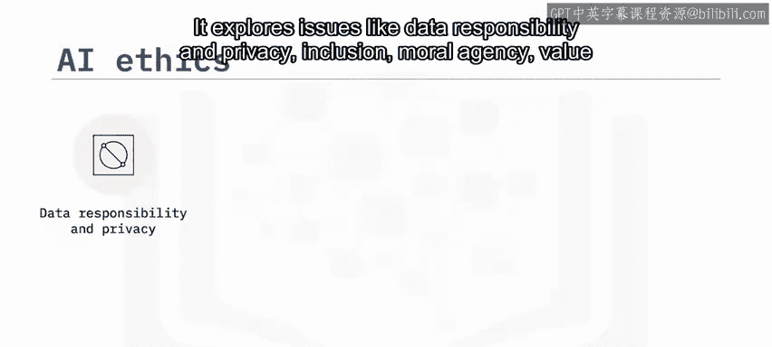

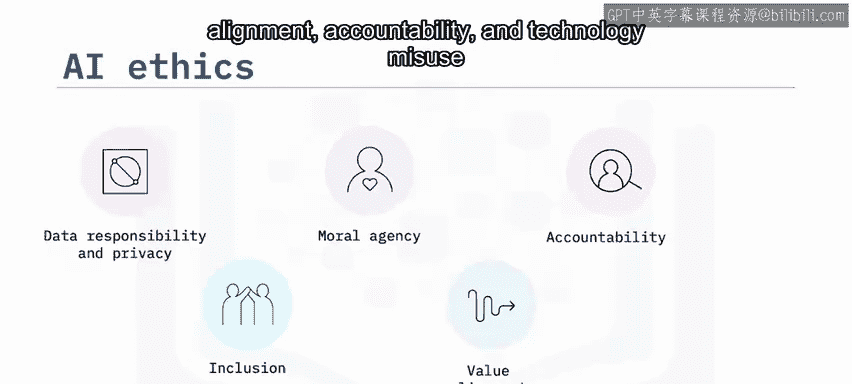

## 什么是AI伦理？🧐

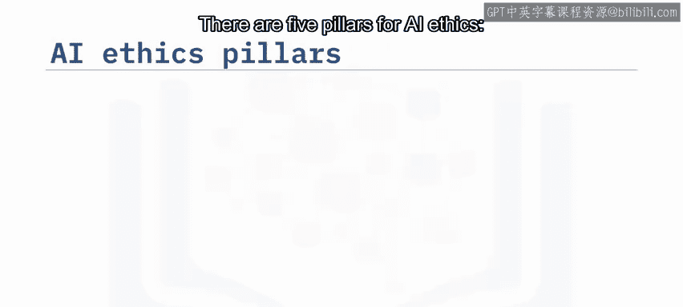

上一节我们提到了伦理在AI中的核心地位，本节中我们来看看AI伦理的具体定义。

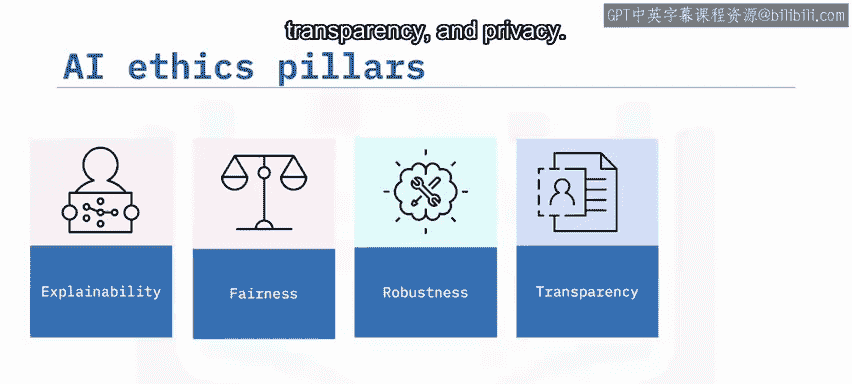

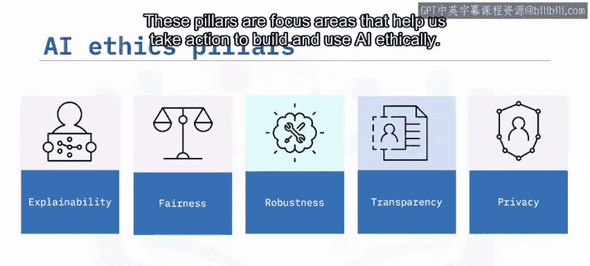

AI伦理是一个多学科领域，旨在研究如何最大化AI的积极影响，同时减少其风险和负面影响。它探讨诸如数据责任与隐私、包容性、道德能动性、价值对齐、问责制和技术滥用等问题，以理解如何以符合人类伦理和期望的方式构建和使用AI。

---

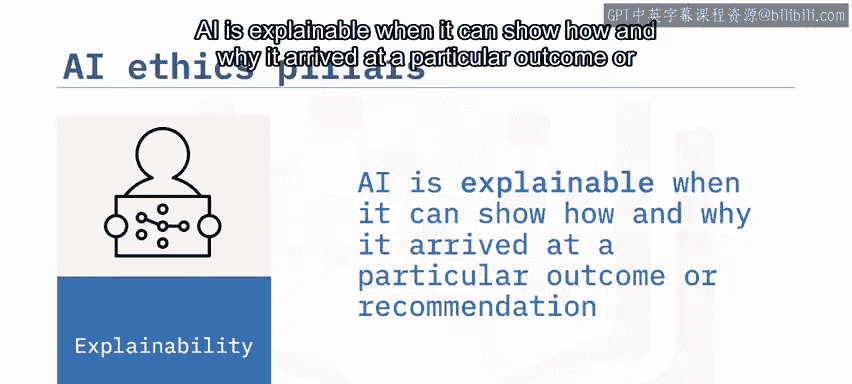

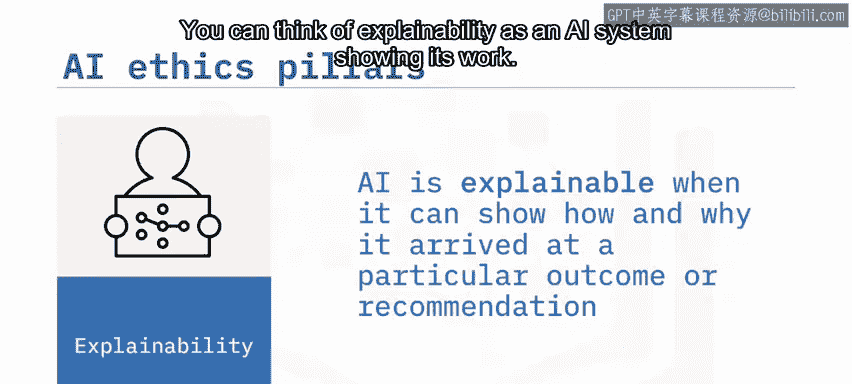

## AI伦理的五大支柱 🏛️

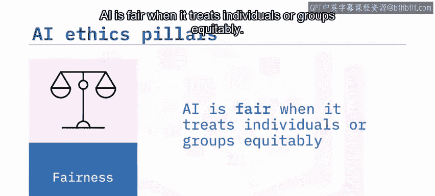

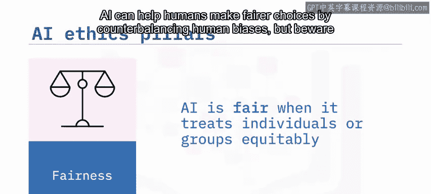

了解了AI伦理的总体目标后，我们接下来深入探讨其具体构成。以下是构成AI伦理基础的五个核心支柱。

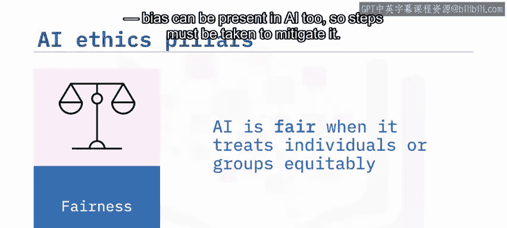

1.  **可解释性**
    AI具有可解释性，是指它能够展示其如何以及为何得出特定结果或建议。你可以将可解释性理解为AI系统“展示其工作过程”。

2.  **公平性**
    AI具有公平性，是指它能够公平地对待个人或群体。AI可以通过抵消人类偏见来帮助人类做出更公平的选择。但需注意，AI本身也可能存在偏见，因此必须采取措施来减轻这种偏见。

3.  **鲁棒性**
    AI具有鲁棒性，是指它能够有效处理异常情况，例如异常输入或对抗性攻击。鲁棒的AI旨在能够抵御有意和无意的干扰。

4.  **透明度**
    AI具有透明度，是指向人类适当地分享有关AI系统如何设计和开发的信息。透明度意味着人类能够获取相关信息，例如用于训练AI系统的数据是什么、系统如何收集和存储数据，以及谁有权访问系统收集的数据。

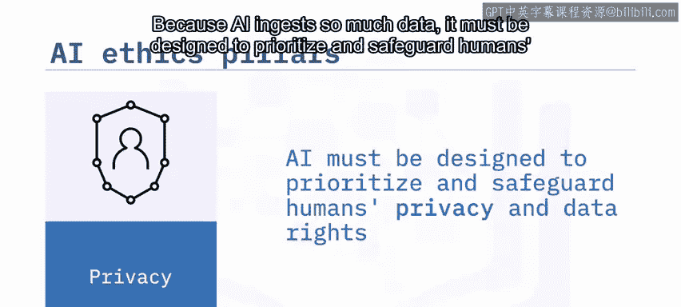

5.  **隐私**
    由于AI会摄入大量数据，其设计必须优先考虑并保护人类的隐私和数据权利。为尊重隐私而构建的AI，仅收集和存储其运行所需的最少量数据，并且在未经用户同意等考虑下，收集的数据绝不应被用于其他目的。

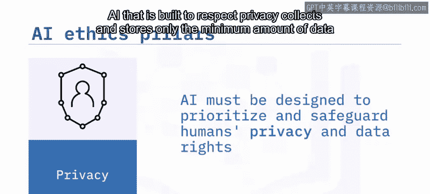

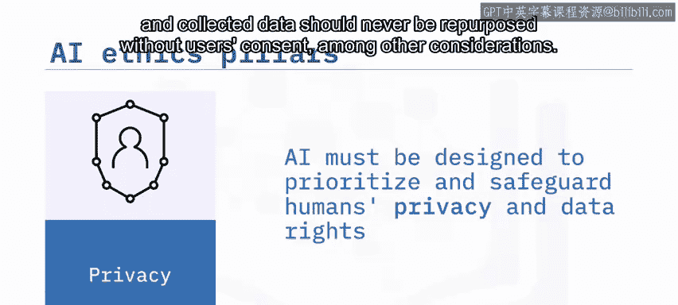

---

## 总结 📝

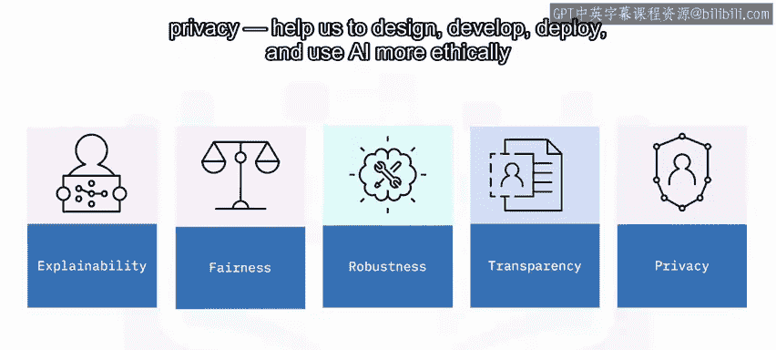

本节课中，我们一起学习了AI伦理的定义及其重要性。我们了解到，AI伦理旨在确保AI的发展与人类价值观一致。具体而言，我们探讨了构成AI伦理基础的五大支柱：**可解释性**、**公平性**、**鲁棒性**、**透明度**和**隐私**。这五大支柱共同帮助我们更合乎伦理地设计、开发、部署和使用AI，并理解如何以符合人类伦理和期望的方式构建和使用AI。