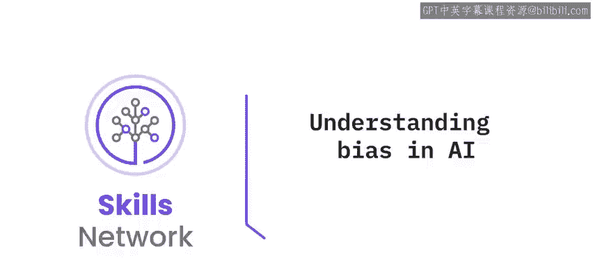
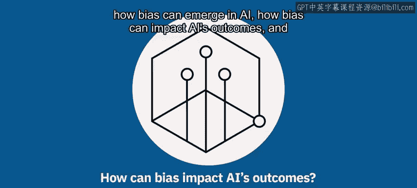
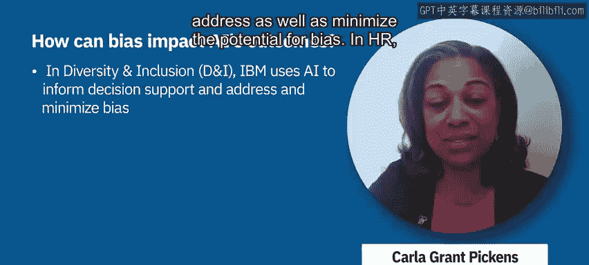

# 023：🤖 了解AI中的偏见

在本节课中，我们将要学习人工智能中的偏见问题。你将了解到偏见如何在AI系统中产生，它如何影响AI的决策结果，以及如何开始着手减轻AI中潜在的偏见。

---

## 什么是AI中的偏见？

人工智能中的偏见，指的是在关键决策任务中，AI系统表现出的、对某些群体或个人造成系统性不利的、非预期的行为。这些任务可能涉及贷款审批、招聘，甚至刑事司法。

一个例子是，一个用于决定谁应获得额外预防性医疗保健的AI系统，分配给白人的机会多于黑人。另一个例子是招聘算法，AI系统让符合条件的男性获得面试的机会多于同等条件的女性。

---

## 偏见是如何产生的？

上一节我们介绍了AI偏见的概念，本节中我们来看看偏见产生的多种来源。AI或机器学习系统是基于人类决策者过去所做的历史决策进行训练的。

以下是偏见产生的主要途径：

1.  **历史数据中的偏见**：过去的决策者可能自身就存在隐性的或显性的偏见，这些偏见会通过数据中的成见反映在训练数据中。
2.  **数据采样偏差**：在特定数据集中，某些群体可能被过度代表或代表不足。
3.  **数据处理阶段的偏差**：在数据科学项目的数据处理或准备阶段，即使进行特征工程也可能引入新的偏见。

    例如，在医疗保健的例子中，如果我将住院、门诊和急诊费用**分开**作为特征，那么对非裔美国人引入的偏见会少得多。而如果我将它们**合并**为一个单一特征，实际上会对非裔美国人产生更大的偏见。这可以用一个简单的选择来描述：
    `特征 = 合并(住院费用， 门诊费用， 急诊费用)`  vs  `特征集 = {住院费用， 门诊费用， 急诊费用}`

4.  **问题定义本身的偏差**：可能我们预测的目标本身就是错误的。例如，如果我试图预测“犯罪性”或“未来犯罪”，那么使用“逮捕记录”作为依据是不合适的。因为警察在某些社区更活跃，逮捕率更高，并且**被逮捕不等于有罪**。

---

## 如何减轻AI中的偏见？

正如我们所讨论的，偏见有多种来源，因此我们需要采取行动来消除这些来源。

以下是一些关键的缓解方法：

*   **组建多元化团队**：认识到偏见的存在是第一步。拥有具备不同生活经验的团队，有助于识别这些危害以及其他可能存在的偏见。
*   **寻找更少偏见的数据集**：使用本身偏见较少的数据集，是抵消偏见的一种方式。
*   **采用技术方法**：如果我们在有偏见的数据上训练机器学习模型，可以引入额外的约束或其他统计度量来减轻偏见。

    例如，IBM开发了多种此类算法，其中许多已在名为 **AI Fairness 360 (AIF360)** 的开源工具包中提供。其核心思想是为模型训练过程添加公平性约束。

我们的目标是确保技术对社会产生积极影响。

---

## IBM的实践：将伦理融入AI

作为IBM AI伦理委员会的成员，我致力于通过“好技术”实现有意识的包容。我们的AI伦理委员会代表了多元化的IBM员工，致力于研究和消除偏见，并在此领域建立标准。

IBM在多个方面运用AI和数据技能来应对偏见：

*   **开发技术资产**：利用我们的技术开发工具来应对偏见。
*   **推动包容性语言**：围绕我们的“语言至关重要”倡议，解决技术术语中的包容性语言问题。
*   **加强解决方案测试**：确保对我们的解决方案进行测试，以降低偏见出现的概率并最小化其潜在影响。

在多元化与包容性领域，我们使用AI、数据分析和洞察来为决策提供支持，同时应对并最小化偏见的潜在影响。

在人力资源领域，这意味着利用AI和数据洞察来增强决策支持，为薪酬、留任、招聘和晋升决策提供信息。这在协助我们满足全球合规要求并采取主动行动方面发挥着重要作用。

---

## 总结

本节课中，我们一起学习了人工智能中偏见的核心概念。我们了解到偏见表现为AI系统对特定群体的系统性不公，其来源包括历史数据偏差、采样问题、数据处理方式以及问题定义本身。为了应对这些挑战，我们可以通过组建多元化团队、选用更好的数据以及应用如AIF360这样的技术工具来减轻偏见。最后，我们也看到了IBM如何将伦理实践融入其AI开发和应用的各个环节。理解并积极管理AI中的偏见，对于构建负责任、可信赖的人工智能至关重要。