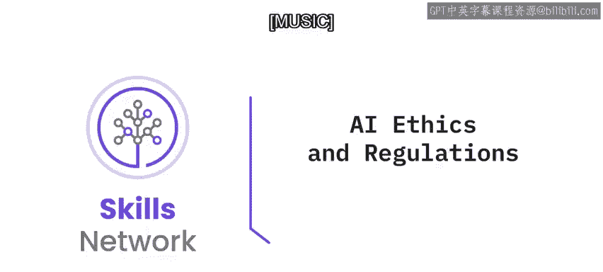
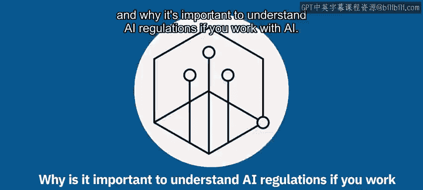
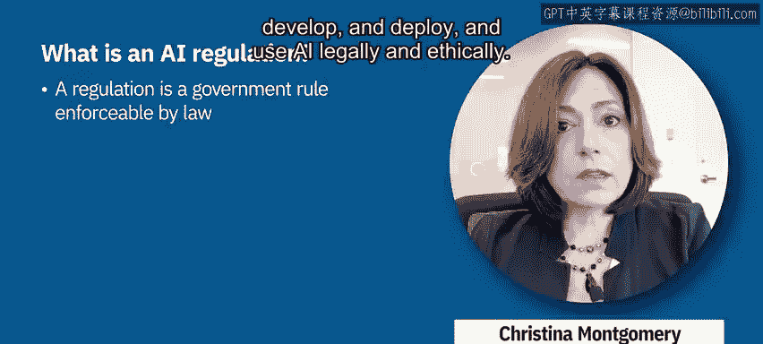
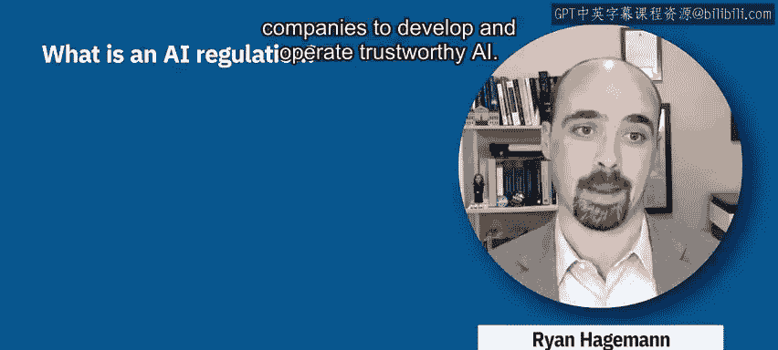
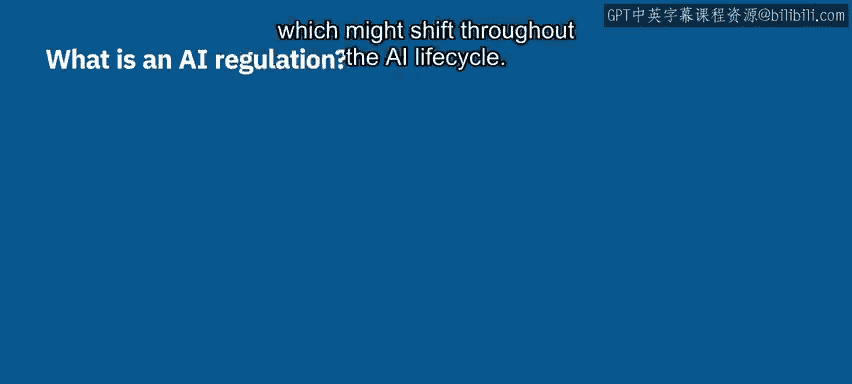
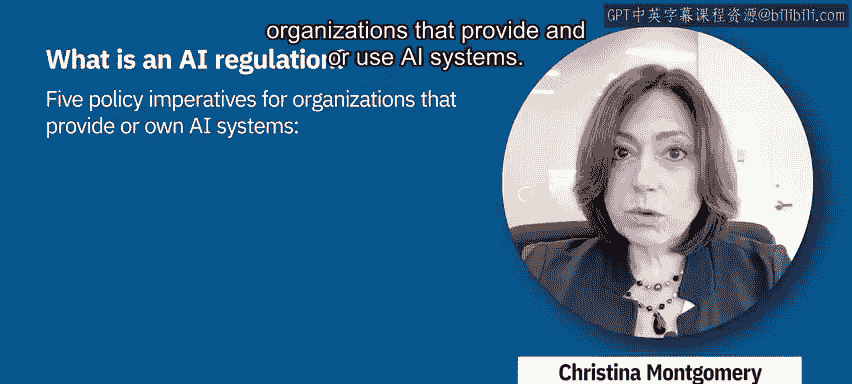

# 024：AI伦理与法规 📜⚖️

在本节课中，我们将要学习什么是人工智能法规，AI法规与AI伦理有何关联，以及为什么对于从事AI相关工作的人来说，理解AI法规至关重要。

上一节我们介绍了AI伦理的基本概念，本节中我们来看看与之紧密相关的AI法规。

## 什么是AI法规？

法规是由政府制定、具有法律强制执行力的规则。围绕人工智能的法规环境正在迅速发展。为了合法且合乎道德地设计、开发、部署和使用AI，理解关键的法规内容非常重要。

## IBM的立场：精准监管

IBM的立场是呼吁对人工智能进行精准监管。我们支持有针对性的政策，以增加公司开发和运营可信赖AI的责任。

**精准监管**指的是基于风险、结合具体情境，并将责任分配给最接近风险一方的监管方式。这种责任方可能在AI生命周期的不同阶段发生变化。

## IBM的精准监管框架

具体而言，IBM提出了一个精准监管框架，该框架为提供和/或使用AI系统的组织包含了五项政策要务。

以下是这五项核心要务：

1.  **指定AI伦理官员**：任命一名负责确保符合可信赖AI标准的首席官员。
2.  **针对不同风险制定不同规则**：即根据具体情境监管AI的应用，而非监管技术本身。
3.  **不要隐藏你的AI**：使其透明化。
4.  **解释你的AI**：换句话说，使其具有可解释性，而非一个“黑箱”决策。
5.  **测试你的AI是否存在偏见**。

本节课中，我们一起学习了AI法规的定义、IBM倡导的精准监管理念，以及一个包含五项要务的具体监管框架。理解这些内容，是负责任地开发和应用人工智能的重要基础。