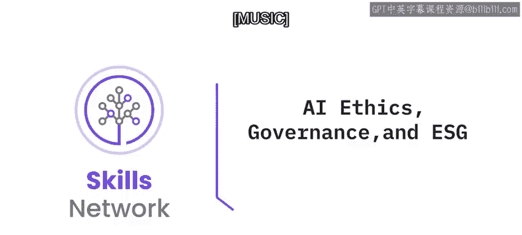
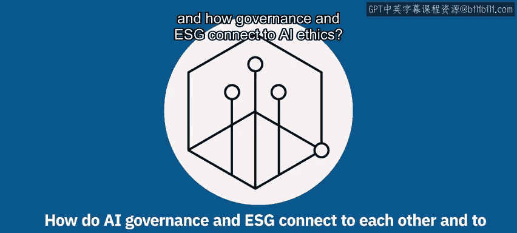
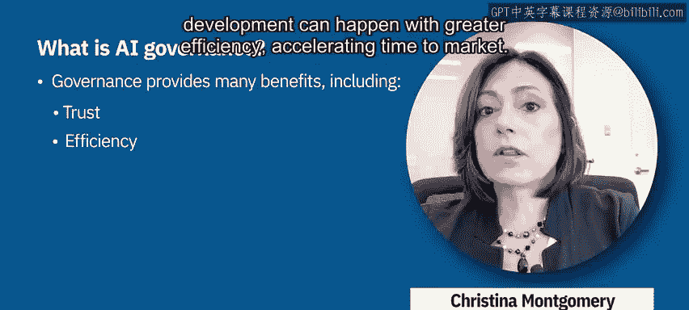
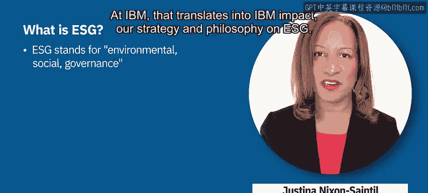

# 025：AI伦理、治理与ESG 🧭

在本节课中，我们将学习人工智能治理（AI Governance）的概念及其目标，了解环境、社会和治理（ESG）框架的含义与作用，并探讨治理、ESG与AI伦理之间的紧密联系。

---

## 什么是AI治理？🎯

上一节我们概述了本课内容，本节中我们来看看AI治理的具体定义。治理是指组织通过其公司指令、员工、流程和系统进行管理的行动，旨在指导、评估、监控并在整个AI生命周期中采取纠正措施，以确保AI系统的运作符合组织的意图、利益相关者的期望以及相关法规的要求。

治理的目标是通过建立对**问责制、责任和监督**的要求，来提供值得信赖的AI。治理能带来诸多益处，以下是其主要优势：

*   **信任**：当AI活动与价值观保持一致时，组织可以构建透明、公平且值得信赖的系统，从而提升客户满意度和品牌声誉。
*   **效率**：当AI活动实现标准化和优化后，开发过程可以更高效地进行，从而加速产品上市时间。
*   **合规**：当AI活动已得到管理和监控时，调整它们以符合新的及即将出台的行业法规和法律要求就会变得不那么繁琐。

一个成功的治理计划需要综合考虑人员、流程和工具。它明确定义了人员在构建和管理可信AI中的角色和职责，包括制定政策和建立问责制的领导者。它建立了用于构建、管理、监控和沟通AI的流程，并利用工具在整个AI生命周期中获得对AI系统性能更高的可见性和一致性。

---

## 理解ESG框架 🌱

了解了AI治理后，我们进一步探讨一个更广泛的框架——ESG。ESG代表**环境（Environmental）、社会（Social）和治理（Governance）**，这些是用于衡量公司所有非财务风险和机遇的因素。

在IBM，这体现为“IBM影响力”（IBM Impact），即我们在ESG方面的战略和理念。IBM影响力由三大支柱构成，我们相信这些支柱将创造一个更可持续的未来：

*   **环境影响**：致力于对环境产生积极影响。
*   **公平影响**：致力于推动社会公平。
*   **道德影响**：致力于坚持高标准的商业道德。

我们通过在世界、商业道德、环境以及我们工作和生活的社区中产生持久积极的影响来实现这些目标。

---

## 治理、ESG与AI伦理的联系 ⛓️

现在，我们已经分别了解了治理和ESG，本节我们将探讨它们如何与AI伦理相互关联。ESG中的治理方面涉及创建优先考虑**道德、信任、透明，尤其是问责制**的创新、政策和实践。

AI伦理是我们治理计划的重要组成部分。例如，在2022年，我们的目标是让**1000个生态系统合作伙伴**接受科技伦理培训。这个目标很重要，因为我们相信AI的益处应该惠及大众，而不仅仅是少数人，并且培养可信AI的文化必须无处不在，而不仅仅是在IBM内部。

我们正引领AI伦理的发展，致力于创造一个更加合乎道德的未来。

---

## 总结 📝

本节课中，我们一起学习了AI治理的核心定义及其在确保AI系统负责任运行中的关键作用。我们探讨了ESG框架的三大支柱及其对可持续未来的贡献。最后，我们明确了治理、ESG与AI伦理之间的深刻联系，认识到通过建立强有力的治理和伦理框架，是推动AI技术向善、实现广泛社会价值的基础。