# 028：AI梯度——成功采用AI的旅程 🧗

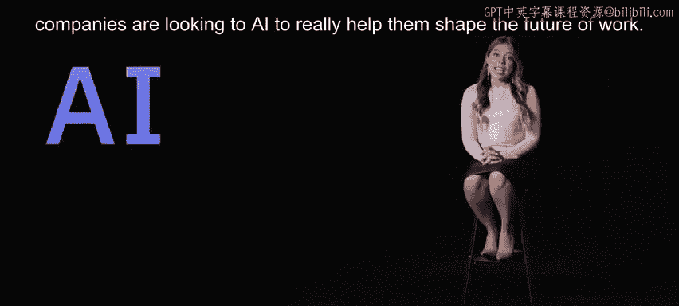

在本节课中，我们将学习企业如何通过一个被称为“AI梯度”的规范性步骤，将采用人工智能的愿望转化为实际成果。我们将探讨从数据现代化到AI全面融合的完整旅程。

在剧烈的数字化转型世界中，企业正寻求人工智能来帮助塑造工作的未来。

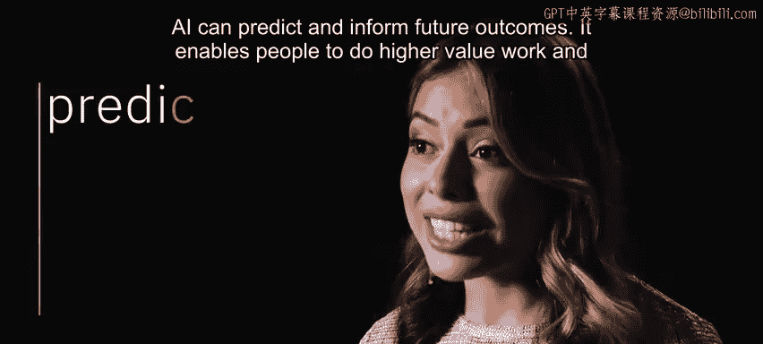

人工智能可以预测并告知未来的结果，它使人们能够在企业中从事更高价值的工作，并构想新的商业模式。

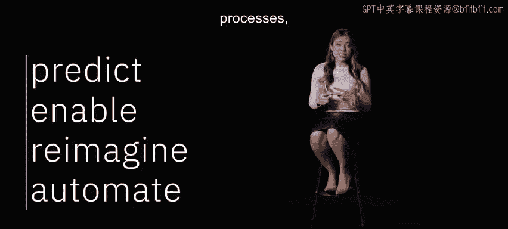

它可以自动化决策、流程和体验，但人工智能并非魔法。

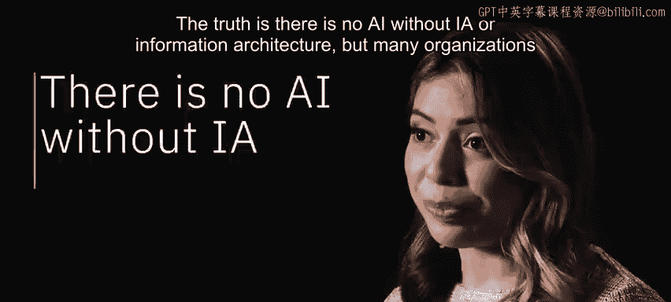

事实是，没有信息架构，就没有人工智能。

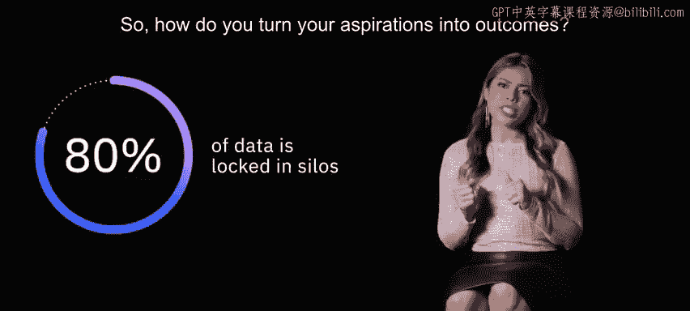

但许多组织无法开始，因为他们80%的数据被锁在孤岛中，且未达到业务就绪状态。

那么，如何将抱负转化为成果呢？

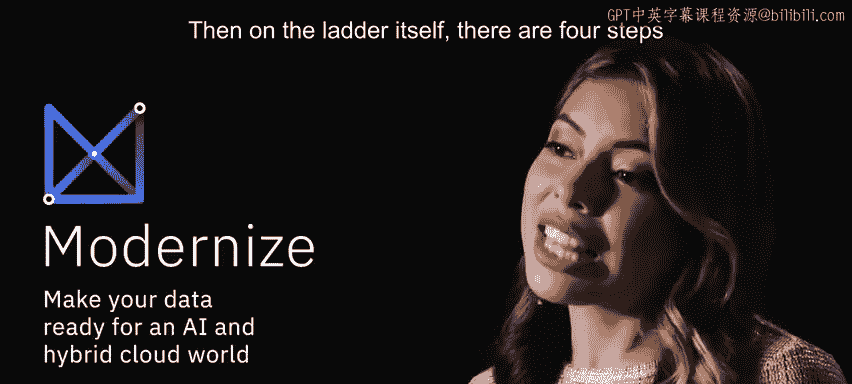

通过一套我们称之为“AI梯度”的规范性步骤。

它始于在可运行于任何云端的单一平台上，将所有数据现代化。

在梯度本身，包含四个步骤。

以下是实现AI价值的四个核心步骤：

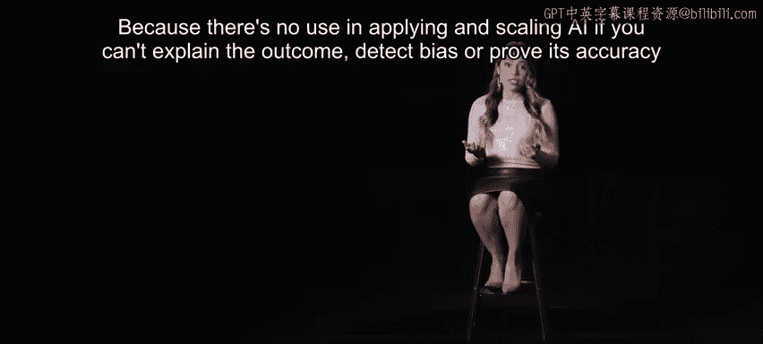

1.  **收集数据**，使其变得简单且易于访问。认真思考需要训练的模型。
2.  **组织数据**，为那些AI模型创建一个业务就绪的分析基础。
3.  **分析数据**，同时确保信任和透明度。因为如果无法解释结果、检测偏见或证明其准确性，应用和扩展人工智能就毫无用处。
4.  **融合**。一旦真正信任你的数据和部署的AI，就可以在控制日常工作的应用程序和流程中实现其全部价值。换句话说，最后一步是融合。

或者可以说，你开始在整个业务中实现人工智能的运营化。

我们通过在这个AI和多云世界中释放其数据的价值，帮助成千上万的企业让人工智能发挥作用。

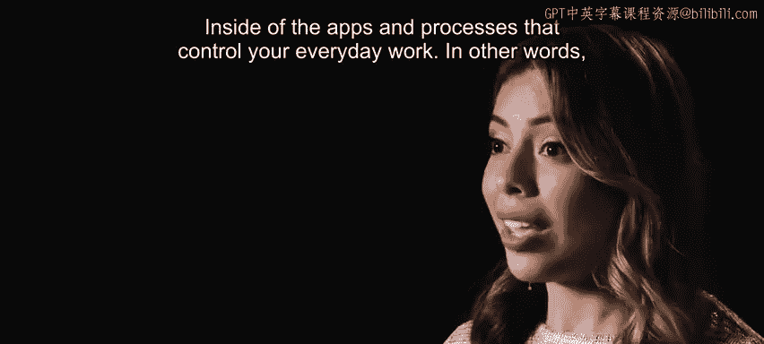

通过为员工提供合适的技能组合。

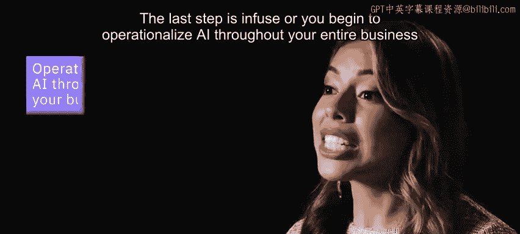

并通过在人工智能中建立信任和透明度。

这就是AI梯度的概要，让我们开始攀登吧。

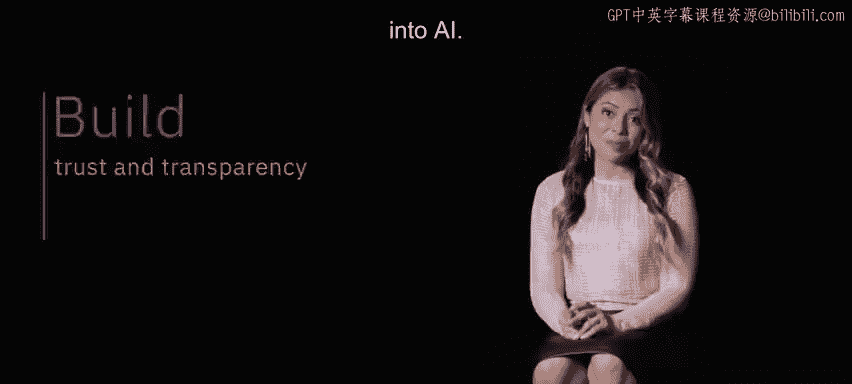

---

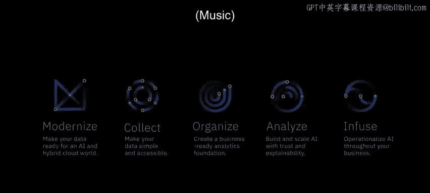

本节课中，我们一起学习了“AI梯度”框架。该框架为企业成功采用人工智能提供了一个清晰的路径：首先在统一平台上实现数据现代化，然后依次完成**收集**、**组织**、**分析**和**融合**四个步骤。这个过程强调以可信的数据为基础，最终将AI价值全面注入业务流程。