# 033：生成式AI专业化简介 🚀

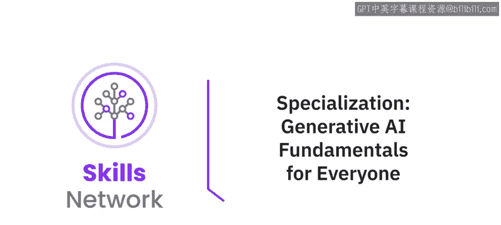

在本节课中，我们将一起了解生成式AI专业化的整体概览。我们将探讨生成式AI的广泛应用、市场前景，并详细介绍一个由五门课程组成的专业化学习路径。通过本课程，你将了解如何从零开始，系统地掌握生成式AI的核心概念、工具和应用，为你的职业发展赋能。

---

你是否知道，全球的营销人员已经在使用生成式AI来创作内容、撰写文案、激发创意、分析市场数据以及生成图像？

根据彭博社的预测，生成式AI市场预计到2032年将达到1.3万亿美元。

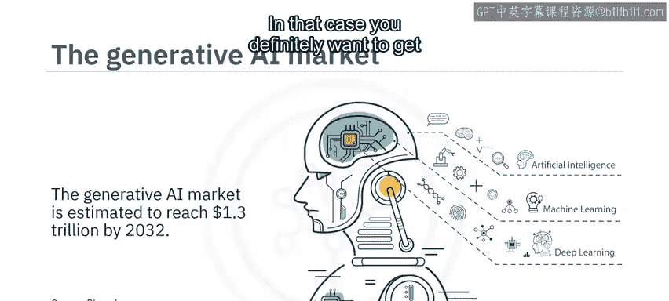

在这种情况下，你肯定希望更好地了解生成式AI。

那么，生成式AI适合所有人吗？是的，它适合。

你可以利用它的潜力，为自己创造更好的职业和生活。

这个专业化课程适合任何对探索生成式AI力量充满热情的人，**不需要具备先前的AI技术知识或背景**。

即使是初学者也能从这个专业化中受益，因为它提供了对生成式AI基本概念、模型、工具和应用的全面理解。

在本专业化课程结束时，你将能够：
*   解释生成式AI的基本概念、能力、模型、工具、应用和平台。
*   描述基础模型和提示工程，并应用强大的提示工程技术来编写有效的提示，从而从AI模型中生成期望的结果。
*   讨论生成式AI的局限性，并解释其伦理关切和负责任使用的考量。
*   认识到生成式AI在提升你职业生涯和帮助你在工作场所实施改进方面的能力。

该专业化包含五门自定进度的核心课程，每门课程需要3到5小时完成。

---

## 课程一：生成式AI导论与应用 🌐

上一节我们概述了整个专业化，本节中我们来看看第一门课程的具体内容。

课程一是你理解生成式AI能力的第一步，其能力涵盖文本、图像、音频、视频、虚拟世界、代码和数据等多个领域。

你将了解不同行业和领域如何应用常见的生成式AI模型和工具，例如：
*   **GPT**
*   **DALL-E**
*   **Stable Diffusion**
*   **IBM Granite**
*   **Synthesia**

---

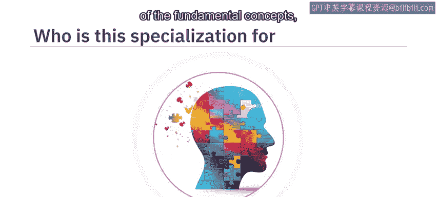

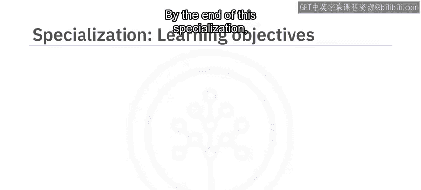

## 课程二：提示工程的艺术与科学 🛠️

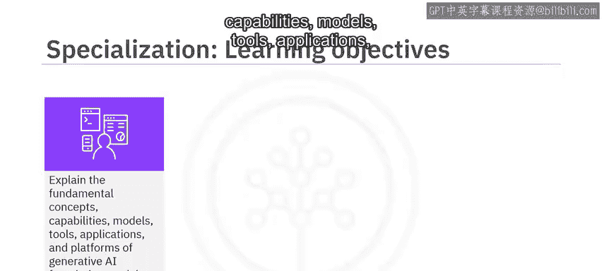

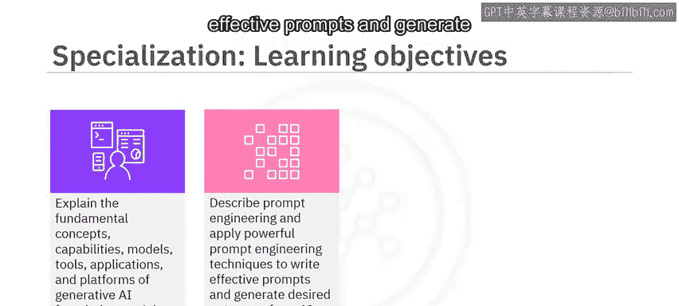

在了解了生成式AI的广泛应用后，本节我们将深入探讨与之交互的关键技能。

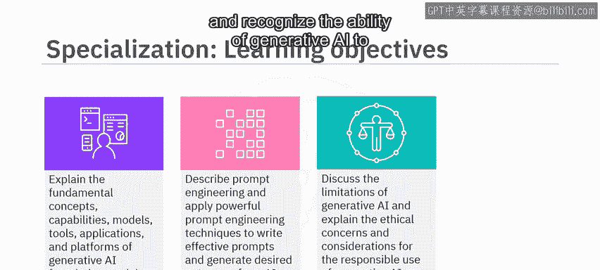

课程二介绍了提示工程的概念，以及它如何帮助你释放像ChatGPT这样的生成式AI工具的全部潜力。

你将探索开发有效提示的技术、方法和最佳实践，并学习使用常用工具，例如：
*   **IBM Watsonx.ai**
*   **PromptLayer**
*   **Spellbook**
*   **Dust**

---

## 课程三：生成式AI的核心概念与平台 🧠

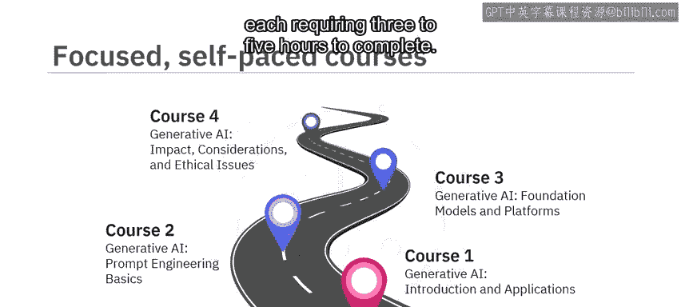

掌握了提示工程后，我们需要理解这些强大工具背后的原理。

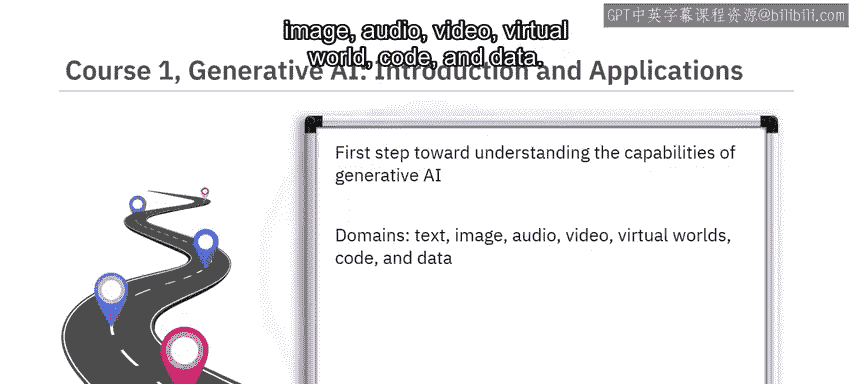

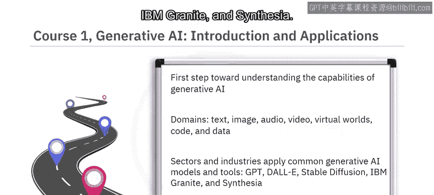

课程三专注于生成式AI的核心概念和构建模块，例如：
*   **深度学习**
*   **基于Transformer架构的大语言模型**
*   **扩散模型**
*   **基础模型**

你还将了解不同的生成式AI平台，如**IBM Watsonx.ai**和**Hugging Face**。

---

## 课程四：生成式AI的伦理与局限 ⚖️

理解了技术原理，我们必须同时关注其带来的影响和挑战。

在课程四中，你将探讨与生成式AI相关的伦理考量。

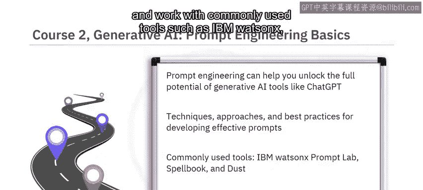

它将如何影响数据隐私和安全、版权侵权、劳动力以及环境？

你还将描述其局限性，例如：
*   **数据偏见**
*   **缺乏可解释性、透明度和可理解性**

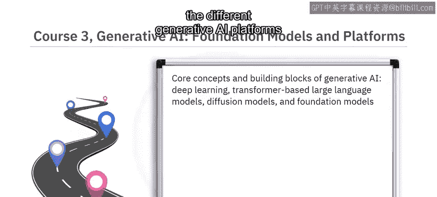

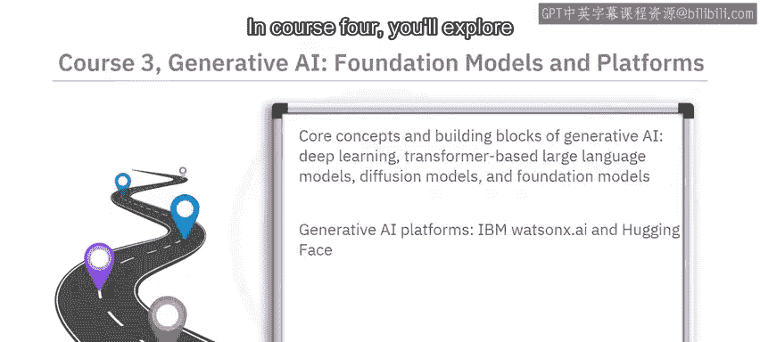

并识别生成式AI的常见滥用，例如**深度伪造**和**幻觉输出**。

---

## 课程五：生成式AI的未来与你 🚀

探讨了伦理挑战后，让我们展望未来，看看它如何塑造你的职业道路。

最后，课程五讨论了生成式AI的未来。你难道不想知道在那个未来里，你的职业机会是什么吗？

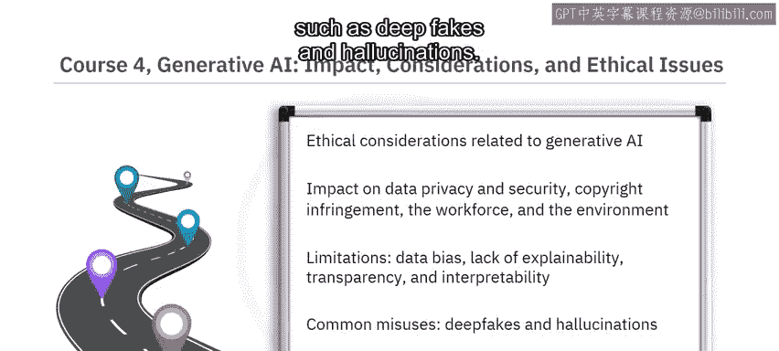

你将学习生成式AI如何影响和增强不同行业和领域的现有职能、技能和工作角色。

以及你如何能使用生成式AI来构建自己的应用程序，以创造新的商业机会。

---

## 学习方式与收获 📈

本专业化课程的内容旨在吸引并赋能你。

通过观看精选的概念视频、聆听AI专家分享他们的见解和技巧，以及在实践实验室和项目中练习技术，你将在日常生活中使用生成式AI工具和应用程序时感到更加自信。

目前，65%的生成式AI用户是千禧一代或Z世代，72%是在职人士。

通过这个专业化学习，你将准备好加入生成式AI变革者的行列。

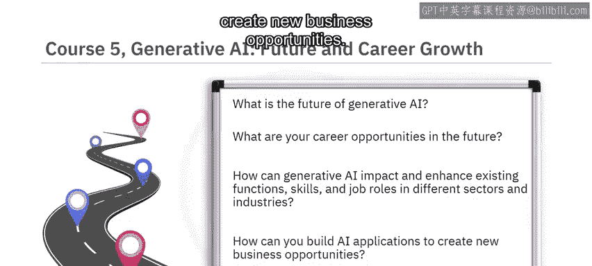

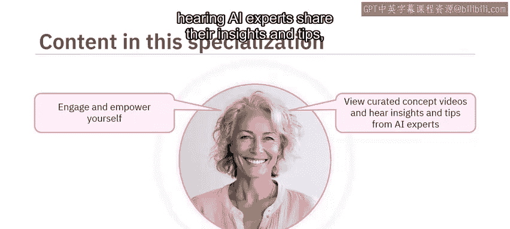

生成式AI属于每个人。

---

**本节课总结**

在本节课中，我们一起学习了IBM生成式AI专业化课程的完整蓝图。我们从生成式AI的市场潜力开始，逐步深入了解了由五门课程构成的学习路径：从基础应用、提示工程、核心技术、伦理考量到未来展望。这个课程体系设计精良，无需技术背景，适合所有希望利用生成式AI提升职业能力和创造价值的初学者。现在，你已经准备好开启这段激动人心的学习旅程了。