# 034：生成式人工智能导论 🚀

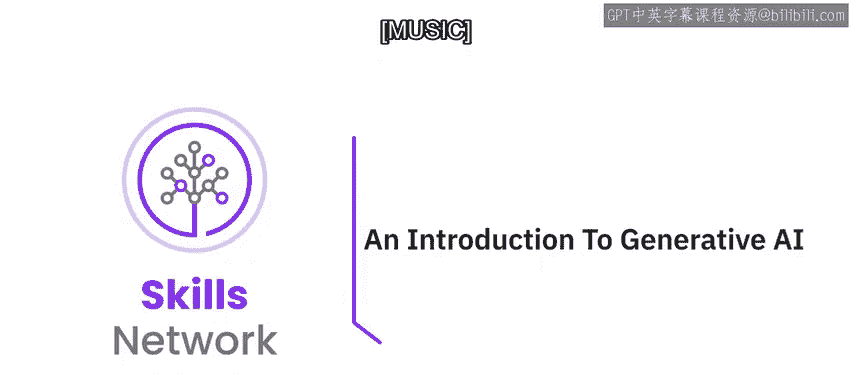

在本节课中，我们将要学习生成式人工智能（Generative AI）的基本概念、核心能力及其在现实世界中的应用。我们将了解这门技术如何改变我们的工作与生活，并预览整个课程的结构与学习目标。

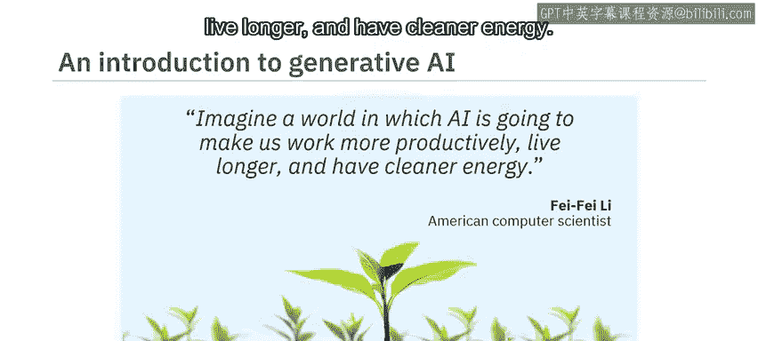

---

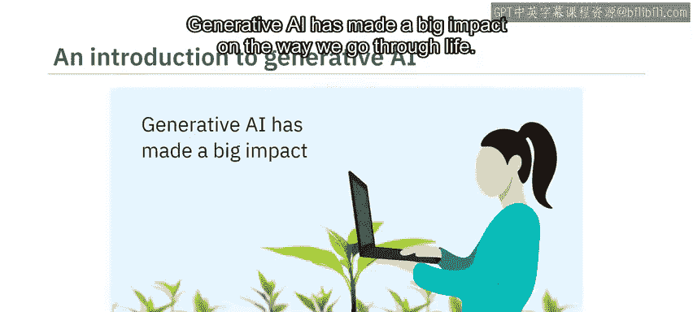

想象一个由人工智能驱动的世界，它能让我们工作更高效、寿命更长、能源更清洁。

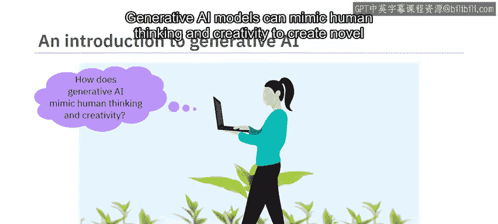

这个世界已经到来。生成式人工智能对我们生活方式的各个方面都产生了巨大影响。

生成式人工智能模型能够模仿人类的思维和创造力，以生成新颖的内容并执行复杂的任务，就像你我一样。

组织可以利用生成式人工智能来提高生产力和盈利能力。个人可以使用生成式人工智能工具来提升效率、为工作增添实际价值、节省成本并最大化其品牌价值。

如果你尚未接触过这项技术，那么这门课程正适合你。我们邀请所有对快速发展的生成式人工智能领域抱有真诚兴趣的专业人士、爱好者、从业者和学生。无论你的背景或经验如何，这是一门面向所有人的课程。

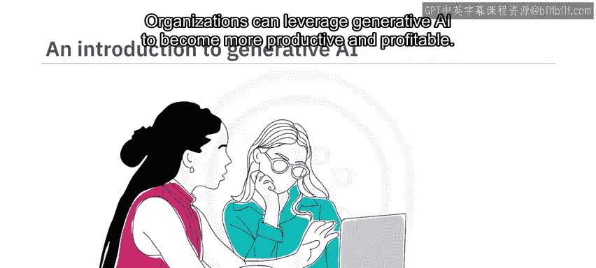

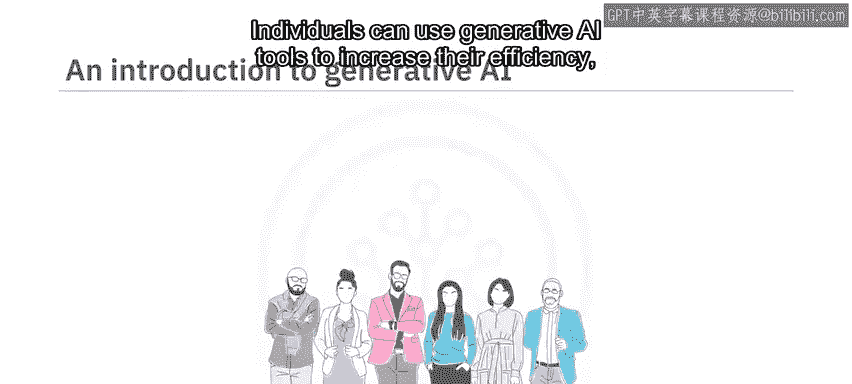

---

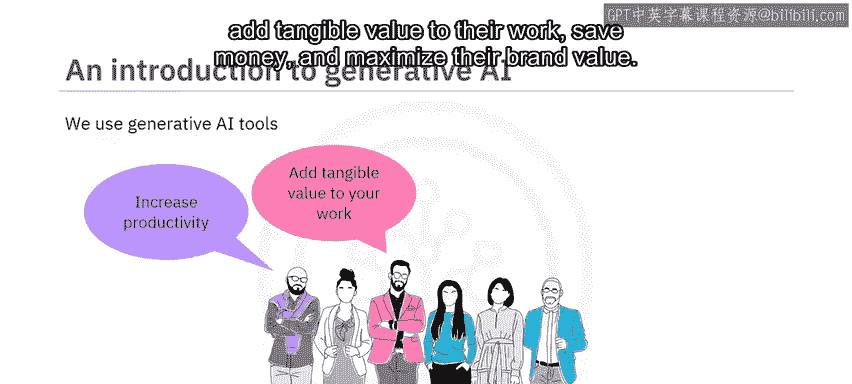

## 课程目标 🎯

本课程旨在让你对生成式人工智能的能力、应用以及常见模型和工具有一个扎实的理解。

课程结束时，你将能够：
*   描述生成式人工智能的能力及其在现实世界中的用例。
*   识别生成式人工智能在不同领域和行业中的应用。
*   探索常见的生成式人工智能模型和工具。

## 课程结构 📚

这是一门精炼的课程，包含三个模块。预计每个模块需要花费一到两小时完成。

### 模块一：核心概念与能力

在课程的第一个模块中，你将学习生成式人工智能的核心概念，了解其在不同领域的应用案例，并理解其在生成文本、图像、代码、音频和视频方面的能力。

### 模块二：行业应用与工具

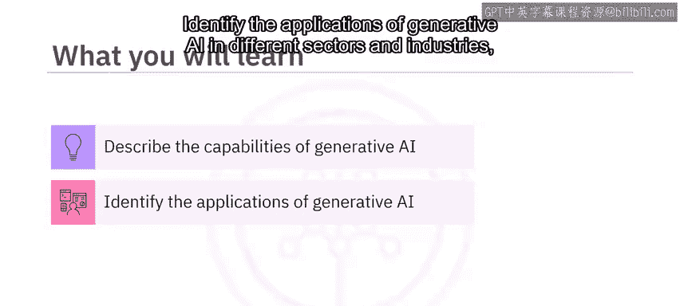

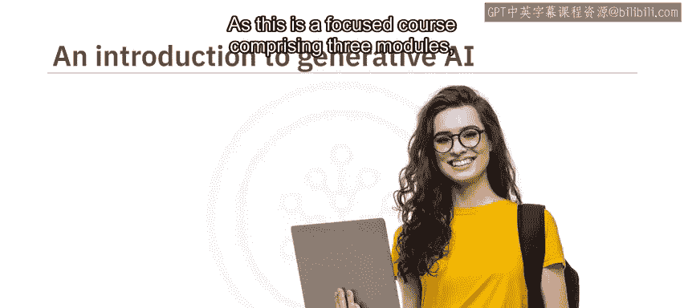

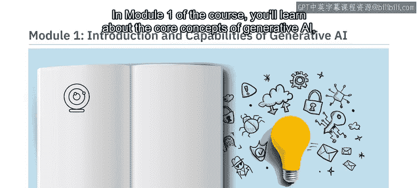

在模块二中，你将探索信息技术、娱乐、教育、金融和医疗保健等不同行业如何利用生成式人工智能。此外，在本模块中，你将学习用于生成文本、图像、代码、音频和视频的常见模型和工具（例如 **ChatGPT**、**DALL-E** 和 **Synthesia**）的功能与特性。

### 模块三：实践与评估

模块三要求你参与一个最终项目，并完成一个计分测验，以检验你对课程概念的理解。你还可以访问课程术语表，并获得关于后续学习路径的指导。

## 学习方法与资源 💡

本课程融合了概念讲解视频和辅助阅读材料。观看所有视频以充分掌握学习材料的潜力。

你将享受到实践实验室和一个最终项目，这些内容展示了生成式人工智能在多个领域的常见用例。每节课后都有练习测验，帮助你巩固所学知识。课程结束时，你还需要完成一个计分测验。

课程还提供了讨论论坛，方便你与课程工作人员联系并与同伴交流互动。最有趣的是，通过专家观点视频，你将听到经验丰富的从业者分享他们对生成式人工智能不同方面的见解。

---

## 总结

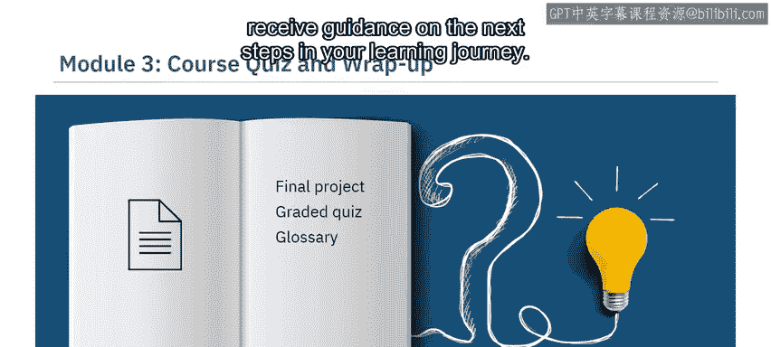

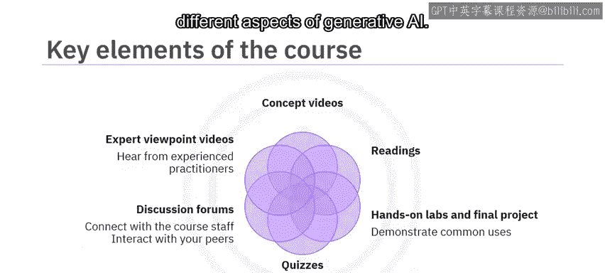

本节课中，我们一起学习了生成式人工智能的初步介绍。我们了解到，这项技术已深刻影响着我们的社会，能够模仿人类创造力，为组织和个人带来巨大价值。本课程面向所有背景的学习者，旨在通过三个结构化的模块，带你从核心概念走到实际应用，最终通过项目和测验巩固知识。

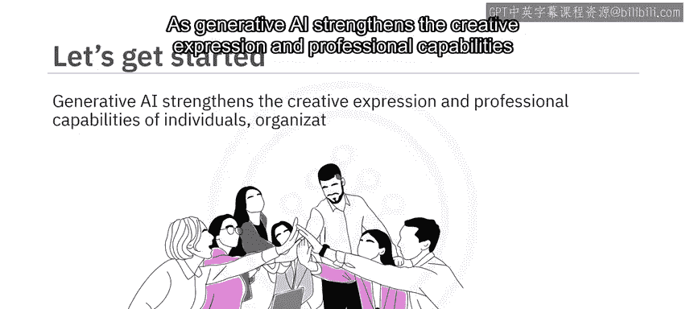

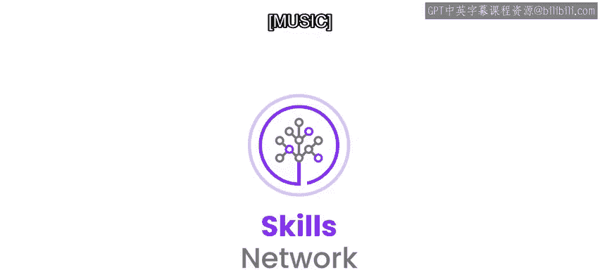

当生成式人工智能正在全球范围内增强个人、组织和社区的创造力表达与专业能力时，你为何不加入进来？这门课程为你提供了一个创造新体验的绝佳机会。