# 035：生成式AI简介 🤖

在本节课中，我们将学习生成式人工智能的基本概念、其发展历程，以及它与判别式人工智能的区别。我们将探讨生成式AI的核心模型、基础模型的作用，并了解其广泛的应用前景。

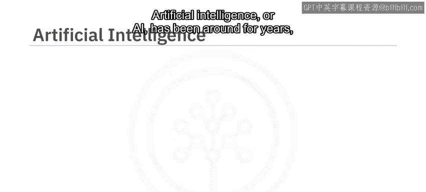

---

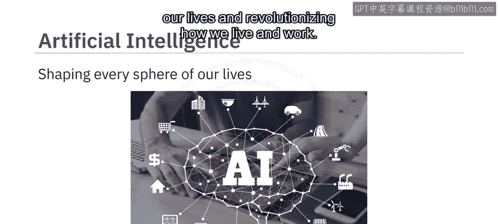

## 什么是人工智能？🧠

人工智能（AI）已存在多年，它塑造了我们生活的方方面面，并彻底改变了我们的工作和生活方式。

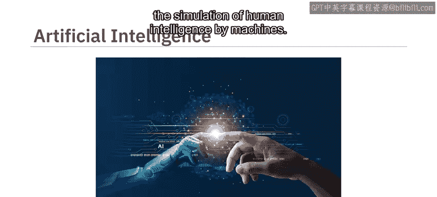

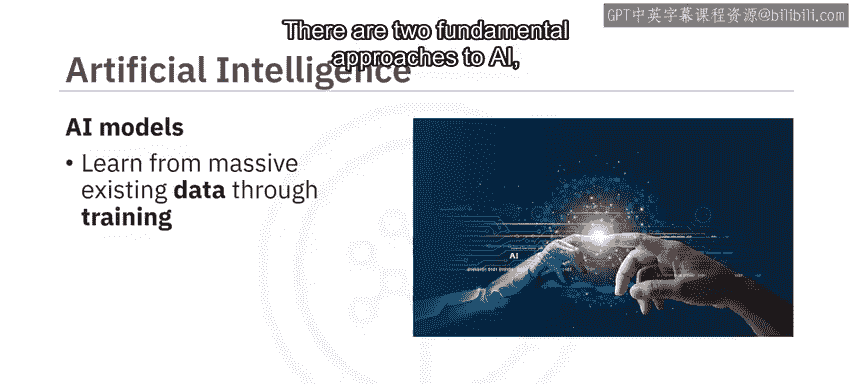

从本质上讲，AI可以定义为机器对人类智能的模拟。AI模型从海量的现有数据中学习，这个过程被称为**训练**。AI有两种基本方法：**判别式AI**和**生成式AI**。

---

## 判别式AI 🎯

上一节我们介绍了AI的两种基本方法，本节中我们来看看第一种：判别式AI。

判别式AI是一种学习区分不同数据类别的方法。判别式AI模型会获得一组训练数据，其中每个数据点都标有其类别。然后，该模型通过判断新数据点落在决策边界的哪一侧来预测其类别。判别式AI模型使用高级算法来区分、分类、识别模式，并根据训练数据得出结论。

以下是判别式AI工作原理的一个例子：
*   电子邮件垃圾邮件过滤器可以区分垃圾邮件和非垃圾邮件。

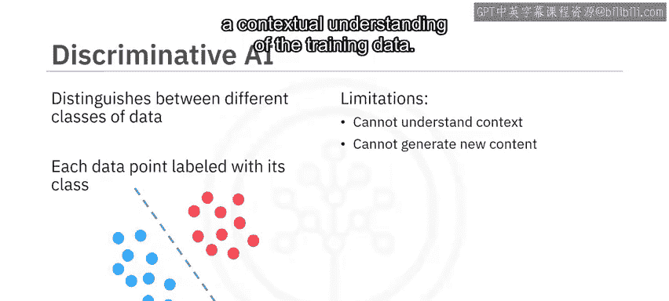

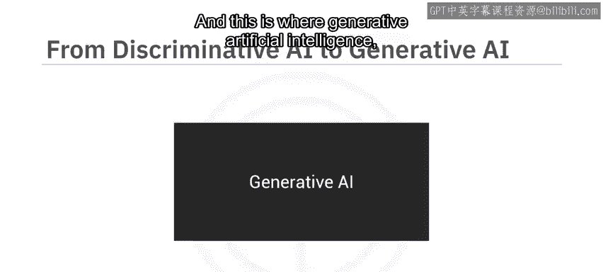

判别式AI模型最适合应用于分类任务。然而，它们无法理解上下文，也无法基于对训练数据的上下文理解来生成新内容。

---

## 生成式AI ✨

判别式AI有其局限性，而生成式人工智能（生成式AI）则弥补了这些不足。

生成式AI模型学习根据训练数据生成新的内容。它们能够捕捉训练数据的底层分布，并生成新颖的数据实例。

生成式AI从一个**提示**开始。这个提示可以是文本、图像、视频或模型可以处理的任何其他输入。作为输出，模型会生成新的内容，包括文本、图像、音频、视频、代码和数据。生成式AI可以生成与提示相同形式的输出（例如，文本到文本），也可以生成与提示不同形式的输出（例如，文本到图像或图像到视频）。

这里有一个简单的例子来理解判别式（传统）AI和生成式AI之间的区别：
*   判别式AI最适合回答诸如“这张图片画的是鸟巢还是鸟？”这类问题。
*   生成式AI则会响应诸如“画一幅有三个蛋的鸟巢图像”这样的提示。

如果说判别式AI模仿了我们的分析和预测能力，那么生成式AI则更进一步，模仿了我们的创造能力。正如《哈佛商业评论》的评论所暗示的：AI不仅可以提升我们的分析和决策能力，还能激发创造力。生成式模型可以利用所学知识，基于这些信息创造出全新的内容。

---

## 生成式AI的基石 🧱

上一节我们了解了生成式AI的基本概念，本节中我们将探讨其背后的技术基石。

判别式模型和生成式模型都是使用深度学习技术创建的。深度学习涉及训练人工神经网络从海量数据中学习。

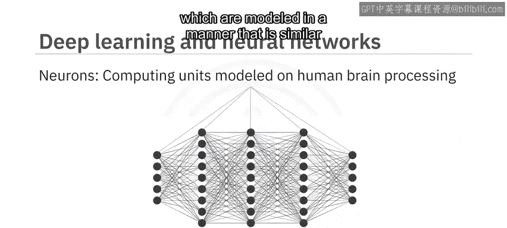

人工神经网络是由称为**神经元**的较小计算单元组成的集合，其建模方式类似于人脑处理信息的方式。

生成式AI的创造能力来自于生成式AI模型，例如：
*   **生成对抗网络（GANs）**
*   **变分自编码器（VAEs）**
*   **Transformer模型**
*   **扩散模型**

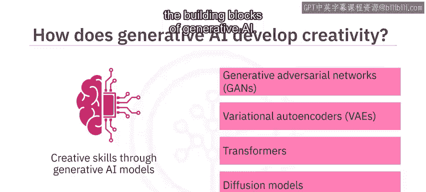

这些模型可以被视为生成式AI的构建模块。

---

## 生成式AI的演进历程 📜

生成式AI并非一个新概念。它的根源可以追溯到机器学习的起源。在20世纪50年代末，当科学家提出机器学习时，他们就探索了使用算法来创建新数据。到了20世纪90年代，神经网络的兴起进一步推动了生成式AI的发展。

在21世纪10年代初，得益于大数据集的可用性和增强的计算能力，深度学习进一步推动了生成式AI的发展。2014年，随着Ian Goodfellow及其同事引入**GANs**，生成式AI发生了变革。GANs以及其他模型如VAEs和Transformer为生成式AI的增长以及基础模型和工具的开发奠定了基础。

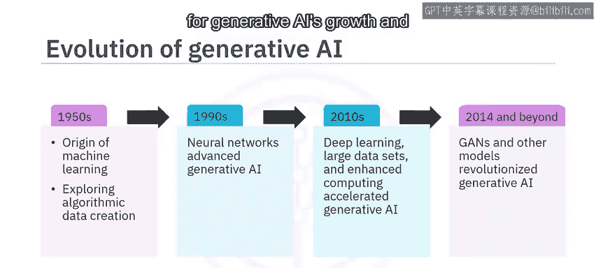

---

## 基础模型与大语言模型 📚

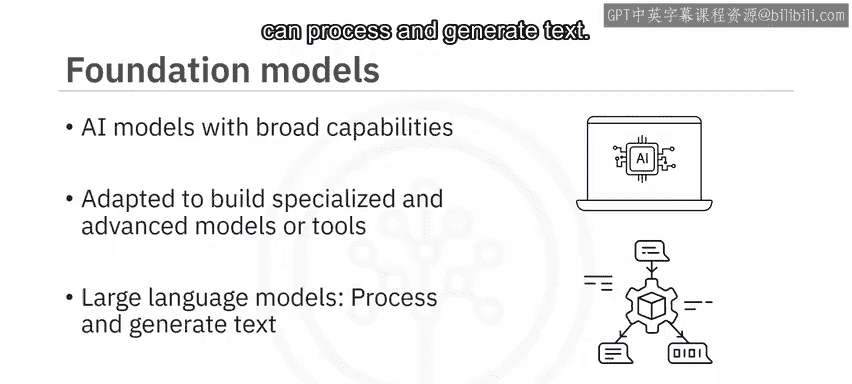

基础模型是具有广泛能力的AI模型，可以被调整以创建更专业的模型或针对特定用例的工具。

基础模型的一个特定类别称为**大语言模型（LLMs）**，它们经过训练以理解人类语言，并能处理和生成文本。

2018年，OpenAI推出了一款基于Transformer的LLM，名为**生成式预训练Transformer（GPT）**。多年来，不同的LLM，如GPT系列中的GPT-3和GPT-4、Google的Pathways语言模型（PaLM）以及Meta的大语言模型Meta AI（Llama），都显著增强了生成式AI生成连贯且相关文本的能力。在其他用例的模型方面也有类似的发展，例如用于图像生成的Stable Diffusion和DALL-E模型。

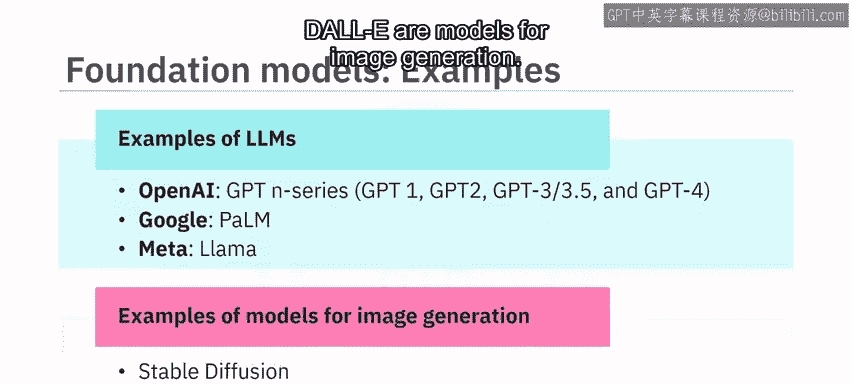

---

## 生成式AI工具与应用 🌐

多种生成式模型的发展催生了针对不同用例的生成式AI工具市场的增长。

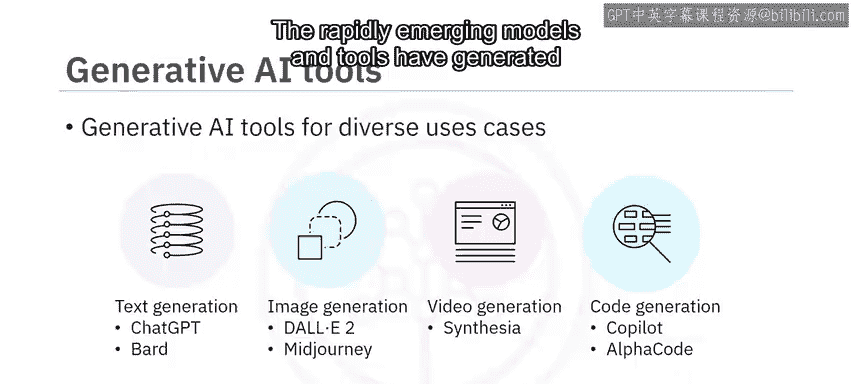

以下是不同领域的生成式AI工具示例：
*   **文本生成**：ChatGPT和Bard
*   **图像生成**：DALL-E 2和Midjourney
*   **视频生成**：Synthesia
*   **代码生成**：GitHub Copilot和Amazon CodeWhisperer

快速涌现的模型和工具为生成式AI在各个领域的应用开辟了广阔的前景。引用麦肯锡关于生成式AI经济潜力的报告：“生成式AI有潜力改变工作的结构，通过自动化部分个人活动来增强个体工作者的能力。”该报告还预测，生成式AI对生产力的影响可能为全球经济增加数万亿美元的价值。

---

## 总结 📝

本节课中我们一起学习了生成式人工智能的核心知识。

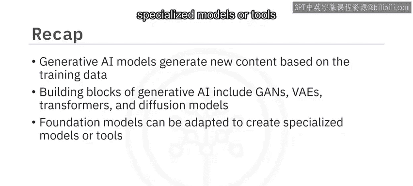

我们了解到，生成式AI模型可以根据其训练的数据生成新的内容。此外，我们还学习了生成式AI的创造能力建立在诸如GANs、VAEs、Transformer和扩散模型等模型之上。基础模型可以被调整以创建针对特定用例的专业模型或工具。

最后，我们认识到生成式AI模型和工具在不同领域和行业具有广泛的应用范围。