# 036：生成式AI的功能 🚀

在本节课中，我们将学习生成式人工智能（Generative AI）的核心功能。我们将探讨文本生成、图像生成、音频生成、视频生成、代码生成、数据生成与增强，以及虚拟世界创建等能力，并了解它们在现实世界中的应用。

---

## 文本生成能力 📝

上一节我们概述了生成式AI的多种能力，本节中我们来看看其文本生成功能。生成式AI能够生成清晰、流畅且与上下文相关的文本响应。其核心是先进的大型语言模型（LLMs），这些模型在大型数据集上训练，能够生成类人文本。

以下是LLMs能够执行的一些语言相关任务：

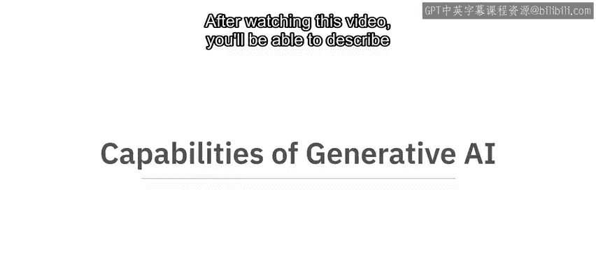

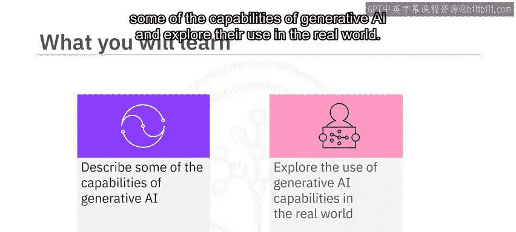

*   **文本补全**：根据已有内容续写文本。
*   **摘要**：将长文本内容浓缩为简短摘要。
*   **问答**：根据给定信息回答问题。
*   **翻译**：将文本从一种语言转换为另一种语言。
*   **代码生成**：根据描述生成代码片段。
*   **图文配对**：理解图像内容并生成描述性文本，或根据文本生成图像。

聊天机器人和虚拟助理的对话交互就是由LLMs驱动的。一些知名的LLMs包括OpenAI的生成式预训练变换器（GPT）和谷歌的Pathways语言模型（PaLM）。

---

## 图像生成能力 🎨

了解了文本生成后，我们转向视觉领域。生成式AI能够合成具有艺术感和真实感的图像，这些图像与真实照片非常相似。这主要依赖于生成对抗网络（GANs）和变分自编码器（VAEs）等深度学习技术。

生成的图像展现出逼真的纹理、自然的色彩和精细的细节，给人以真实拍摄的印象。例如：

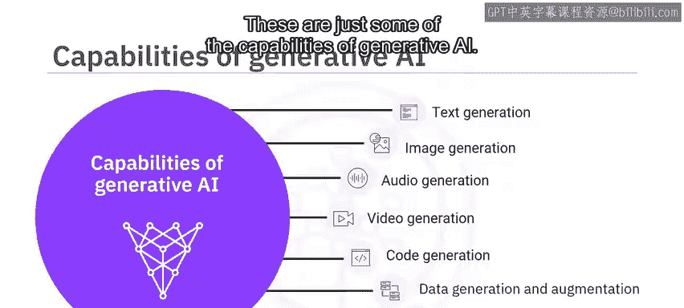

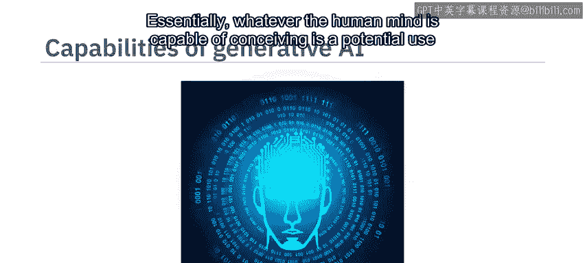

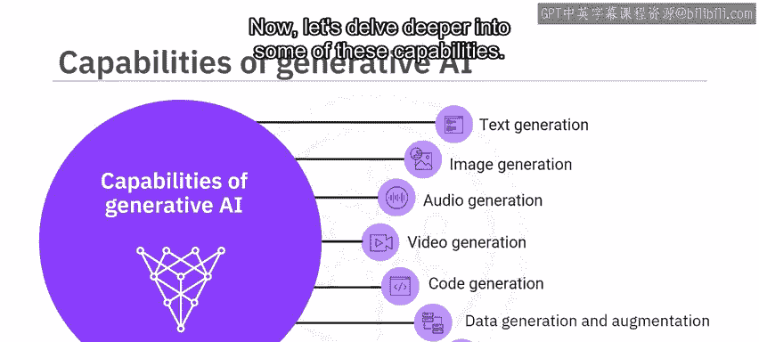

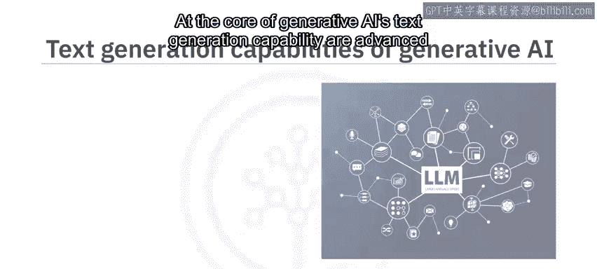

*   **StyleGAN** 可以生成高质量、高分辨率的虚构人脸、动物或自然景观图像。
*   **DeepArt** 可以从简单的草图创建复杂的艺术作品。
*   **DALL-E** 可以根据用户的文字描述生成全新的图像。

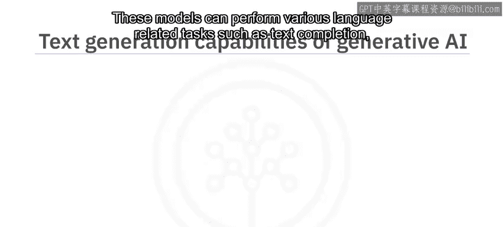

除了艺术、设计、娱乐和游戏领域，生成的图像还可用于增强训练数据集，并辅助医学成像和科学可视化。

---

## 音频生成能力 🎵

从静态图像过渡到动态声音，生成式AI在音频领域同样强大。生成模型可以创作新的音乐作品，使用文本转语音（TTS）技术将文本转换为音频，并创建合成语音和自然的人声。

这些模型能够转换、修改、净化人声，降低噪音并提升音频质量。它们还能相当逼真地模仿人类声音。例如：

*   **WaveGAN** 可以生成新的、逼真的原始音频波形，包括语音、音乐和自然声音。
*   **OpenAI的MuseNet** 可以结合各种乐器、风格和流派来生成新颖的音乐作品。
*   **Google的Tacotron 2** 和 **Mozilla TTS** 使用先进的TTS系统创建合成语音，模仿人类的语调、音高、发音、节奏和表达。

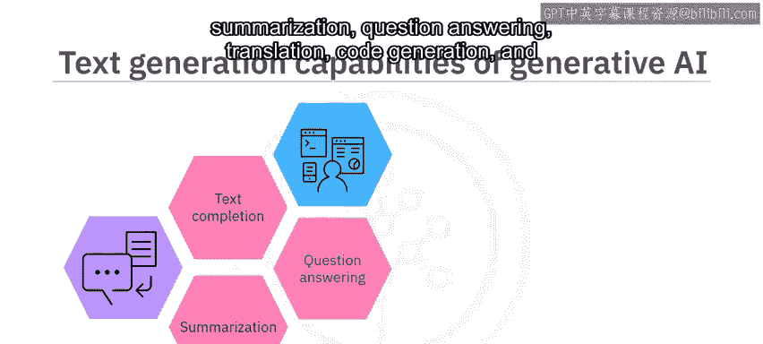

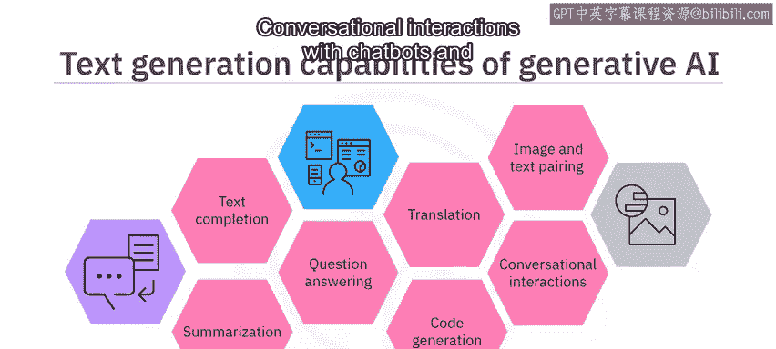

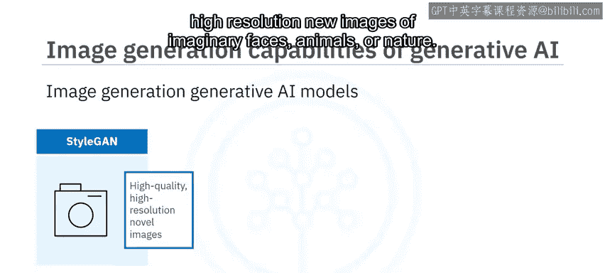

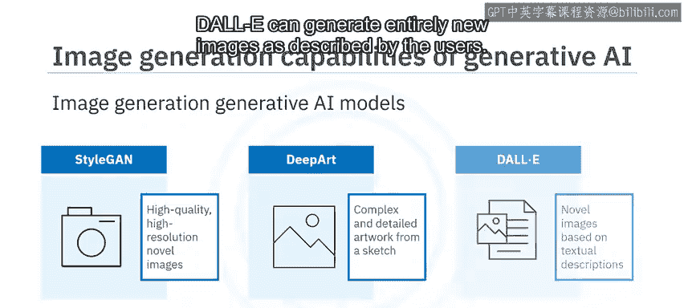

AI生成的音频在媒体创作、娱乐、培训、游戏、虚拟现实等多个领域有广泛应用。

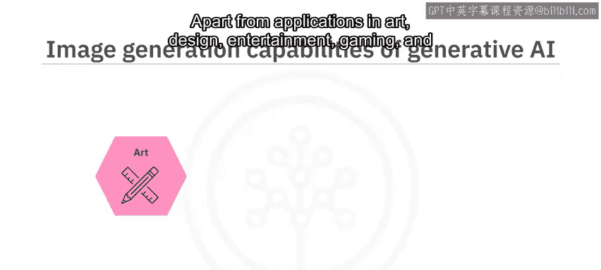

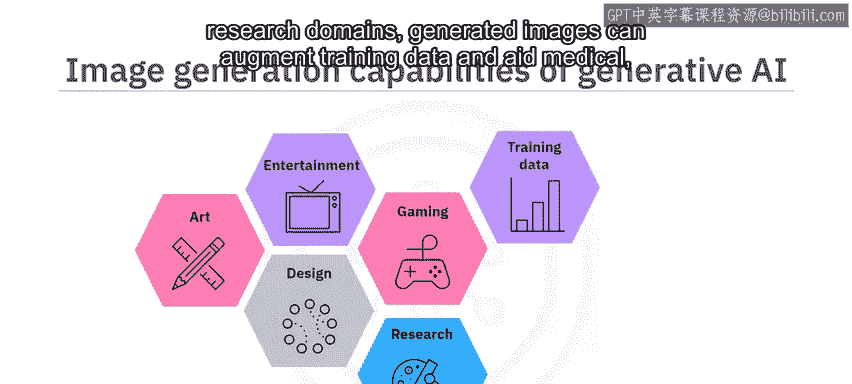

---

## 视频生成能力 🎬

接下来，我们探索动态视觉内容。生成式AI模型可以创建动态、清晰的视频，从基本动画到复杂场景。这些模型能够将图像转化为动态视频，其关键在于融入了**时间连贯性**。

在自然语言处理中，时间连贯性指的是意义或上下文随时间推移保持一致和连续。这使得模型能够在视频中呈现平滑的运动和合理的转场。

例如，流行的AI模型**VideoGPT**遵循用户提供的文本提示来生成新视频。用户可以指定期望的内容来指导视频生成过程，包括视频补全、编辑、合成、预测和风格迁移。

生成的视频可用于艺术、娱乐、教育、游戏、医学和研究等领域。

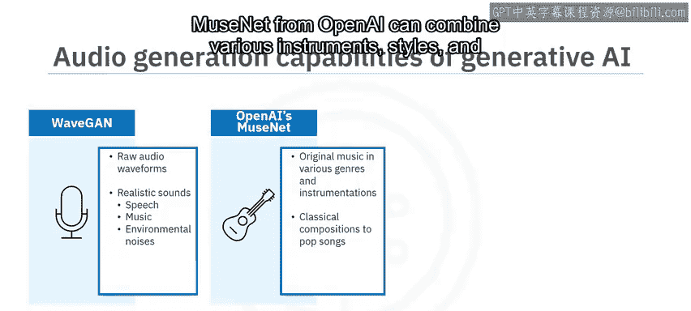

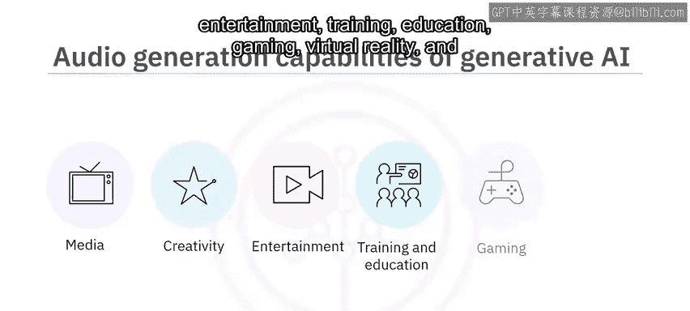

---

## 代码生成能力 💻

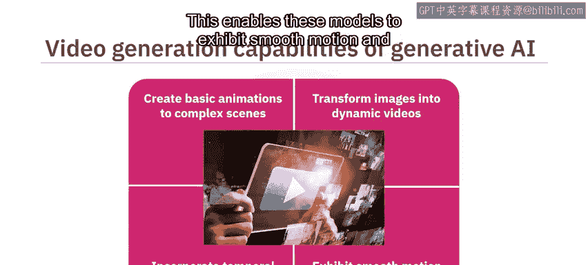

从创意内容转向实用工具，生成式AI也具备强大的代码生成能力。生成模型可以根据所需功能生成新的代码片段、函数或完整程序。

通过在现有代码库上进行训练，这些模型可以：
*   补全或创建代码。
*   合成或重构代码。
*   识别并修复代码中的错误。
*   测试软件。
*   创建文档，包括注释、函数描述和使用示例。

例如，**GitHub Copilot** 和 **IBM Watson Code Assistant** 都是基于AI的编程助手，可以帮助自动补全代码、处理复杂任务，并根据输入生成代码。

AI生成的代码可用于软件和Web开发、机器学习和自然语言处理、数据科学与分析、机器人技术与自动化、虚拟游戏和AR/VR环境开发，以及音视频和语音处理软件。开发人员可以利用代码生成功能来编写、调试和测试代码。

---

## 数据生成与增强能力 📊

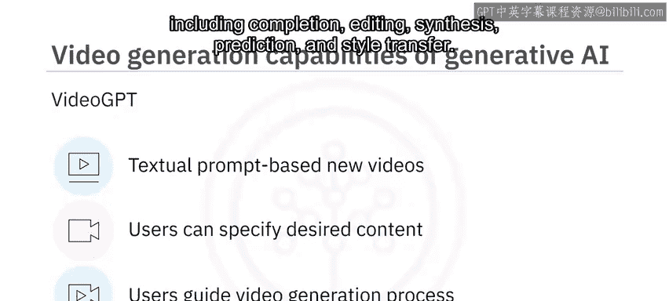

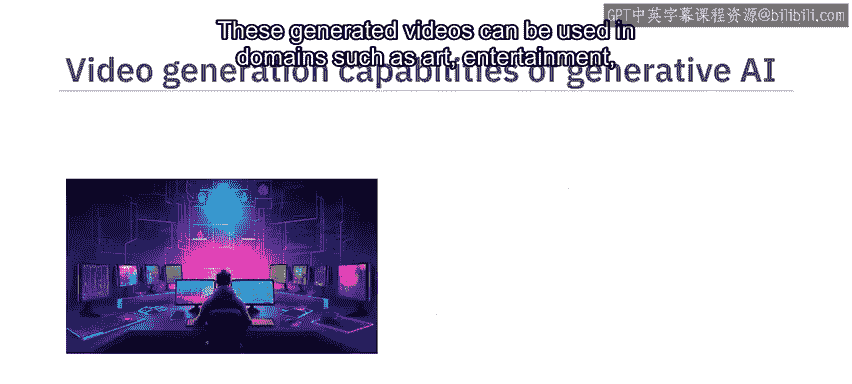

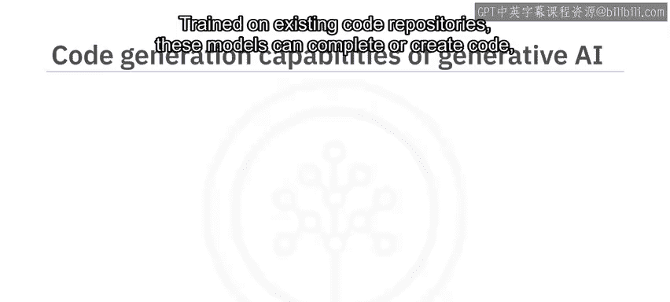

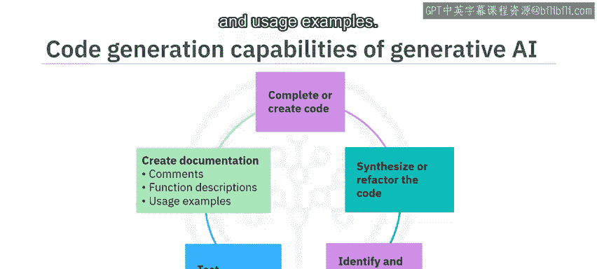

在机器学习和数据分析中，数据至关重要。生成式模型可以生成新数据并增强现有数据集。生成合成数据集有助于增加数据的多样性和可变性，从而带来更稳健、更有效的模型性能。

这些模型可以为以下内容生成新样本并增强数据集：
*   图像、文本、语音。
*   表格数据和统计分布。
*   时间序列数据、金融数据等。

生成式AI的数据生成与增强能力在医疗健康、游戏、教育与培训、艺术创作、自动驾驶汽车等众多领域有广泛应用。

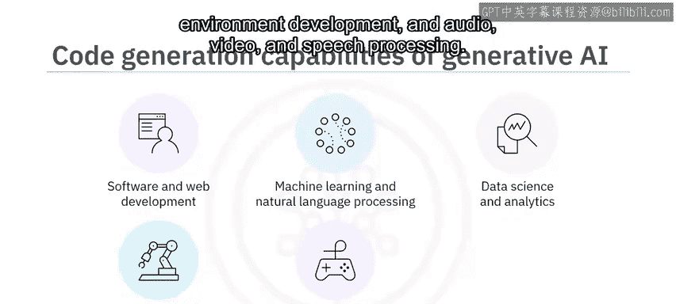

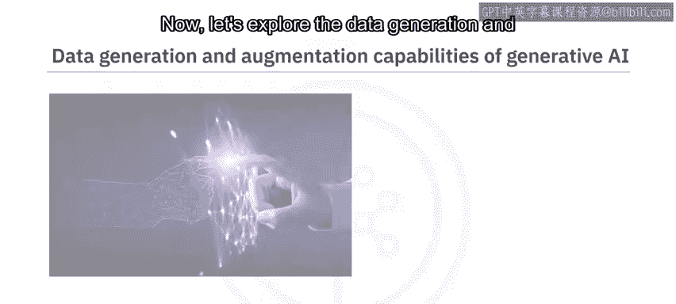

---

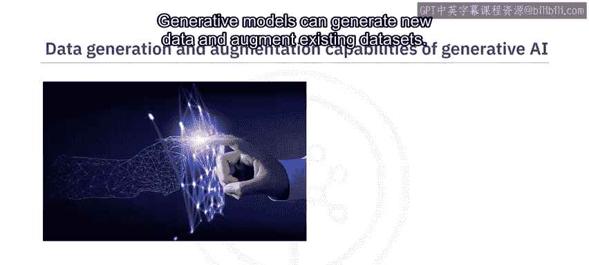

## 虚拟世界创建能力 🌐

最后，我们探讨生成式AI一个引人入胜的能力：创建高度逼真和复杂的虚拟世界。你可以创建模拟真实行为、表情、对话甚至决策的**虚拟化身（Avatars）**。

你也可以创建具有逼真纹理、声音和物体的复杂虚拟环境，这些环境遵循物理世界的规律。**元宇宙（Metaverse）** 平台使用生成模型为个体用户创造独特和个性化的体验。

生成式AI还能创建具有独特个性的虚拟身份，为虚拟化身赋予特定的性格特征，这些特征会体现在其行为和对话中。

生成式AI的虚拟世界创建能力在游戏、娱乐、教育、增强现实（AR）和虚拟现实（VR）、元宇宙平台，以及虚拟影响者和数字人格等领域有广泛应用。

---

## 总结 📚

本节课中，我们一起学习了生成式AI模型的各种功能及其在现实世界中的应用。

生成式AI能够：
1.  创建连贯且与上下文相关的内容。
2.  生成逼真的高质量图像、合成语音、新音频和动态视频。
3.  生成和补全代码，并合成新数据以增强现有数据集。
4.  创建高度逼真和复杂的虚拟世界，包括虚拟化身和数字人格。

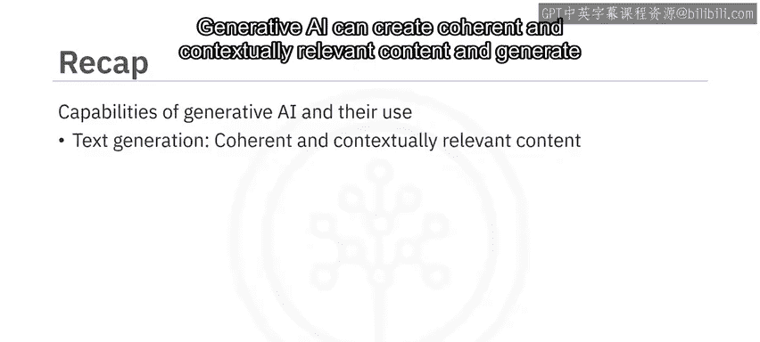

本质上，人类思维能够构想出的任何事物，都是生成式AI潜在的应用场景。