# 037：生成式AI的应用 🚀

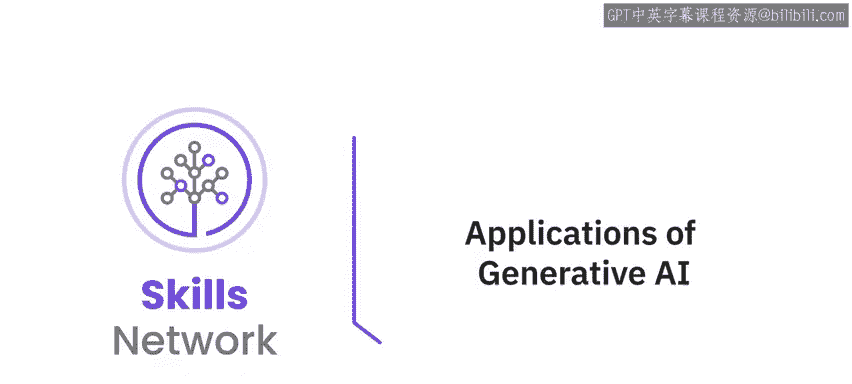

在本节课中，我们将学习生成式人工智能在不同领域的具体应用。我们将重点探讨生成式AI在信息技术与运维、娱乐、教育、银行与金融、医疗保健、人力资源以及日常工作等领域的实际应用案例。

## 概述

生成式AI能够创造新的内容、数据或解决方案，其应用正迅速扩展到各行各业。理解这些应用有助于我们认识AI技术如何改变工作方式并创造价值。

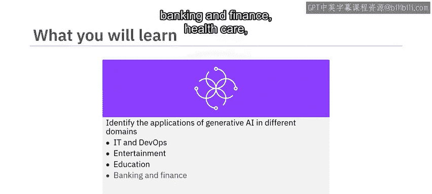

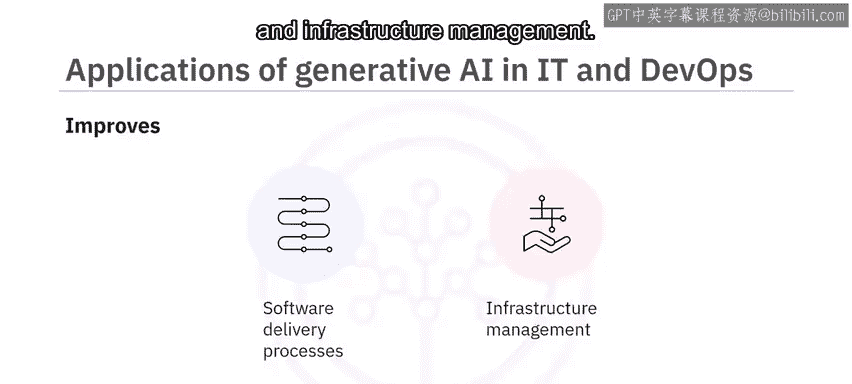

---

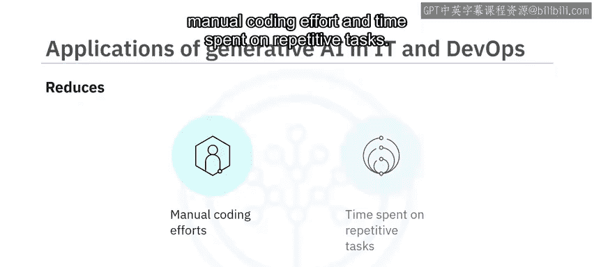

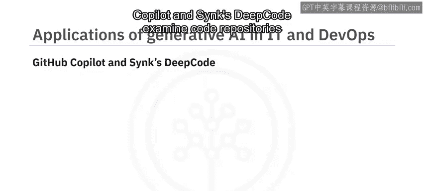

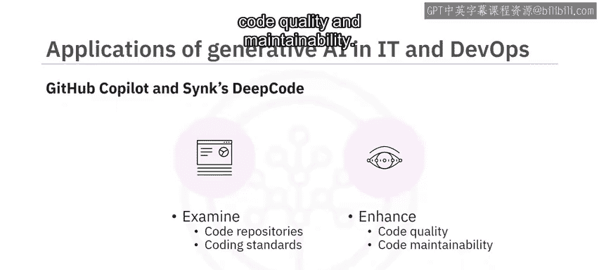

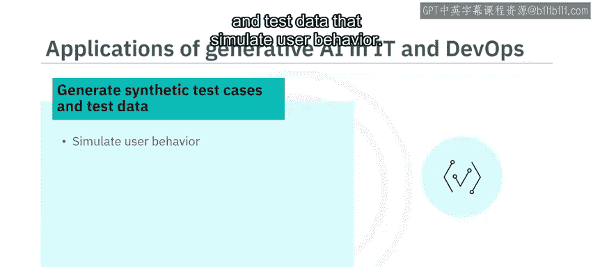

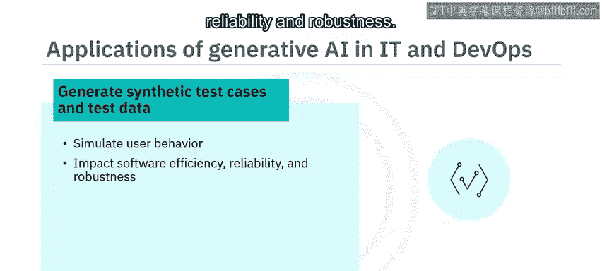

## 信息技术与运维 (IT & DevOps) 💻

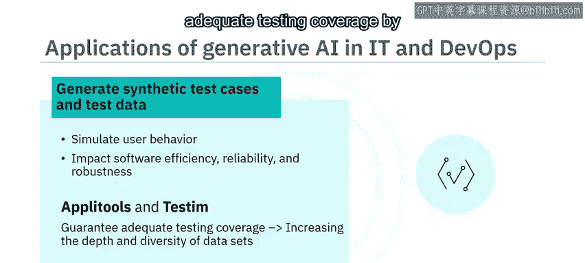

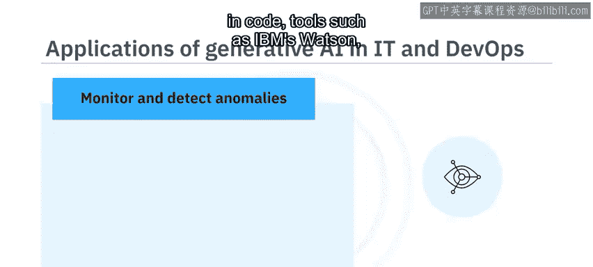

上一节我们介绍了课程概述，本节中我们来看看生成式AI在IT与运维领域的应用。生成式AI有助于改进软件交付流程和基础设施管理。

以下是生成式AI在IT与DevOps中的主要应用：

*   **代码生成**：生成式AI的代码生成能力减少了手动编码的工作量和在重复性任务上花费的时间。
*   **代码审查**：由生成式AI驱动的代码审查工具（如 **GitHub Copilot** 和 **Synk DeepCode**）检查代码库和编码标准，以提高代码质量和可维护性。
*   **自动化测试**：生成模型可以生成模拟用户行为的合成测试用例和测试数据。多样化的测试用例影响软件的效率、可靠性和健壮性。**Applitools** 和 **Testim** 等工具通过增加数据集的深度和多样性来保证足够的测试覆盖率。
*   **监控与异常检测**：为了监控和检测代码中的异常，**IBM的Watson AIOps** 和 **Moogsoft AIOps** 等工具会分析系统日志、指标和其他数据。这有助于进行主动维护和故障排除，减少停机时间并防止严重故障。
*   **持续集成与部署**：**GitDuo** 通过自动创建发布说明、变更日志以及更新部署模板和脚本来支持持续集成与部署（CI/CD）流程。
*   **其他应用**：在IT和DevOps中的其他应用包括自然语言界面、自动化管理和预测性维护。

---

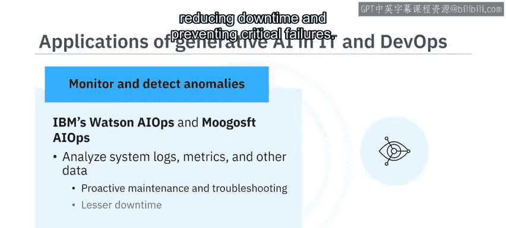

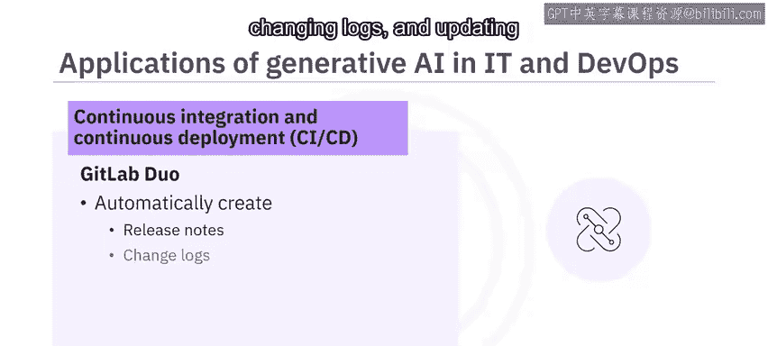

## 娱乐领域 🎬

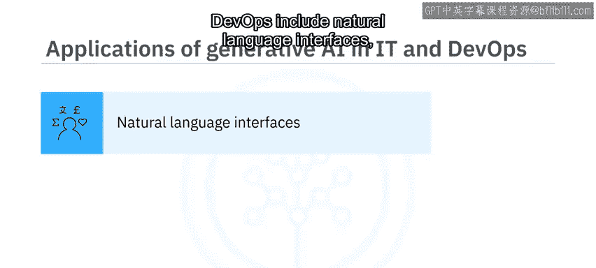

了解了生成式AI如何助力IT运维后，我们转向娱乐产业。生成式AI工具可以生成各种合成内容。

以下是生成式AI在娱乐领域的主要应用：

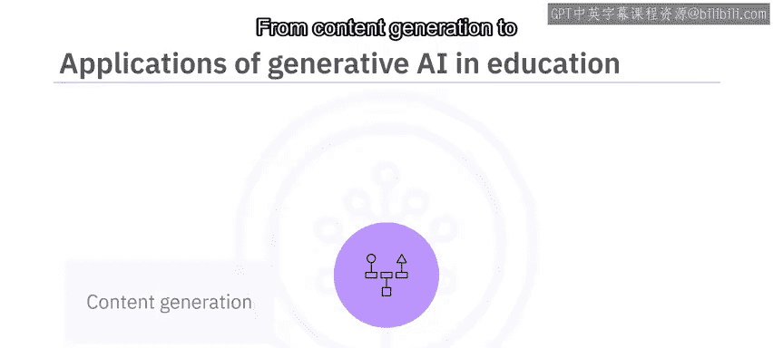

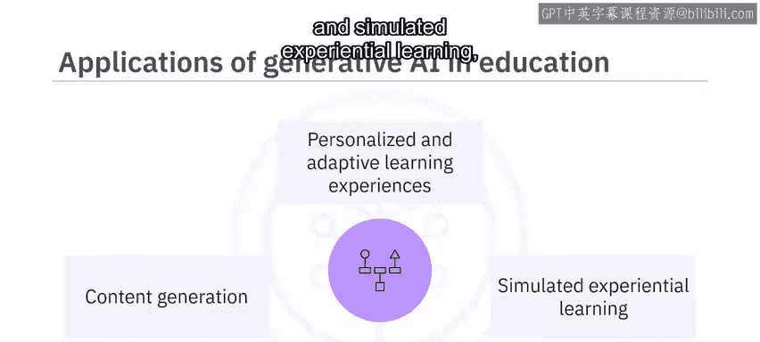

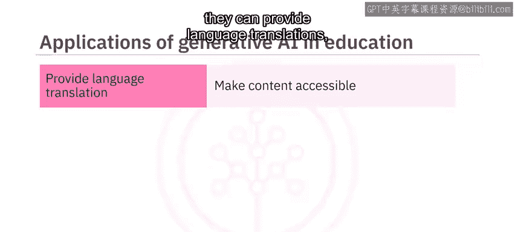

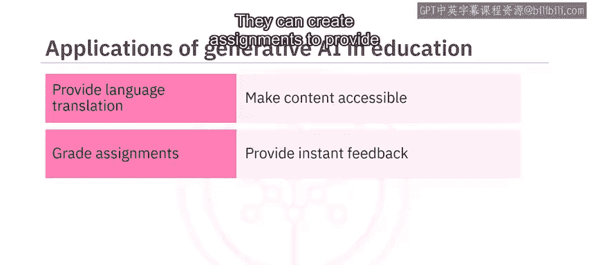

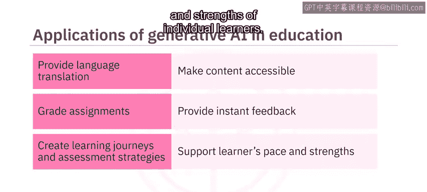

*   **内容生成**：生成式AI工具可以生成各种合成内容，例如音乐、剧本、故事、电影和视频游戏。
*   **内容本地化与个性化**：它们还可以翻译、本地化和个性化内容。
*   **游戏开发**：**SideFX公司的Houdini** 等游戏开发工具利用生成式AI的力量来创建游戏、动画、增强和虚拟现实体验以及具有独特行为的角色。
*   **虚拟形象**：最近，由生成式AI驱动的虚拟影响者和虚拟形象也流行起来，它们可以与用户互动，创造引人入胜的体验。

---

## 教育领域 📚

生成式AI的另一个重要应用领域是教育，从内容生成到个性化和自适应学习体验，再到模拟体验式学习，其影响巨大。

以下是生成式AI在教育领域的主要应用：

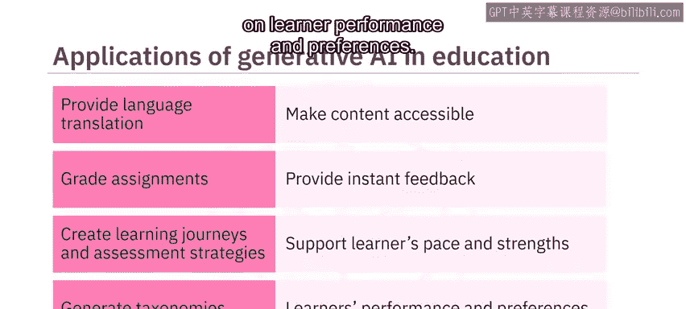

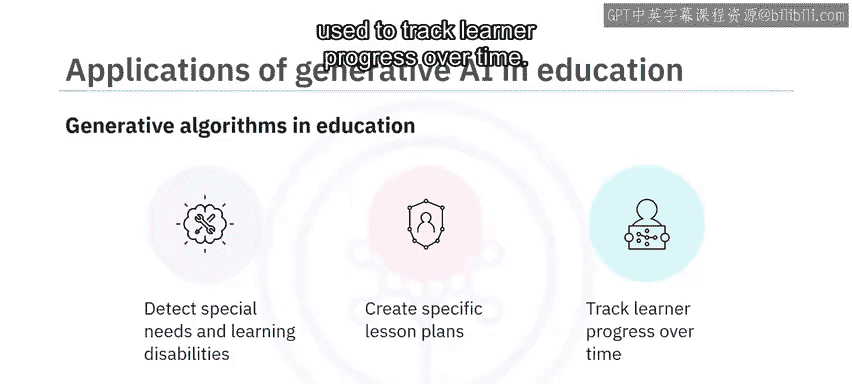

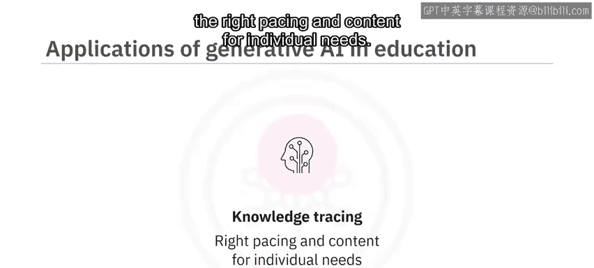

*   **语言翻译**：凭借其语言能力，它们可以提供语言翻译，使内容能以不同语言访问。
*   **作业批改与反馈**：它们可以批改作业以提供即时反馈。
*   **个性化学习路径**：它们可以创建支持个体学习者节奏和优势的学习旅程和评估策略。
*   **学习分类生成**：可以根据学习者的表现和偏好生成分类法。
*   **特殊需求检测**：生成式算法可以检测特殊需求和学习障碍，以帮助学习者和教育者制定特定的课程计划。
*   **知识追踪**：生成式算法也被用于追踪学习者随时间推移的进度，即知识追踪。这有助于为个人需求提供合适的节奏和内容。
*   **其他益处**：辅导支持、虚拟和模拟环境以及包容性教育也从中受益。
*   **工具示例**：例如，**Nolej** 在几分钟内提供AI生成的电子学习内容，包括针对目标主题的交互式视频、术语表、练习题和摘要。**Duolingo** 是一个语言学习平台，它使用GPT-3来纠正法语语法并为英语创建测试项目。

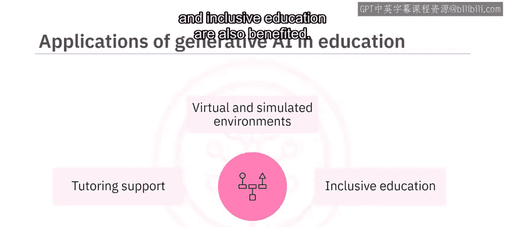

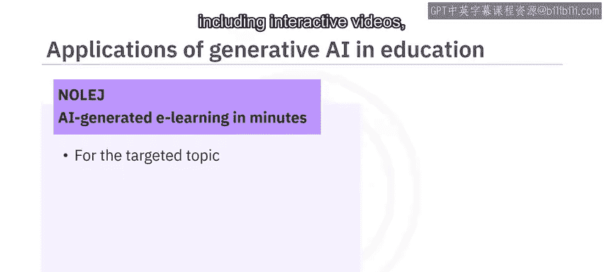

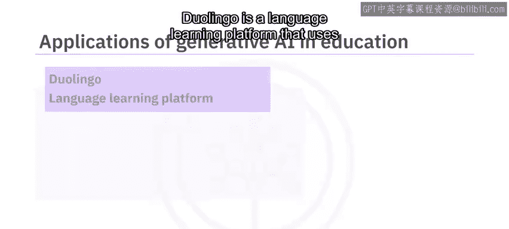

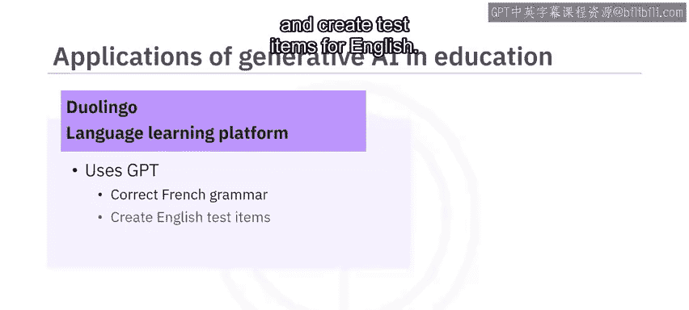

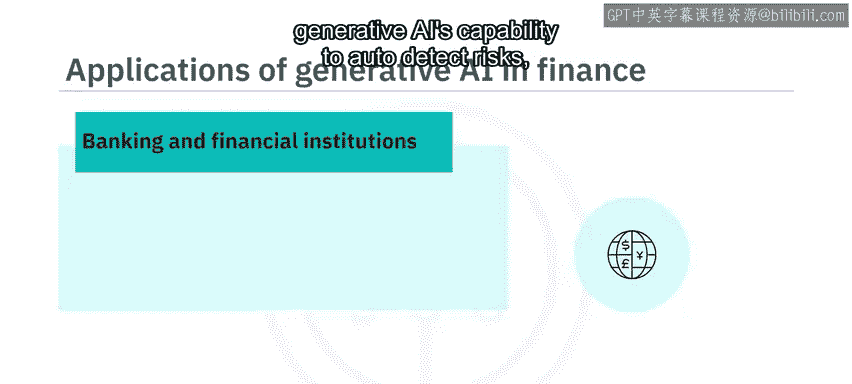

---

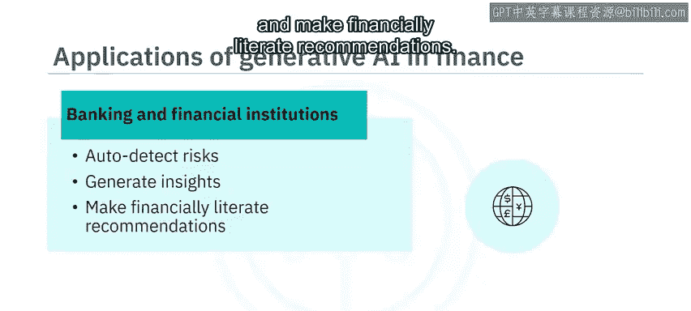

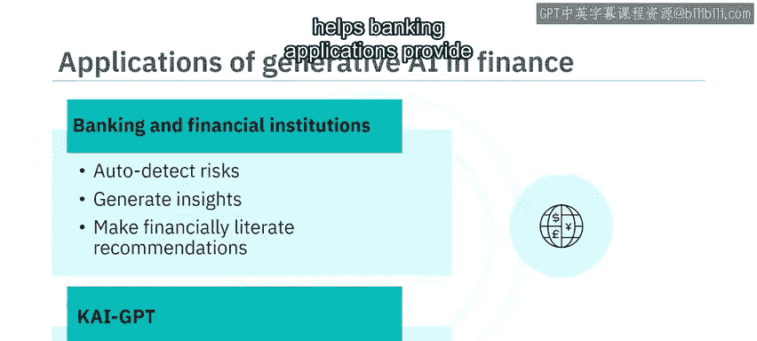

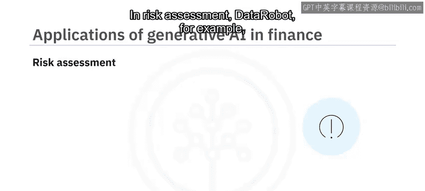

## 银行与金融领域 🏦

银行和金融机构极大地受益于生成式AI自动检测风险、生成见解和提供具备金融知识的建议的能力。

以下是生成式AI在银行与金融领域的主要应用：

*   **行业专用大语言模型**：**K.AI G** 是第一个银行业专用的大语言模型，它帮助银行应用程序提供类人的、具备金融知识的响应。
*   **风险评估**：例如，在风险评估中，**DataRobot** 通过模拟潜在的欺诈场景来生成合成用例，以检测信用风险、欺诈风险和市场波动。
*   **信用评分**：**Peritus** 和 **Aiolo.gic** 利用生成模型来检测风险、确定利率和构建定制贷款。它们自动化评估客户信用度并设定信用额度或保险费率。
*   **市场情绪分析**：由生成式AI驱动的工具，如 **BloombergGPT**，可以分析新闻文章、社交媒体和其他分类文本数据，以更有效地进行市场情绪分析和管理投资组合。
*   **客户服务**：生成式AI工具增强了对话系统，并利用机器人顾问、聊天机器人和虚拟助手协助财务规划。
*   **其他受益领域**：监管合规与报告、财务预测、投资组合优化、反洗钱和算法交易是一些极大受益的领域。

需要注意的是，其中一些应用和工具同时利用了生成式和判别式AI模型。

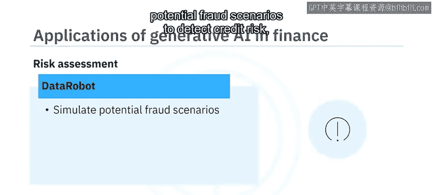

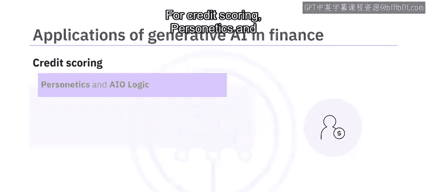

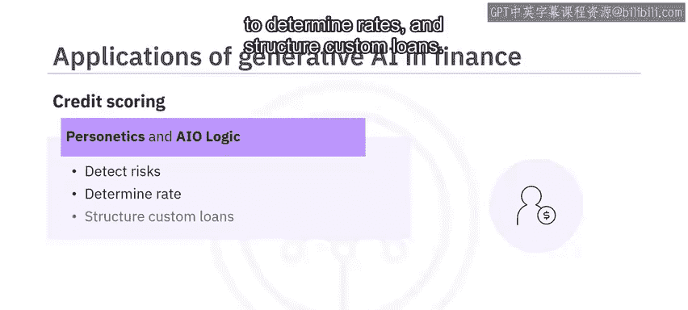

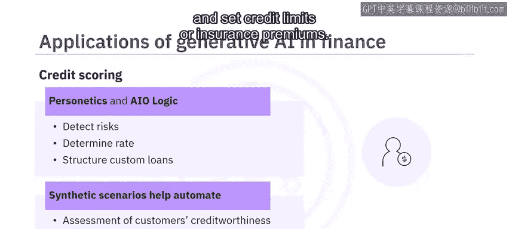

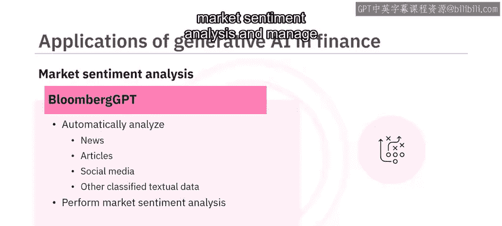

---

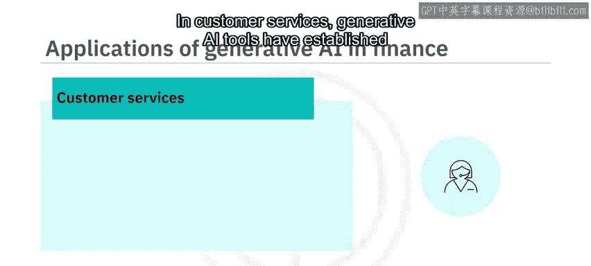

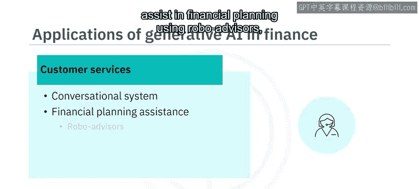

## 医疗保健领域 🏥

现在让我们讨论一些在医学和医疗保健研究、药物发现、诊断和患者护理方面的应用。

以下是生成式AI在医疗保健领域的主要应用：

*   **医学影像分析**：凭借生成类似于患者数据的合成图像的能力，生成模型提高了用于医学影像分析的深度学习模型的健壮性。
*   **罕见病研究**：这些模型可以为数据非常有限的罕见疾病合成数据。这有助于促进研究、训练AI模型并为罕见病例开发新的诊断工具。
*   **药物发现**：在药物发现中，这些模型通过生成新分子、加速药物发现过程和降低开发成本来提供帮助。
*   **远程医疗**：远程医疗和远程监护也受益于生成式AI驱动的对话工具。
*   **工具示例**：例如，**Rasa** 可以与患者建立具备医学知识的对话，以提供即时医疗建议、健康相关支持和个性化治疗计划。
*   **其他领域**：该领域的其他领域包括电子健康记录管理、健康欺诈检测以及医学模拟和培训。

---

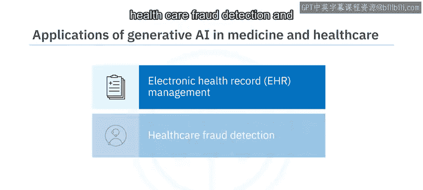

## 人力资源领域 👥

让我们看看生成式AI如何赋能人力资源部门，使其自动化重复性任务、提供有价值的见解并简化人力资源流程。

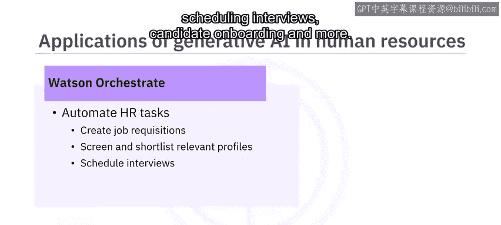

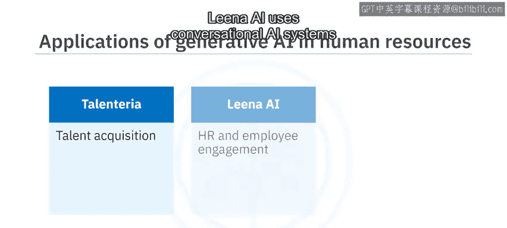

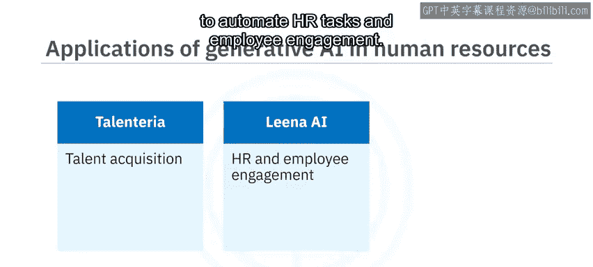

以下是生成式AI在人力资源领域的主要应用：

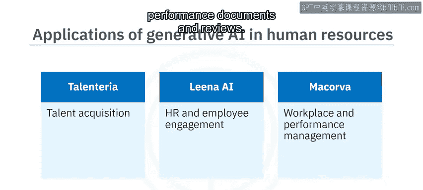

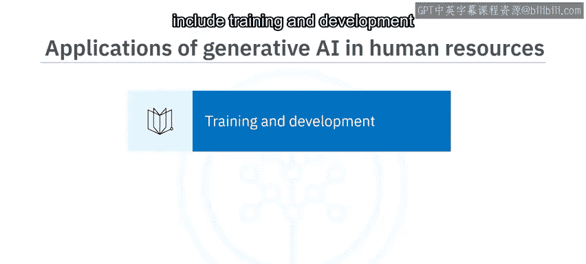

*   **自动化HR任务**：例如，**Watson X Orchestrate** 有助于自动化HR任务，例如创建职位需求、筛选和入围相关简历、安排面试、候选人入职等。
*   **人才获取**：**Talenteria** 专注于人才获取。
*   **员工互动**：**Lina AI** 使用对话式AI系统自动化HR任务和员工互动。
*   **绩效管理**：**Mccorva** 通过自动生成绩效文档和评估来专注于工作场所和绩效管理。
*   **其他应用**：生成式AI在HR中的其他应用包括培训与发展、分析与决策以及合规与政策实施。

---

## 对工作的影响 ⚙️

虽然我们今天只谈到了几个领域，但人们最终相信生成式AI将对所有行业产生重大影响。另一个产生重大影响的领域是我们的工作方式。

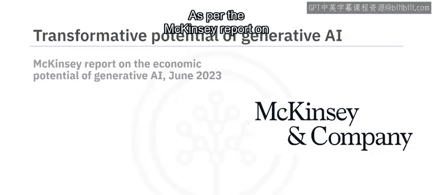

根据麦肯锡关于生成式AI经济潜力的报告，当前的生成式AI和其他技术有潜力自动化如今占用员工60%至70%时间的工作活动。到2030年至2060年间，今天一半的工作活动可能会被自动化。生成式AI日益增长的理解自然语言的能力最终将影响甚至通常与高等教育和习得技能相关的知识型工作。

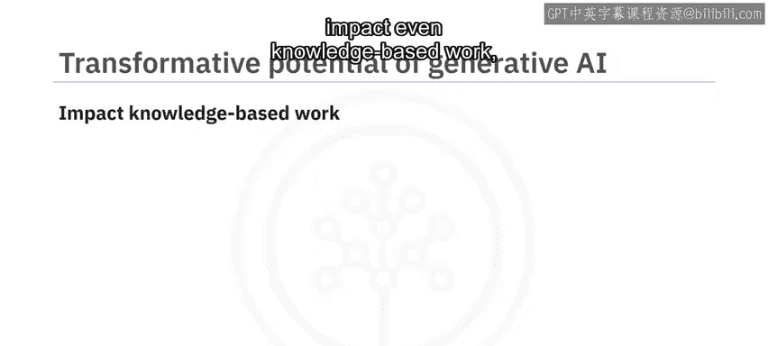

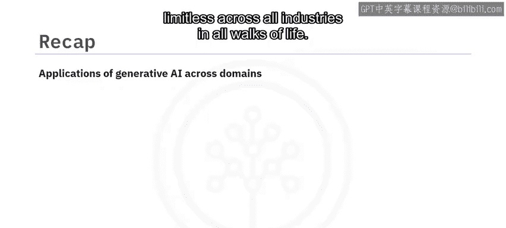

---

## 总结 📝

本节课中，我们一起学习了生成式AI在各个领域的流行应用。然而，重要的是要注意，生成式AI的潜在应用在所有行业和生活的各个方面几乎是无限的。

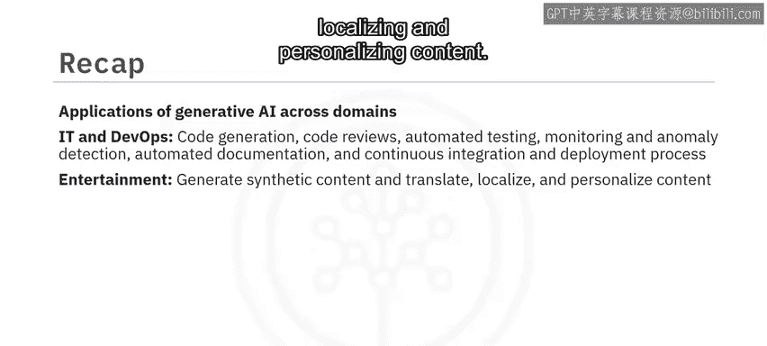

*   在**IT和DevOps**中，应用包括代码生成、代码审查、自动化测试、监控和异常检测、自动化文档以及持续集成和部署流程。
*   在**娱乐**领域，生成式AI通过生成各种合成内容以及翻译、本地化和个性化内容，提供了令人兴奋的可能性。
*   在**教育**领域，生成式AI改变了教育的覆盖范围和质量，影响着学习者、教育者和教育技术。
*   在**金融**领域，应用领域包括风险评估、信用评分、情绪分析、投资组合管理、合规、预测、培训和客户关怀。
*   在**医学和医疗保健**领域，我们看到应用涉及医学研究、诊断、药物、医学培训和患者护理。
*   在**HR**领域，应用涉及人才获取、员工互动、绩效管理、培训与发展、HR分析和政策实施。
*   在**工作场所**，生成式AI的应用正在改变我们的工作方式，使我们更高效、更成功。