# 038：文本生成工具 🧠

在本节课中，我们将学习生成式人工智能如何实现文本生成，并介绍几种主流的文本生成工具及其核心能力。

---

## 概述

文本生成是生成式人工智能的核心能力之一，其基础是大语言模型。本节将解释大语言模型的工作原理，并介绍两种流行的文本生成工具：ChatGPT 和 Bard。我们还将探讨其他工具及其特定用途。

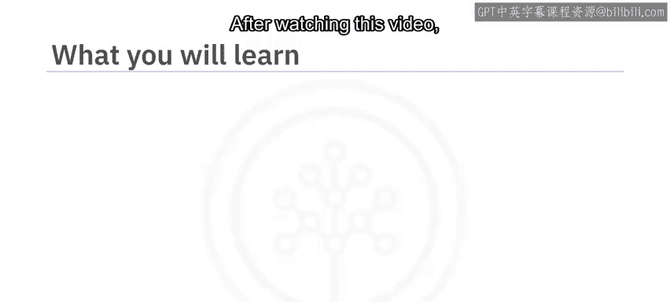

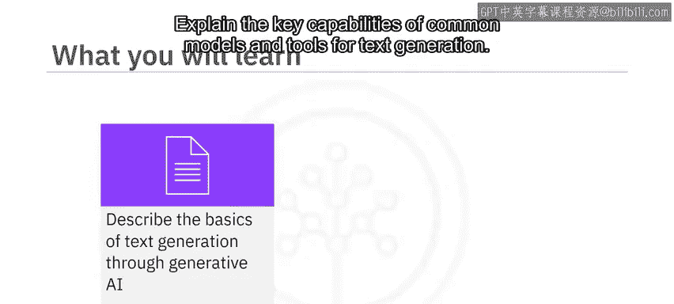

---

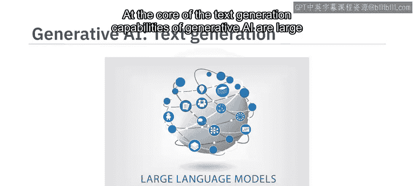

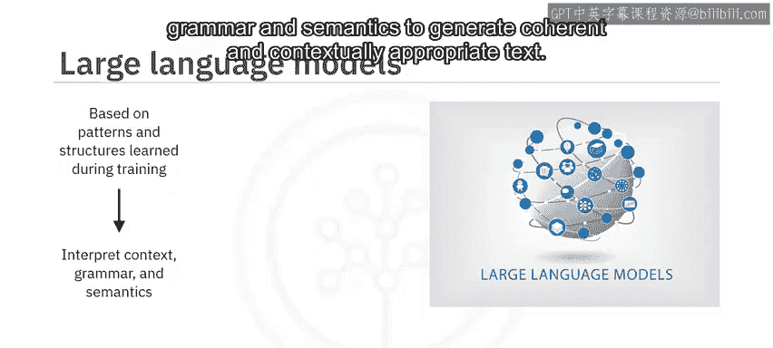

## 大语言模型：文本生成的核心

上一节我们介绍了生成式人工智能的基本概念，本节中我们来看看其文本生成能力的核心——大语言模型。

大语言模型基于在训练期间学习到的模式和结构。它们通过解读上下文、语法和语义来生成连贯且符合语境的文本。通过分析词语和短语之间的统计关系，大语言模型能够适应任何给定语境下的创造性写作风格。

**公式表示其核心思想**：
`生成的文本 = 模型(输入提示 | 训练数据中的统计模式)`

许多文本生成模型都基于大语言模型，例如生成式预训练变换器。

---

## 主流文本生成工具

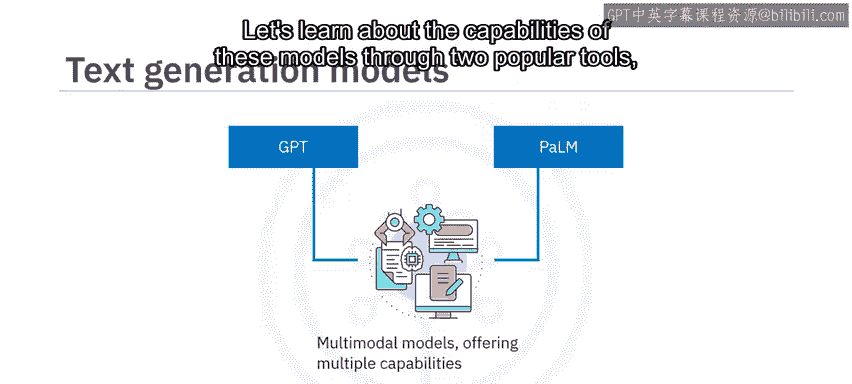

这些模型已发展为多模态模型，提供多种能力。我们通过两个流行工具来了解这些模型的能力：ChatGPT 和 Bard。

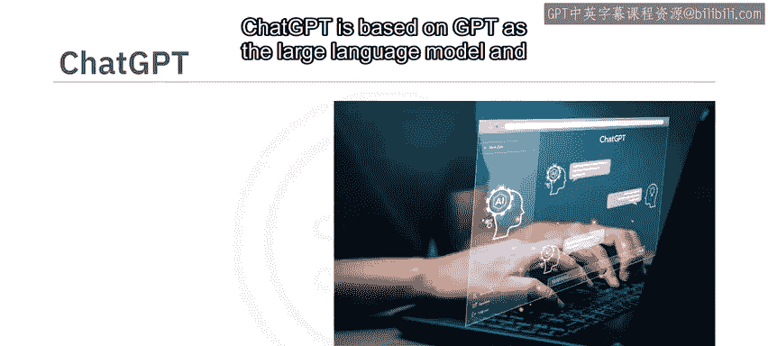

### ChatGPT：基于GPT模型

ChatGPT 基于 GPT 大语言模型，并使用了先进的自然语言处理技术。最初，ChatGPT 仅接受文本提示作为输入来生成新内容；而更新版本可以同时接受图像和文本输入。

ChatGPT 为文本生成提供了多样化的能力，能够进行流畅且基于上下文的对话。

以下是使用 ChatGPT 进行学习对话的示例步骤：

1.  输入提示：“我听说过生成式人工智能，想了解更多。”
2.  ChatGPT 会根据上下文回复一些基本信息。
3.  继续对话，提出更具体的问题来细化研究，例如：“我如何利用生成式人工智能来提高我的讲故事技巧？”
4.  ChatGPT 会根据你提供的上下文和问题给出相应回答。

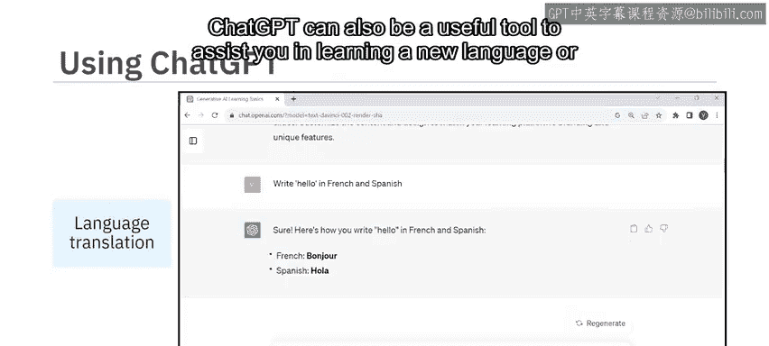

你可以自由尝试并引导对话，ChatGPT 将构建出信息丰富且有趣的交流。

它也能协助完成各种创造性任务。例如，输入提示：“帮我创建幻灯片来展示一个学习平台的功能。” ChatGPT 会为特定幻灯片提供标题、内容和视觉元素的建议。

尽管 ChatGPT 最擅长英语，但它能理解并响应多种其他语言。例如，提示它用法语和西班牙语写“你好”，它就能生成所需的输出。ChatGPT 也可以是学习新语言或任何科目的有用工具。

### Google Bard：基于PaLM模型

另一个流行的文本生成工具是 Google Bard。它基于谷歌的高级语言模型 PaLM。

PaLM 是变换器模型与谷歌 Pathways AI 平台的结合。Pathways AI 基于专门的“路径”模块，每个模块负责特定任务，如自然语言处理或机器翻译。

除了海量的文本和代码训练数据集，Bard 还会从互联网上的资源中提取信息来响应提示。

尝试使用不同的提示来探索 Bard 的能力：

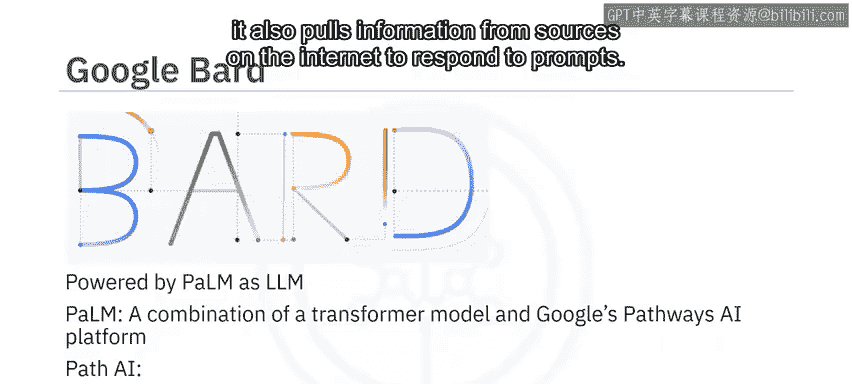

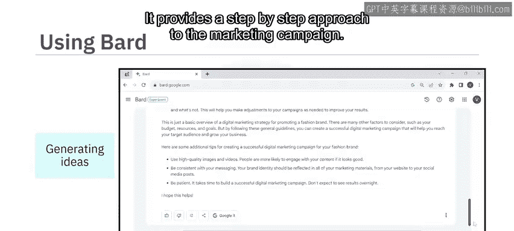

*   **获取新闻摘要**：提示“提供关于乌克兰战争的最新新闻摘要”。它会提供多个版本的回复草稿，你可以选择其一或重新生成。
*   **生成想法或解决问题**：提示“为推广一个时尚品牌提供数字营销活动策略”。它会提供营销活动的分步方法。

---

## 其他能力与用例

ChatGPT 和 Bard 还为其他有价值的用例提供能力。例如：

*   它们可以通过这些科目帮助你进行基础数学、统计和问题求解。
*   它们也精通财务分析、投资研究、预算编制等。
*   此外，ChatGPT 和 Bard 可以生成代码，并跨各种编程语言和框架执行与代码相关的任务。

在与 ChatGPT 和 Bard 互动后，你会注意到：
*   ChatGPT 在生成动态响应和维持对话流方面更有效。
*   而 Bard 由于其通过谷歌搜索和谷歌学术访问网络资源，可能是研究某个主题的最新新闻或信息的更好选择。

需要认识到，包括 GPT 和 PaLM 在内的生成式 AI 模型正在不断发展，因此其他能力和特性可能会发生变化。

---

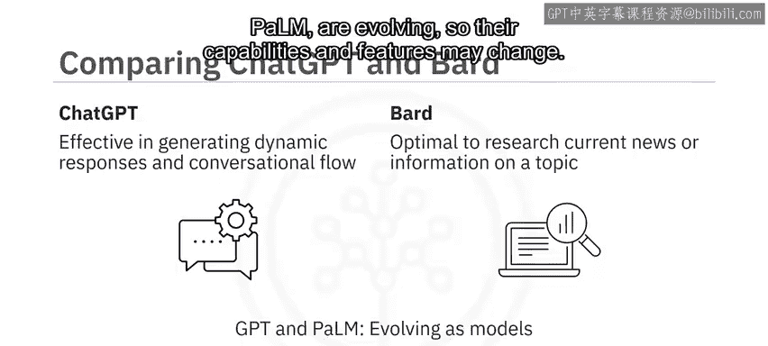

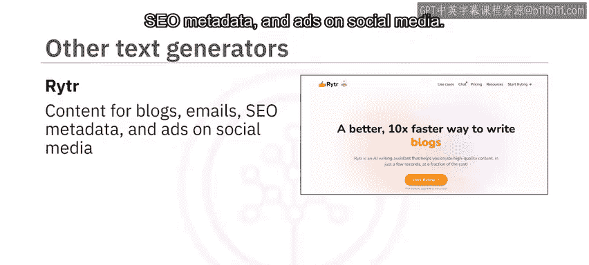

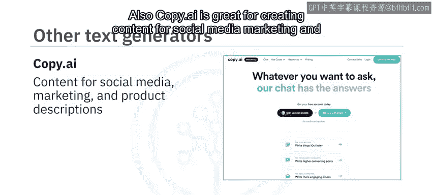

## 其他文本生成工具

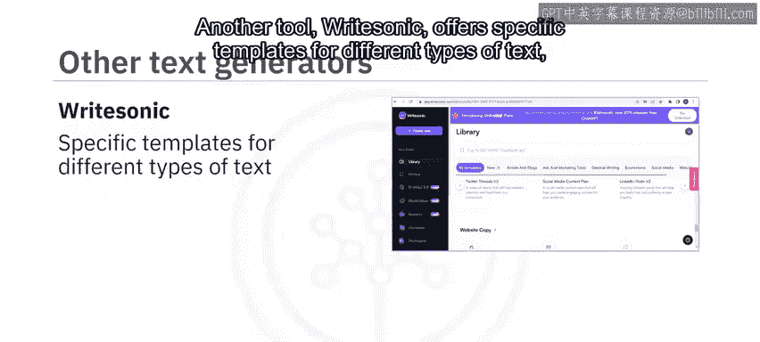

除了 ChatGPT 和 Bard，还有其他文本生成器。以下是部分工具及其特点：

*   **Jasper**：生成任何长度的高质量营销内容，并可根据品牌声音进行定制。
*   **Writesonic**：为不同类型的文本（如文章、博客、广告和营销文案）提供特定模板。
*   **Copy.ai**：擅长为社交媒体、营销和产品描述创建内容。

还有一些工具可用于特定用例：

*   **摘要生成**：例如 TLDR，通过提取关键思想或概念来生成文本摘要。
*   **文本分类**：例如 UClassify，用于为文本片段分配一个或多个类别。
*   **情感分析**：例如 Brand24 和 Repustate，用于理解并生成反映人类语言中所表达潜在情感的文本。
*   **多语言翻译**：例如 Language Weaver 和 Yandex Translate。

---

## 隐私考量与开源替代方案

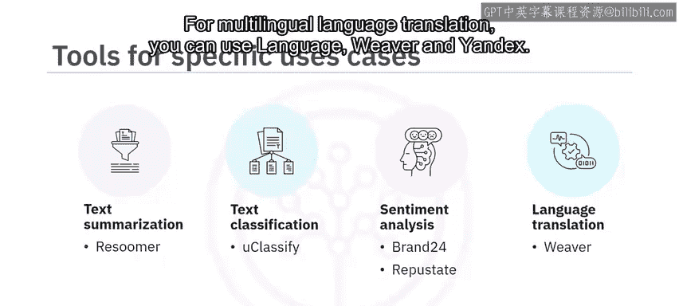

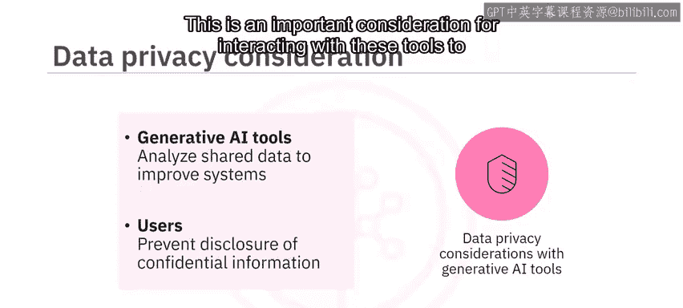

需要注意的是，许多开源的生成式 AI 工具会收集并审查与其共享的数据以改进其系统。在与这些工具互动时，为避免共享任何机密或敏感信息，这是一个重要的考虑因素。

那么，我们是否有开源的、保护隐私的替代方案？答案是肯定的。

例如，**GPT4All** 可以安装在你的机器上，作为一个具有隐私意识的聊天机器人运行，无需互联网或图形处理单元。

此外，像 **H2O AI** 和 **PrivateGPT** 这样的聊天机器人旨在通过在没有互联网连接的本地机器上运行来保护用户隐私。

不仅如此，你还可以通过将这些工具链接到你组织的文档和数据库，为特定组织内部使用进行定制。

---

## 文本生成工具的优势

生成式 AI 文本生成工具提供了多项好处：

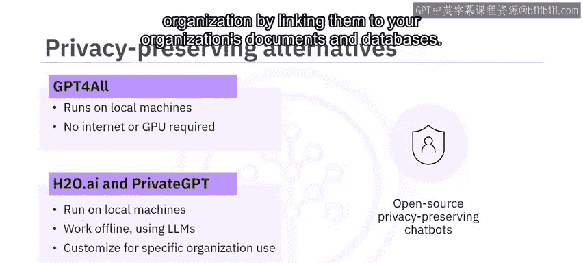

*   **学习辅助**：提供分步解释，是良好的学习助手。
*   **提升效率**：能够快速生成不同形式的文本，为作者和创作者提高效率。
*   **激发创意**：增强创造力并激发新想法。
*   **虚拟助手**：通过实现引人入胜的互动对话，可用作虚拟助手和聊天机器人。
*   **提高生产力**：通过自动化重复性写作任务，可以提高组织生产力。
*   **支持多语言**：通过多语言支持，便于全球受众的沟通和内容本地化。

---

## 总结

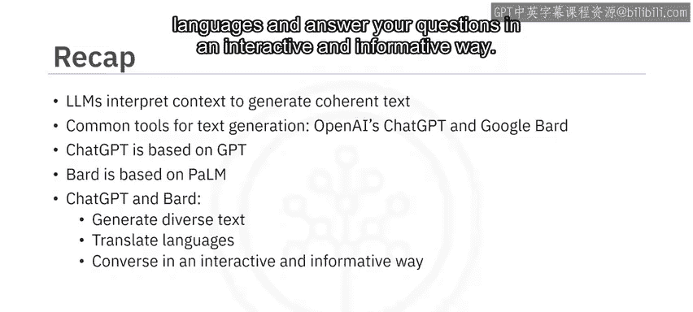

本节课中，我们一起学习了：
1.  大语言模型通过解读上下文、语法和语义来生成连贯且符合语境的文本。
2.  大语言模型是许多文本生成工具的基础。
3.  两种流行的文本生成工具：OpenAI 的 ChatGPT（基于 GPT）和 Google Bard（基于 PaLM）。
4.  ChatGPT 和 Bard 都能生成不同类型的文本、翻译语言，并以互动和信息丰富的方式回答你的问题。
5.  我们讨论的其他工具包括 Jasper、Copy.ai、Writesonic。
6.  开源且保护隐私的文本生成器包括 GPT4All、H2O AI 和 PrivateGPT。