# 039：图像生成工具 🎨

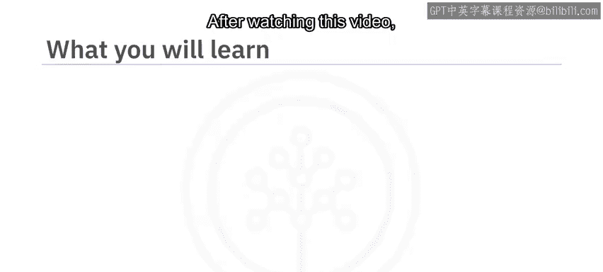

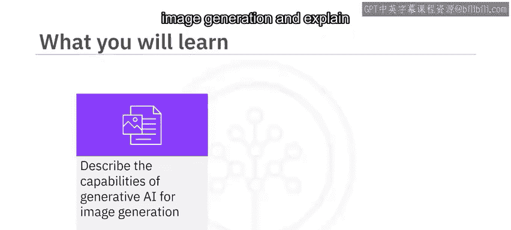

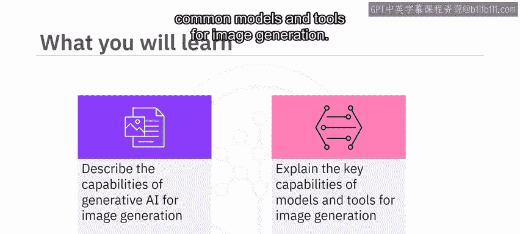

在本节课中，我们将学习生成式AI模型在图像生成方面的基本能力，并解释常见图像生成模型和工具的核心功能。

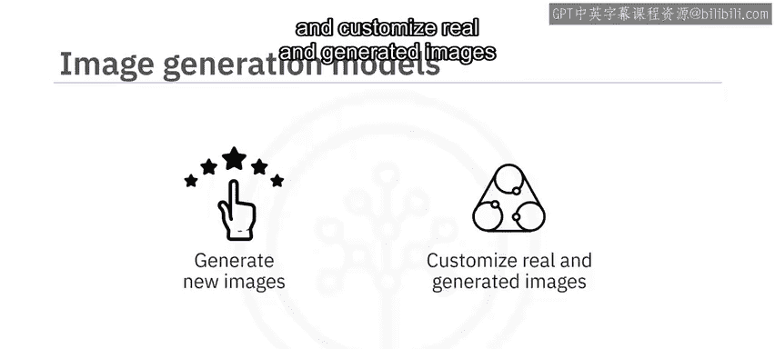

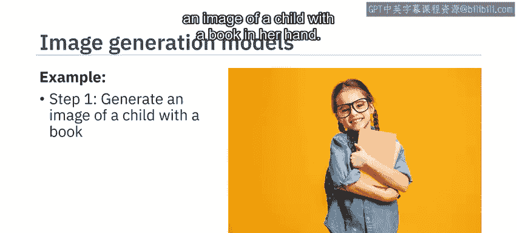

---

生成式AI图像生成模型能够生成全新的图像，并能对真实或生成的图像进行定制，以输出符合期望的结果。例如，你可以生成一个手持书本的儿童图像，并进一步修改生成图像中书封的颜色。

上一节我们了解了图像生成的基本概念，本节中我们来看看如何实际操作一个免费的AI图像生成器。

以下是使用免费AI图像生成器FreePik生成新图像的步骤：
1.  输入描述你希望创建图像的文本提示词。
2.  例如，输入提示词：“夕阳下，一艘小船在宁静的湖泊上航行，周围是郁郁葱葱的绿植和安详的天空。”
3.  记住，你描述图像的方式以及提示词中包含的词语，决定了生成图像的准确性和质量。
4.  选择一种风格并生成图像。
5.  生成多个图像后，你可以选择并下载其中一个，或者通过修改提示词来生成其他图像。

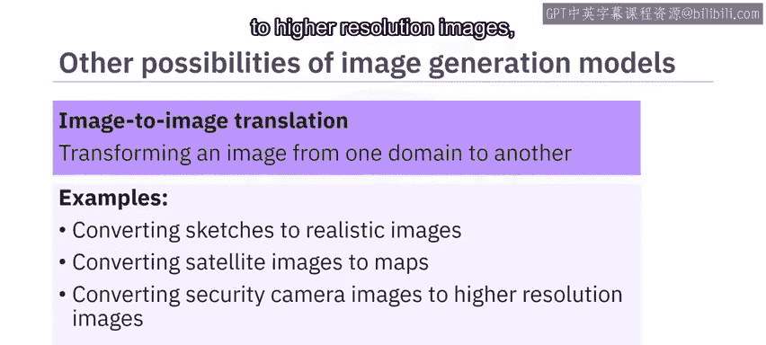

接下来，让我们进一步探索图像生成模型的更多可能性。

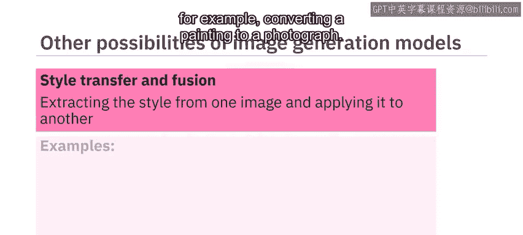

图像到图像转换是指在保留原始内容和风格的前提下，将图像从一个领域转换到另一个领域。例如：
*   将草图转换为逼真图像。
*   将卫星图像转换为地图。
*   将安防摄像头图像转换为更高分辨率的图像。
*   增强医学影像的细节。

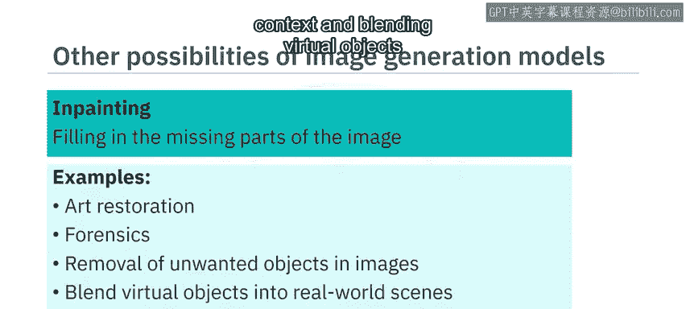

风格迁移与融合涉及从一幅图像中提取风格，并将其应用到另一幅图像上，从而创建混合或融合图像。例如，将一幅绘画转换为照片。

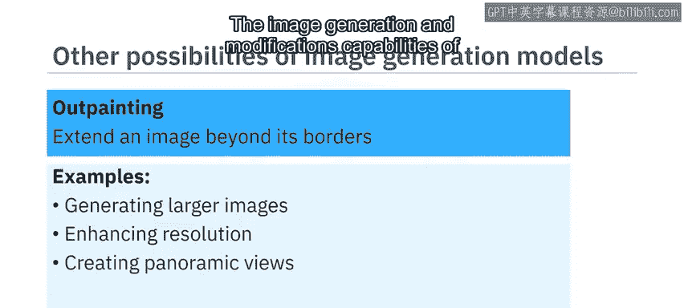

修复是指重建图像中缺失或损坏的部分，使其变得完整。你可以将此技术用于：
*   艺术品修复。
*   取证分析。
*   在保持连续性和上下文的前提下，移除图像中不需要的物体。
*   将虚拟物体融入现实世界场景和增强现实中。

外绘涉及通过生成与原始图像风格一致的新部分来扩展原始图像。这可以用于：
*   生成更大尺寸的图像。
*   增强分辨率。
*   创建全景视图。

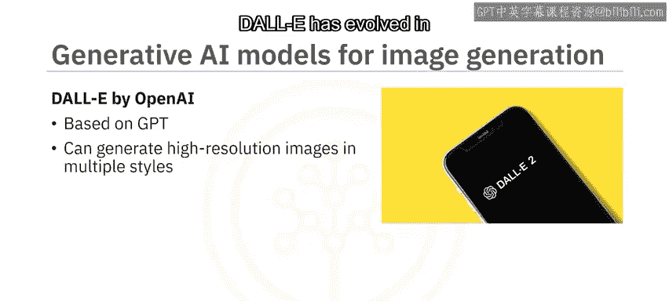

生成模型和工具的图像生成与修改能力，随着其底层模型的演进而不断发展。

OpenAI的DALL-E基于GPT模型，并在大型图像及其文本描述数据集上进行了训练。DALL-E能够生成多种风格的高分辨率图像，包括逼真的照片和绘画。在新版本中，DALL-E已演进为能够通过修复和外绘等功能生成多种图像变体并进行图像转换。

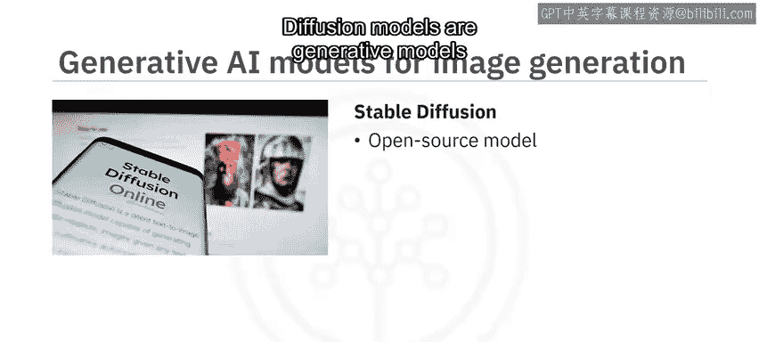

Stable Diffusion是一个开源的文生图扩散模型。扩散模型是能够创建高分辨率图像的生成模型。Stable Diffusion主要用于基于文本提示生成图像，但也可用于图像到图像转换、修复和外绘。

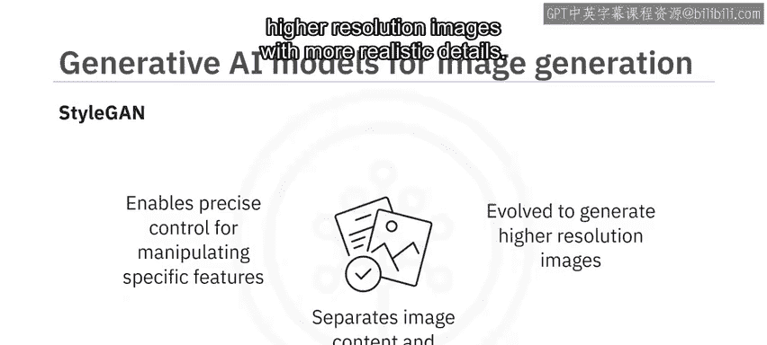

NVIDIA的StyleGAN模型将图像内容和图像风格的建模分离开来，从而能够精确控制风格，以操控姿态或面部表情等特定特征。StyleGAN已演进到能够生成具有更逼真细节的更高分辨率图像。

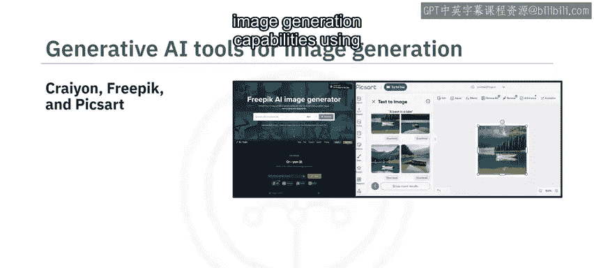

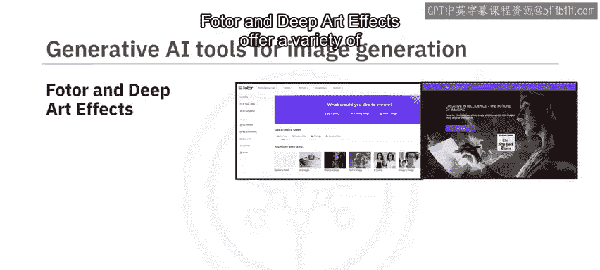

你可以使用Crayon、FreePik和Pixlr等免费工具探索生成式AI的文生图能力。这些工具能以不同的形式和风格生成图像。

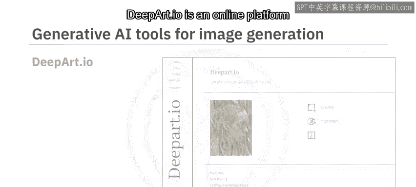

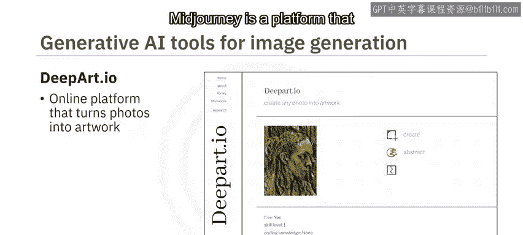

DeepArt.io是一个在线平台，可以将照片转化为不同风格的艺术作品。

MidJourney是一个支持图像生成者社区的平台，帮助艺术家和设计师使用AI创建图像，并探索彼此的作品。

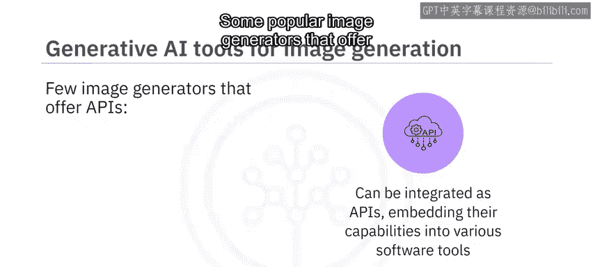

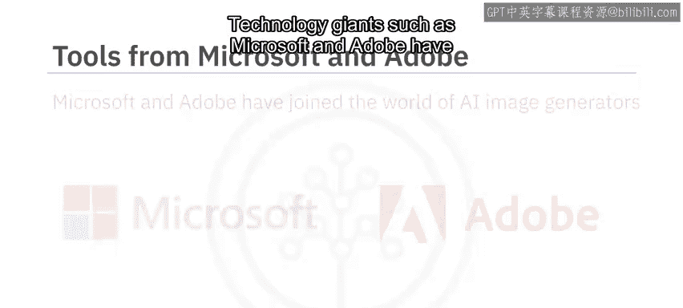

许多生成式AI图像生成器也可以作为API集成，将其功能嵌入到不同的软件程序和工具中。一些提供API的流行图像生成器包括DALL-E、MidJourney和Crayon。

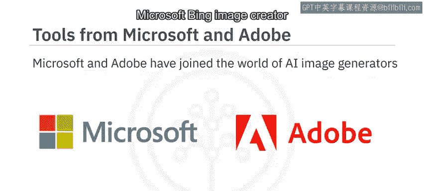

微软和Adobe等技术巨头也已涉足AI图像生成器领域。

微软Bing图像创建器基于DALL-E模型。你可以通过访问Bing.com/create或通过Microsoft Edge浏览器使用此工具。这使得Microsoft Edge成为首个集成AI图像生成器的浏览器。

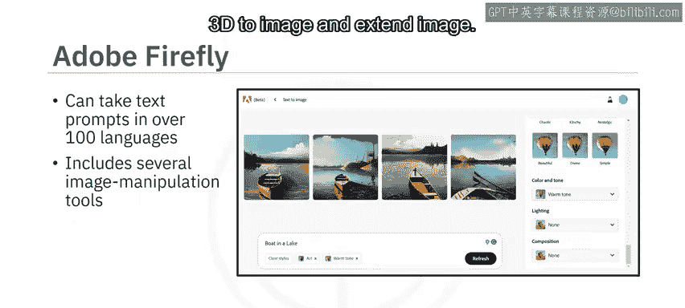

Adobe Firefly是一系列生成式AI工具，旨在与Adobe Creative Cloud应用程序（如Photoshop和Illustrator）集成。Firefly在Adobe Stock图片、公开授权内容和公共领域内容上进行训练。Firefly可以接受超过100种语言的文本提示，并包含允许你操控颜色、色调、光照、构图、生成填充、文本效果、生成重新着色、3D转图像以及扩展图像等工具。

---

本节课中，我们一起学习了基于生成式AI的模型和工具能够通过文本和图像提示生成新图像。它们还提供图像到图像转换、风格迁移、修复或外绘等功能。一些著名的图像生成模型包括DALL-E、Stable Diffusion和StyleGAN。有多种图像生成工具可用，提供多样化的图像生成和转换能力。一些图像生成器也可以作为API集成。我们还了解到，Adobe Firefly是一系列旨在与Adobe Creative Cloud应用程序集成的生成式AI工具。