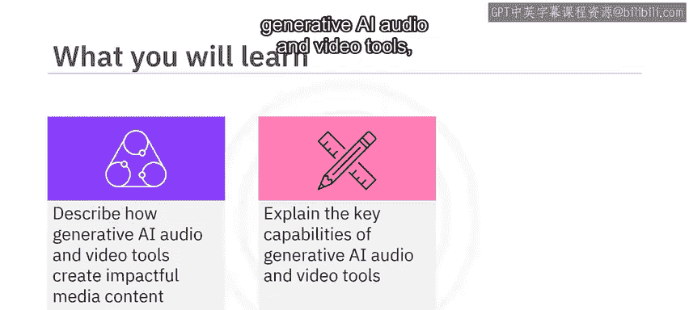
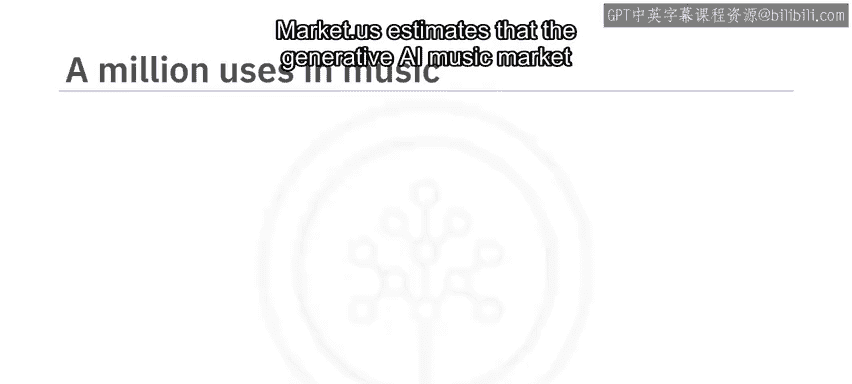
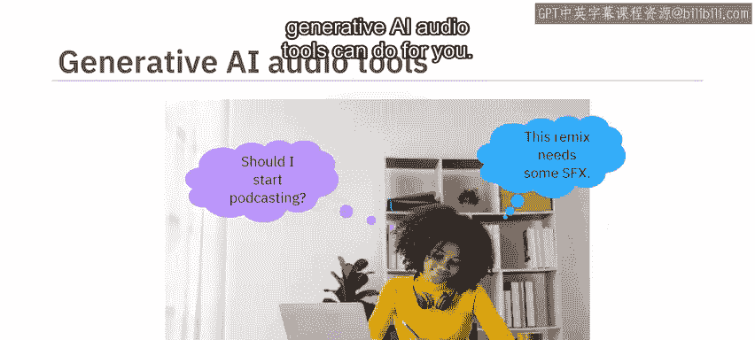
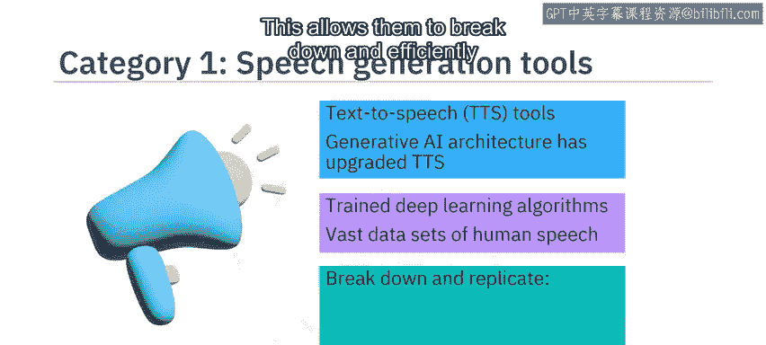
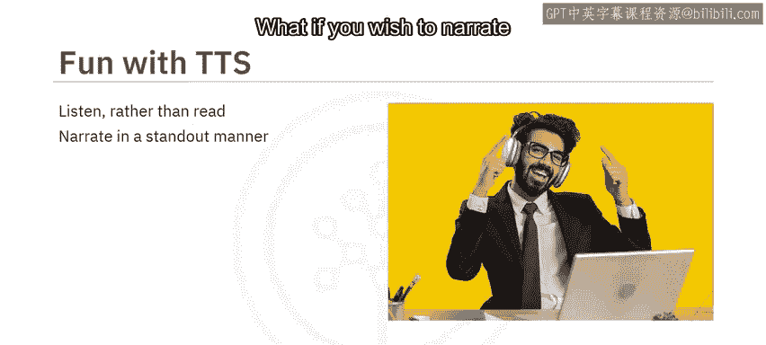
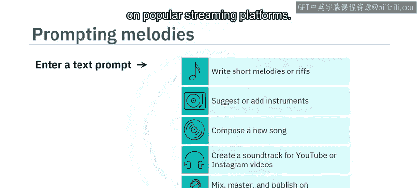
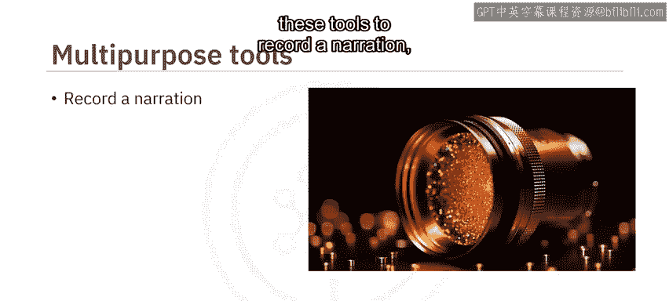
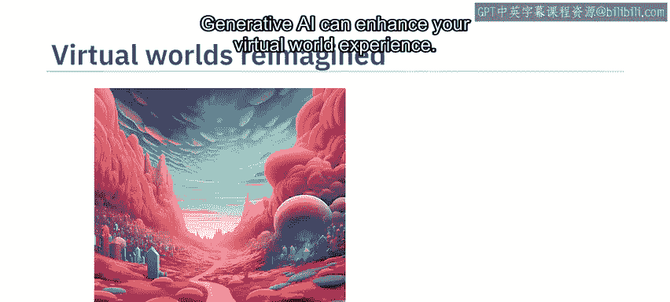
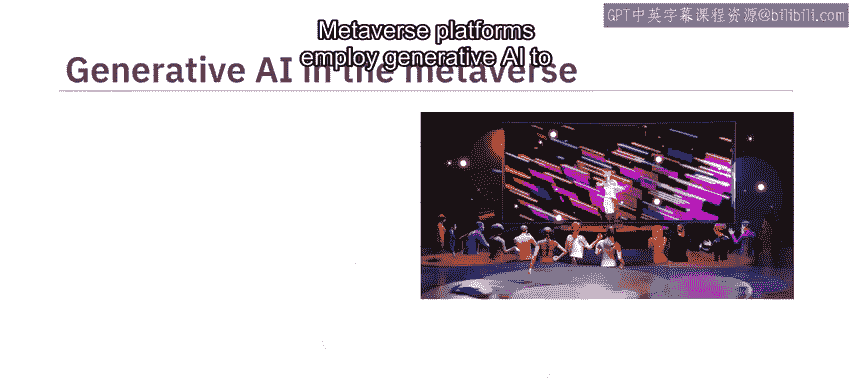
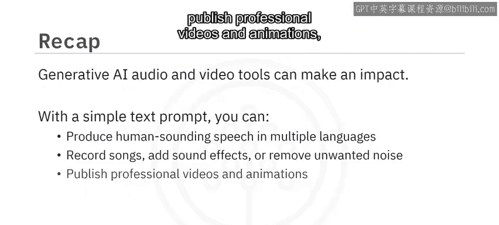

# 040：音频与视频生成工具 🎵🎬

在本节课中，我们将学习生成式人工智能在音频和视频内容创作领域的应用。你将了解这些工具如何运作，它们具备哪些关键能力，以及如何利用它们来创造有影响力的媒体内容，甚至重塑虚拟世界。

观看本视频后，你将能够：
*   描述生成式AI音频和视频工具如何创造有影响力的媒体内容。
*   解释生成式AI音频和视频工具的关键能力。
*   探索生成式AI重塑虚拟世界的能力。

市场预测显示，生成式AI音乐市场在2022年价值2.29亿美元，预计将以28.6%的高复合年增长率增长，到2032年将达到26.6亿美元。生成式AI音乐正是利用生成式AI的音频能力创造的。近年来，这些能力正在帮助公司和个人（无论是新手还是专家）简化流程，将他们复杂的构想变为现实。

设想一下，假设你一直拖延着没有开始你的播客，或者想为你的混音添加一些音效。那么，你一定会喜欢生成式AI音频工具能为你做的事情。它们主要分为三类：**语音生成工具**、**音乐创作工具**和**音频增强工具**。

---

## 语音生成工具 🗣️

上一节我们提到了生成式AI音频工具的三大类别，本节中我们首先来看看语音生成工具。

高质量的语音生成工具主要是**文本转语音（TTS）** 工具，它们能将文本转换为音频。虽然朗读技术并不新鲜，但生成式AI架构升级了这项技术的工作方式。深度学习算法在大量的人类语音数据集上反复训练，这使得它们能够分解并高效地复制发音、语速、情感和语调等声音特征。

因此，生成式AI TTS工具能创造出更准确、更自然的语音。这对于有视觉障碍、语言障碍或其他阅读困难的人群尤其有帮助。从趣味性来说，这些工具可以帮助你“听”论文、反馈和笔记，这可能比阅读它们更容易。它们也能帮助你更好地沟通。

如果你想以一种出众的方式为你的演示文稿配音，你可以登录**Lovo、Synthesia、Murf AI或Listnr**等平台，从庞大的AI语音库、语言或情感库中进行选择。你甚至可以创建一个独特的声音或克隆你自己的声音。

以下是语音生成工具的一些核心功能：
*   **文本转语音（TTS）**：`text_input -> AI Model -> audio_output`
*   **声音定制**：提供多种语言、情感和音色的AI语音。
*   **语音克隆**：允许用户创建或复制独特的声音。
*   **音轨编辑**：可以编辑发音、语调和语速，以生成专业水准的最终产品。

---

## 音乐创作与音频增强工具 🎶

了解了语音生成后，我们来看看生成式AI在音乐创作和音频处理方面的应用。

假设在一个阳光明媚的下午，你内心的业余音乐家感到灵感迸发。你可以尝试**Meta的AudioCraft**，这是一个经过音效和2万小时Meta自有或授权音乐预训练的生成式AI工具。此外，还有**Shutterstock的Amper Music、AIVA、Soundful、Google的Magenta**以及**G4驱动的Wave工具**。

这些工具让你可以从丰富的音乐库、不同的音乐流派、乐器风格和旋律中进行选择。你只需要输入一个基于需求的文本提示，工具就会根据你的请求创作简短的旋律、建议或添加乐器、创作一首新歌，或者为你的下一个YouTube或Instagram视频制作配乐。生成式AI还可以帮助你混音、母带处理，并将最终的音乐作品发布到流行的流媒体平台上。

你甚至可以使用音频增强工具。这些工具经过预训练，能够识别特定声音，可以为你的音频添加有趣的声音效果，或去除不需要的噪音。例如，**Descript**可以帮助你消除背景噪音、增强低质量录音并添加所需的音效。**Auto AI**可以清理文件中的杂音。许多音乐生成工具也具备音频编辑和增强能力。

---

## 视频生成工具 🎥

然而，有些项目需要的不仅仅是精选的音效。2022年，Runway AI就利用生成式AI制作了奥斯卡获奖电影《瞬息全宇宙》。即使你不制作大片，也可以在日常生活中使用生成式AI视频工具。

假设你正在制作一部关于你所在城市树木缺乏的纪录片。你可以登录**Runway的Gen-1工具**，它将现有的视频片段转换成不同的风格；或者使用**Runway的Gen-2工具**，通过文本、图像或视频输入来创建视频。作为替代，你可以使用**Videoki或Synthesia应用**。

以下是视频生成工具的主要工作流程：
1.  **输入**：上传现有照片/视频，或使用文本提示生成所需图像。
2.  **处理**：AI模型根据输入内容生成或转换视频。
3.  **增强**：录制旁白、增强音频、转换视频文件格式。
4.  **输出**：发布最终视频。Synthesia甚至允许你创建自定义虚拟形象以增强品牌记忆点。

---

## 重塑虚拟世界 🌐

生成式AI不仅能处理音视频，还能提升你的虚拟世界体验。

你可以创造具有混合特征和异域风光的独特、富有想象力的虚拟世界。生成模型还可以实时响应，提高模拟的准确性。**元宇宙**应用生成式AI来创造更个性化、更具吸引力的用户体验。

在游戏元宇宙中，你可以快速生成3D物体，甚至创建配备特定人格特征的虚拟形象，这些特征会反映在他们的表情、行为、对话和决策中。例如，**The Sandbox**就是一个元宇宙，用户可以在其中即时构建、拥有并向全球推广自己的游戏。**Scenario AI**则帮助创建和连接定制化的移动游戏资产。

---

## 总结 📝

本节课中，我们一起学习了生成式AI音频和视频工具如何产生影响。通过一个简单的文本提示，你就可以：
*   生成多种语言的人声级语音。
*   录制歌曲、添加音效或去除 unwanted 噪音。
*   发布专业的视频和动画。
*   构建增强型的、充满异域风情的虚拟世界。

这些工具正在降低媒体创作的门槛，让每个人都能更轻松地将创意变为现实。