# 041：代码生成工具 🛠️

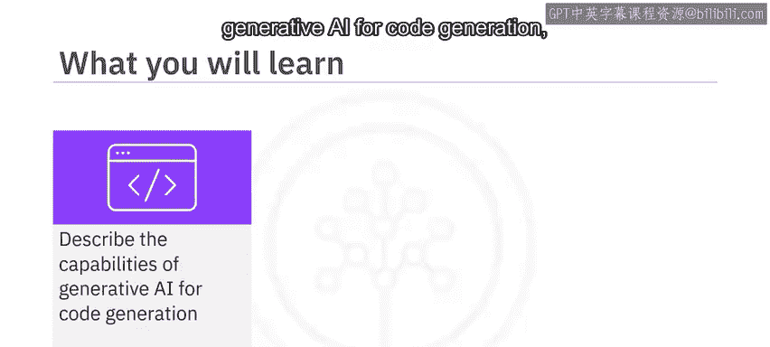

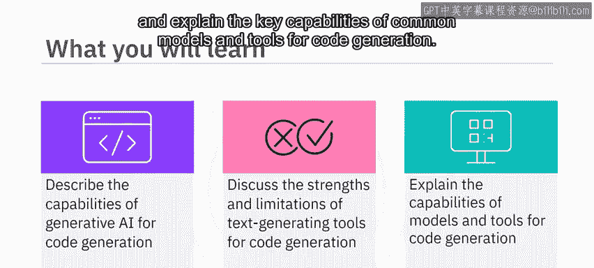

在本节课中，我们将学习生成式AI在代码生成领域的基本能力，探讨文本生成工具在代码生成方面的优势与局限，并解释常见代码生成模型和工具的核心功能。

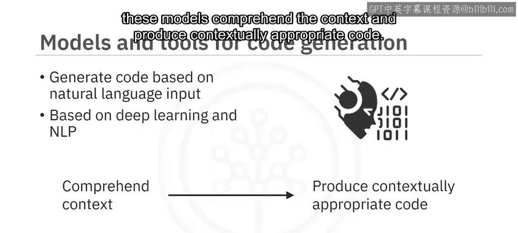

## 代码生成工具概述

上一节我们介绍了AI的多种应用场景，本节中我们来看看它在代码生成方面的具体能力。基于深度学习和自然语言处理（NLP）的生成式AI模型，能够理解自然语言输入的上下文，并生成符合语境的代码。

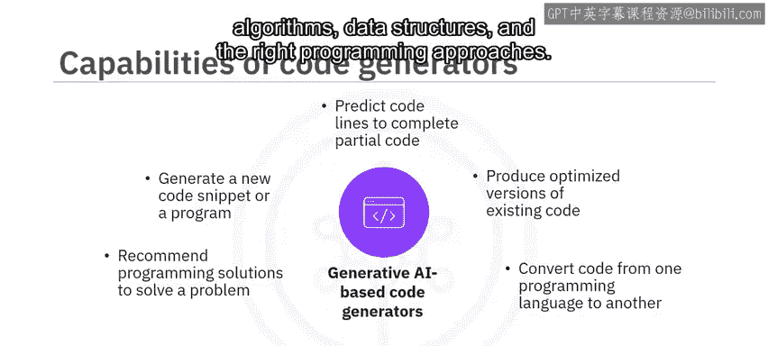

以下是代码生成工具的主要能力：

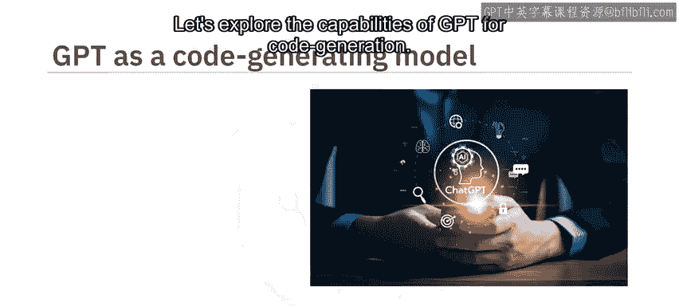

*   **生成新代码**：根据文本提示生成全新的代码片段或程序。
*   **代码补全**：预测并补全部分代码片段。
*   **代码优化**：生成现有代码的优化版本。
*   **代码转换**：将代码从一种编程语言转换为另一种。
*   **生成文档**：为代码生成摘要和注释，以改进文档。
*   **提供解决方案**：描述您试图解决的问题，代码生成器会推荐算法、数据结构和合适的编程方法。

## GPT的代码生成能力

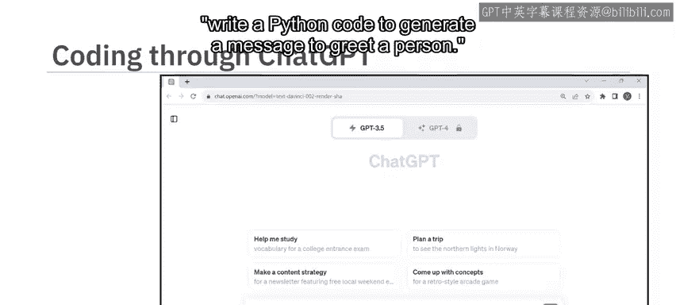

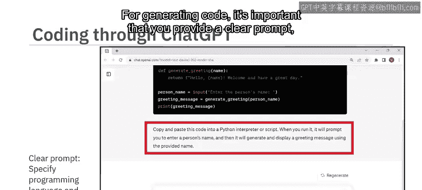

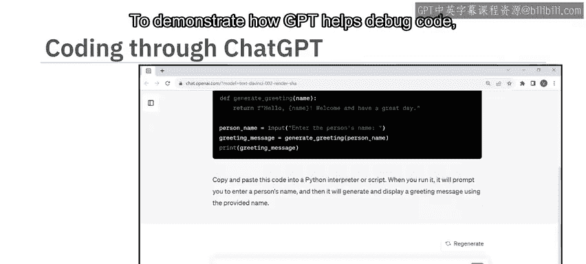

接下来，我们具体了解一下GPT在代码生成方面的表现。OpenAI的GPT在类人文本生成方面表现出色，在代码创建方面也展示了令人印象深刻的能力。

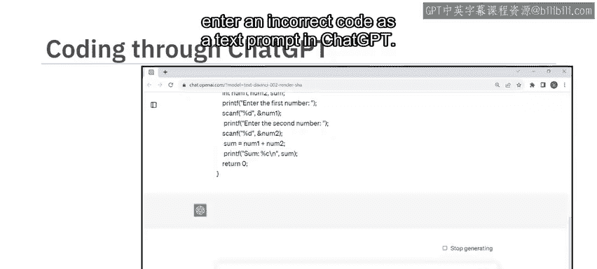

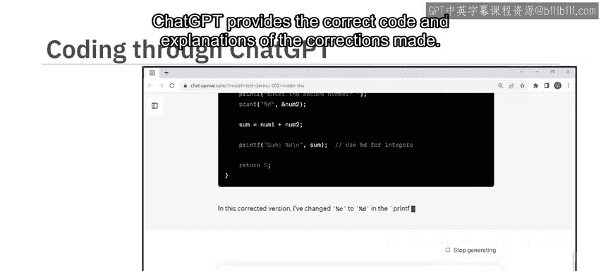

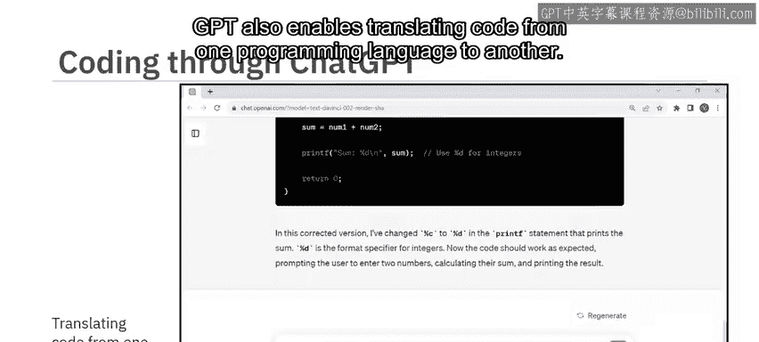

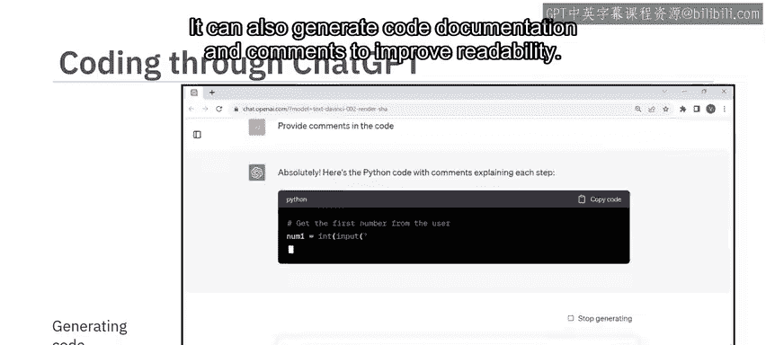

以下是使用基于GPT的ChatGPT生成代码的示例：

*   **生成简单代码**：输入提示“写一段Python代码来生成问候信息”，ChatGPT会生成相应的Python代码，并提供运行指南。
*   **调试代码**：输入一段错误的代码，ChatGPT能提供修正后的代码并解释所做的更正。
*   **代码翻译**：支持将代码从一种编程语言翻译到另一种。
*   **生成文档**：能够生成代码文档和注释，以提高可读性。

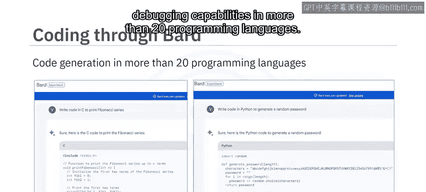

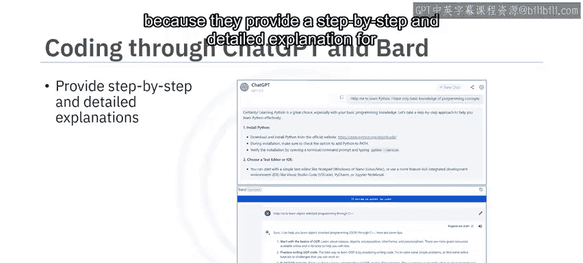

基于GPT的模型和工具已经发展到可以生成更长、更准确的代码，这使得它们能够用于开发应用程序、网站和插件。此外，GPT的演进甚至使其能够根据图像生成代码，例如，输入课程大纲的图片来生成一个功能完整的应用程序代码。

Google Bard也提供了代码生成和调试能力，支持超过20种编程语言。

ChatGPT和Bard是学习新编程语言的宝贵工具，因为它们能提供逐步的详细解释，有助于更好地理解。

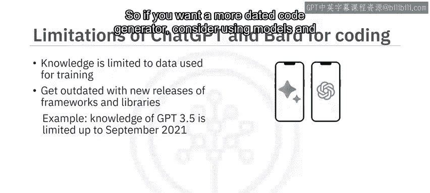

## 代码生成工具的局限与专用工具

尽管ChatGPT和Bard擅长生成具有基本逻辑和编程概念的代码，但它们也存在一些局限。它们可能无法从零开始生成大型或复杂的代码。虽然这些工具理解编程概念和语法，但可能不完全理解语义。因此，生成的代码可能在技术上是准确的，但功能上可能不符合要求。

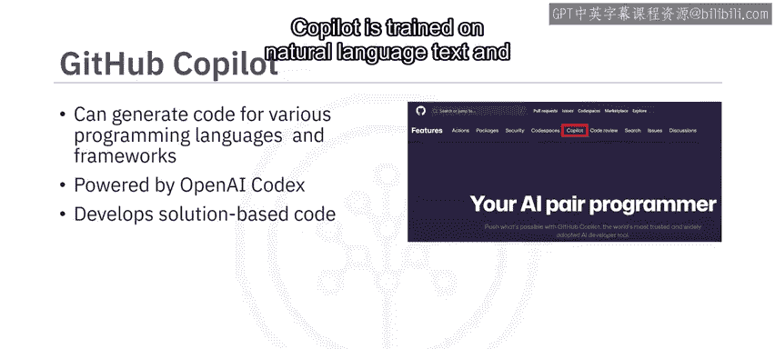

需要注意的是，这些模型的知识受限于其训练数据。特定版本的GPT可能不了解其训练后发布的编程框架和库。例如，GPT-3.5的知识截止日期是2021年9月。

因此，如果您需要更专业的代码生成器，可以考虑使用专门为代码生成设计的模型和工具。

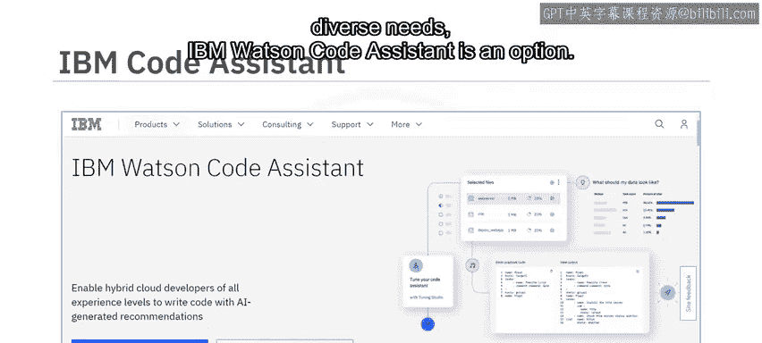

以下是几个主流的专用代码生成工具：

*   **GitHub Copilot**：由OpenAI Codex提供支持，这是一个生成式预训练语言模型。它可以根据各种编程语言和框架生成代码，帮助开发者生成基于解决方案的代码。Copilot可以集成到流行的代码编辑器（如Visual Studio）中，生成符合最佳实践和行业标准的代码片段。
*   **Polycoder**：一个开源的AI代码生成器，基于GPT模型，并在12种编程语言的GitHub仓库数据上进行了训练。它在编写C语言代码方面特别准确。Polycoder提供了丰富的预定义模板库，可作为各种用例代码生成的蓝图，帮助创建、审查和精确定制代码片段。
*   **IBM Watson Code Assistant**：基于IBM Watsonx.ai基础模型构建，适用于任何技能水平的开发者。它可以集成到代码编辑器中，通过实时推荐、自动补全和代码重构辅助，帮助开发者准确高效地编写代码。开发者还可以输入代码或项目文件进行分析，它会识别模式、提出改进建议并生成代码片段或模板。

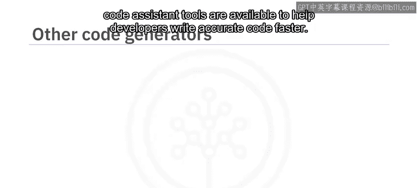

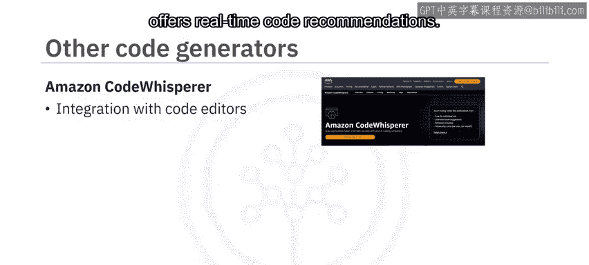

此外，还有许多其他AI驱动的代码生成器和助手工具，例如**Amazon CodeWhisperer**和**Tabnine**，它们都能集成到代码编辑器中并提供实时代码建议。**Replit**则是一个提供交互式编码、学习和协作空间的平台。

## 优势与注意事项

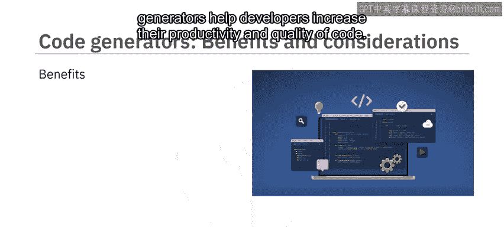

自动代码编写和优化能力，基于AI的代码生成器能帮助开发者提高生产力和代码质量。它们支持快速原型设计以迭代设计想法，并通过支持多语言代码翻译来帮助实现跨平台兼容和迁移。基于AI的代码生成器遵循一致的编码模式和标准，可以建议重构模式以遵循最佳实践。

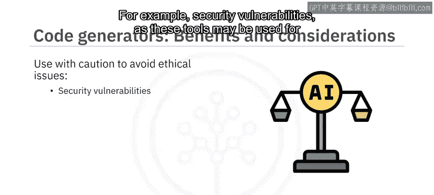

然而，使用这些工具时需要谨慎，以确保AI生成的代码不会导致伦理问题，例如，基于训练数据可能产生的安全漏洞、恶意代码或数据偏见。

## 总结

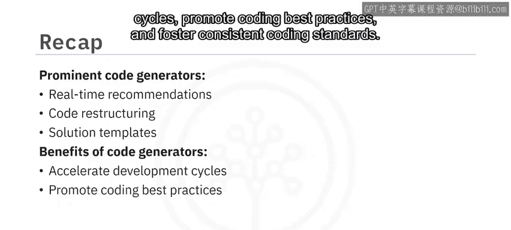

本节课中我们一起学习了生成式AI模型和工具如何从文本和图像提示生成新代码、优化现有代码并生成基于解决方案的代码。ChatGPT和Bard适用于简单的代码生成、调试和学习编程。而GitHub Copilot、Polycoder和IBM Watson Code Assistant等主流代码生成器则提供了实时推荐、代码重构和解决方案模板等多样化功能。总体而言，代码生成器提高了生产力，加速了开发周期，促进了编码最佳实践并培养了统一的编码标准。