# 042：提示工程入门 🚀

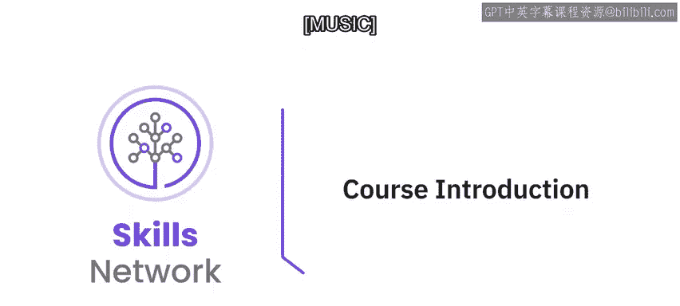

在本节课中，我们将要学习提示工程的基础知识。提示工程是引导生成式人工智能模型产生精确、相关响应的关键技能。无论你是专业人士、爱好者、实践者还是学生，只要对学习如何编写有效提示感兴趣，这门课程都适合你。

## 概述

专家知道所有答案，前提是你提出了正确的问题。有趣的是，这正是我们为生成式人工智能模型设计提示时所遵循的原则。我们使用提示来查询和提问人工智能应用，例如聊天机器人、图像、音频或视频生成工具，甚至虚拟世界。提示能够优化生成式人工智能模型的响应，其力量在于你所提出的问题。了解如何编写有效且直接的提示，将使你能够生成更精确、更相关的内容。

完成本课程后，你将能够：
*   解释提示工程在生成式人工智能模型中的概念和重要性。
*   应用创建提示的最佳实践。
*   评估常用的提示工程工具。
*   应用常见的提示工程技术和方法来编写有效的提示。

这是一门精炼的课程，包含三个模块，每个模块需要一到两个小时完成。

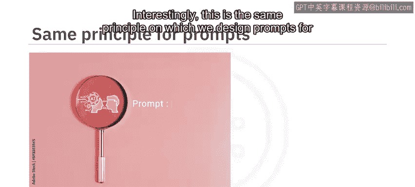

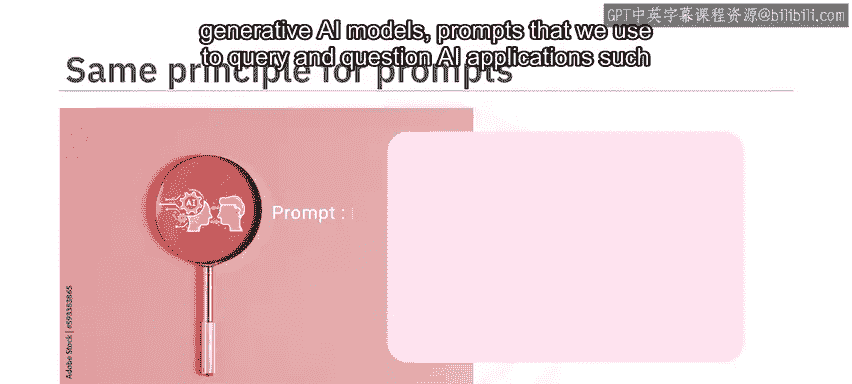

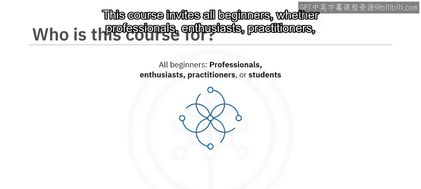

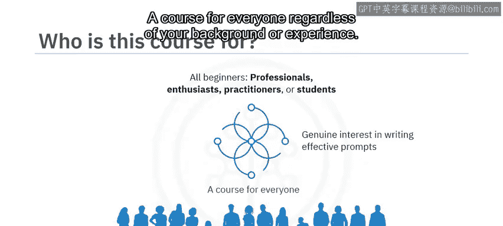

## 课程模块详解

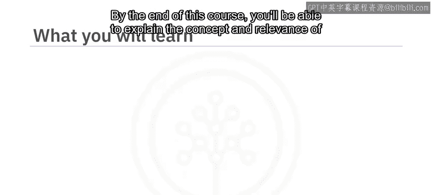

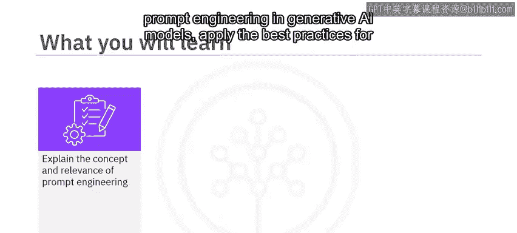

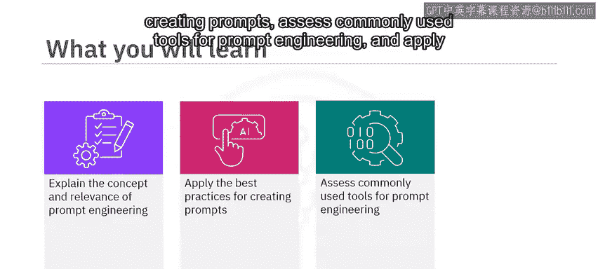

上一节我们介绍了课程的整体目标，本节中我们来看看课程的具体内容安排。

### 模块一：提示工程基础与工具

在课程的第一个模块中，你将学习提示工程的概念。从如何定义提示及其构成要素开始，你将学习应用编写有效提示的最佳实践，并评估常见的提示工程工具，例如 IBM Watson X Prompt Lab、Spellbook 和 Dust。

### 模块二：提示工程方法与技巧

在模块二中，你将学习各种提示工程方法，例如**访谈模式**、**思维链**和**思维树**。你将发现巧妙设计提示的技巧，例如**零样本提示**和**少样本提示**，以产生精确且相关的响应。

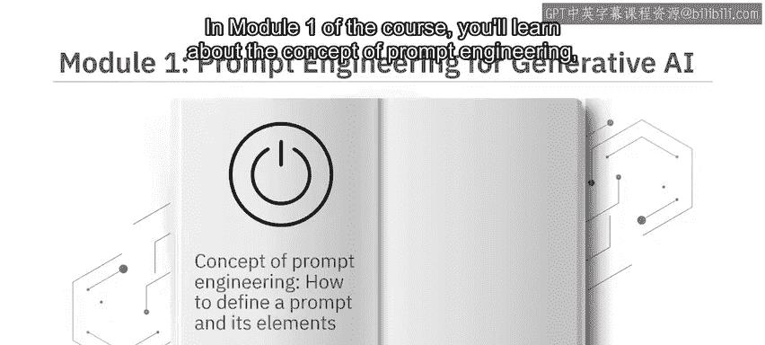

### 模块三：实践项目与评估

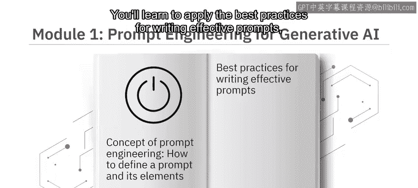

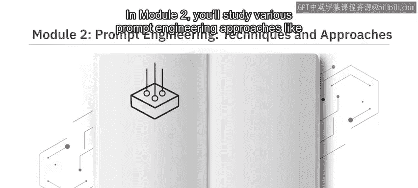

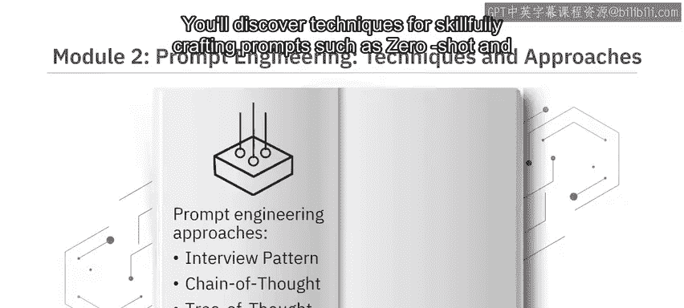

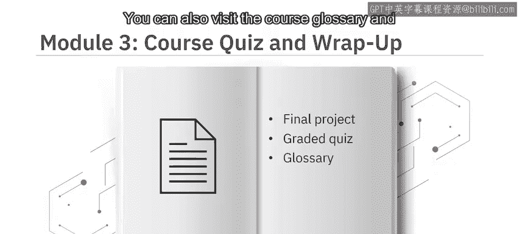

模块三要求你参与一个最终项目，并提供一个分级测验来检验你对课程概念的理解。你还可以访问课程术语表，并获得关于后续学习路径的指导。

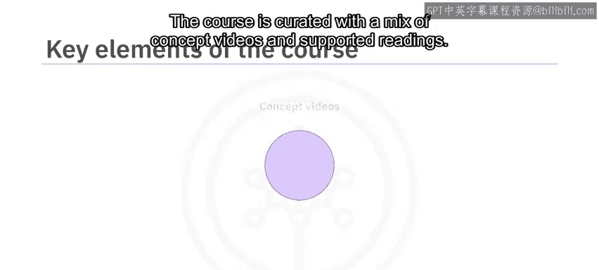

## 课程特色与学习建议

本课程融合了概念讲解视频和辅助阅读材料。观看所有视频以充分掌握学习材料的潜力。

以下是本课程的主要特色：
*   **实践实验室**：在最终项目中，你将享受动手实践的乐趣，该项目演示了如何在 IBM 生成式人工智能教室中通过创建有效提示来优化结果。
*   **练习测验**：课程包含练习测验，帮助你巩固所学知识。
*   **分级测验**：课程结束时，你还需要完成一个分级测验。
*   **讨论论坛**：课程提供讨论论坛，方便你与课程工作人员联系并与同伴交流。
*   **专家观点视频**：最有趣的是，通过专家观点视频，你将听到经验丰富的从业者分享他们对提示工程中使用的工具、方法以及编写有效提示的艺术的见解。

## 总结

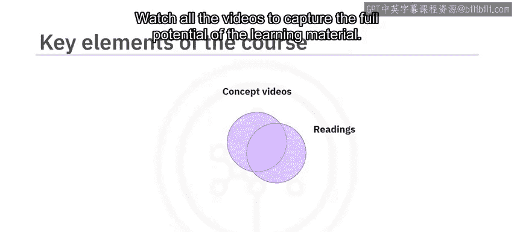

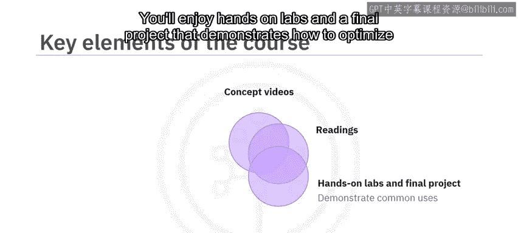

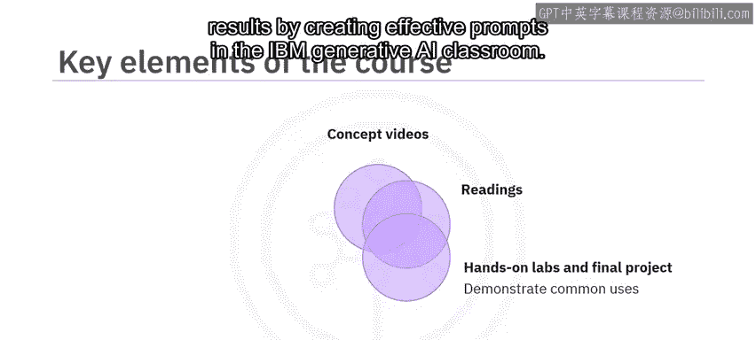

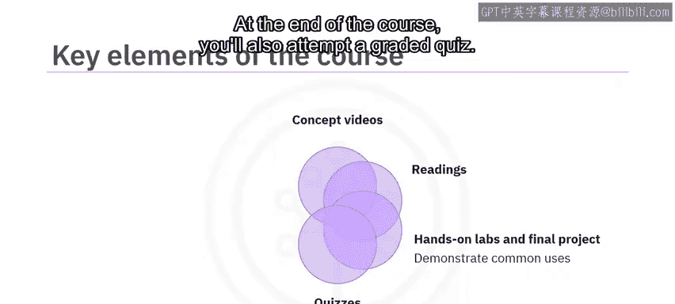

本节课中，我们一起学习了“提示工程入门”课程的概览。我们了解到，编写有效的提示是释放生成式人工智能全部潜力的关键。本课程专为初学者设计，通过三个模块的系统学习，结合视频、阅读、实践和评估，你将掌握提示工程的核心概念与实用技能。

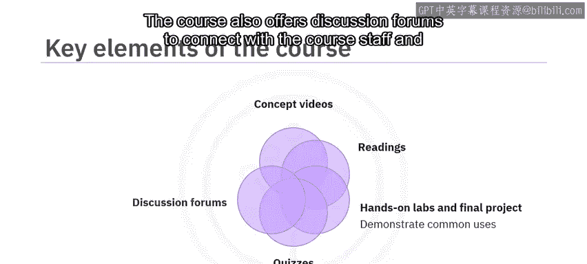

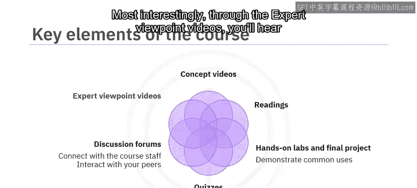

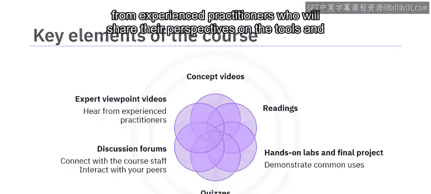

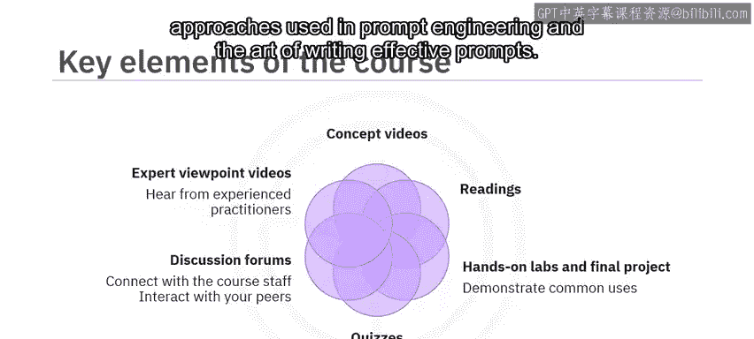

你准备好学习关于编写提示的一切知识，以解锁生成式人工智能的全部潜力了吗？让我们开始吧。😊