# 044：什么是提示工程？🤖

在本节课中，我们将学习提示工程的定义、重要性及其在生成式AI模型中的应用。我们将通过一个具体示例，了解如何通过系统化的步骤设计有效的提示，以引导模型生成更准确、更相关的回答。

---

## 概述

提示工程是指设计有效提示的过程，旨在引导生成式AI模型产生更优质、更符合预期的回答。尽管生成式AI模型能够辅助人类创造力，但如果提示不够精确，模型可能会产生不充分甚至错误、误导性的信息。因此，掌握提示工程对于充分利用AI模型至关重要。


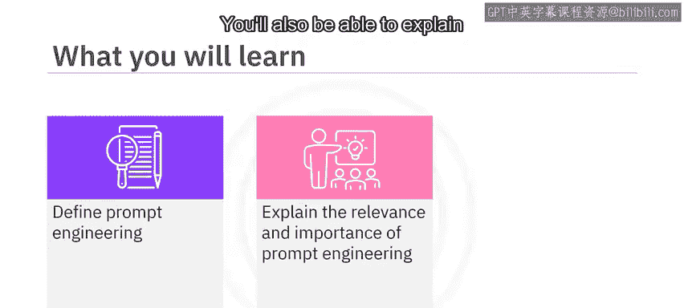

---

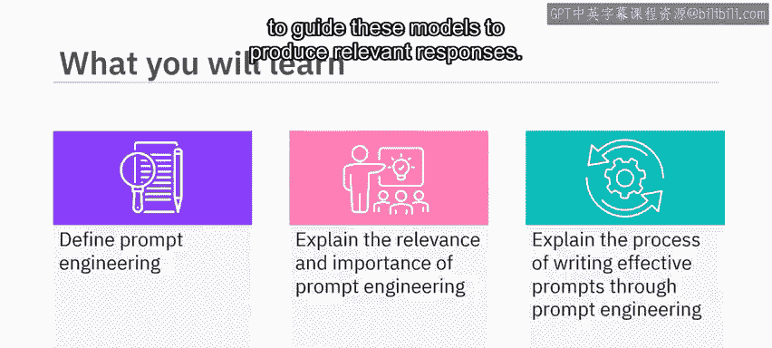

## 提示工程的定义与重要性

提示工程是批判性分析、创造力和技术敏锐度的结合。它不仅仅是提出正确的问题，还包括在正确的语境中构建问题，提供恰当的信息，并明确期望的结果，以引导模型生成最合适的回答。

**核心公式**：  
`有效回答 = 精确的提示 + 充分的上下文 + 明确的期望`

如果未能提供精确的提示，模型可能产生不理想的结果。例如，简单询问“大西洋的天气预报”可能无法获得船长所需的特定时间和地点的详细预报。

---


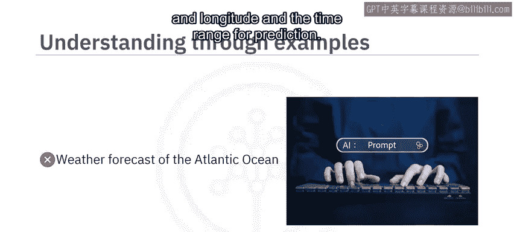

## 示例：船长的天气预报需求

为了更好地理解提示工程，我们来看一个例子。一位船长计划在大西洋航行，需要了解特定时间和地点的天气预报。

如果只提供简单的提示，例如：
```
天气 forecast of the Atlantic Ocean
```
模型可能无法给出有针对性的回答。

通过提示工程，船长可以设计更精确的提示：
```
船长计划在大西洋进行战略航行。请提供2023年8月28日至9月1日期间，北纬20度至30度、西经40度至20度区域的详细天气预报，包括风速、浪高、降水概率、云量以及可能影响航行的风暴信息。
```
这样的提示能引导模型生成更准确、有用的回答。

---

## 提示工程的步骤

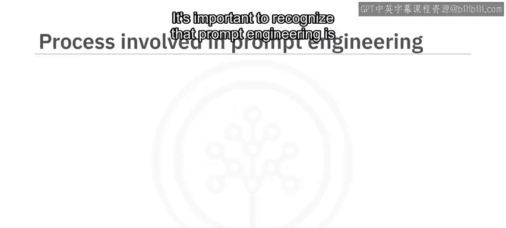

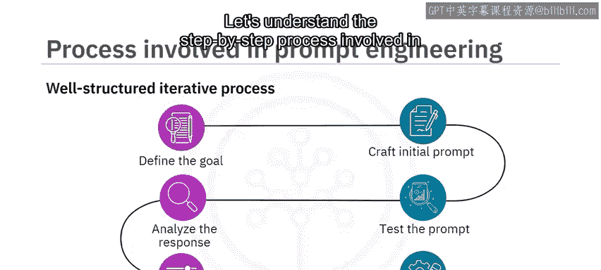

以下是创建有效提示的逐步过程，这是一个结构化的迭代流程。

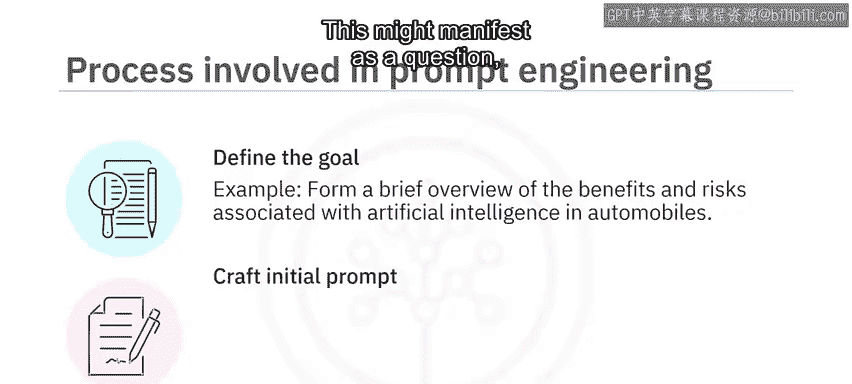

### 1. 定义目标
首先，明确你希望模型生成什么内容。例如：
```
生成一份关于人工智能在汽车行业益处与风险的简要概述。
```

### 2. 创建初始提示
根据目标，构建初始提示。它可以是问题、指令或情境描述。例如：
```
撰写一篇文章，全面分析人工智能在汽车行业应用的益处与弊端。
```

### 3. 测试提示
将初始提示输入模型，测试其回答。例如，上述提示可能生成涵盖益处和弊端的文章，但可能未涉及伦理问题或正反影响的深入讨论。

### 4. 分析回答
仔细评估模型的回答是否与目标一致。记录不足之处。例如：
```
初始提示未能全面覆盖人工智能在汽车行业的所有潜在风险和益处。
```

### 5. 优化提示
根据测试和分析结果，修改提示。可以增加细节、补充上下文或调整措辞。例如，优化后的提示：
```
撰写一篇信息性文章，讨论人工智能如何变革汽车行业。涵盖自动驾驶、实时交通分析等具体领域，以及技术复杂性、网络安全问题等潜在挑战。
```

### 6. 迭代过程
重复步骤3至5，直到对回答满意为止。经过多次优化，最终提示可能如下：
```
撰写一篇文章，展示人工智能为汽车行业带来的变革。讨论其对自动驾驶和实时交通分析的积极影响，同时深入探讨技术复杂性、网络安全漏洞等担忧，这些漏洞可能导致关键车辆系统被控制，从而危及安全。
```

---

## 提示工程的重要性

提示工程在生成式AI模型中具有多方面的重要性：

1. **优化模型效率**  
   通过设计智能提示，用户无需大量重新训练模型，即可充分发挥其能力。

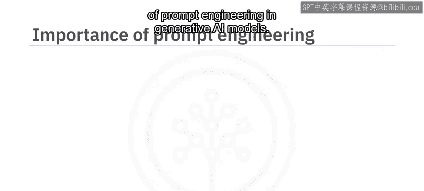

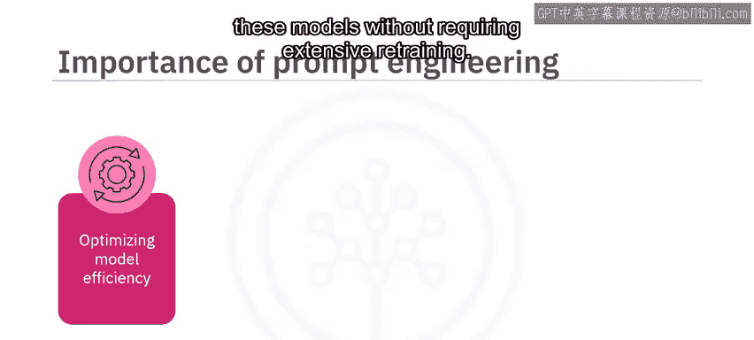

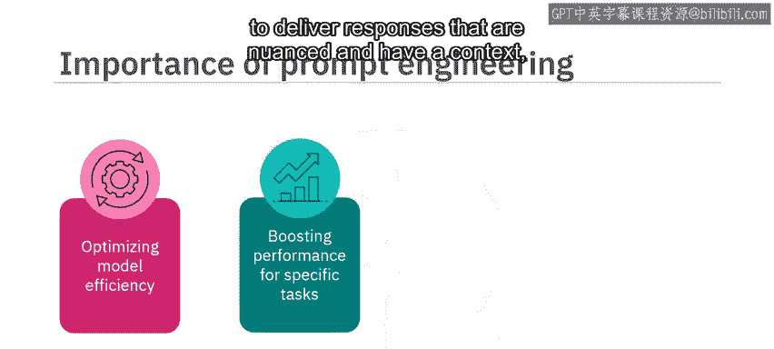

2. **提升特定任务性能**  
   提示工程使模型能够生成更细致、更具上下文感知的回答，从而在特定任务中表现更佳。

3. **理解模型限制**  
   通过迭代优化提示并分析模型回答，我们可以了解模型的优势与弱点，为未来功能增强或模型开发提供指导。

4. **增强模型安全性**  
   良好的提示工程可以避免因提示设计不当而导致有害内容的生成，从而提高模型的安全使用性。

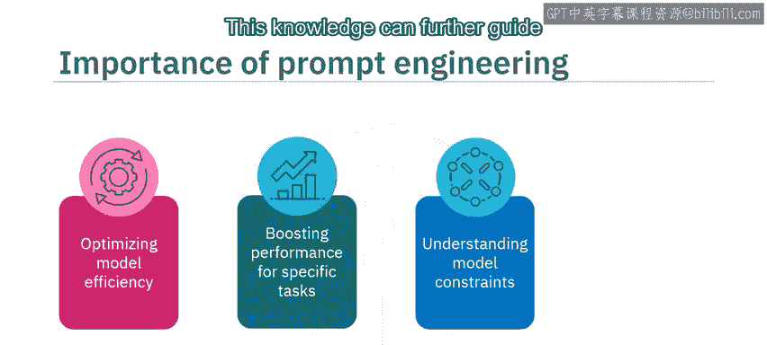

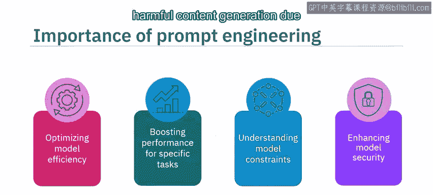

---

## 总结

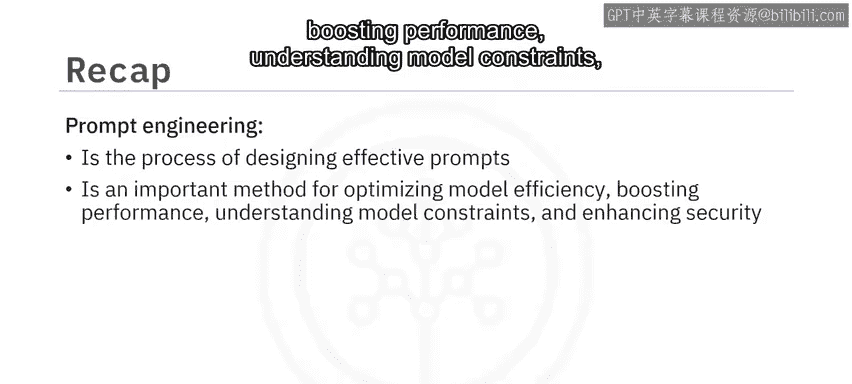


本节课中，我们一起学习了提示工程的定义及其在生成式AI模型中的重要性。我们通过一个船长的示例，了解了设计有效提示的步骤：定义目标、创建初始提示、测试提示、分析回答、优化提示并迭代过程。最后，我们探讨了提示工程在优化模型效率、提升任务性能、理解模型限制和增强安全性方面的关键作用。掌握提示工程，将帮助你更有效地利用生成式AI模型，获得更优质的回答。