# 045：提示创建的最佳实践 🎯

在本节课中，我们将学习如何应用最佳实践来创建有效的提示，并通过多个示例解释如何起草和优化提示。

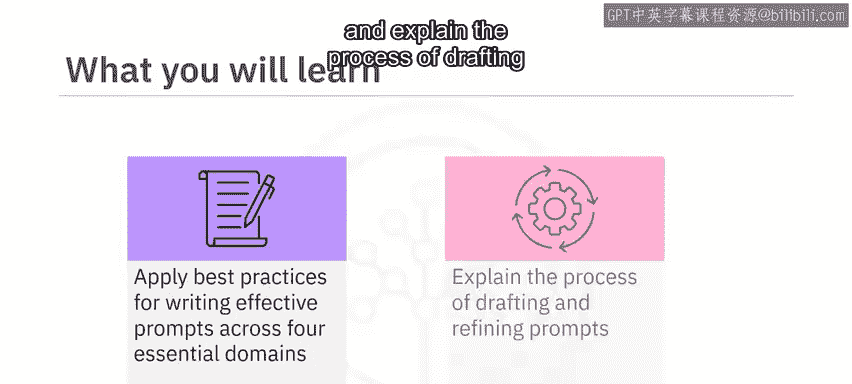

---

## 概述

撰写有效的提示对于充分发挥生成式AI模型的潜力、获取相关且准确的回应至关重要。通过应用最佳实践，你可以监督输出内容的风格、语气和内容。创建有效提示的最佳实践主要围绕四个核心维度展开：**清晰度**、**上下文**、**精确度**以及**角色扮演或人物设定模式**。

---

## 清晰度

清晰度要求你的提示易于理解且无歧义。以下是确保清晰度的关键点：

*   **使用简单直接的语言**：简单的语言能轻松传达指令。
*   **避免专业术语**：专业术语可能会让模型或用户感到困惑。
*   **明确描述任务**：模糊的提示可能导致回应与你的意图不符。

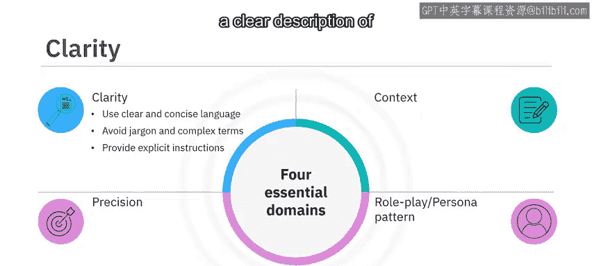

让我们通过一个例子来理解。考虑以下提示：

> “讨论在植物完全叶状托叶上借助阳光发生的烹饪过程。同时提及一个绿色物体，以及光、空气和水对植物地上部分的重要性。”

这个提示存在多处问题：它没有明确提及想要讨论的过程（光合作用），使用了复杂的术语，并且整体描述模糊，任务不清晰。

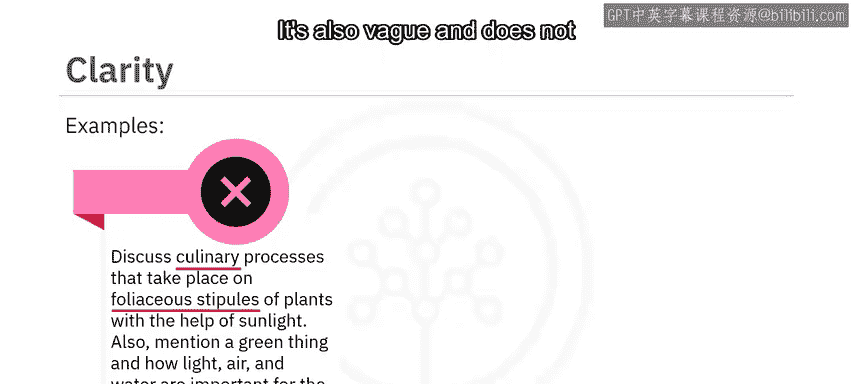

为了确保清晰度，我们可以将其重写为：

> “解释植物光合作用的过程，详细说明叶绿素的作用，以及阳光、二氧化碳和水如何参与这一生物功能。”

修改后的提示使用了**简单、清晰、简洁的语言**，并**明确声明**了要讨论的主题。

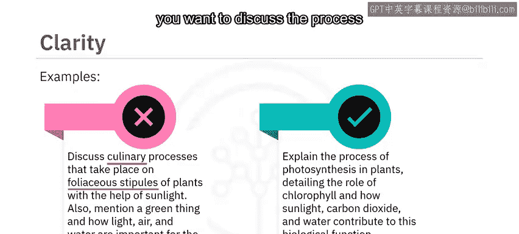

---

## 上下文

上下文帮助模型理解情境或主题。这包括提供简短的背景介绍或解释回应所需的环境。

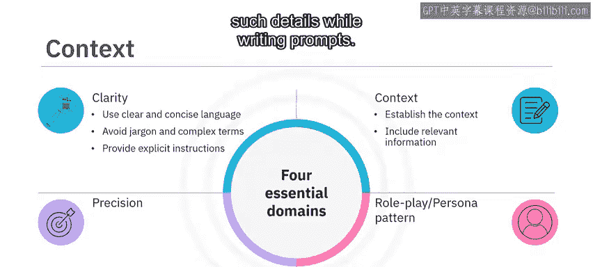

*   **提供背景信息**：简要介绍情况。
*   **包含相关细节**：如人物、地点、事件或概念等具体信息，能有效引导模型的理解。

例如，提示“写下1775年革命战争爆发时发生了什么”缺乏足够的背景和具体细节来引导模型。

为了建立正确的上下文并包含相关信息，可以将其重写为：

> “描述导致美国革命战争的历史事件，重点关注波士顿倾茶事件、萨拉托加战役等关键事件。强调美洲殖民地与英国政府之间的紧张关系，并解释这些事件如何导致了1775年革命战争的爆发。”

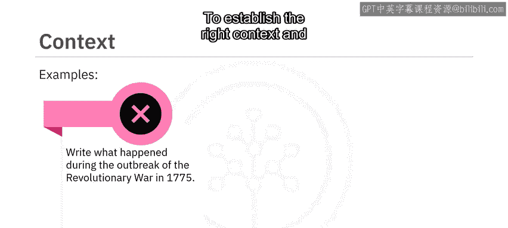

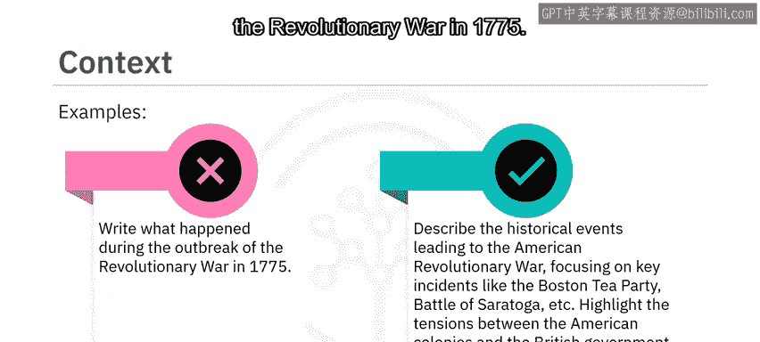

---

## 精确度

精确度有助于勾勒出你的请求。如果你在寻找特定类型的回应，请清晰地表达出来。

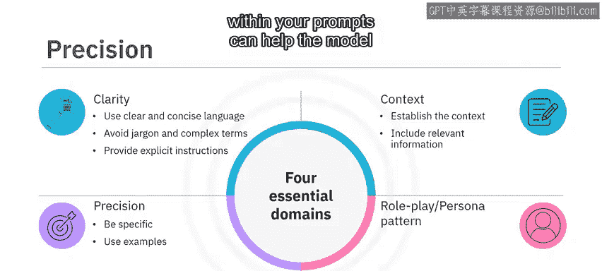

*   **明确表达需求**：清晰说明你想要的回应类型。
*   **提供示例**：在提示中融入示例，可以帮助模型理解你期望的回应类型，并引导其思考过程。

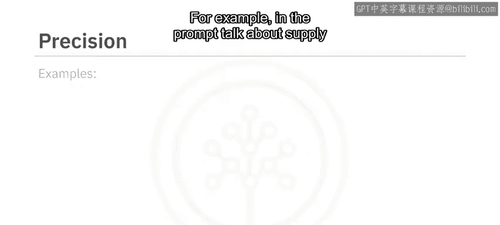

例如，提示“谈谈经济学中的供需关系及其影响”没有精确地勾勒出特定的回应类型，也没有提供示例。

为了确保精确度，可以将其重写为：

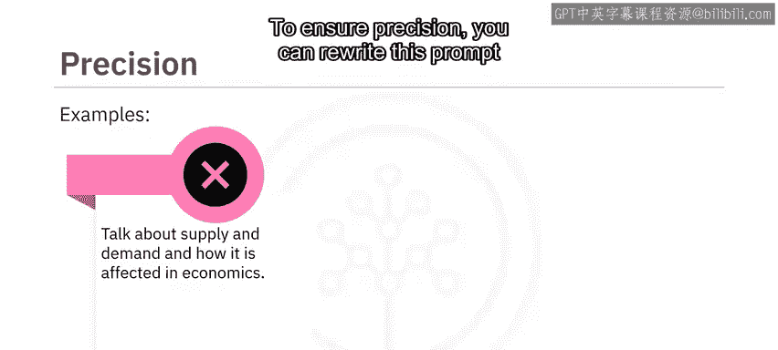

> “解释经济学中的供需概念。描述需求增加如何影响价格，并以智能手机市场为例进行说明。同样，通过类比石油生产中断等情况，解释供应减少对价格的影响。”

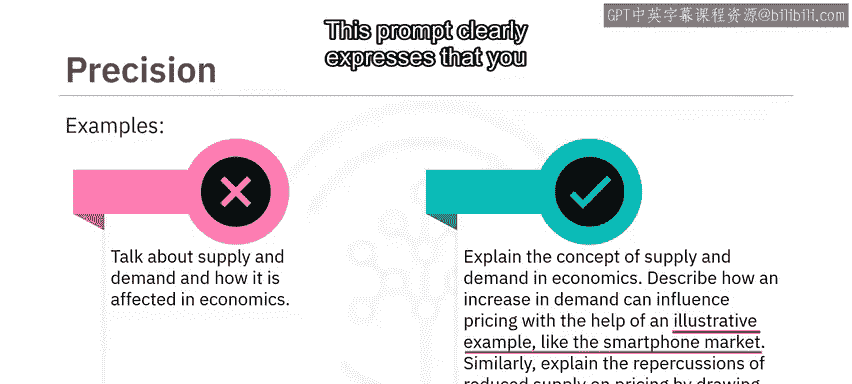

这个提示**清晰地表达**了希望通过示例来解释概念。

---

## 角色扮演或人物设定模式

从特定角色或人物视角撰写的提示，可以帮助模型生成与该视角一致的回应。

*   **设定角色**：要求模型从特定视角（如历史人物、虚构角色或特定职业）进行回应。
*   **提供上下文细节**：提供必要的背景细节，使模型能够有效地扮演特定角色。

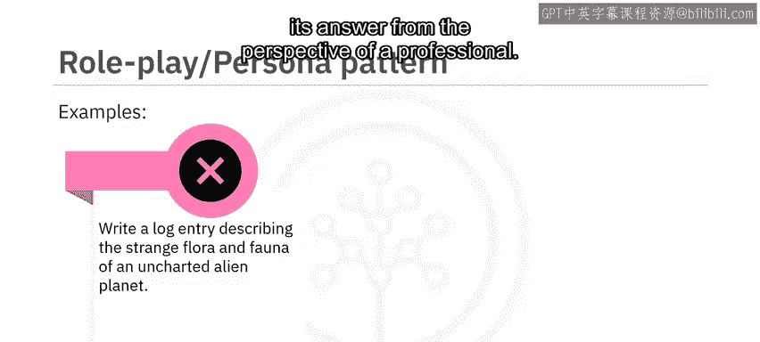

请看这个例子：“写一篇日志，描述一个未知外星星球上奇特的动植物。”这个提示只会给出关于外星星球的科学细节，而不会从专业人士的视角解释其答案。

你可以将提示重写为：

> “假设你是一名刚刚登陆未知外星星球的宇航员。写一篇日志，描述你遇到的奇特动植物，例如天空的颜色和回荡在异星景观中的陌生声音。在记录这段非凡旅程时，表达你的兴奋、好奇以及一丝忧虑。”

在这个例子中，你**明确提供了上下文细节**，并**假设自己是一名宇航员**。因此，这个提示将生成与宇航员视角一致的回应。

---

## 总结

本节课中，我们一起学习了为生成式AI模型撰写有效提示的重要性，它能帮助我们监督输出的风格、语气和内容。撰写有效提示的最佳实践可围绕四个维度实施：**清晰度**、**上下文**、**精确度**和**角色扮演**。

*   **清晰度**包括使用简单、简洁的语言。
*   **上下文**提供背景和所需细节。
*   **精确度**意味着具体明确并提供示例。
*   **角色扮演**可以通过设定人物角色和提供相关上下文来增强回应。

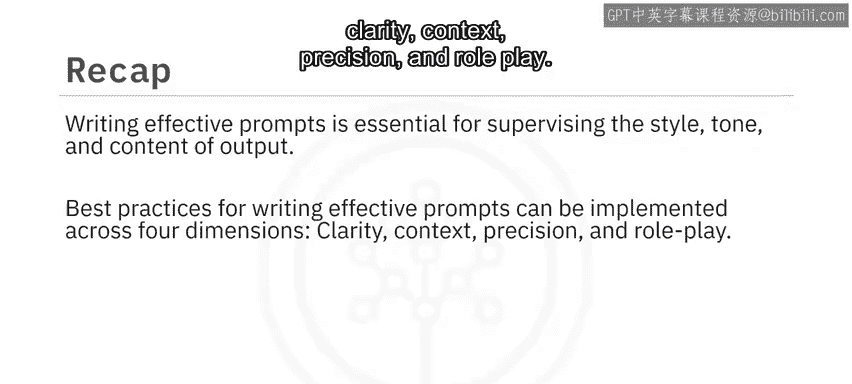

这些实践可以根据具体需求进行调整，以获得最佳结果。