# 046：常见的提示工程工具 🛠️

在本节课中，我们将学习常见的提示工程工具。你将能够描述这些工具的常见功能，并解释几种主流工具的核心能力。

提示工程是指设计精确且符合上下文的提示词，以便与生成式AI模型交互，从而获得相关且准确的输出。为了辅助这一过程，存在多种提示工程工具。这些工具提供丰富的功能和特性，旨在优化提示词的创建，以实现期望的结果。它们对于不精通自然语言处理技术，但又希望在使用生成式AI模型时达成特定目标的用户尤为有用。

## 常见功能概览

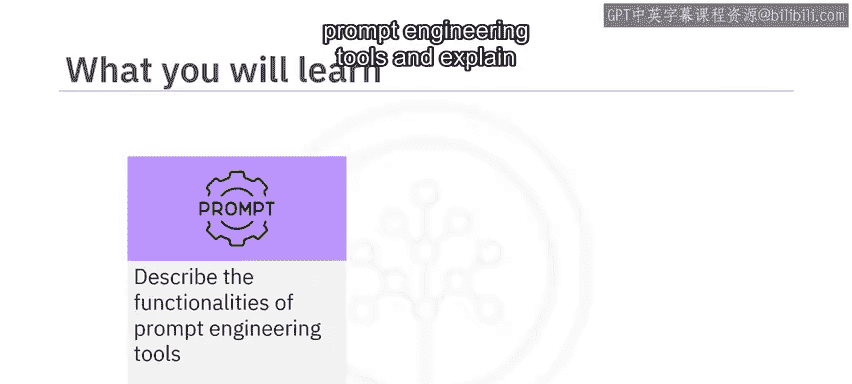

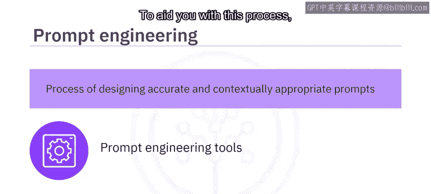

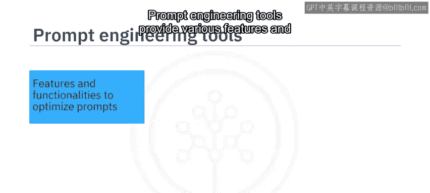

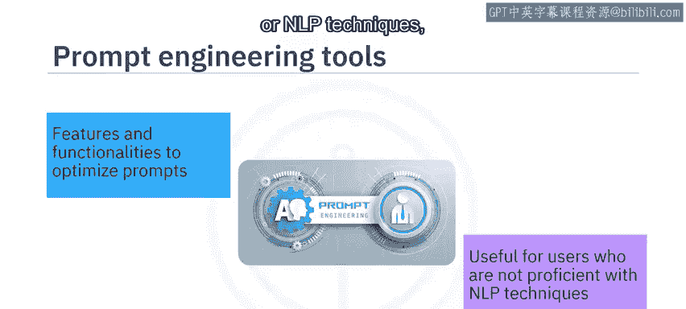

上一节我们了解了提示工程工具的作用，本节中我们来看看这些工具通常提供哪些核心功能。

以下是提示工程工具常见的几类功能：

*   **提示建议**：许多工具能根据给定的输入或期望的输出，为用户提供提示词建议。
*   **结构优化**：这些工具可以建议如何组织提示词结构，以实现更好的上下文沟通。它们帮助构建能为模型提供必要上下文、使其理解用户意图的提示词。
*   **迭代精炼**：你可以根据工具的初始响应，迭代地优化提示词，以找到最有效的版本。
*   **偏见缓解**：提示工程工具可能提供功能，帮助减轻生成式AI模型响应中的偏见。它们可以指导如何构建提示词，以降低产生偏见或不恰当输出的可能性。
*   **领域适配**：这些工具能帮助创建针对特定领域（如法律、医疗或技术）的提示词。
*   **预设库**：一些提示工程工具提供了针对各种用例的预定义提示词库，用户可以根据具体需求进行定制。

## 主流工具介绍

了解了核心功能后，接下来我们具体探索几种常见的提示工程工具。

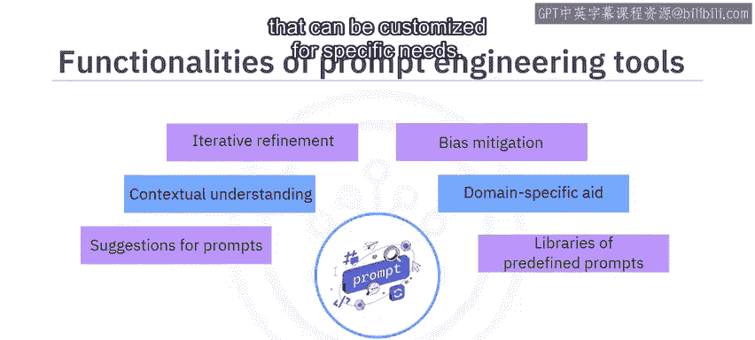

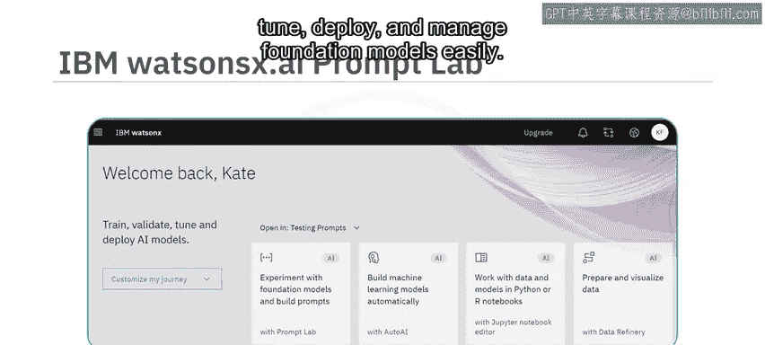

### 1. IBM Watsonx.ai Prompt Lab

让我们从 **IBM Watsonx.ai** 开始。这是一个集成工具平台，用于轻松地训练、调优、部署和管理基础模型。该平台包含 **Prompt Lab** 工具，使用户能够基于不同的基础模型试验提示词，并根据自身需求构建提示词。

为了帮助用户入门，Prompt Lab 为不同用例提供了示例提示词，包括摘要生成、文本生成和信息提取。要创建符合特定需求的提示词，你可以通过添加指令和示例来训练模型，向模型展示应如何响应输入。

### 2. Spellbook (Scale AI)

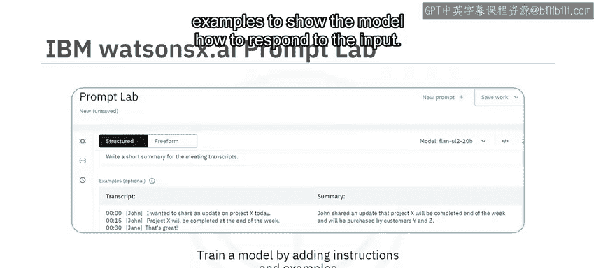

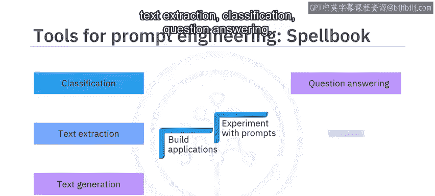

接下来，我们了解一下 **Spellbook**。这是 Scale AI 提供的一个集成开发环境。通过 Spellbook，你可以基于语言模型构建应用程序，并为各种用例（包括文本生成、信息提取、分类、问答、自动补全和摘要）试验提示词。

对于提示工程，Spellbook 包含一个提示词编辑器，允许你编辑和测试提示词。你可以使用提示词模板来利用结构化提示生成文本，也可以访问预构建的提示词作为示例。

### 3. Dust

另一个提示工程工具是 **Dust**。它提供了一个用于编写提示词并将其链接在一起的 Web 用户界面。你可以管理链式提示词的不同版本。它还提供了一种自定义编码语言和一组标准模块，用于处理 LLM 提供的输出。Dust 也支持集成其他模型和服务。

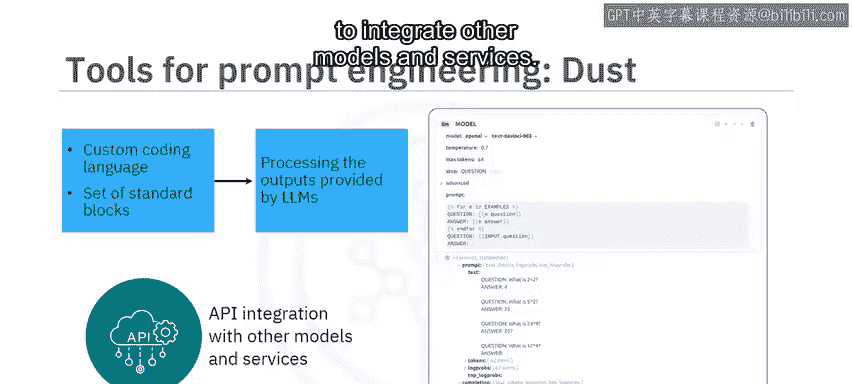

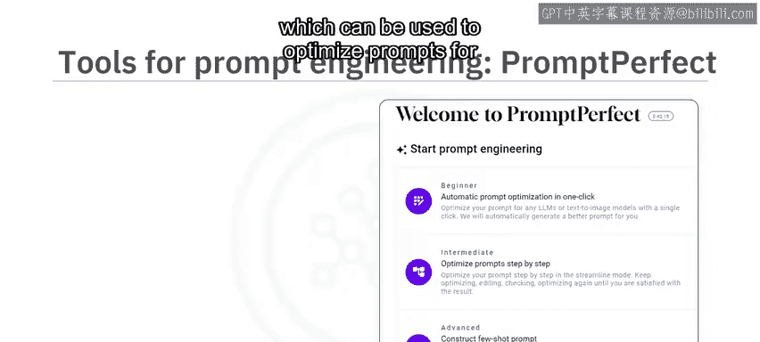

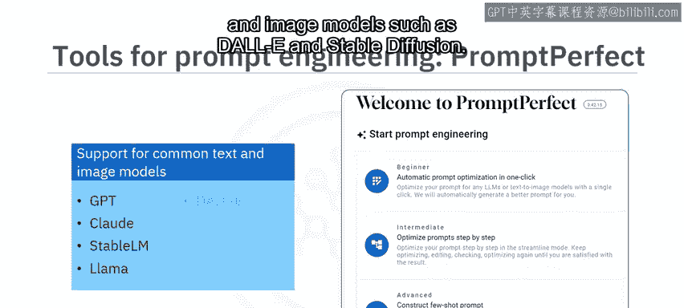

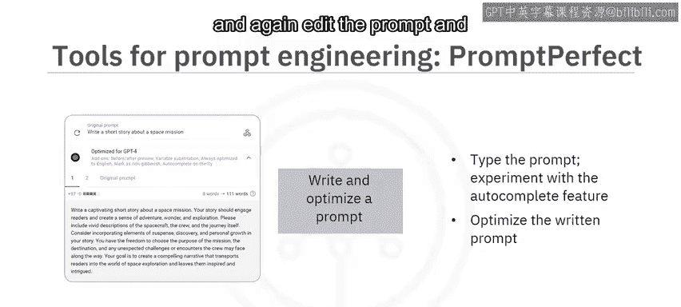

### 4. PromptPerfect

用于高效提示工程的另一个工具是 **PromptPerfect**。它可用于为不同的 LLM 或文生图模型优化提示词。它支持常见的文本模型（如 GPT、Claude、Stable LM 和 LLaMA）以及图像模型（如 DALL-E 和 Stable Diffusion）。

要编写或优化提示词，首先需要选择你想要为其优化提示词的相关模型。不同的模型有不同的优化策略。你还可以选择与预览质量、语言和审核相关的选项。在编写提示词时，你可以尝试自动补全功能，它会在你输入时提供建议。你可以在此进一步优化已编写的提示词。

例如，一个示例展示了用户编写的原始提示词和由 PromptPerfect 生成的相应优化提示词。为了进一步优化，你可以在“流线模式”中逐步优化和精炼提示词：编写提示词、优化它、再次编辑、再优化，直到对输出满意为止。

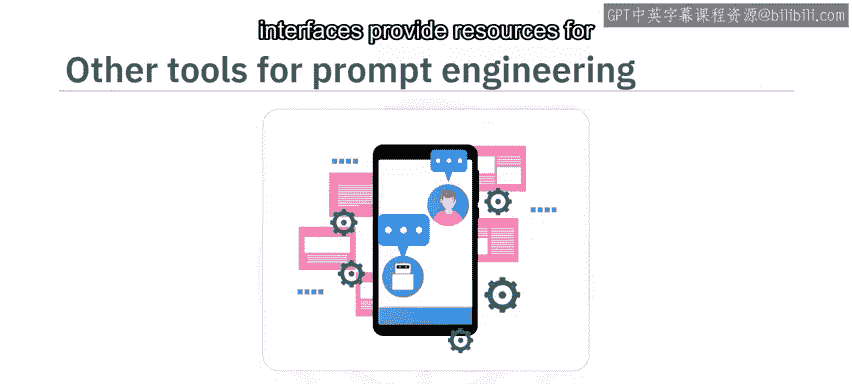

## 其他资源与平台

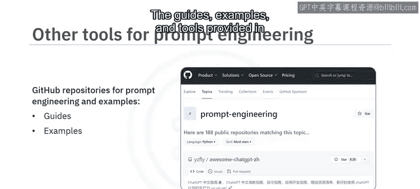

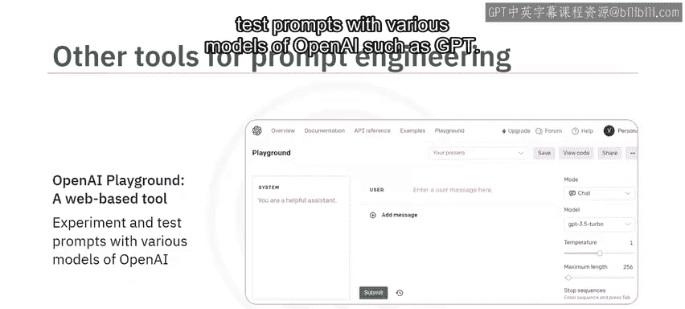

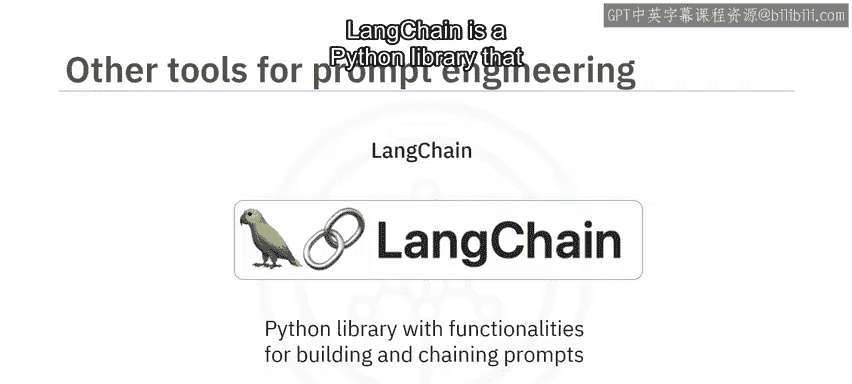

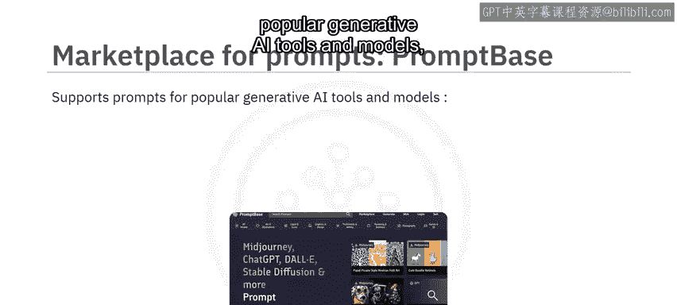

除了上述专用工具，还有一些流行的平台和接口为提示工程提供资源或帮助你试验提示词。

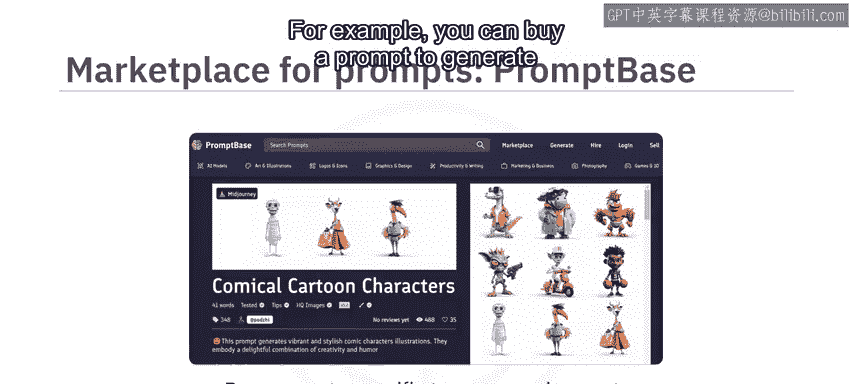

*   **GitHub**：提供了大量关于提示工程和 LLM 的代码仓库。这些仓库中的指南、示例和工具有助于提升提示工程技能。
*   **OpenAI Playground**：一个基于 Web 的工具，帮助用户使用 OpenAI 的各种模型（如 GPT 系列）试验和测试提示词。
*   **Playground AI**：该平台帮助你试验文本提示词，以使用 Stable Diffusion 模型生成图像。
*   **LangChain**：一个 Python 库，为构建和链接提示词提供功能。
*   **提示词市场**：有趣的是，提示词也可以进行买卖。**PromptBase** 就是一个提示词市场的例子。它支持针对流行生成式 AI 工具和模型的提示词，包括 Midjourney、ChatGPT、DALL-E、Stable Diffusion 和 LLaMA。通过 PromptBase，你可以购买针对特定需求和特定模型或工具的提示词。例如，你可以购买一个用于通过 Midjourney 生成漫画卡通角色的提示词。同样，如果你拥有出色的提示词构建技能，也可以通过 PromptBase 上传和出售提示词。该平台还支持直接在其平台上构建提示词并在其市场上出售。

## 总结

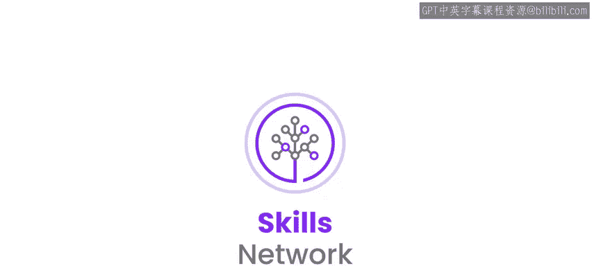

本节课中，我们一起学习了提示工程工具。我们了解到，这些工具提供多种特性和功能来优化提示词，包括提供提示建议、优化上下文理解、支持迭代精炼、缓解偏见、提供领域特定帮助以及提供预定义提示词库。常见的提示工程工具和平台包括 **IBM Watsonx.ai Prompt Lab**、**Spellbook**、**Dust** 和 **PromptPerfect**。此外，GitHub、OpenAI Playground 等平台以及 PromptBase 这样的市场也为提示工程提供了丰富的资源和可能性。