# 048：面试模式方法 🎤

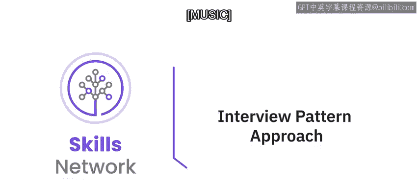

在本节课中，我们将学习提示工程中的“面试模式方法”。我们将了解其核心概念、工作原理，并通过一个具体示例掌握如何应用此方法来编写更有效的提示，从而让生成式AI模型产出更具体、更符合需求的回答。

## 概述：什么是面试模式方法？

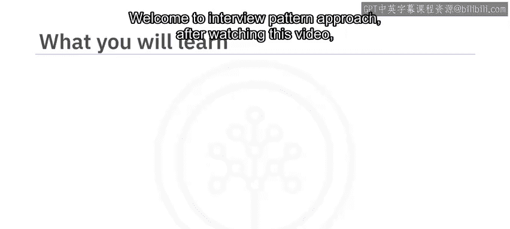

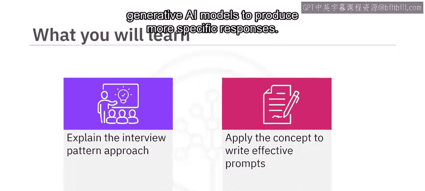

面试模式方法是一种提示工程策略，其核心在于通过模拟对话或类似面试的互动方式来设计提示。这种方法旨在引导AI模型进行更动态、迭代的对话，以获取更精确的响应。

上一节我们介绍了提示工程的基础概念，本节中我们来看看如何通过结构化的“面试”来优化与模型的互动。

## 面试模式方法的工作原理

这种方法需要对提示进行细致的优化，以确保模型生成的响应能精确满足你的目标。其流程通常如下：

1.  你向模型提供特定的提示指令。
2.  模型根据指令，向用户提出必要的后续问题。
3.  你回答这些后续问题。
4.  模型根据收集到的相关信息进行处理，最终为用户提供一个经过优化的响应。

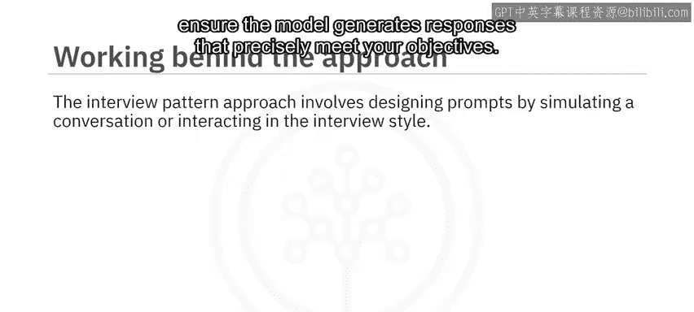

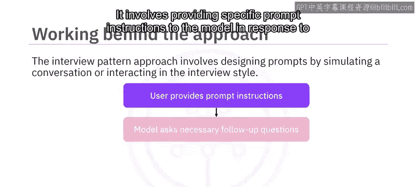

一个核心原则是：**你提供的信息越多，得到的结果就越好**。

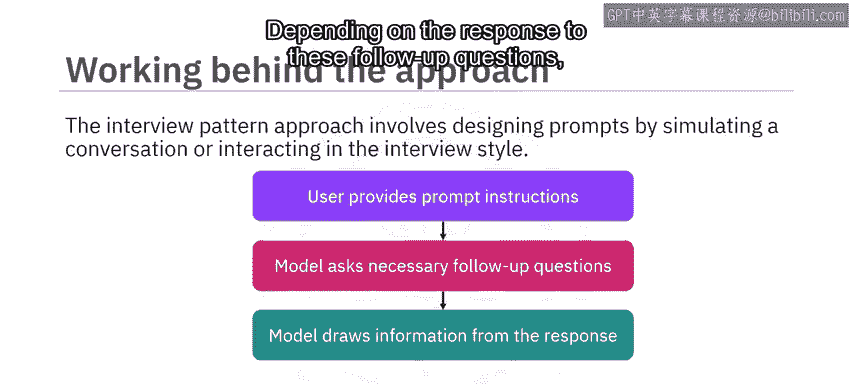


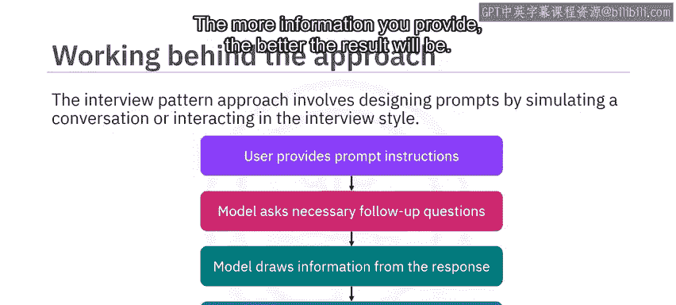

下面，我们通过一个例子来更好地理解这个过程。

## 实战示例：扮演旅行顾问

假设你希望模型扮演一名旅行顾问，为你规划假期旅行行程。你将如何提示模型？

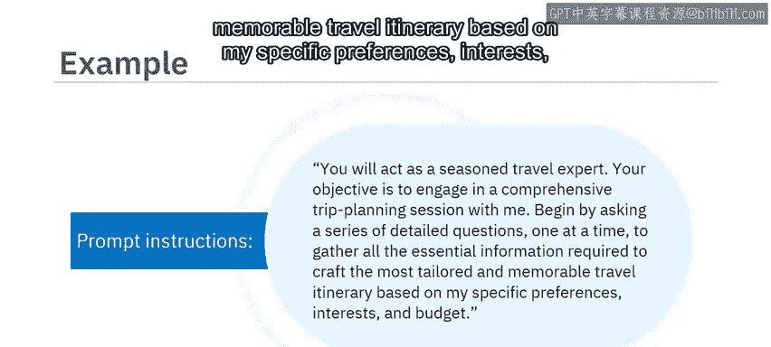

你可以向模型提供如下提示指令：

```
你将扮演一位经验丰富的旅行专家。
你的目标是与我进行一次全面的旅行规划对话。
请首先提出一系列详细的问题（一次一个），以收集所有必要信息，从而根据我特定的偏好、兴趣和预算，制定出最量身定制且令人难忘的旅行行程。
```

在收到这个提示指令后，模型会开始提出所有必需的后续问题。以下是模型可能会问的问题示例：

*   你最喜欢去哪种类型的旅行目的地？
*   请描述一下你理想假期的活动和体验。
*   你通常如何规划旅行？在选择目的地时，哪些因素对你最重要？
*   在规划旅行目的地时，你是否对特定的文化或历史方面感兴趣？
*   旅行时你偏好哪种住宿选择？为什么？
*   你如何平衡预算考虑与获得难忘旅行体验的愿望？

在这个例子中，每个问题都建立在前一个问题的基础上，形成了一场关于旅行偏好的结构化、信息丰富的对话。根据你对这些问题的回答，模型将规划出一个符合你偏好和需求的、令人难忘的旅行行程。

## 面试模式方法的优势

通过这个视频的学习，我们了解到面试模式方法优于传统的单次提示方法。

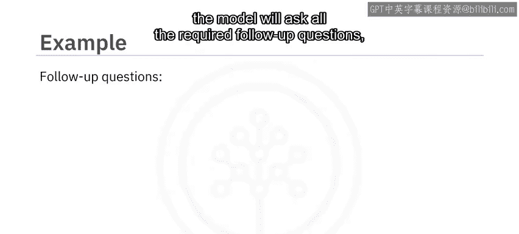

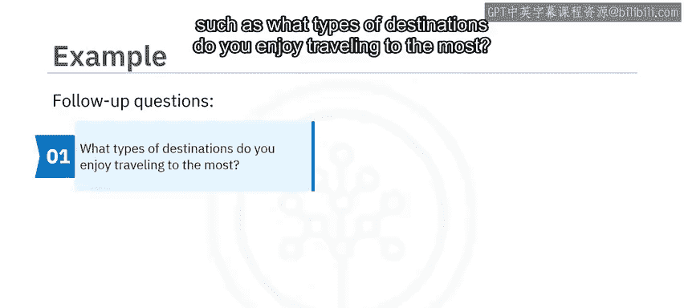

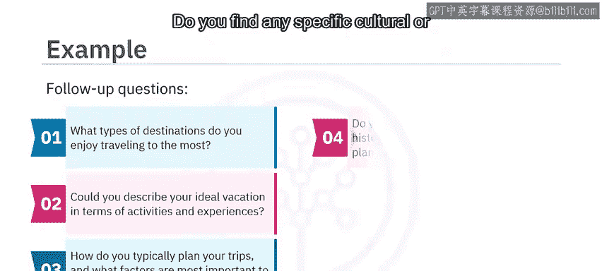

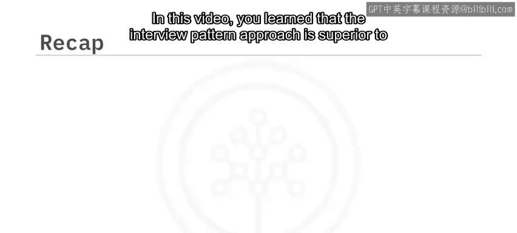

传统的单次提示是提供单一的、静态的指令。而面试模式则涉及与模型进行来回的信息交换，这有助于实时澄清疑问并引导模型的响应方向，从而增强用户优化结果的能力。

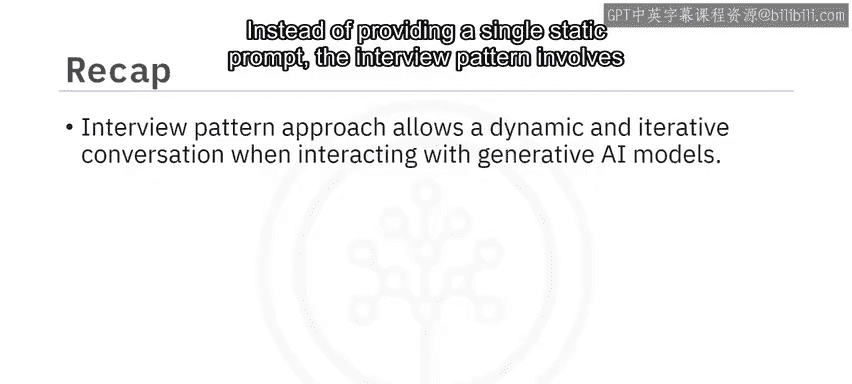

## 总结

本节课中，我们一起学习了提示工程中的面试模式方法。我们掌握了其通过模拟对话来设计提示的核心思想，了解了它分步收集信息以优化响应的工作流程，并通过旅行顾问的示例实践了如何应用该方法。记住，采用这种互动式的方法，能让生成式AI模型更好地理解你的复杂需求，并给出更精准、个性化的答案。