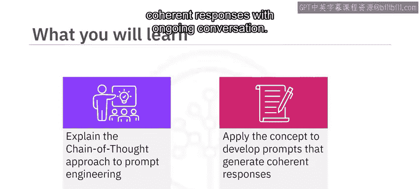
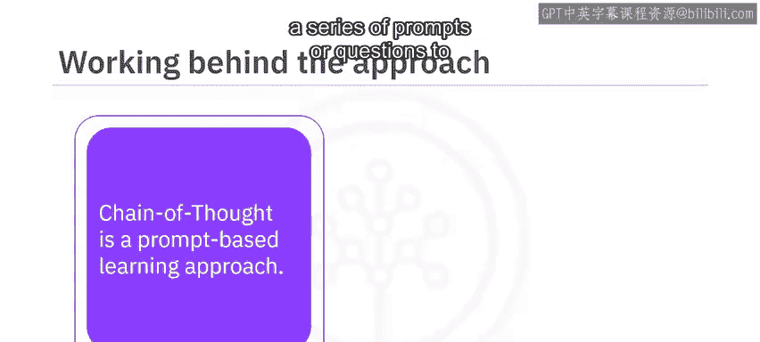
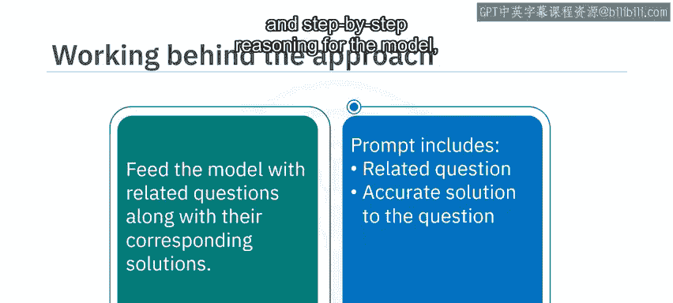
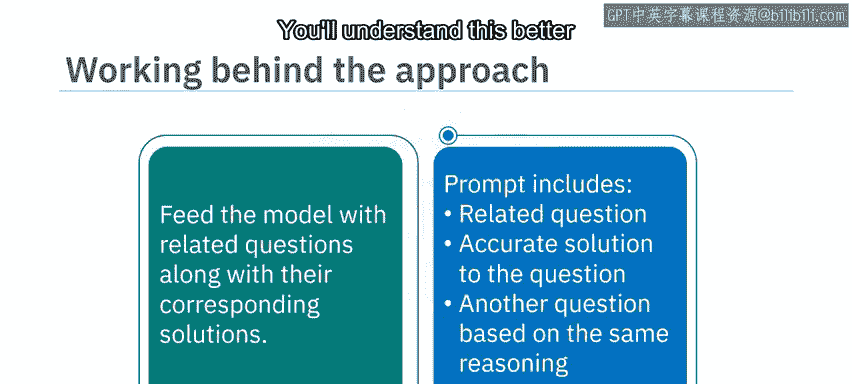

# 049：思维链（Chain of Thought）方法 🧠

在本节课中，我们将要学习提示工程中的“思维链”方法。这是一种通过构建一系列提示或问题来引导生成式AI模型，使其产生更准确、更具逻辑性回答的技术。我们将了解其核心概念、工作原理，并通过一个具体示例来掌握如何应用此方法。




---

思维链是一种基于提示的学习方法，它通过构建一系列提示或问题来引导模型生成期望的回应。使用这种方法，可以展示生成式AI模型的认知能力，并更好地解释其推理过程。



其核心在于将一个复杂任务分解为一系列更小、更简单的子任务。每个后续的提示都建立在前一个的基础上，逐步引导模型走向预期的结果。

在直接向模型提出一个问题之前，你需要先为它提供一些相关的问题及其对应的解决方案。这一系列的提示能帮助模型思考问题，并学会运用相同的策略来正确回答更多类似问题。

简单来说，一个完整的思维链提示应包含：一个示例问题及其**分步推理的准确答案**，以此向模型提供所需的上下文和推理逻辑；然后，再提出一个需要运用相同逻辑来解答的新问题。

---

为了更好地理解，我们来看一个例子。


如果你直接向模型提出一个数学问题：“马修有6个鸡蛋。他又买了2盘鸡蛋，每盘有12个。他现在一共有多少个鸡蛋？”模型可能会在复杂逻辑上出错。





为了训练模型掌握解决此类问题所需的适当推理，你可以先构建这样一个示例：

**示例问题**：玛丽有8个萝卜。她用了5个萝卜做晚餐。第二天早上，她又买了10个萝卜。她现在有多少个萝卜？

**解决方案（分步推理）**：
1.  玛丽最初有8个萝卜。
2.  她用掉了5个，所以剩下 `8 - 5 = 3` 个萝卜。
3.  第二天她又买了10个，所以现在总共有 `3 + 10 = 13` 个萝卜。


这个示例帮助模型理解了其中涉及的逻辑（先减后加）。然后，你再提出最初的目标问题，模型就能运用相同的推理链来解答。

因此，你的最终提示应遵循以下结构：

1.  **提供一个相关示例**：包含问题及其分步推理的解决方案。
2.  **提出目标问题**：一个可以运用相同逻辑解答的新问题。

以下是一个符合思维链方法的提示模板：

```text
问题：玛丽有8个萝卜。她用了5个萝卜做晚餐。第二天早上，她又买了10个萝卜。她现在有多少个萝卜？
解决方案：玛丽最初有8个萝卜。用掉5个后，剩下 8 - 5 = 3 个。又买了10个后，她现在有 3 + 10 = 13 个萝卜。

问题：马修有6个鸡蛋。他又买了2盘鸡蛋，每盘有12个。他现在一共有多少个鸡蛋？
```

---


本节课中，我们一起学习了思维链方法。这种方法通过为模型提供相关示例及其分步解决方案，来强化生成式AI模型的认知能力，并引导其进行逐步推理。其核心在于训练模型理解问题背后的解决逻辑，从而能够将相同的逻辑应用于解决更多类似的问题。掌握这种方法，能让你更有效地引导AI模型进行复杂思考。