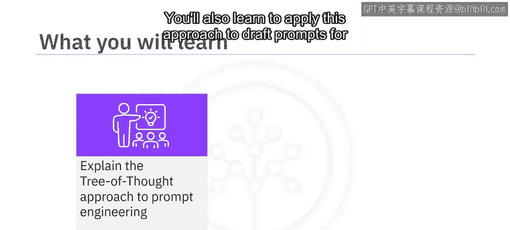
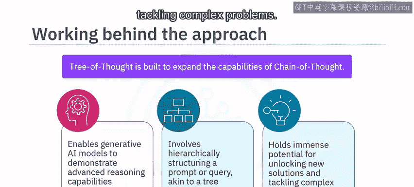
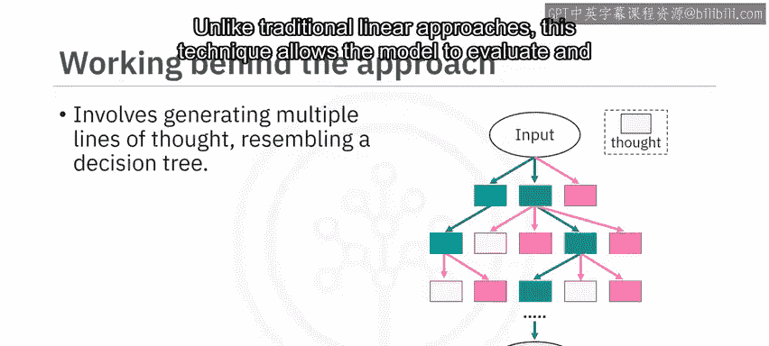
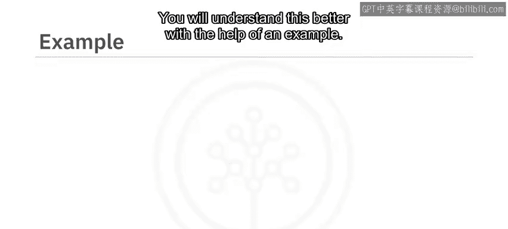

# 050：思维树方法 🌳

在本节课中，我们将学习一种创新的提示工程方法——思维树方法。我们将了解其核心概念、工作原理，并通过一个具体示例学习如何应用它来生成更符合需求的AI响应。

思维树方法是一种创新的提示工程技术，它扩展了思维链方法的能力。该方法使生成式AI模型能够展现更高级的推理能力。它通过将提示或查询分层组织成类似树状的结构，来为模型指定所需的思考或推理路径。当您需要向模型提供明确的指令或约束，以确保其生成期望的输出时，这种方法尤其有用。此方法在解锁新解决方案和解决复杂问题方面具有巨大潜力。

上一节我们介绍了思维树方法的基本概念，本节中我们来看看它的具体工作原理。






思维树方法的工作原理是生成多条思考路径，类似于决策树，以探索不同的可能性和想法。与传统的线性方法不同，该技术允许模型同时评估和探索多条路径。每个想法会像树枝一样分叉，形成一个相互关联的思考树状结构。模型通过评估每条可能的路径，根据其对结果的预测分配数值，并剔除前景较小的思考路径，最终确定最优选择。



为了更好地理解，我们通过一个示例来说明。

假设您希望模型为一家电子商务企业设计吸引和留住熟练远程员工的招聘与保留策略，并要求模型使用思维树方法来完成此任务。

您可以向模型提供以下提示指令：




```
想象三位不同的专家正在回答这个问题。
所有专家都将写下他们思考的一个步骤，然后与小组分享。
然后，所有专家将继续进行下一步，依此类推。
如果有任何专家在任何时候意识到自己错了，那么他们将退出讨论。
```

除了提示指令，您还需要给出原始问题提示：

```
扮演人力资源专家的角色，为一家电子商务企业设计一个招聘与保留策略，重点在于吸引和留住熟练的远程员工。
```

构建这样的提示指令将使生成式AI模型能够考虑一个逐步的过程并进行逻辑思考。它还会让模型考虑中间想法，在此基础上进行构建，并探索可能导向不同结果的“分支”。这种做法将最大化模型的利用率和能力，从而产生更有用的结果。


在本节课中，我们一起学习了思维树方法。这是一种在思维链方法基础上发展起来的创新技术，它通过将提示分层组织成类似树状的结构，来指导模型的推理和输出生成。当需要明确的指令或约束来获得期望的输出时，这种方法尤其有价值。它使模型能够像决策树一样分叉，同时探索各种可能性和想法。