# 051：文本到图像提示技术 🎨

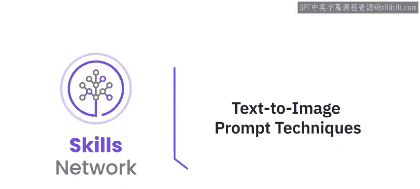

在本节课中，我们将学习文本到图像的提示技术。观看本视频后，你将能够解释用于提升图像质量和影响力的常见图像提示技术，并应用这些技术来编写更好的图像生成提示词。

图像是沟通的重要组成部分，广泛应用于市场营销、广告、教育、新闻等多个领域。然而，某些图像在传达情感方面比其他图像更为出色。图像提示词是你想要生成的图像的文本描述。它可以简单到一个单词或短语，也可以更详细地描述图像的构图、色彩和氛围。

为了增强通过生成式AI模型获得的图像的影响力，使其更具说服力和吸引力，你可以使用图像提示技术。这些技术旨在提升生成式AI模型所产生图像的质量、多样性和相关性。

有多种图像提示技术可用于改善图像效果。让我们逐一了解这些技术。

## 风格修饰词 🖌️

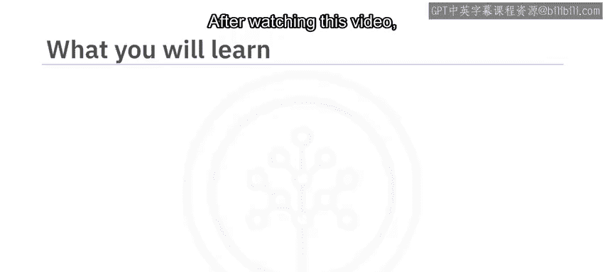

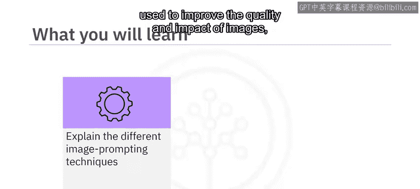

风格修饰词是用于影响生成式AI模型所产生图像的艺术风格或视觉属性的描述符。这些描述符可以帮助模型在遵循输入提示词结构和内容的同时，生成具有创新风格的图像。

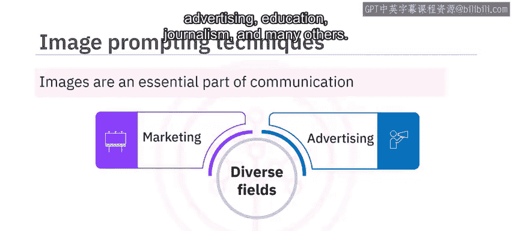

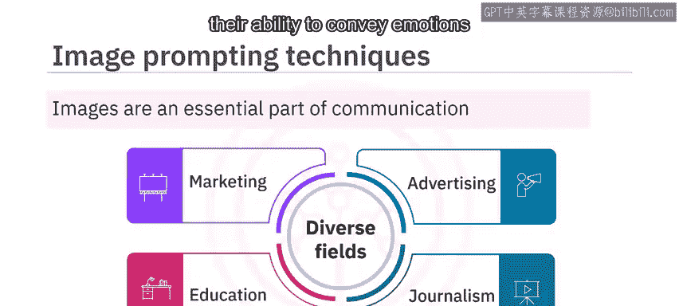

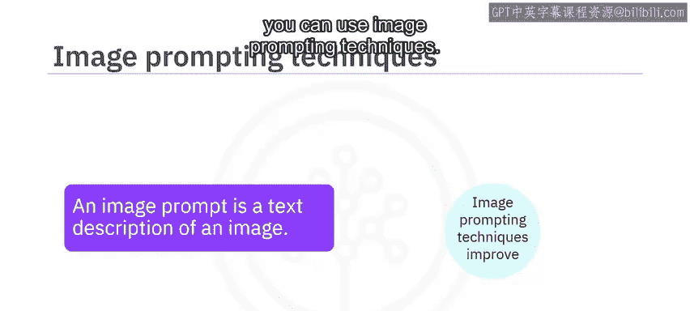

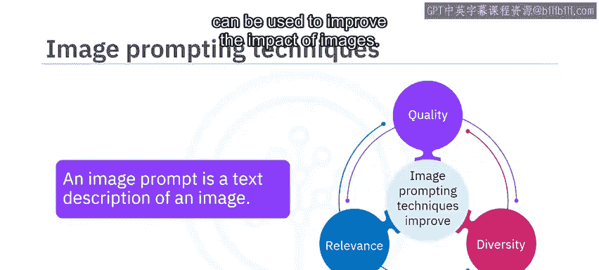

你可以修改图像的各种视觉元素，如颜色、对比度、纹理、形状和大小，从而生成具有美学吸引力且视觉上令人愉悦的输出。你的提示词可以包含关于各种艺术风格、历史艺术时期、摄影技术、所用艺术材料类型，甚至是你希望模型模仿的知名品牌或艺术家特征的信息。所有这些信息都有助于生成模型理解输出图像所需的外观或风格。

以下是图像提示词中使用风格修饰词的一些例子。

在这些提示词中使用的风格修饰词已被高亮显示。

接下来，我们介绍下一个图像提示技术：质量增强词。

## 质量增强词 📈

与低质量图像相比，高质量的图像更具说服力和可靠性。低分辨率图像经常出现模糊和像素化问题，使观看者难以辨别其中的精细细节。另一方面，高分辨率图像保证了基本的可见性和可读性。使用高质量的图形设计可以提升图像的感知价值。

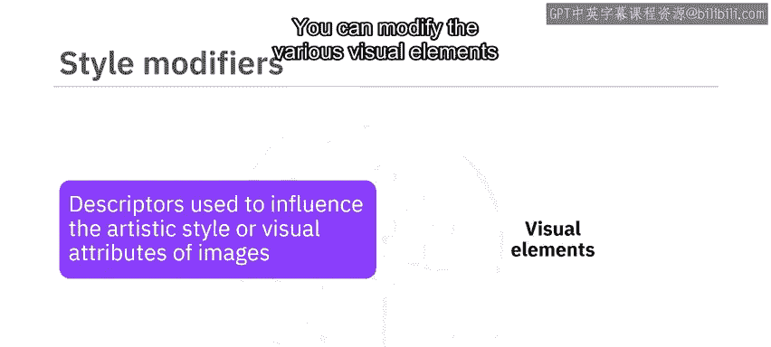

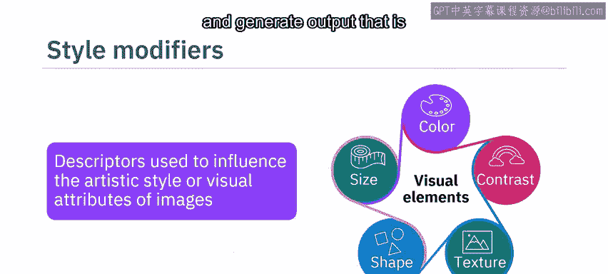

质量增强词是图像提示词中用于增强视觉吸引力、提高整体保真度和清晰度的术语。这些是特定的术语，可以指导生成式AI模型执行降噪、锐化、色彩校正和分辨率增强等步骤。

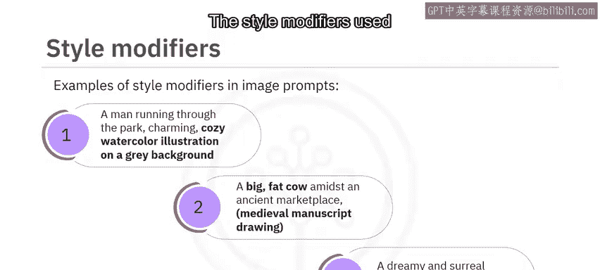

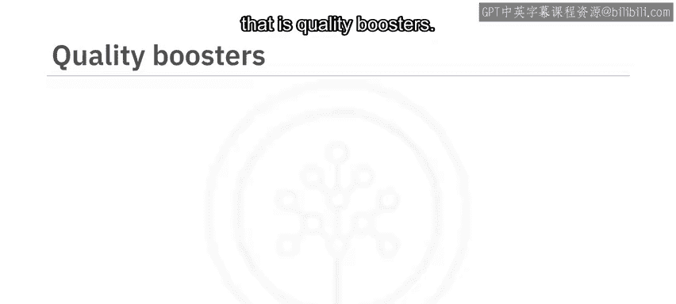

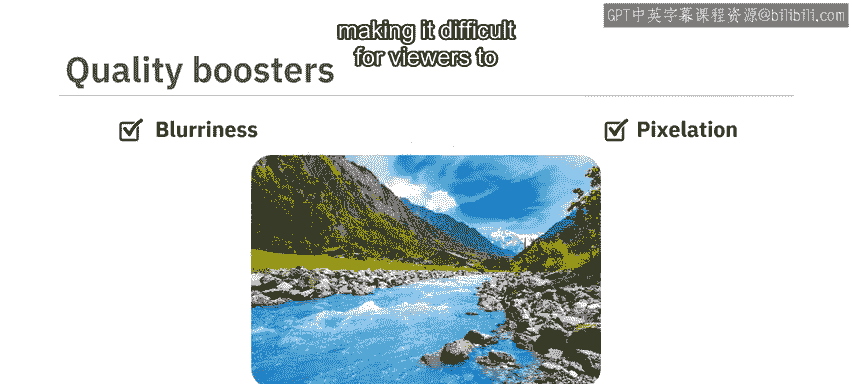

你可以在图像提示词中使用诸如 **`high resolution`**、**`hyper detailed`**、**`sharp`**、**`complementary colors`** 等术语作为质量增强词。它们可以增强图像的特定特征，从而产生更连贯的输出。

让我们看一些例子来理解如何在图像提示词中使用质量增强词。

在上述图像提示词中，诸如“突出纹理”、“4K分辨率”、“锐利”、“清晰细节”、“精细线条”、“互补色”、“模糊背景”和“突出”等术语就是使用的质量增强词。

第三个图像提示技术是重复。

## 重复技术 🔁

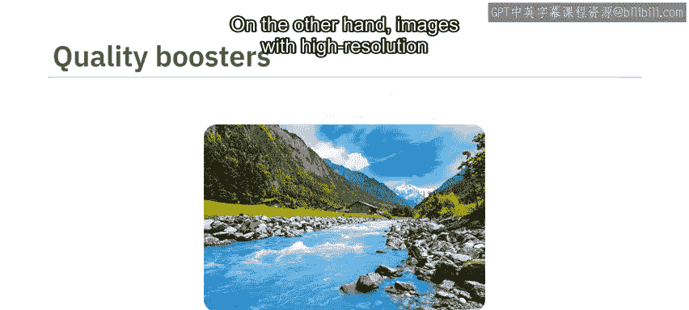

该技术利用迭代采样的力量来增强模型生成图像的多样性。重复涉及强调图像中的特定视觉元素，为模型创造一种熟悉感，使其能够专注于你想要突出的特定想法或概念。

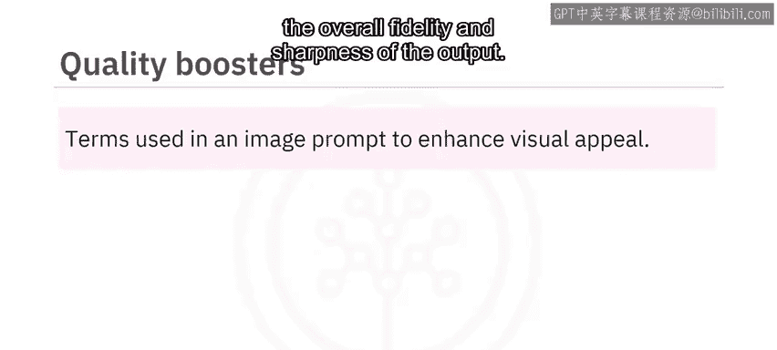

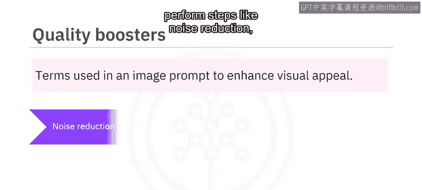

这可以通过在图像提示词中重复相同的单词或相似的短语来实现。重复有助于强化通过图像传达的信息，并增加模型对特定概念的关注度。

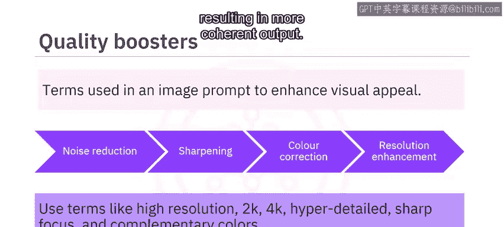

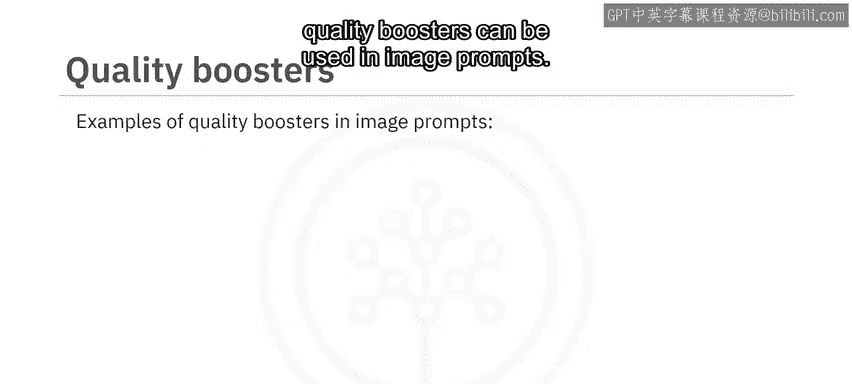

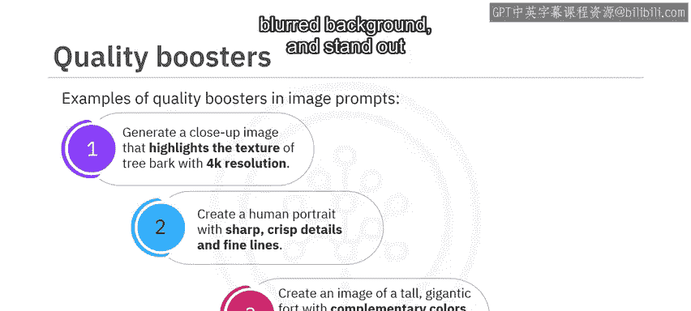

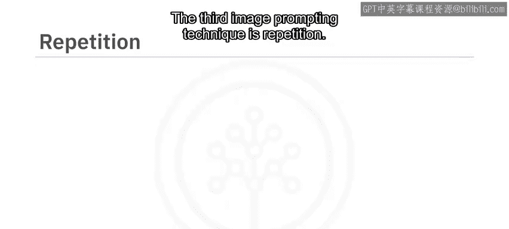

模型并非仅根据一个提示生成一张图像，而是生成多张具有细微差别的图像，从而产生一组多样化的潜在输出。当生成模型面对抽象或模糊的提示词，且存在多种有效解释时，这种技术尤其有价值。

让我们看一些在图像提示词中使用重复单词的例子。

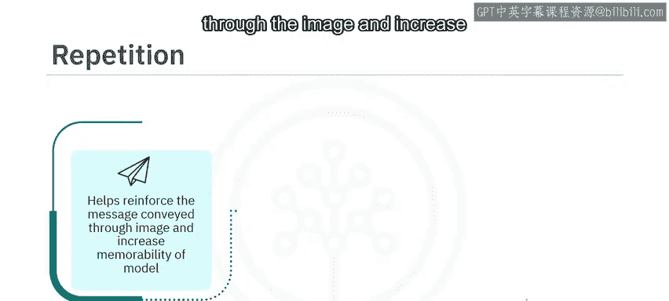

诸如“微小”、“密集”、“巨大”、“广阔”、“宁静”、“清澈”和“茂盛”等词语被重复多次，以聚焦于特定的想法。

第四个图像提示技术是加权术语。

## 加权术语 ⚖️

加权术语指的是使用具有强烈情感或心理影响的词语或短语。例如，“免费”、“限时优惠”和“保证”等词语常用于广告中，以引发紧迫感、安全感和信任感。同样，“奢华”、“高级”和“独家”等词语用于营造排他性和精致感。

生成式AI模型允许你为这类术语赋予正权重或负权重，以强调或弱化某种情感。在图像提示词中使用加权术语有助于创建令人难忘、有说服力的图像，并能引发观众的情感反应。

以下是一些在图像提示词中使用加权术语的例子。

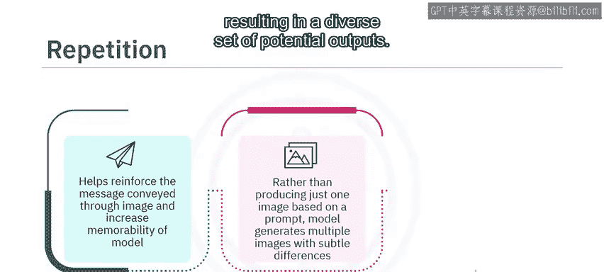

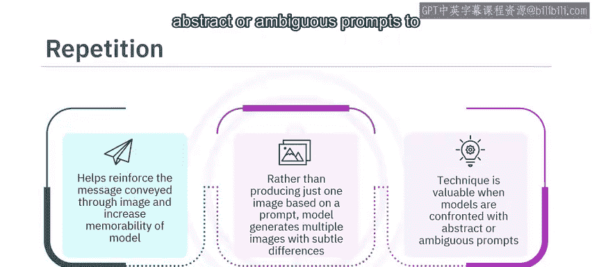

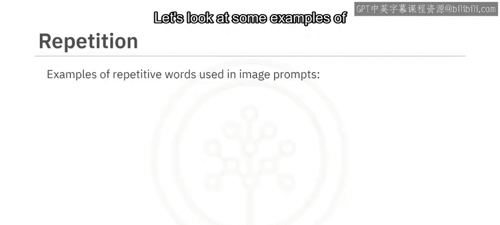

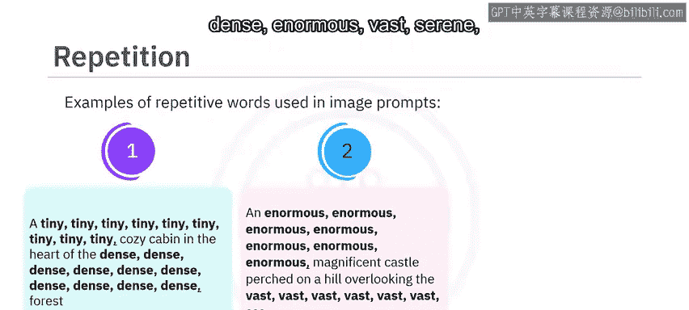

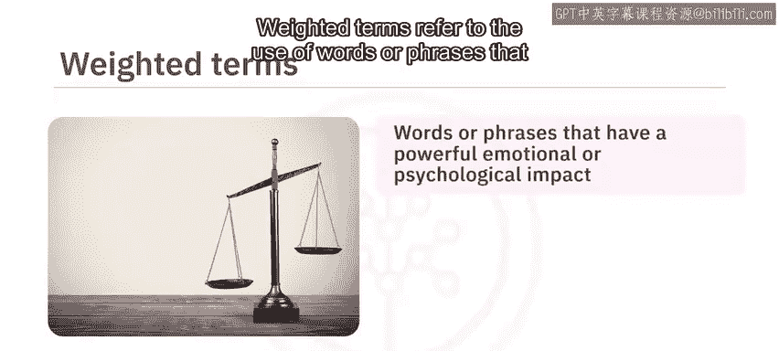
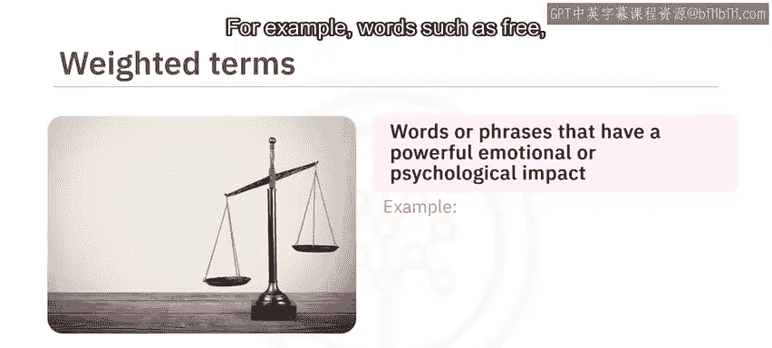

如第一个例子所示，词语“温暖”被赋予了正10的权重，而“噼啪作响”的权重是正8。这意味着生成模型必须更多地关注“温暖”这个词，而对“噼啪作响”的关注稍少一些。

类似地，在第二个例子中，词语“闪烁”被赋予了正6的权重，“霓虹灯照亮”的权重是正8。因此，模型应该更多地关注“霓虹灯照亮”。

在最后一个例子中，词语“色彩”被赋予了负6的权重，而“异国情调”被赋予了正10的权重。这意味着模型必须强调“异国情调”这个词，并弱化“色彩”这个词。

第五个图像提示技术是修复畸形生成。

## 修复畸形生成 🛠️

该技术用于修改可能影响图像有效性的任何畸形或异常。图像中的畸形可能包括扭曲（特别是在人体部位如手或脚上）、像素化或其他会损害视觉吸引力和图像整体效果的图像质量问题。

通过使用良好的负面提示词，可以在一定程度上缓解这些问题。以下是一些在图像提示词中使用畸形生成修复技术的例子。

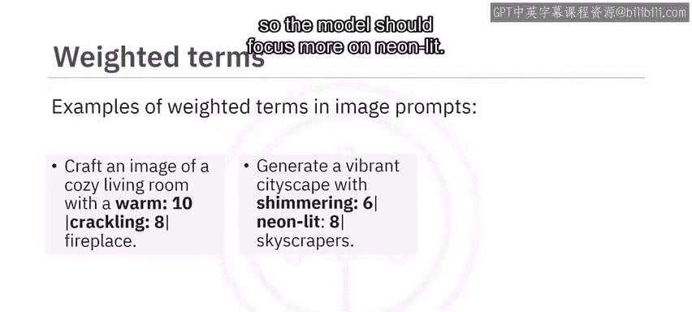

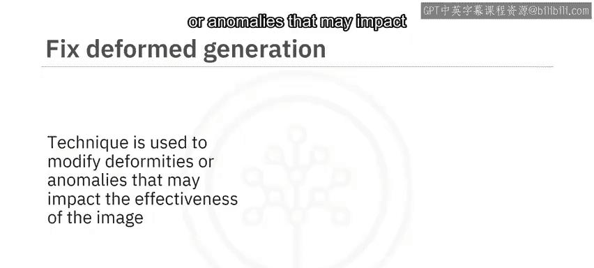

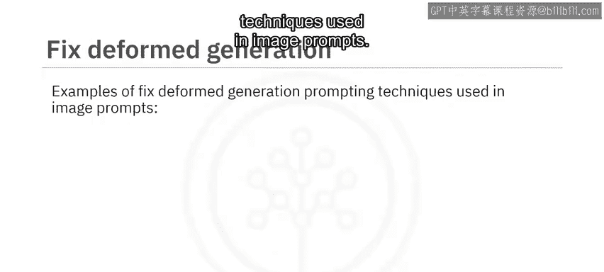
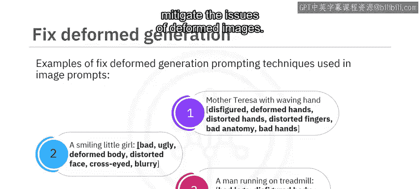

你可以看到，在所有这些例子中，都使用了良好的负面词语来缓解图像畸形的问题。

## 总结 📝

在本视频中，你了解到图像提示技术在提升生成式AI模型的图像生成能力方面起着至关重要的作用。

风格修饰词、质量增强词、重复技术、加权术语和修复畸形生成是五种可用于改善图像影响力的技术。通过结合这些技术，可以创建更令人难忘、更具吸引力和说服力的视觉效果，从而有效地传达预期信息。

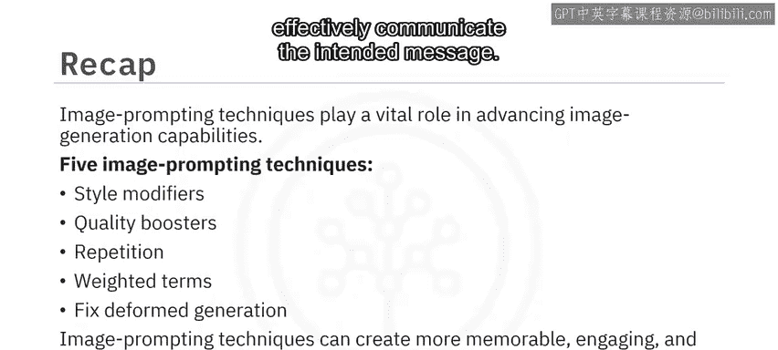

