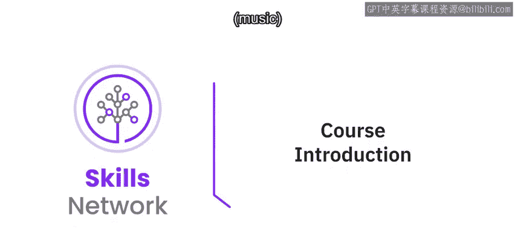
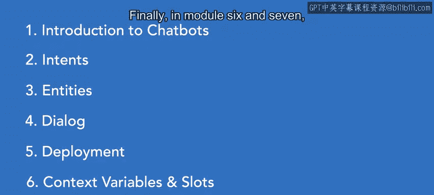

# 052：欢迎来到无需编程的AI聊天机器人世界 🤖

在本节课中，我们将一起了解人工智能（AI）聊天机器人的基本概念、课程目标以及学习路径。我们将探讨AI的实际应用，特别是聊天机器人如何改变我们的日常生活，并概述如何在不编写代码的情况下构建它们。

---

大家好，我是Anton和Jano，我是IBM的一名软件开发者和AI布道者。

当我们谈论AI时，人们往往会联想到科幻场景。这些场景可能让你兴奋，也可能让你感到害怕。但有一点是确定的：我们距离所谓的“强人工智能”——即机器变得和人类一样智能——还有很长的路要走。不过，我们离能够服务于实际目的、并从根本上改变我们日常生活体验的人工智能并不遥远。

在本课程中，我们将聚焦于当今最流行的AI应用之一：聊天机器人，它是对话式AI的一个例子。聊天机器人正变得极其流行，以至于高德纳公司预测，到明年，将有四分之一的客户服务运营使用聊天机器人来协助客户。这为掌握构建安全聊天机器人技能的个人和公司提供了巨大的机会。这正是本课程的目标：教会你如何构建客户服务聊天机器人。

---

AI正变得越来越智能，也越来越容易获取。因此，我将能够教你如何创建聊天机器人，而无需编写任何一行代码。

---

## 课程结构概览

以下是本课程的主要模块内容：

*   **模块1：聊天机器人简介** - 我们将从介绍聊天机器人开始，讨论它们是什么，以及它们为何如此受欢迎。
*   **模块2与3：意图与实体** - 接下来，在模块2和3中，我们将介绍**意图**和**实体**，这是任何聊天机器人的两个关键组成部分。
*   **模块4：对话设计** - 在模块4中，我们将处理对话本身，包括聊天机器人设计的考虑因素和最佳实践。
*   **模块5：部署聊天机器人** - 在模块5中，我们将把聊天机器人部署到一个实际为你生成的网站上。这意味着任何拥有你网站链接的人都可以试用你的聊天机器人。
*   **模块6与7：高级主题** - 最后，在模块6和7中，我们将探讨更高级的主题，这些主题能真正帮助你优化用户体验并创建更高级的聊天机器人。

---

## 实践课程与评估

请注意，这是一门实践性很强的课程。当我说我们将处理某个主题时，我是认真的。我会提供理解所需的理论背景，而你大部分时间将用于完成实验，这些实验旨在帮助你体验创建聊天机器人的实际过程。每个模块都有一系列计入最终成绩的优秀测验。

同样，课程结束时有一个考试，以确保你完全掌握了课程中呈现的概念。

我相信，一旦你完成本课程，你会发现使用Watson创建聊天机器人的过程既直观又有趣。我希望你喜欢这门课程，并希望它能帮助你开启AI领域的职业生涯。

---

在本节课中，我们一起了解了AI聊天机器人的现实意义、本课程无需编程的核心特点，以及从基础概念到高级部署的完整学习路径。我们明确了课程目标是帮助你掌握构建实用聊天机器人的技能。接下来，让我们正式开启构建之旅。