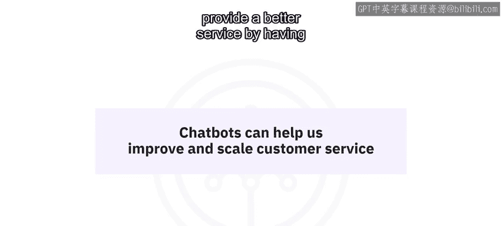
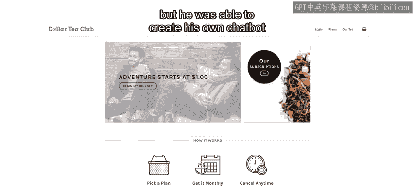
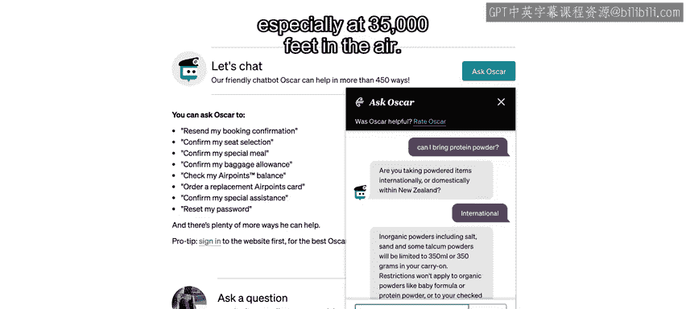
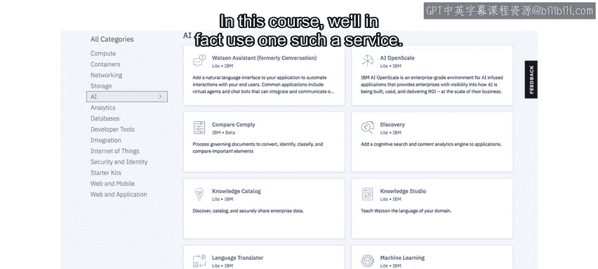
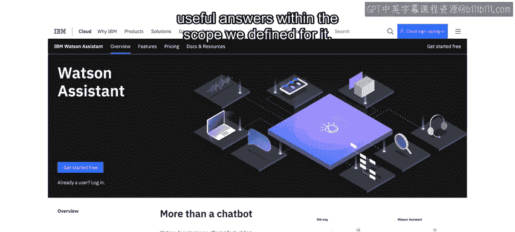

# 053：聊天机器人简介 🤖

在本节课中，我们将要学习聊天机器人的基本概念、它们为何重要，以及它们如何为各种规模的企业提供商业价值。我们还将了解构建一个实用聊天机器人的核心流程。

## 概述

聊天机器人是一种能够通过聊天界面与用户对话的软件代理。它们正成为解决客户服务可扩展性问题的关键工具。本节将介绍聊天机器人的定义、工作原理以及当前流行的原因。

## 什么是聊天机器人？

上一节我们介绍了课程目标，本节中我们来看看聊天机器人的具体定义。

聊天机器人是一种能够通过某种聊天界面与用户进行对话的软件代理。典型的交互流程如下：
1.  机器人问候用户并邀请其采取行动（例如提问）。
2.  用户回复后，机器人解析输入内容，理解用户意图。
3.  最后，机器人以合乎逻辑的方式回应，或提供信息，或在最终回答问题前询问更多细节。

优秀的聊天机器人能在其设计范围内，以自然的方式进行这种来回对话，让用户感到被理解并获得帮助，同时无需伪装成人类。

最常见的聊天机器人是基于文本的，例如网站聊天弹窗或 Facebook Messenger、WhatsApp、Slack 等即时通讯应用中的机器人。此外，也存在通过语音交互的聊天机器人，例如苹果的 Siri 和亚马逊的 Alexa。

> 值得注意的是，“bot”一词有时可与“chatbot”互换使用，但“bot”含义更广，泛指能独立执行某些操作的软件程序（如自动交易机器人），而“聊天”元素才是聊天机器人的核心特征。

## 聊天机器人的价值

了解了聊天机器人的定义后，我们来看看它们为何能提供实际价值。

许多人在拨打公司客服热线时，都熟悉以下场景：“您的来电对我们非常重要，由于通话量异常之高，您的等待时间可能比平时更长。” 无论何时拨打，通话量似乎总是“异常之高”。经过漫长等待后，客服人员可能给出的建议是：“您试过关机再开机吗？” 无论这个简单建议是否能解决问题，漫长的等待过程本身已令人沮丧。

问题的核心在于，由人力驱动的客户服务难以扩展。业务增长意味着需要帮助的客户越来越多，从而需要雇佣和培训更多员工，成本高昂。聊天机器人并非要完全取代人类，但它们可以作为客服团队的第一道防线，高效处理大量简单的客户咨询。

以下是聊天机器人带来价值的几个实例：

*   **酒店业**：一个能回答餐厅营业时间、退房时间、设置叫醒服务或连接 Wi-Fi 等常见问题的聊天机器人，可以显著减少前台接到的电话量，让员工有更多时间和精力处理更复杂的请求。
*   **在线教育**：Cognitive Class 平台在拥有百万注册学员后，面临巨大的客服压力。他们创建了一个学生顾问聊天机器人，用于推荐课程和回答常见问题。这个简单的机器人将学生的支持请求数量减少了一半，并且能够提供 7x24 小时的服务。
*   **小型企业**：Dollar Tea Club 的创始人 Alan 在引入聊天机器人之前，需要花费大量时间反复回答“是否运送到加拿大？”、“运费多少？”等简单问题。通过学习本课程，他构建的聊天机器人每周为他节省了大量时间，使他能更专注于业务增长。
*   **大型企业**：新西兰航空的聊天机器人“Oscar”甚至在飞机上也能为用户提供有用的信息，例如解答关于蛋白粉的入境规定等问题，展示了其普遍实用性。

由此可见，聊天机器人无论对单人运营还是财富 500 强公司都普遍有用。它们能以低廉的成本扩展客户支持业务，并通过全天候即时响应常见咨询来提供更好的服务。

## 聊天机器人为何现在兴起？

我们已经看到了聊天机器人的实际应用，本节将探讨其近期兴起的两大关键原因。

聊天机器人并非新概念。第一个聊天机器人 **Eliza** 早在 20 世纪 60 年代末就已出现。然而，直到最近，两项关键发展才使其成为可行的商业工具和热门技能。

1.  **即时通讯应用的盛行**：WhatsApp、微信、Facebook Messenger 和 Slack 等应用在全球拥有数十亿用户，其普及度甚至超过了社交媒体。这些平台为聊天机器人提供了天然的交互环境。当然，聊天机器人也出现在网站和移动应用中，其核心魅力在于对话式的交互界面，文本聊天深受用户喜爱。
2.  **人工智能（AI）的进步与普及**：如果无法理解用户意图并做出相应回应，聊天机器人将毫无用处。近年来，机器学习、深度学习、自然语言处理（NLP）等人工智能技术发展迅速。例如，IBM Watson 曾在智力竞赛节目《危险边缘》中击败人类冠军，而最近的“Project Debater”则能就复杂话题与人类辩论。

这些成就背后的数学原理可能很复杂，但关键在于，AI 正变得不仅更智能，而且更易于获取。如今，像 IBM 这样的公司通过云服务提供了强大的 AI 能力。在本课程中，我们将使用 **Watson Assistant** 服务，它使我们能够开发具备自然语言处理（NLP）能力的聊天机器人，即一个能理解用户并在我们定义的范围内提供有用答案的聊天机器人。

## 你的第一个任务

在了解了背景知识后，是时候开始动手了。以下是你的第一个实践任务。

在下一节中，你将找到一个实验指导，要求你注册一个免费的 IBM Cloud 账户并创建一项 Watson Assistant 服务。请按照我提供的分步说明进行操作，这个过程不会花费太多时间或精力。

## 总结

本节课中我们一起学习了聊天机器人的基本概念。我们明确了聊天机器人是一种通过对话界面与用户交互的软件代理，探讨了它如何通过处理简单、重复的咨询来帮助企业高效扩展客户服务。我们还分析了聊天机器人近期兴起的两个主要原因：即时通讯平台的流行以及人工智能技术的成熟与普及。最后，我们为你设置了第一个实践任务，为后续的动手构建做好准备。