# 054：理解与使用意图 🎯

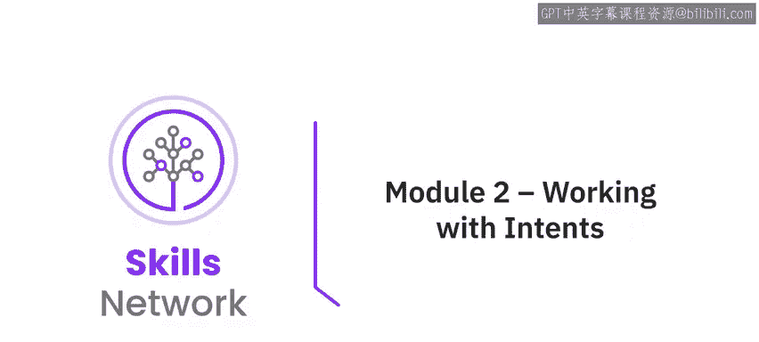

在本节课中，我们将学习聊天机器人的核心组件之一：**意图**。我们将探讨意图的概念、作用，以及如何在IBM Watson Assistant中创建和训练意图，使机器人能够理解用户的目标。

---

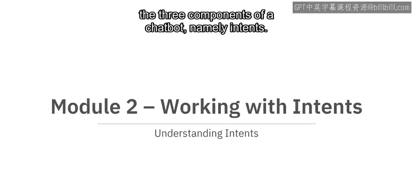

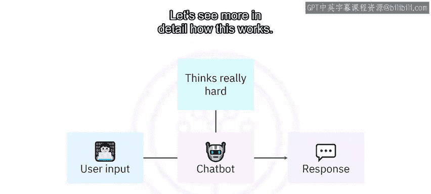

## 聊天机器人的工作原理 🤖

上一节我们介绍了聊天机器人的整体概念，本节中我们来看看其内部如何工作。

从概念上讲，聊天机器人的工作流程如下：用户输入一些文本，聊天机器人进行“思考”，然后向用户发出响应。这是一个非常宏观的描述，接下来让我们深入了解其背后的机制。

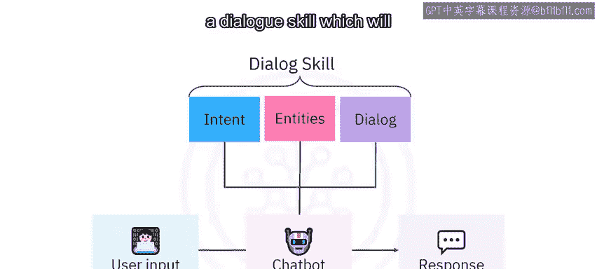

聊天机器人主要使用三个组件来确定如何解释用户输入并作出响应：
1.  **意图**（本模块的主题）
2.  **实体**（我们将在下一个模块中介绍）
3.  **对话**（将在第4模块中介绍）

在Watson Assistant中创建聊天机器人时，首先要创建一个包含这三个组件的**对话技能**。其中，意图是最重要的组件，因为它试图确定用户想要什么。

---

## 什么是意图？ 🎯

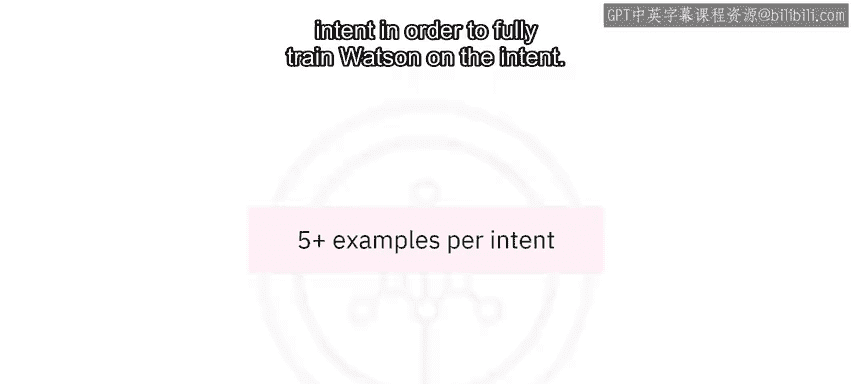

意图旨在捕捉用户的**意图或目标**。换句话说，它试图回答“用户在问什么？”这个问题。

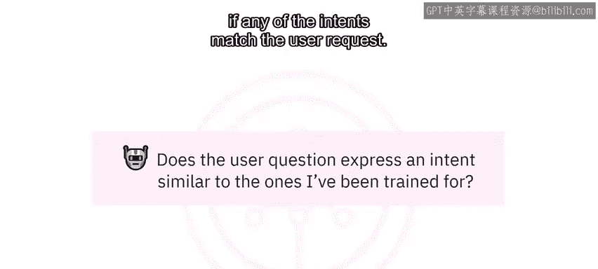

例如，我们可以定义一个“问候”意图，并用一些问候语的例子来训练Watson。以下是训练示例：
*   hello
*   hey
*   hi
*   good morning
*   Kiora（来自新西兰朋友的问候）

为了充分训练Watson理解一个意图，最佳实践是**为每个意图提供至少五个示例**，当然，示例越多越好。一旦Watson在我们定义的意图上完成训练，它就会查看用户输入，并尝试判断是否有任何意图与用户的请求匹配。

例如，如果用户说“Aloha”，Watson会识别出这是一种问候，类似于我们训练过的示例。请注意，“Aloha”并不是我们提供的例子之一。这正是Watson人工智能能力的体现：我们提供一些示例，Watson就能够识别用户话语中的意图，即使用户的表达方式与我们提供的示例大不相同。

---

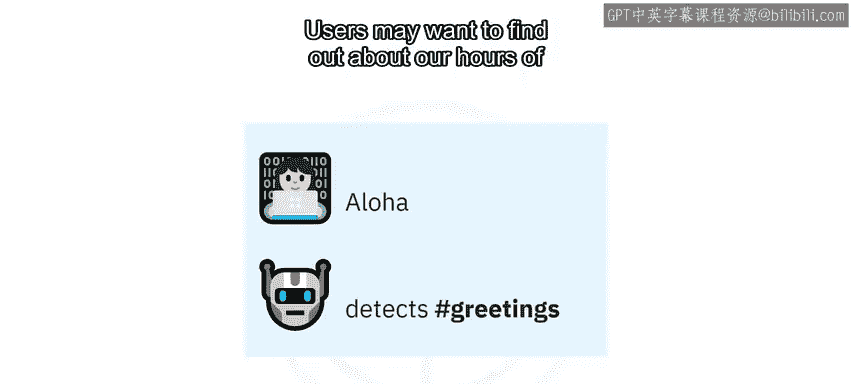

## 特定领域的意图示例 🌸

正如上一模块提到的，在本课程中，我们将为一个虚构的花店连锁品牌创建一个简单的聊天机器人。因此，让我们考虑一个特定领域的意图，而不是简单的闲聊意图。

用户可能想了解我们的营业时间，因此我们可以定义一个 `#hours_info` 意图（注意：意图名称不能包含空格，所以我们用下划线代替）。

以下是我们可以提供来训练Watson理解 `#hours_info` 意图的一些示例：
*   What time are you open until?
*   What are your hours of operation?
*   Are you open on Saturdays?

这些都是用户表达“询问营业时间”这一相同请求的现实方式。用现实的例子训练Watson非常重要，甚至应该保留你在输入示例时可能不小心打出的错别字。毕竟，如果你会犯这种错误，你的用户也可能犯。

现在，当用户问“When is your Toronto store open?”时，Watson将识别出我们的 `#hours_info` 意图。再次强调，这种特定的措辞并不是我们示例的一部分，但Watson足够智能，能够推断出用户想要什么，因为它已经理解了 `#hours_info` 所代表的含义。

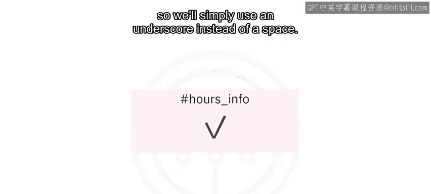

---

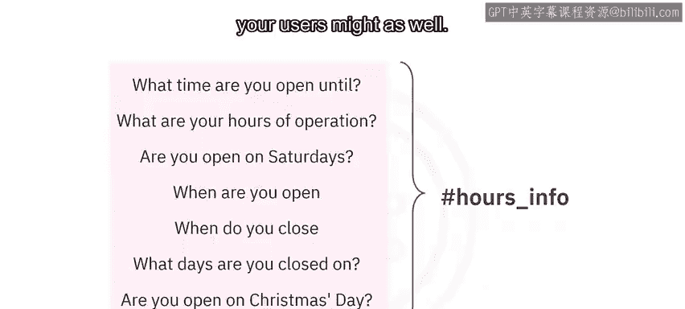

## 创建与导入意图 📥

在Watson Assistant中，意图示例可以手动输入，也可以从CSV文件导入。这简化了协作流程。例如，你可以从客户关怀团队的同事那里接收示例，即使他们对构建聊天机器人一无所知，也能帮助你。

Watson Assistant还附带一个**内容目录**，提供了与银行、保险、电子商务等各种行业相关的意图集合。这并非一个现成的聊天机器人，但你可以将其作为起点进行构建。

值得注意的是，本课程我们将用英语构建聊天机器人，但Watson Assistant也支持多种其他语言。如果你想用意大利语或日语创建聊天机器人，只需用该语言创建一个对话技能，然后用同一语言的相关示例训练Watson即可。

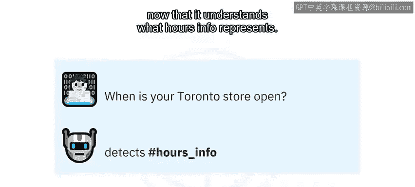

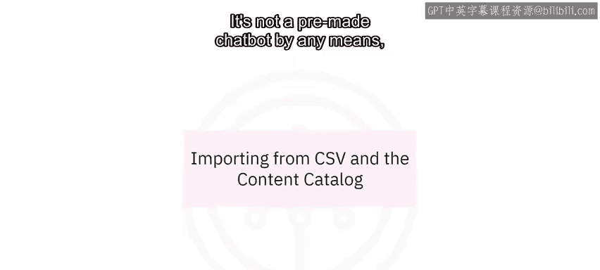

---

## 总结与后续 🚀

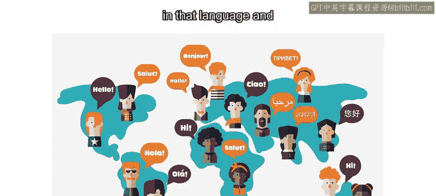

以上就是关于意图的理论部分。在本节课中，我们一起学习了：
*   **意图**是聊天机器人理解用户目标的核心组件。
*   通过提供多样化的现实示例来训练意图，Watson能够智能地识别出未在示例中出现的用户表达。
*   意图可以通过手动或导入CSV文件的方式创建，并可以利用行业内容目录作为起点。
*   Watson Assistant支持多语言意图训练。

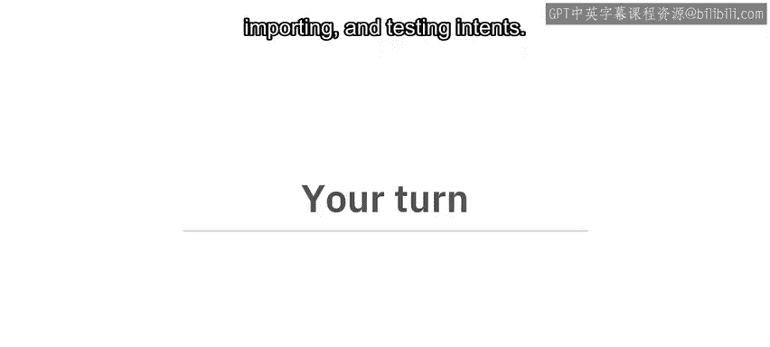

在接下来的实践环节，你将通过实验指导，完成创建、导入和测试意图的全过程。