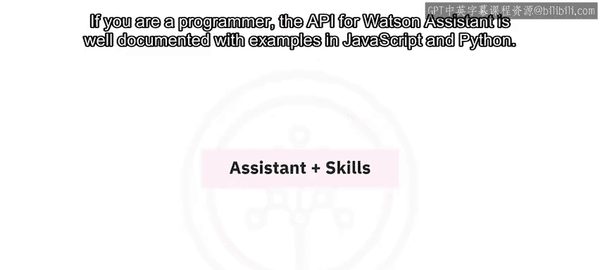
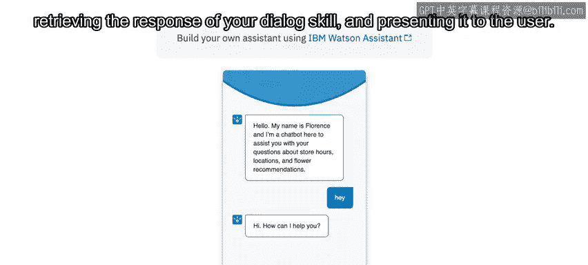
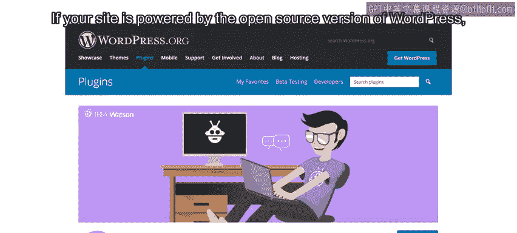
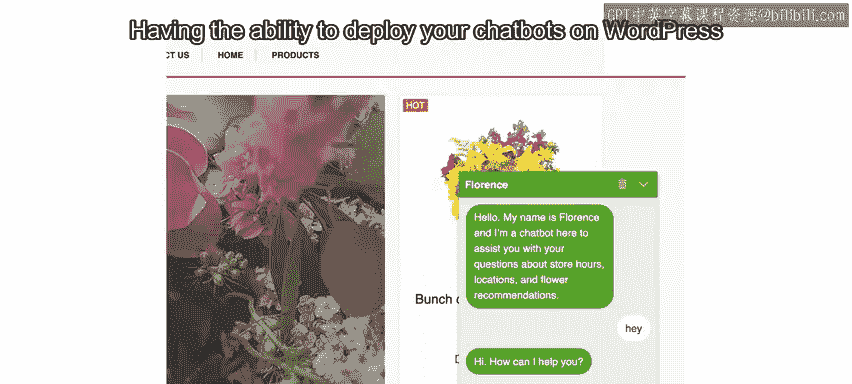

# 058：部署WordPress站点 🚀

在本节课中，我们将学习如何将已创建的聊天机器人部署到一个公开可访问的平台上，特别是WordPress网站。我们将了解“助手”的概念，并学习如何通过一个便捷的插件，无需编写代码即可将机器人集成到网站中。

---

在之前的模块中，我们创建了一个基础但功能完整的对话技能。目前的问题是，这个聊天机器人只能在你登录后的“试用”面板中使用。如果你希望与朋友或最终用户分享，目前还无法实现，除非你提供登录信息，但这绝不是一个好做法。我们需要做的是将聊天机器人部署到一个公开可访问的地方。

上一节我们介绍了对话技能的开发，本节中我们来看看如何将其包装并发布。

当你在开发对话技能时，可能已经注意到，在“技能”标签旁边还有一个“助手”标签。一个助手就是一个聊天机器人，它可以包含一个或多个技能。我们已经开发了一个对话技能，使聊天机器人能够理解并回复用户。现在，我们需要创建实际的助手，并将我们的对话技能链接到它。这样做将使我们的聊天机器人能够通过各种渠道部署，包括WordPress网站、Facebook Messenger、Intercom、Slack以及你自己的应用程序等。

以下是创建和部署助手的关键步骤：
1.  **创建助手**：在Watson Assistant界面中，创建一个新的助手。
2.  **关联技能**：将之前开发的对话技能添加到这个助手中。
3.  **获取凭证**：助手创建后，你需要获取其唯一的身份凭证（如`assistant_id`和`api_key`）。
4.  **配置部署渠道**：选择你希望机器人出现的渠道，例如“预览链接”或“WordPress”。



对于更高级的部署（如集成到你自己的Web或移动应用程序），需要一些编程技能。但幸运的是，在本课程中，我们将无需编写任何代码即可完成部署。如果你是程序员，Watson Assistant的API文档完善，并提供了JavaScript和Python的示例代码。

```javascript
// 示例：使用Watson Assistant API发送消息
const assistant = new WatsonAssistantV2({
  version: '2021-06-14',
  authenticator: new IamAuthenticator({ apikey: '<your_api_key>' }),
  serviceUrl: '<your_service_url>'
});
```



---

创建助手时，系统会提供启用“预览链接”的选项。启用它是一个好主意，因为它会生成一个页面，任何拥有该链接的人都可以试用你的聊天机器人。这是让同事、朋友甚至客户在网页上测试机器人的绝佳方式。这个小部件的工作原理是：将用户输入发送到你创建的Watson Assistant服务，获取对话技能的回复，并将其呈现给用户。

上一节我们了解了助手的概念，本节中我们来看看如何利用预览链接进行快速分享。

---

如果你的网站由开源版WordPress驱动，那么借助我们开发的一个插件，你可以极大地简化聊天机器人的部署过程。你只需一键安装插件，从助手中复制凭证，你的聊天机器人就会神奇地出现在你的网站上。WordPress极其流行，约占全球网站的三分之一。能够在WordPress上部署聊天机器人，极大地简化了向广大公众提供聊天机器人的过程。






以下是该插件的主要优势：
*   **一键安装**：简化部署流程。
*   **高度可定制**：允许你自定义聊天机器人窗口的外观和感觉。
*   **功能强大**：包含许多强大功能，例如对对话评分、限制聊天机器人可进行的对话数量（以免超出每月的免费额度）。
*   **防止滥用**：可以防止滥用用户通过垃圾信息耗尽你的配额。
*   **人工接管**：能够将请求升级给真人处理。
*   **对话记录**：记录对话内容等。

安装插件后，花些时间研究其功能是值得的。


---

在本模块的实验环节，你将生成一个测试用的WordPress站点，因此你不需要拥有自己的WordPress网站。另外请注意，WordPress.com是位于WordPress.org的开源WordPress软件的商业版本。因此，他们实际上会收取相当高的费用才允许用户安装插件，所以我不建议你创建WordPress.com账户并尝试在那里安装我们的Watson Assistant插件。相反，至少在你学习期间，应该使用实验中提供给你的站点。

一旦生成了WordPress测试站点，你的任务将是激活并配置插件，使其能够与你将创建的助手进行通信。这个助手将反过来链接到你目前一直在开发的对话技能。

当聊天机器人部署到你的WordPress测试站点后，你将能够直接在Watson Assistant中对聊天机器人进行更改，这些更改和改进将自动反映在部署在你站点上的聊天机器人中。

---


本节课中我们一起学习了如何将Watson Assistant聊天机器人部署到公开平台。我们首先理解了“助手”作为机器人容器的角色，然后探索了通过“预览链接”快速分享机器人的方法。最后，我们重点介绍了如何利用专用插件，将机器人无缝集成到WordPress网站中，从而实现无需编码的便捷部署。这使得你的AI机器人能够真正服务于更广泛的用户群体。