# 059：使用上下文变量与插槽 🧠


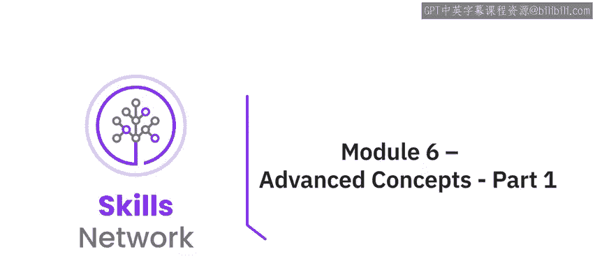

在本节课中，我们将学习如何通过**上下文变量**和**插槽**来提升聊天机器人的智能水平，使其能够记住对话中的关键信息，从而提供更连贯、更个性化的回复。


---

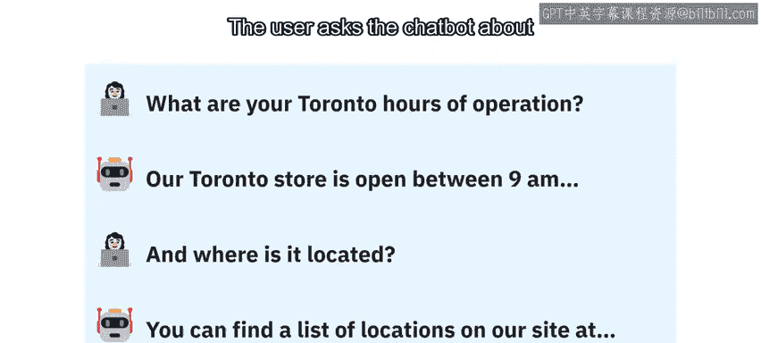

## 概述

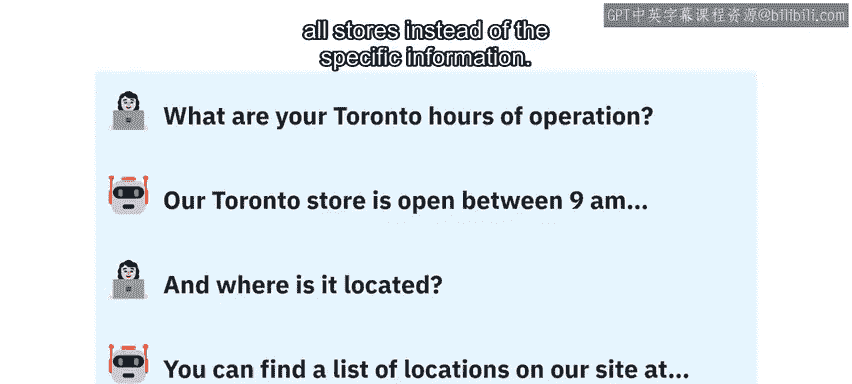

上一节我们介绍了聊天机器人的基础构建与部署。本节中，我们将探讨两个高级功能：**上下文变量**和**插槽**。它们能让你的机器人记住用户提供的信息，并在后续对话中灵活运用，从而显著提升用户体验。

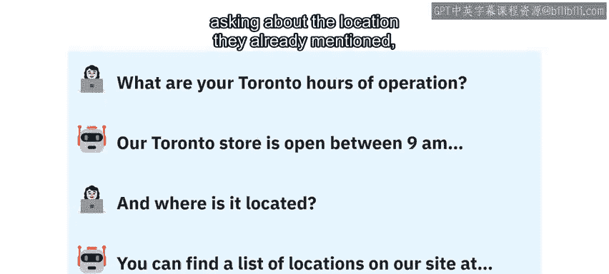

---

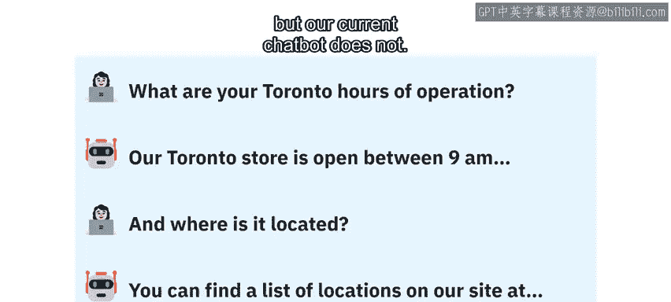

## 理解问题：缺乏记忆的对话

考虑以下交互场景：

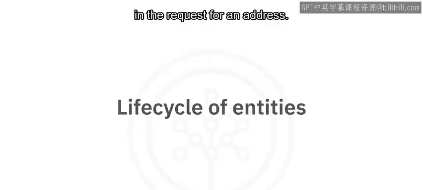

> **用户**：多伦多分店的营业时间是？
> **聊天机器人**：多伦多分店的营业时间是早9点到晚9点。
> **用户**：它的地址是什么？
> **聊天机器人**：这是我们所有分店的地址列表：[通用列表]。


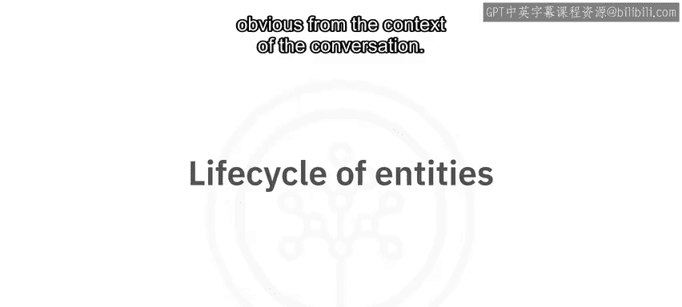

人类客服会从**上下文**中理解，用户询问的是刚才提到的“多伦多”分店的地址。然而，我们当前的聊天机器人却做不到这一点。

**原因**在于，实体（如“多伦多”）仅在当前用户输入时被捕获，一旦用户提出新问题，这些信息就被“遗忘”了。因此，当用户询问地址时，机器人无法回忆起之前提到的“多伦多”。


唯一的解决方式是用户再次明确提及地点，例如：“**多伦多**分店的地址是什么？”。但我们无法控制用户的表达方式，在对话上下文明确时，要求用户重复信息并不现实。

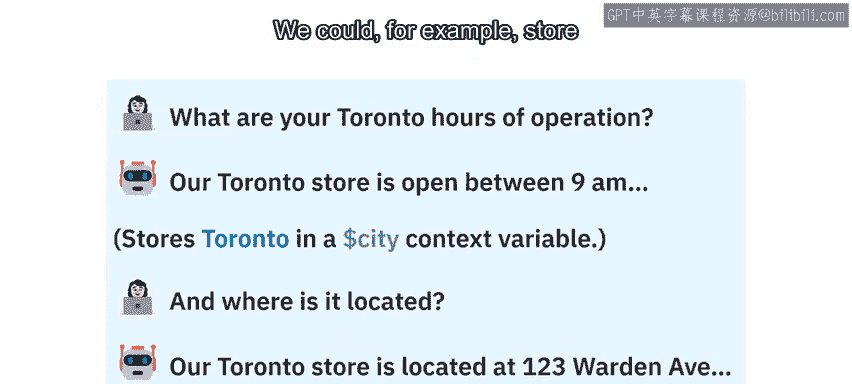

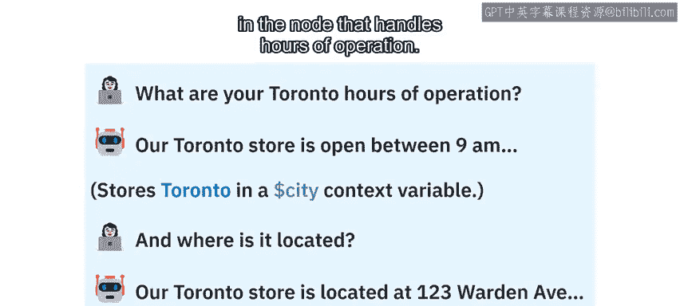

---

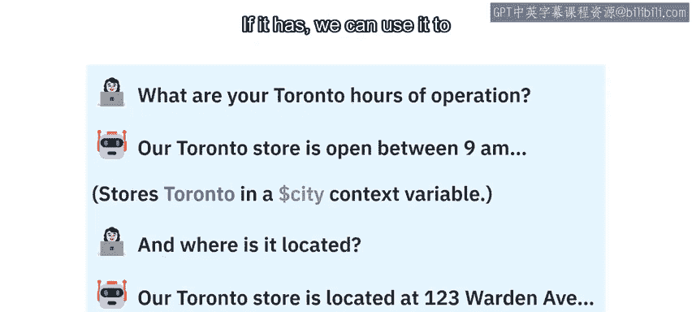

## 解决方案：上下文变量


**上下文变量**正是为了解决这个问题而设计的。它允许我们在对话的任何节点，存储从用户那里收集到的值，并在整个对话期间随时调用。与实体不同，上下文变量在用户会话期间持续有效。

例如，我们可以在处理“营业时间”的节点中，将捕获的`@location`实体值存储到一个名为`$city`的上下文变量中。

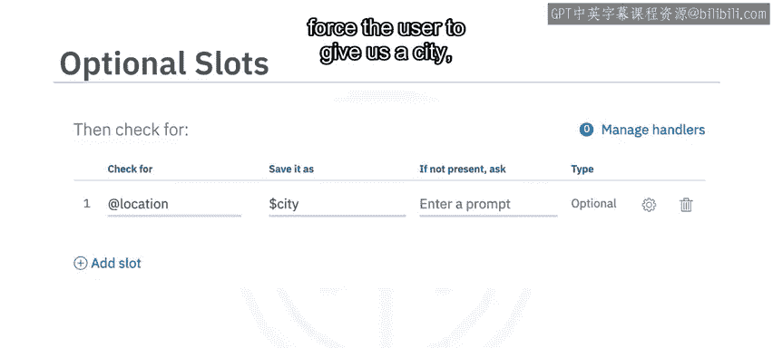

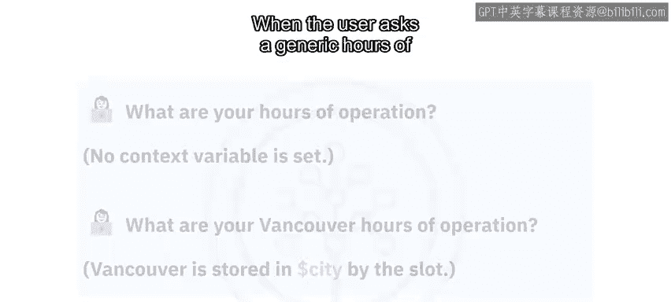

```json
{
  "context": {
    "city": "@location"
  }
}
```

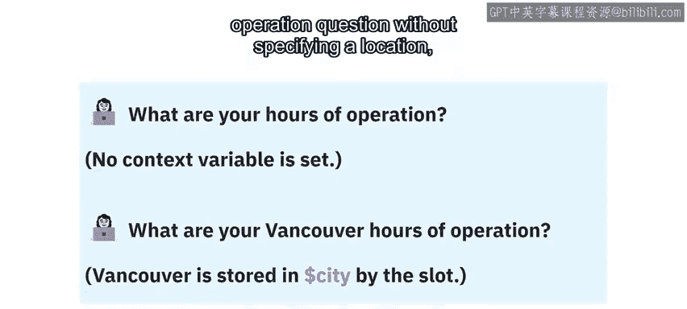

随后，当对话进入“查询地址”的节点时，我们可以检查`$city`变量是否已被赋值。如果已设置，就能用它来提供特定地址，而不是通用列表。

---

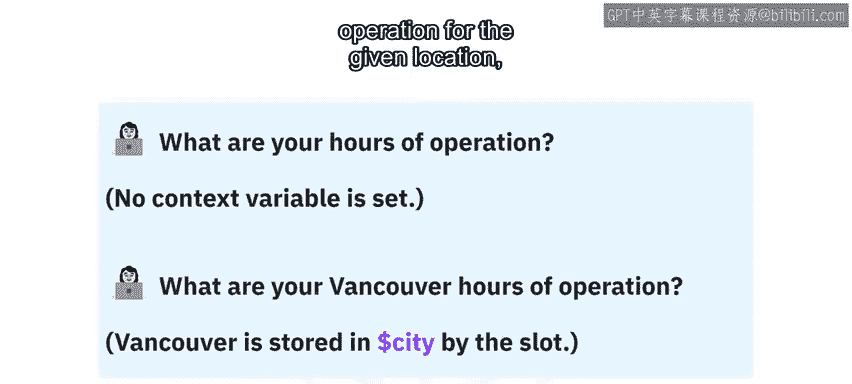

## 实现工具：插槽

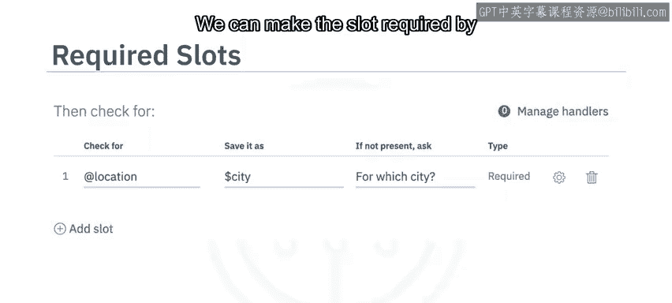

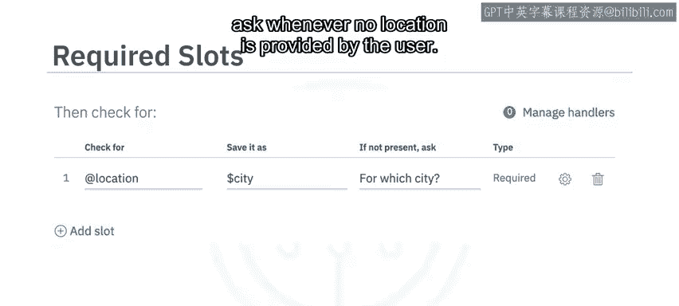

设置上下文变量有多种方法，其中最便捷的方式之一是使用**插槽**。

插槽可以添加到对话节点中，用于检查和存储特定的实体信息。例如，我们可以在“营业时间”节点添加一个**可选**插槽来检查`@location`实体。

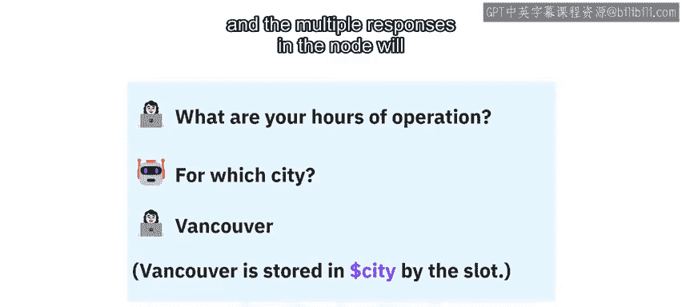

*   **如果用户输入中包含地点**：该值将被自动存储到`$city`上下文变量中。
*   **如果用户输入中未指定地点**：由于插槽是**可选**的，对话会继续，不会强制用户提供。


我们也可以将插槽设置为**必填**。只需在插槽设置中添加一个提示问题（例如：“请问您想查询哪个城市？”）。当用户未提供地点时，机器人会主动询问，直到获得有效回答为止。

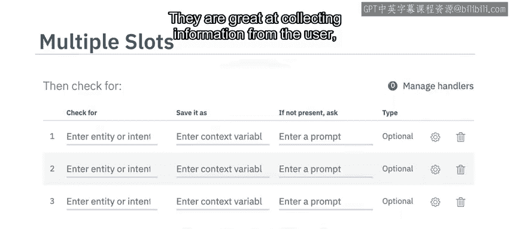

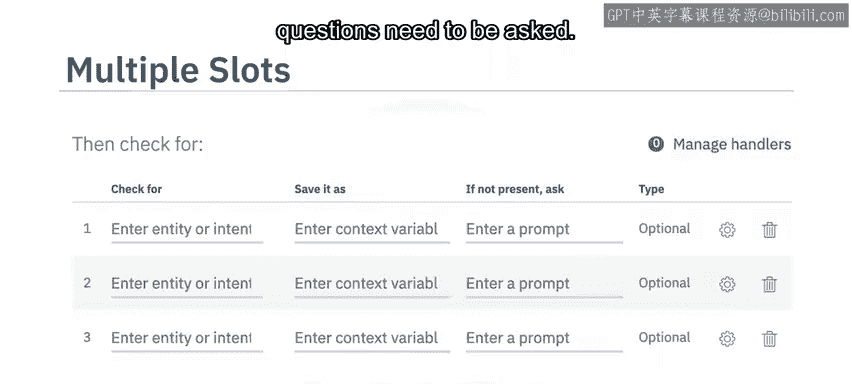

**插槽的核心价值在于可以收集多个信息**。以下是使用多个插槽的典型场景：

假设有一个餐厅预订机器人。在一个预订节点内，可以设置多个插槽来依次询问并存储信息：
1.  第一个插槽：询问并存储`$guest_count`（用餐人数）。
2.  第二个插槽：询问并存储`$reservation_date`（预订日期）。
3.  第三个插槽：询问并存储`$reservation_time`（预订时间）。
4.  第四个插槽：询问并存储`$customer_name`（预订姓名）。

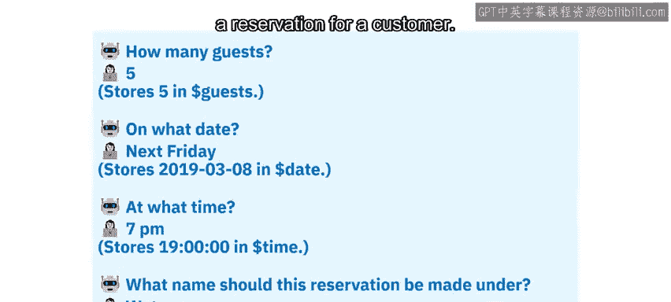

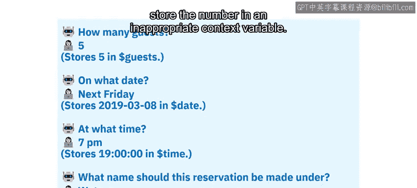

所有信息收集并存入上下文后，餐厅就能获得预订所需的全部数据。这些数据可以用于人工查看日志，或通过编程方式（例如调用API）自动录入到餐厅的订座系统中。

---

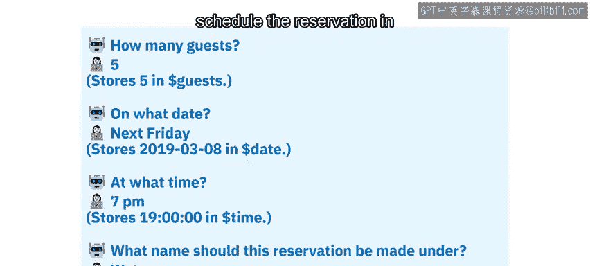

## 总结

本节课我们一起学习了**上下文变量**和**插槽**这两个核心概念。
*   **上下文变量**（如`$city`）为聊天机器人提供了“记忆”能力，使其能在整个对话中记住关键信息。
*   **插槽**是实现信息收集和存储到上下文的高效工具，尤其擅长通过多轮问答获取多个必要信息。


掌握这些概念是构建智能、流畅对话机器人的关键。理论理解是基础，但真正的掌握离不开实践。接下来的实验环节将引导你运用这些技术来改进自己的聊天机器人。