# 060：了解话题转移（Digressions）💬

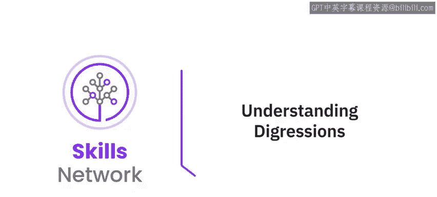

在本节课中，我们将要学习如何让聊天机器人更智能地处理用户的“跑题”问题。我们将探讨如何配置槽位（Slot）的“已找到”和“未找到”响应，并引入“话题转移”这一强大功能，使对话流程更加自然和人性化。

---

## 当前面临的交互问题

上一节我们介绍了上下文变量和槽位的作用。然而，我们仍然面临一个尚未解决的问题。

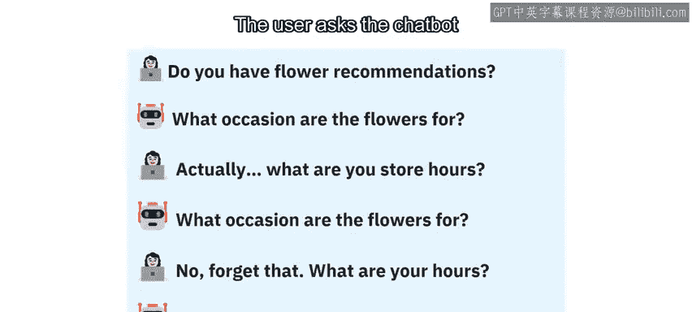

考虑以下交互场景：用户向聊天机器人询问鲜花推荐。

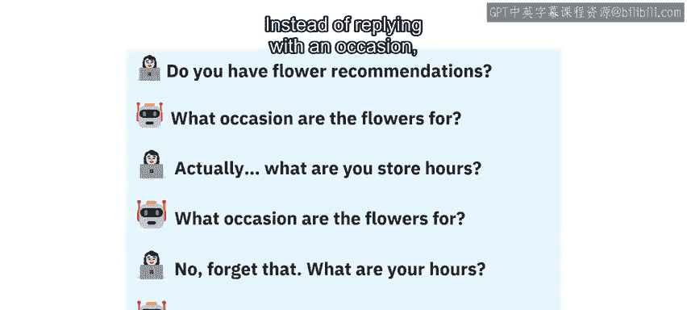

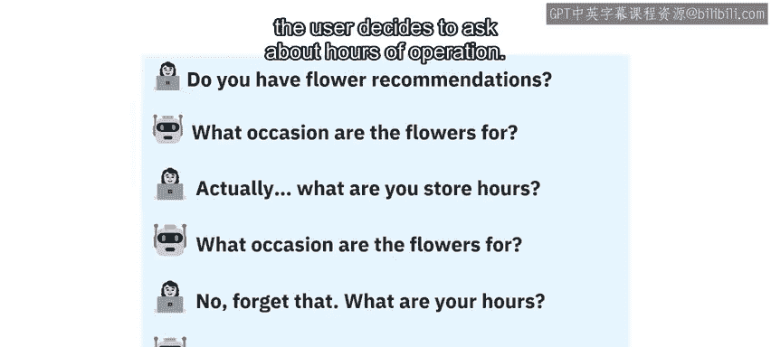

槽位会询问用户是为何种场合需要鲜花。

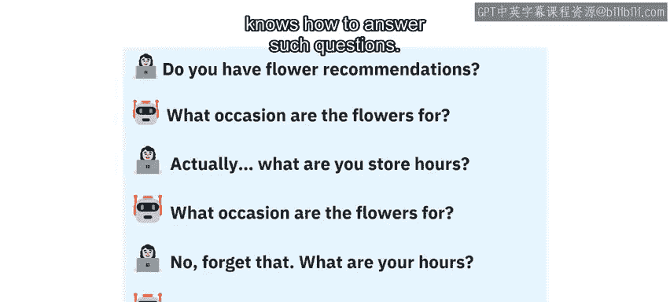

用户没有回答场合，而是决定询问营业时间。

此时，槽位会继续纠缠用户，反复询问场合，并忽略用户提出的其他问题，即使聊天机器人技术上知道如何回答这些问题。

问题的核心在于：**必需的槽位在收到可接受的答案并存入上下文变量之前，不会停止提问。**

---

## 初步优化：配置槽位的“未找到”响应

为了使交互不那么令人反感，我们有一个选择：配置槽位的“未找到”部分。

“已找到”和“未找到”部分允许我们分别指定，当最终用户回复可接受的答案和未回复可接受的答案时，槽位将向用户说什么。

通常，您会使用“已找到”部分来感谢用户回答问题，或者像默认设置一样留空。
然而，更有趣的是，我们可以使用“未找到”部分让再次提问显得不那么尴尬。
换句话说，我们可以通过为不得不再次提问而道歉，来缓和忽略用户第二个问题所带来的生硬感。

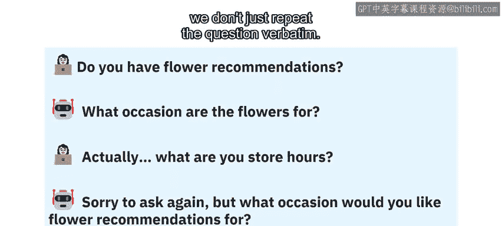

以下是配置槽位“未找到”部分如何使交互更顺畅的一个实际例子。

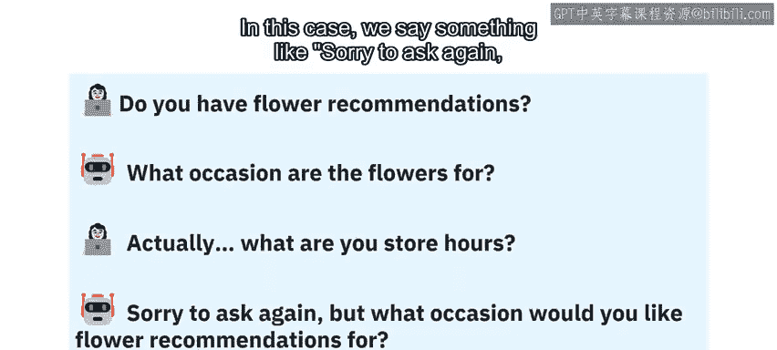

您会注意到，当用户在槽位询问具体场合时提出了一个不相关的问题，我们不会逐字重复问题。
在这种情况下，我们会说：“抱歉再次询问，但您想要为哪种场合推荐鲜花呢？”

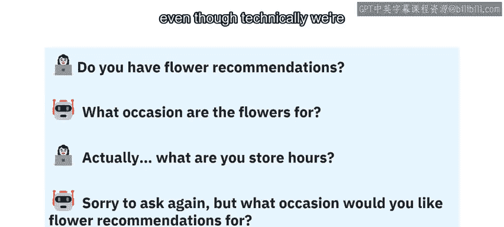

这样显得更有同理心，不那么机械，尽管技术上我们仍在问同一个问题。

这是一个改进，但如果能够先回答用户提出的附带问题，然后再回到原来的问题，岂不是更好？

---

## 引入话题转移（Digressions）

这正是人类客服在大多数情况下会做的事情。

事实证明，这可以通过**话题转移**来实现。
我们可以允许一个槽位在提出强制性问题后，跳转到另一个节点。
我们还可以指定其他节点在回答用户的附带问题后，能够返回到发起转移的原始槽位。

让我们看一个实际例子，了解这是如何工作的。

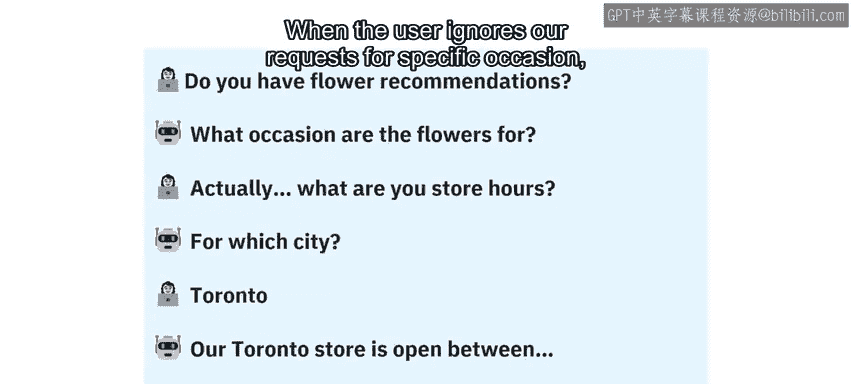

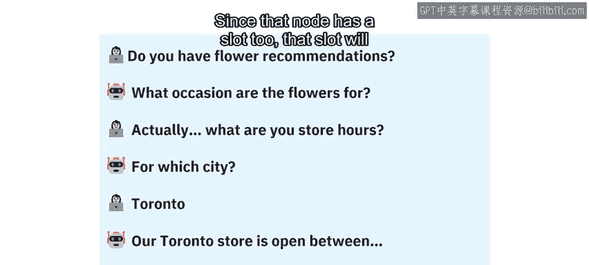

当用户忽略我们对具体场合的请求，转而询问我们的聊天机器人营业时间时，话题转移允许我们跳转到处理营业时间的节点。
由于该节点也有一个槽位，该槽位会询问其自己的问题：“您想查询哪个城市的营业时间？”

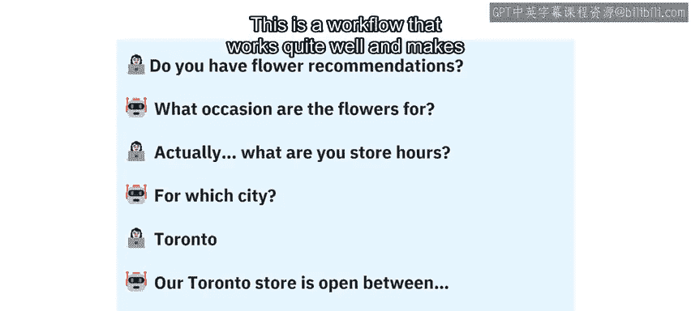

一旦用户回复“多伦多”，该节点将向用户提供信息，并返回到原始节点，在那里槽位将再次询问场合。
这是一个运行良好的工作流程，使我们的聊天机器人显得更聪明、更友好。

在某些情况下，您可能不希望返回，而是希望从跳转到的节点继续对话。
通过话题转移，您将有机会指定所需的行为，包括：
*   哪些槽位可以转移到其他节点。
*   哪些节点可以接受转移。
*   是否需要返回。

这是一个强大且真正有用的功能。

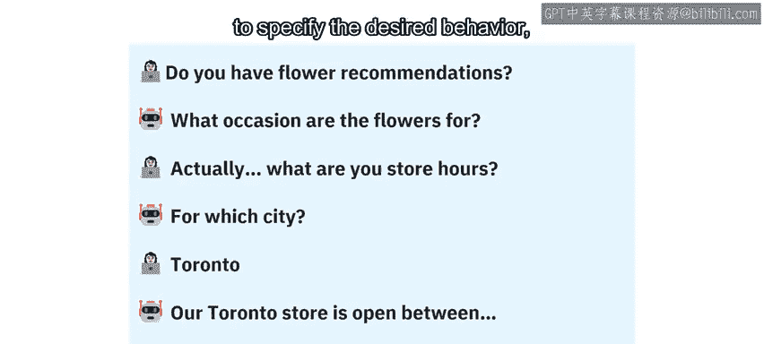

---

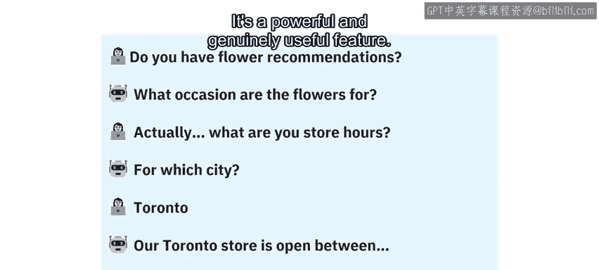

## 配置位置与高级特性说明

那么，我们究竟在哪里指定槽位的“已找到”和“未找到”文本？又在哪里配置话题转移呢？

正如您可能猜到的，具体的细节在本模块的实验部分。您将有机会使用这些新功能，使我们简单的聊天机器人更有用、更用户友好。

请记住，这些功能有些高级。我认识很多人，他们在不理解或不依赖这些功能的情况下也构建了出色的聊天机器人。
尽管如此，对本章和前一章中介绍的高级概念有一个初步的了解，一旦您开始为自己、公司或付费客户构建自己的聊天机器人时，将会带来真正的回报。

---

## 总结

本节课中我们一起学习了如何提升聊天机器人的对话流畅度。我们首先分析了强制槽位在交互中可能造成的僵化问题，然后通过配置“未找到”响应进行了初步优化。最后，我们引入了**话题转移**这一核心功能，它允许聊天机器人智能地处理用户的附带问题，并在回答后优雅地返回原对话流程，从而创造出更自然、更人性化的交互体验。