# 061：IBM应用人工智能（从0开始搭建AI机器人）｜课程总结 🎯

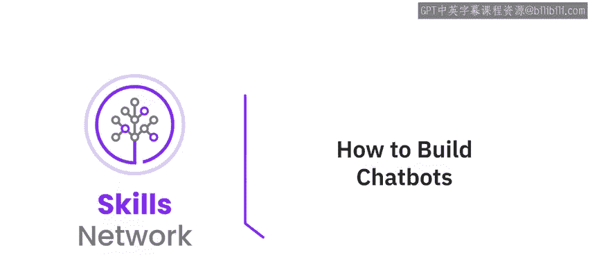

在本节课中，我们将对本课程的核心内容进行回顾与总结，并为你提供后续学习的建议与资源。

---

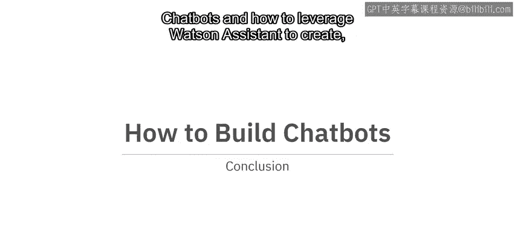

恭喜你完成本课程的学习。希望你享受了学习过程。最重要的是，希望你对自己创建聊天机器人的能力更有信心。

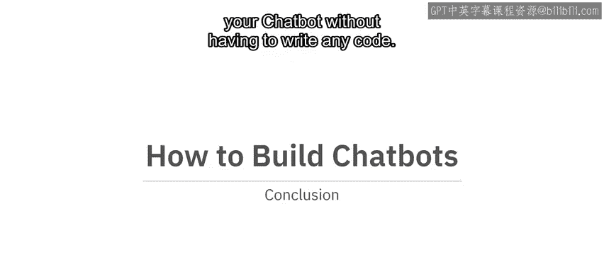

现在，你应该对聊天机器人以及如何利用 **Watson Assistant** 来创建、测试、部署和改进聊天机器人（无需编写任何代码）更加熟悉了。

---

## 后续学习步骤 🚀

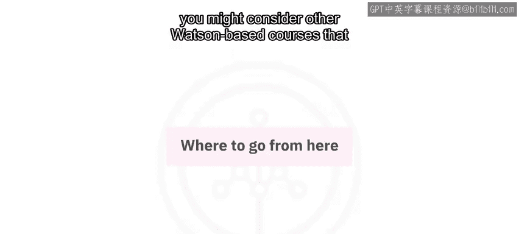

上一节我们回顾了课程的核心收获，本节中我们来看看你接下来可以采取哪些行动。

你可能会思考接下来该做什么，以下是一些可能的后续步骤：

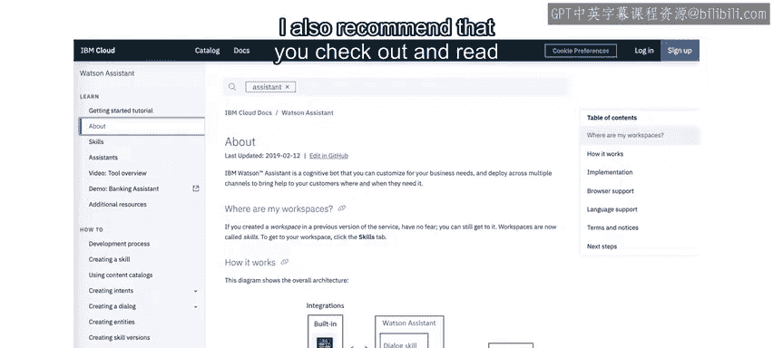

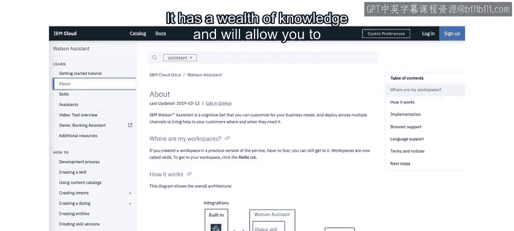

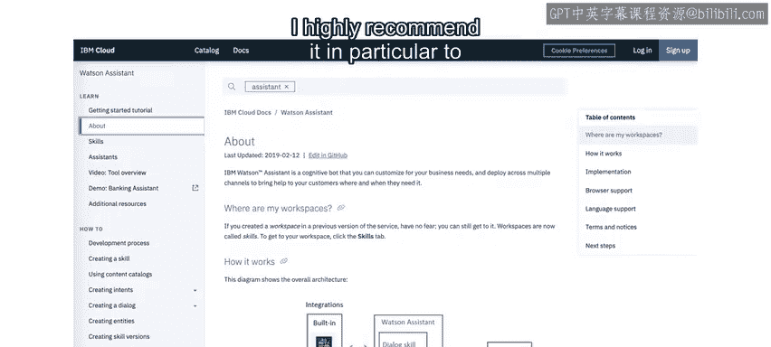

*   **完成课程评估**：如果你尚未完成课程测验和考试，请务必完成。
*   **继续学习路径**：如果你将此课程作为某个学习路径或专业认证的一部分，可以考虑学习其他基于 **Watson** 的课程，以深化你在本课程中掌握的基础知识。

---

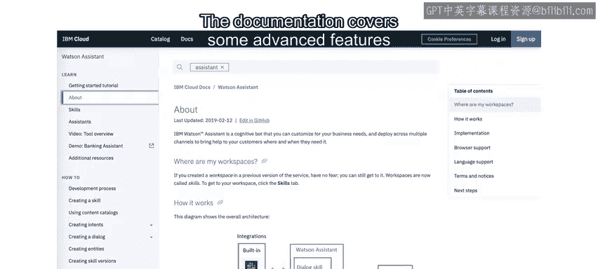

## 深入学习资源 📚

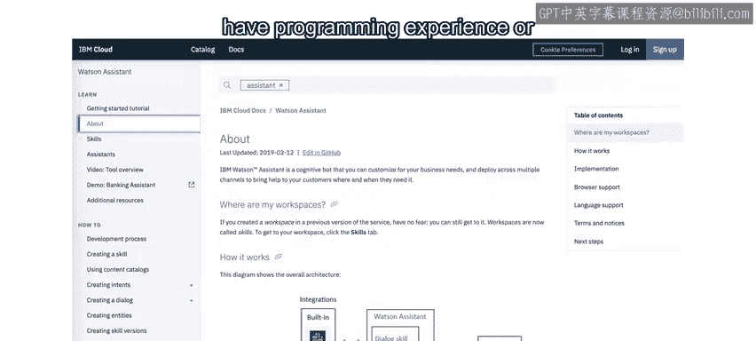

除了完成课程，主动探索官方文档和社区资源是提升技能的关键。

以下是推荐的深入学习资源：

*   **查阅官方文档**：我建议你查看并阅读 **Watson Assistant** 的官方文档。它包含了丰富的知识，能让你了解本课程未涵盖的一些细节。这对于学习了本课程的程序员尤其重要，因为文档涵盖了一些需要编程经验或愿意尝试编程才能使用的高级功能。
*   **探索代码示例**：如果你是程序员，可以访问 **IBM Code Patterns** 网站。在那里，你可以找到与聊天机器人和人工智能等相关的示例代码。许多模式都利用 **Watson Assistant** 以及其他 **Watson** 服务来创建智能且实用的聊天机器人。

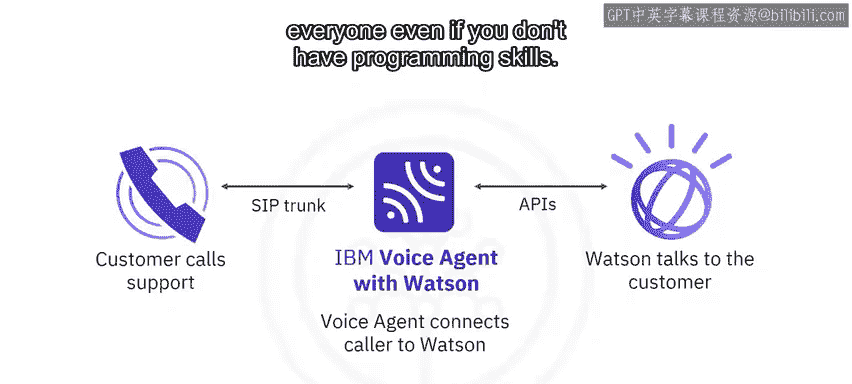

---

## 扩展应用：语音代理 ☎️

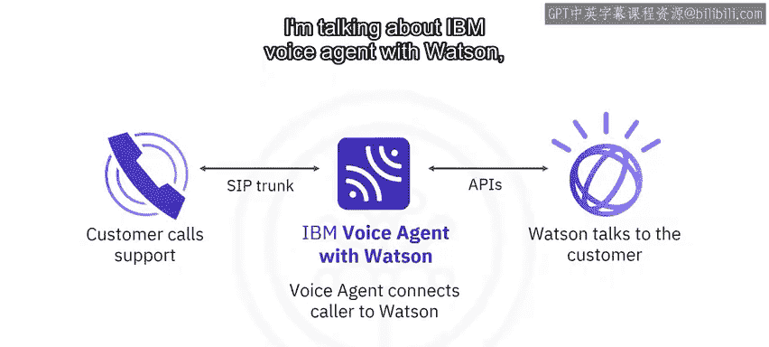

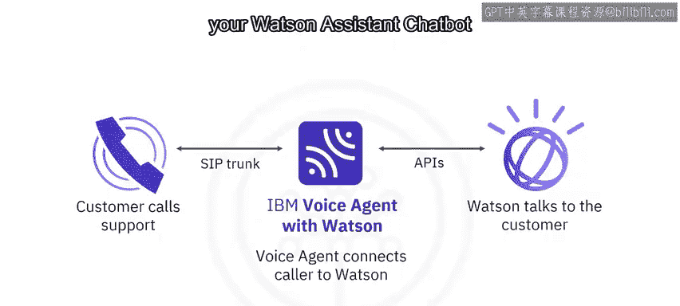

理论学习之后，将知识应用于实际场景能带来更大的价值。其中一个强大的应用是语音交互。

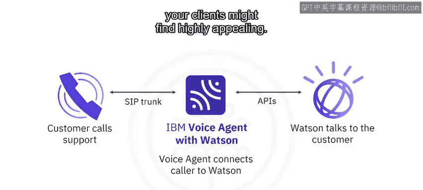

有一种服务实际上对所有人都可用，即使你没有编程技能。我指的是 **IBM Voice Agent with Watson**。这是一个即插即用的服务，可以连接到你的 **Watson Assistant** 聊天机器人，使其能够通过电话提供服务——同一个聊天机器人，只是通过音频而非文本进行交互。你的企业或客户可能会对此非常感兴趣，值得在 **IBM Cloud** 目录中查看。

---

## 实践出真知 💡

在我作为在线学习爱好者的经验中，像这样的课程非常适合概述可能实现的目标以及如何完成特定任务。可以说，我已经为你描绘了蓝图。但除非你花时间亲自创建一些东西，否则你无法真正掌握这些概念。人类倾向于通过实践来学习。

因此，请根据需要反复观看这些视频，适时参考 **Watson Assistant** 文档，查看代码模式示例。但请尝试构思你自己的聊天机器人项目，以磨练和提升你作为聊天机器人构建者的技能。

---

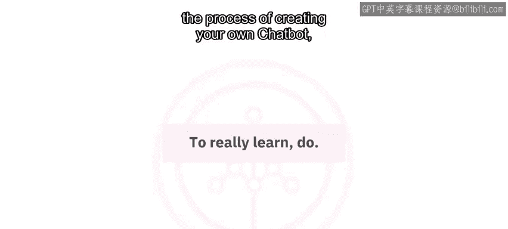

## 交流与分享 🤝

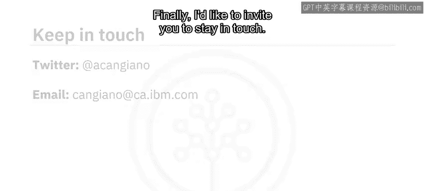

在创建自己的聊天机器人过程中，如果你有任何问题，欢迎在本课程的讨论论坛中提出。

最后，我邀请你保持联系。你可以在 **Twitter** 上关注并与我互动，我的用户名是 `@ACAnGiano`。此外，如果你在学完课程后构建了一些很酷的东西，也欢迎在那里与我分享。如果你不使用 **Twitter** 或希望有更私密的交流环境，也可以通过电子邮件 `canggiiano.ca.ibm.com` 联系我，向我展示你的成果。我们非常乐意展示那些善用我们人工智能技术的人，所以这可能是让你的项目或公司在 **IBM** 网站上获得展示的机会。

我期待看到你的作品。祝你一切顺利，好运！

---

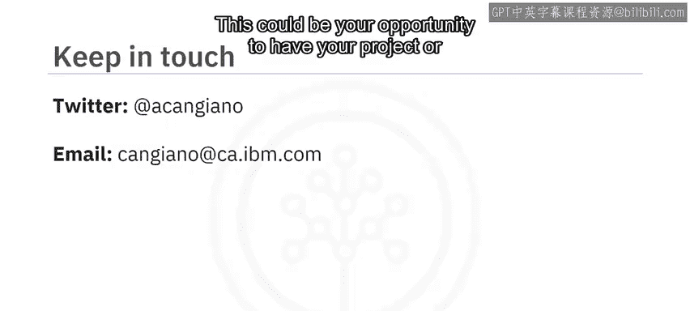

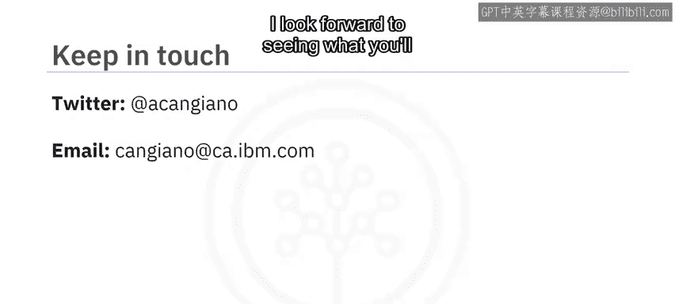

## 课程总结 📝

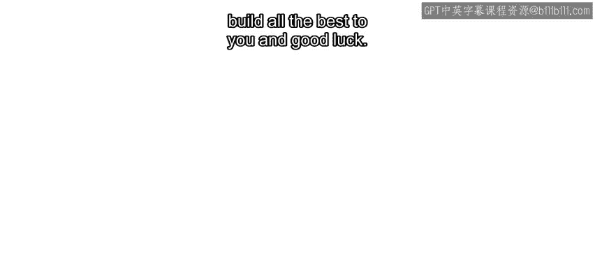

本节课中我们一起学习了如何回顾课程核心知识，并规划了后续的学习路径。我们强调了查阅 **Watson Assistant** 官方文档、探索 **IBM Code Patterns** 以及尝试 **IBM Voice Agent** 等实践的重要性。最重要的是，我们认识到**实践是掌握技能的关键**，鼓励你动手构建自己的聊天机器人项目，并在社区中交流与分享。