# 063：创建Watson操作 🛠️

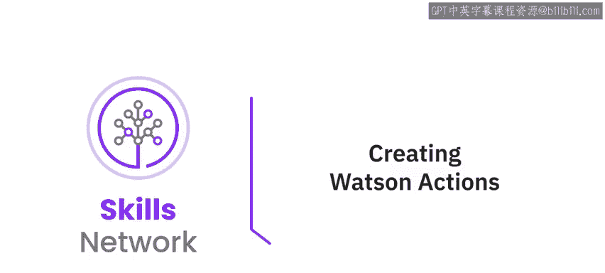

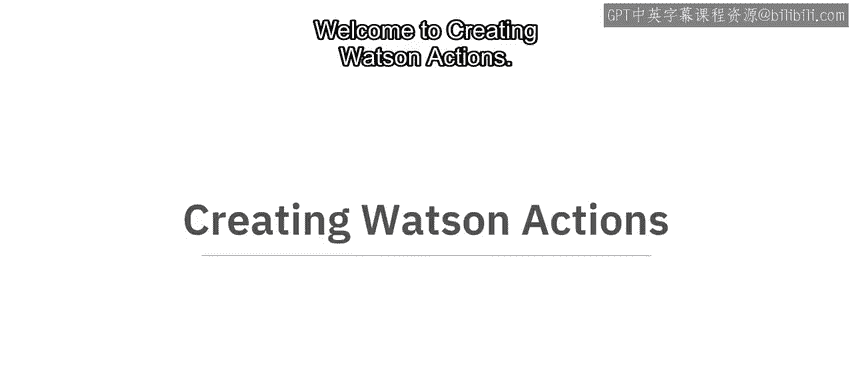

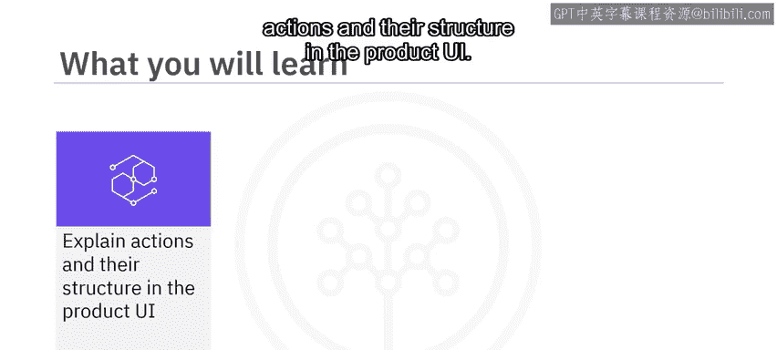

在本节课中，我们将学习如何在IBM Watson Assistant中创建“操作”。我们将了解操作和步骤的基本概念，并通过一个账单支付的实例，一步步构建一个完整的对话流程。课程结束时，你将能够解释操作的结构、构建并测试你的第一个操作。

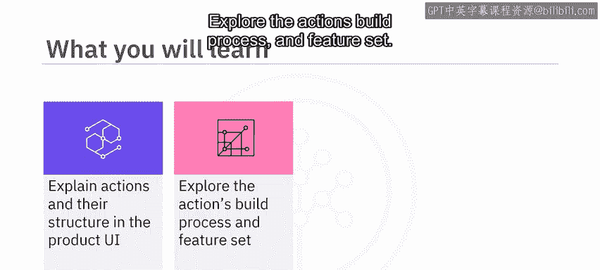

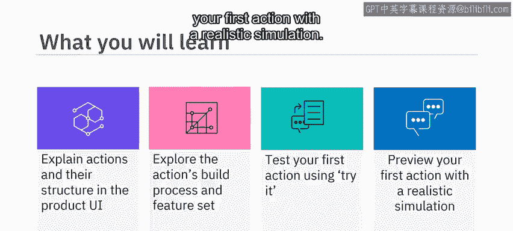

---

## 什么是操作与步骤？ 🤔

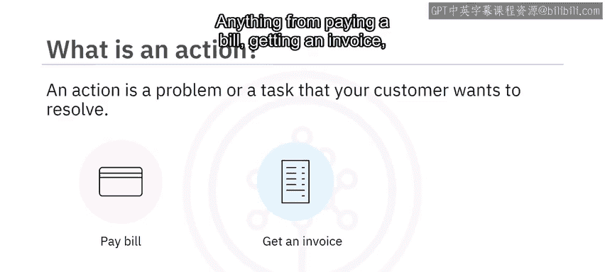

上一节我们介绍了课程目标，本节中我们来看看操作和步骤的核心定义。

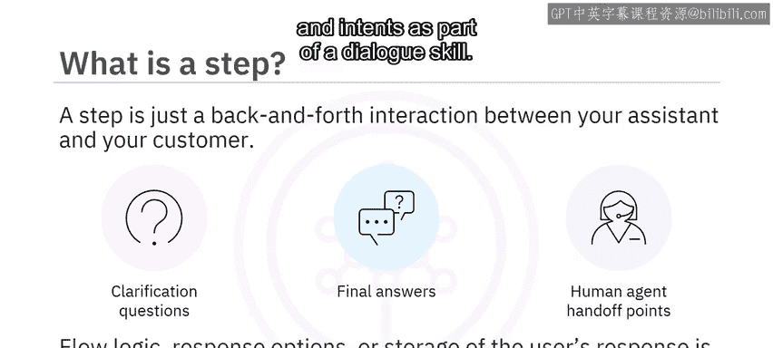

一个**操作**是你的客户希望解决的某个问题或任务。例如，支付账单、获取发票或询问天气，都可以成为你助手中的一个操作。

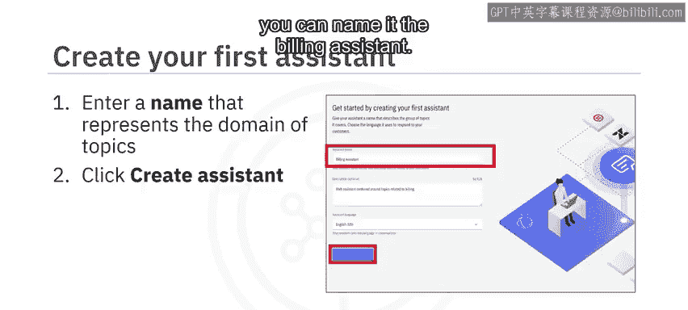

一个**步骤**仅仅是你的助手与客户之间的一次来回交互。简单来说，步骤代表了操作中的澄清问题、最终答案或转接人工客服的节点。

步骤运行所需的其他信息，例如流程逻辑、响应选项或用户响应的存储，都包含在操作自身的结构中。你无需像在对话技能中那样，创建单独的实体和意图。

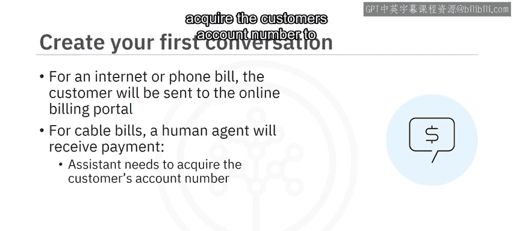

---

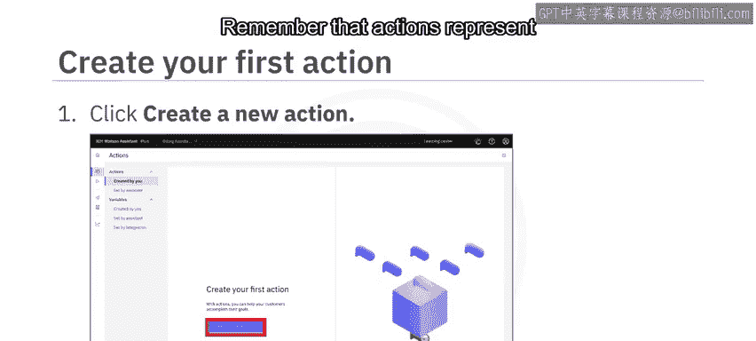

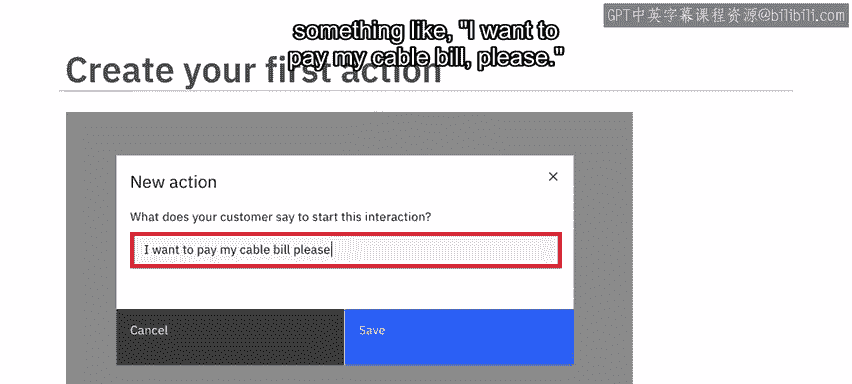

## 创建你的第一个助手 🚀

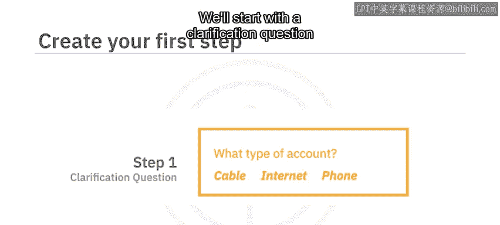

当你首次启动新体验时，系统会提示你创建第一个助手。你需要输入一个代表你希望它处理主题领域的助手名称。

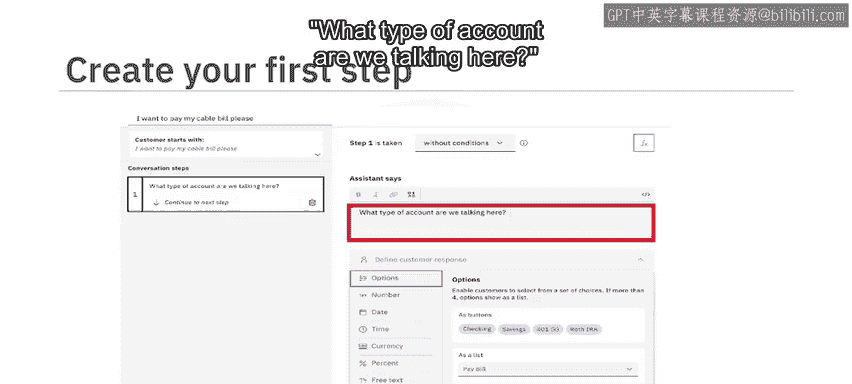

例如，如果你正在构建一个处理账单部门支持问题的助手，可以将其命名为“账单助手”。

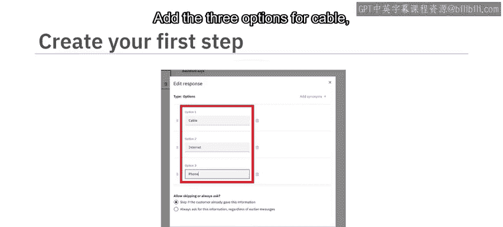

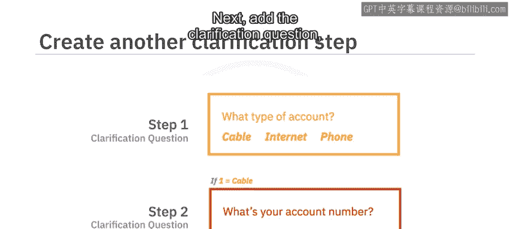

---

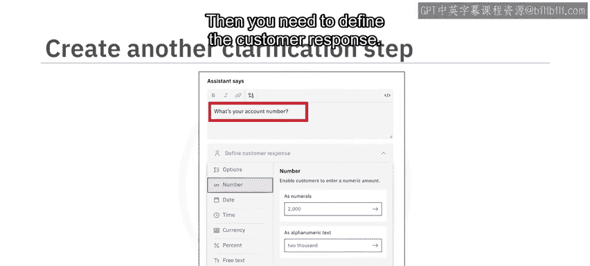

## 构建对话流程：账单支付示例 💳

现在，让我们使用一个账单支付的例子来构建一个对话流程。

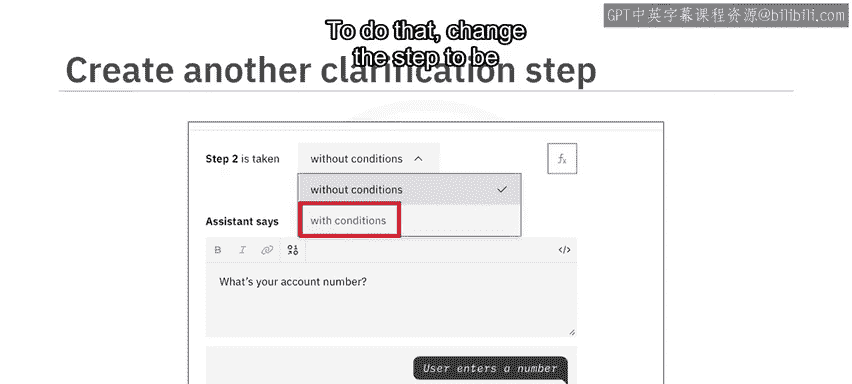

对于互联网或电话账单，客户将被引导至在线账单门户。而对于有线电视账单，我们虚构公司的政策规定将由人工客服接收付款。在这种情况下，助手需要获取客户的账号，以加快与人工客服的交易速度。

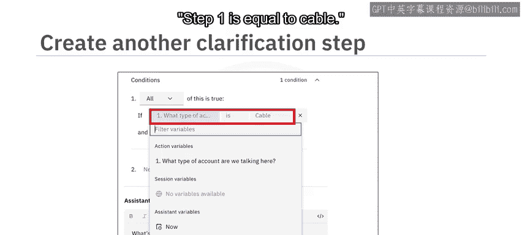

以下是构建此流程的步骤：

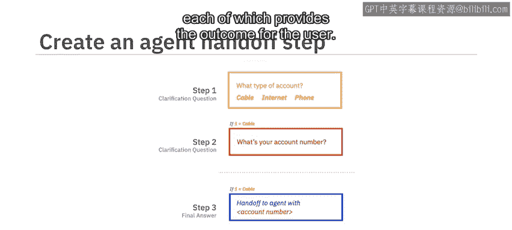

1.  **创建第一个操作**
    首先创建你的第一个操作。记住，操作代表你的助手可以处理的主题，例如“支付账单”。你需要通过提供一些示例句子来训练助手的主题识别人工智能。可以从第一个示例开始，例如：“我想支付我的有线电视账单，谢谢。”

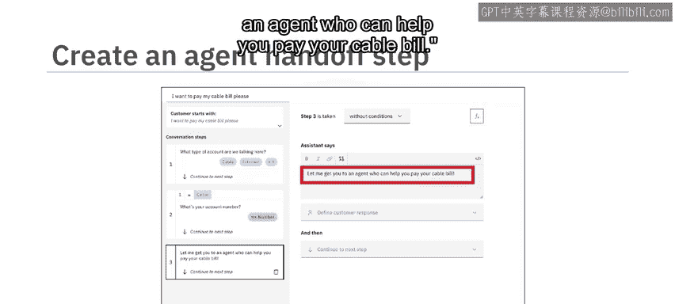

2.  **创建第一个步骤**
    现在是时候在账单支付交互中创建第一个步骤了。我们将从围绕客户账户类型的澄清问题开始。
    *   第一步已为你创建，移动到该步骤，在“助手说”文本框中添加澄清问题，例如：“我们这里说的是哪种类型的账户？”
    *   然后，选择助手应等待的客户响应类型。在这种情况下，“选项”是最佳选择。添加“有线电视”、“互联网”和“电话”三个选项，并应用你的更改。

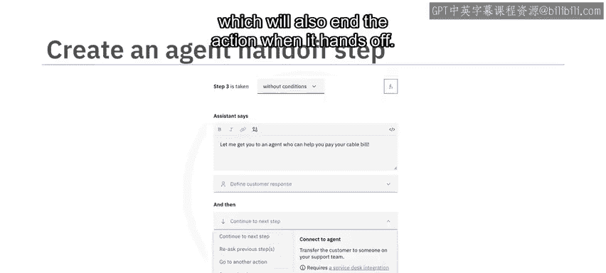

3.  **添加第二个步骤**
    接下来，添加询问账号的澄清问题。例如，输入“你的账号是多少？”。然后，你需要从“响应”下拉列表中定义客户响应，选择“数字”。

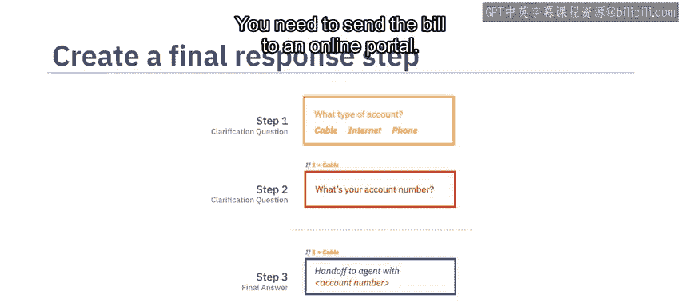

4.  **为步骤添加流程逻辑**
    根据逻辑流程，账号应仅在有线电视账单的情况下被收集。为了处理这个场景，你需要为你的步骤添加一个条件。为此，将步骤更改为“有条件执行”而非“无条件执行”。
    *   条件是步骤被触发必须满足的要求。在这种情况下，你希望将条件设置为第一步的响应等于“有线电视”，而不是“互联网”或“电话”。确保条件设置为 `step1` 等于 `cable`。

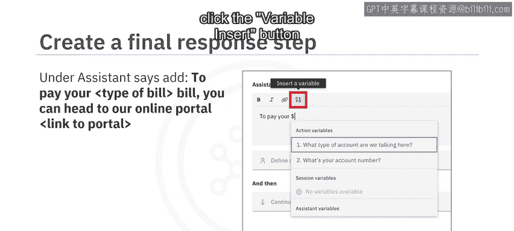

5.  **添加第三步和第四步**
    干得不错！你几乎已经完成了这个操作的构建。现在只需要添加第三步和第四步，它们各自为用户提供一个结果。
    *   **第三步**：在第二步下方添加一些文本，内容关于将用户转接给客服以支付账单。你可以添加：“让我为你转接一位可以帮你支付有线电视账单的客服。”
    *   最后，在客服转接步骤中，你不需要从用户那里收集任何信息，因此可以将“定义客户响应”部分留空。但是，你应该设置助手将此对话路由给人工客服。为此，在“然后”设置下选择“连接到客服”，这也会在转接时结束该操作。
    *   **第四步**：你需要将用户引导至在线门户支付账单。
        *   在“助手说”下添加类似这样的内容：“要支付你的 `{bill_type}` 账单，你可以前往我们的在线门户。” 并附上门户链接。要插入一个变量，如正在支付的账单类型，请点击文本框顶部的变量插入按钮。
        *   现在，确保此步骤仅针对互联网或电话账单触发。为此，创建一个条件 `step1` 等于 `internet`，然后添加另一个条件 `step1` 等于 `phone`。添加条件后，在下拉菜单中选择“任一”。这样，任何一个条件为真即可，而不是所有条件都必须为真。
        *   要结束此操作，点击“然后”设置，更改为“结束操作”。

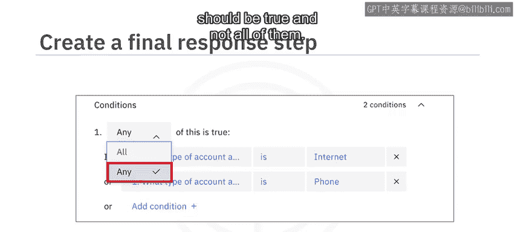

---

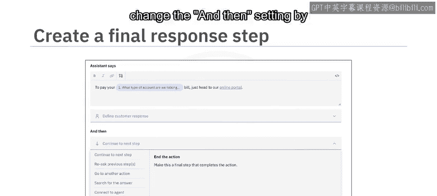

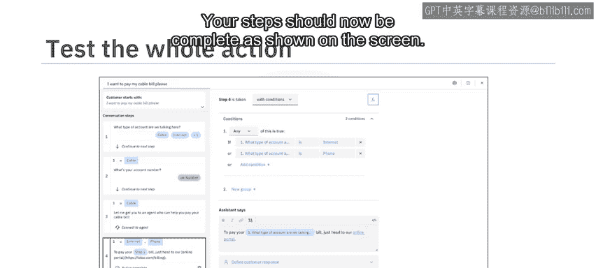

## 测试与预览你的操作 ✅

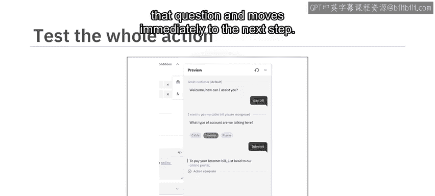

在最后，你应该测试操作以确保其按预期工作。你的步骤现在应该如屏幕上所示那样完整。

尝试几种你直接说明账单类型的场景。注意助手是如何跳过那个问题并立即进入下一步的。

要查看你的助手在某个渠道上的工作效果，请打开预览页面。此页面是你正在进行中的草稿工作的一个展示。它有一个内联预览供你测试。你还可以通过一个可共享的URL与团队中的其他人快速分享你的工作。只需点击按钮将URL复制到剪贴板，然后将其粘贴到任何消息服务中，即可与团队成员分享你的草稿。默认情况下，为你包含了可嵌入的网页聊天集成。你也可以前往集成目录，为你的助手添加任何其他渠道，例如电话集成。

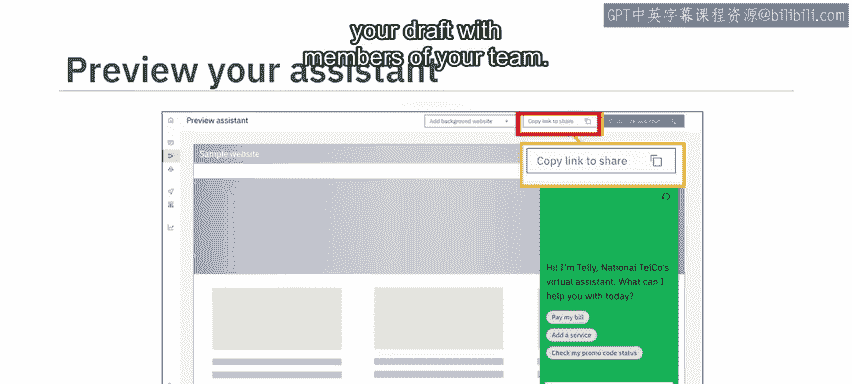

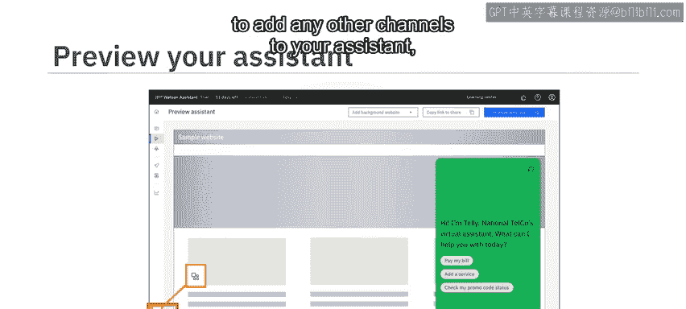

---

## 总结 📝

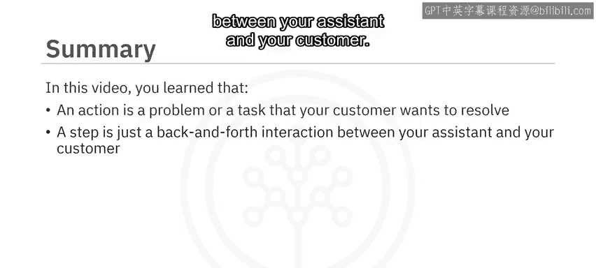

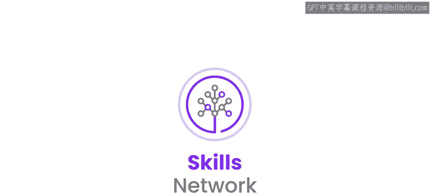

本节课中我们一起学习了：
*   一个**操作**是你的客户希望解决的某个问题或任务。
*   一个**步骤**仅仅是你的助手与客户之间的一次来回交互。
*   步骤运行所需的其他信息，例如流程逻辑、响应选项或用户响应的存储，都包含在操作自身的结构中。
*   你需要通过提供一些示例句子来训练助手的主题识别人工智能。