# 064：将对话技能迁移到Watson操作 🚀

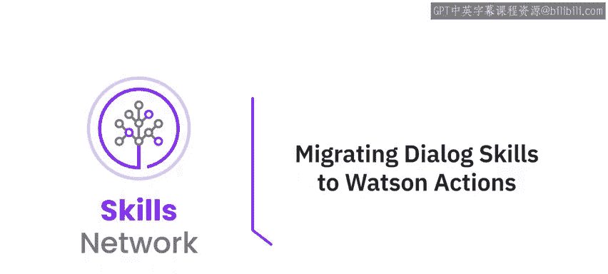

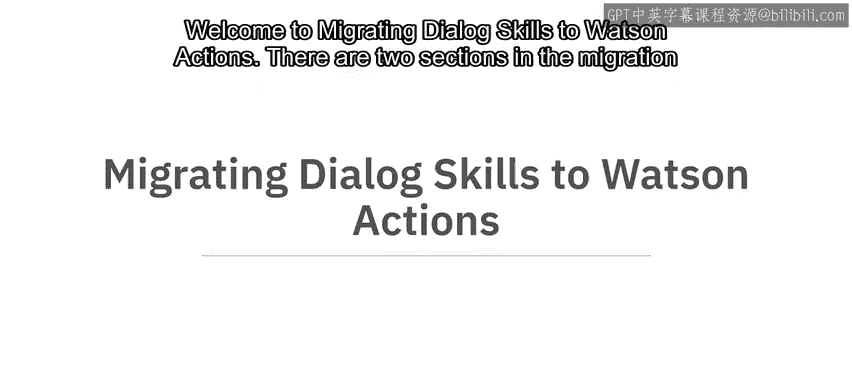

在本节课中，我们将学习如何将经典的Watson Assistant对话技能迁移到新版Watson Assistant中，并了解如何将对话技能转换为操作技能。课程分为两部分：第一部分介绍如何从经典版切换到新版；第二部分详细讲解如何迁移对话技能。

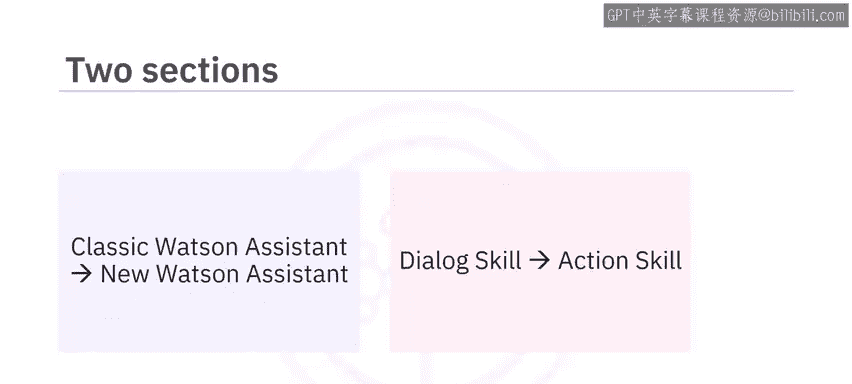

## 从经典版迁移到新版Watson Assistant

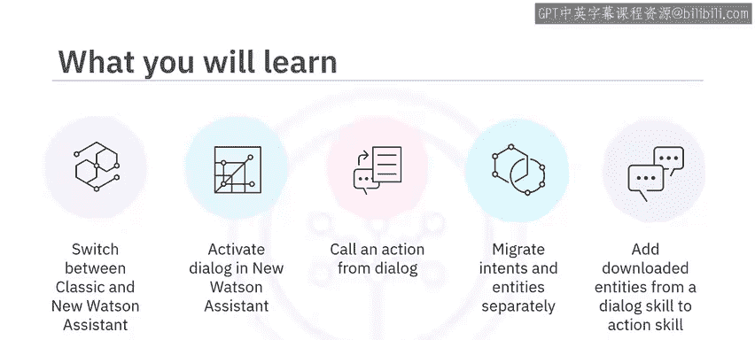

首先，让我们学习如何从经典版Watson Assistant迁移到新版。

要从经典版Watson Assistant迁移到新版，请点击右上角的用户图标。你可以在经典体验和新体验之间进行切换。

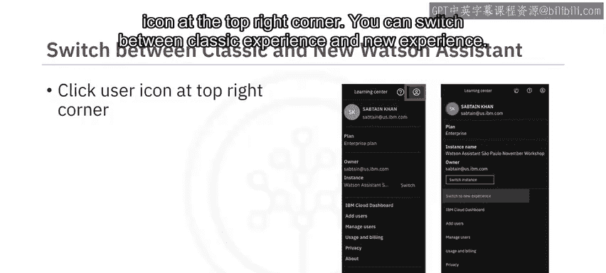

## 在新版中激活并使用对话功能

要使用现有的对话技能，你需要在你的助手（Assistant）中激活对话功能，然后才能上传你现有的技能。

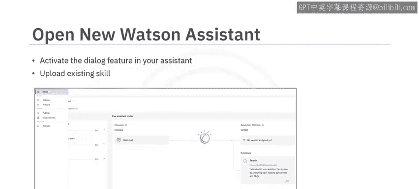

要在新体验中激活对话功能，请创建或打开一个你希望使用对话作为与用户主要交互方式的助手，然后点击“助手设置”。

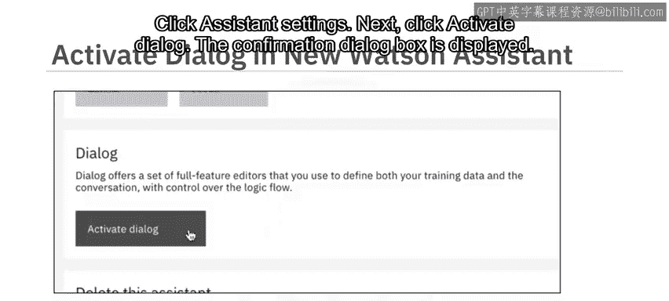

接下来，点击“激活对话”，系统会显示确认对话框，再次点击“激活对话”。一旦你激活了对话功能，它将优先于操作（Actions）功能。

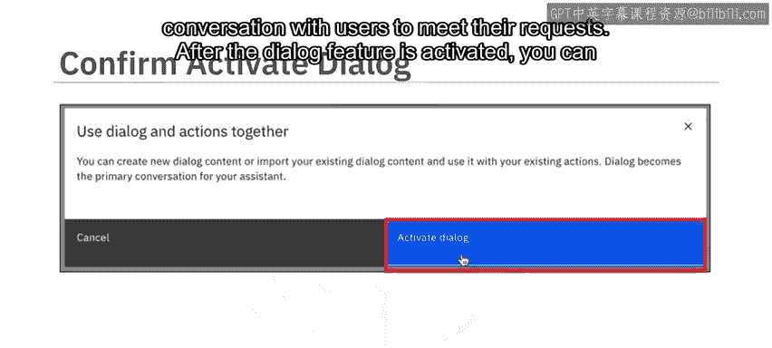

你可以使用操作来补充基于对话的会话，然而，对话将主导与用户的交流以满足他们的请求。

## 迁移现有对话技能

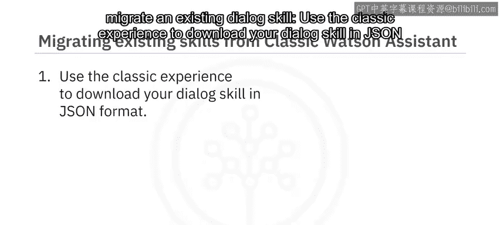

对话功能激活后，你可以开始一个新的对话会话，或将现有的对话迁移到新版Watson Assistant中。

要迁移现有的对话技能，请使用经典体验将你的对话技能以JSON格式下载。在新版Watson Assistant中，打开对话页面，在选项中选择“上传/下载”，在“上传”标签页中，上传你的对话技能的JSON文件。

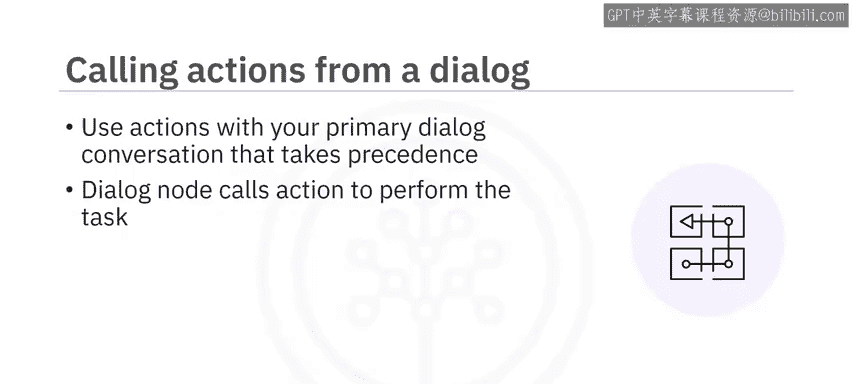

现在，在新版Watson Assistant中，你可以在主要对话会话中使用操作。对话功能优先于操作。一个对话节点可以调用一个操作来执行任务，然后返回到对话。

## 从对话节点调用操作

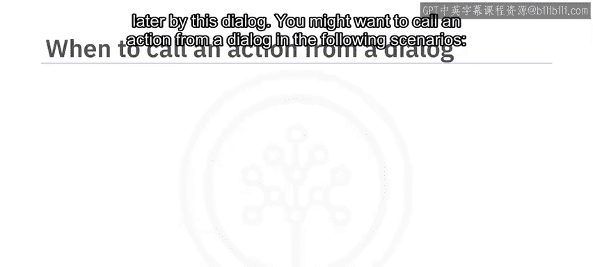

从一个对话节点，你可以调用一个操作来执行一个独立且自包含的任务，然后返回到对话以准备处理任何新的用户请求。在操作处理期间从用户收集的数据必须存储为会话变量，以便传递给对话。

或者，如果你想发送请求到Web服务以完成任务并返回一个可供此对话后续使用的响应，则可以调用Web钩子。

以下是可能需要从对话中调用操作的几种场景。

**以下是几种调用操作的场景：**

*   **从多个对话分支调用同一操作**：例如，你想询问客户对服务的满意度。你可以定义一个检查客户满意度的单一操作，并从多个分支结束的对话节点中调用它。在此场景中，你不需要定义意图（如`#check_satisfaction`），操作会被自动调用，替代跳转到另一个对话节点的响应。
*   **测试操作功能**：在此场景中，你可以为操作选择一个意图来处理。如果你计划仅从对话中调用该操作，你可以将时间花在定义触发该对话节点的意图的用户示例上。当你定义操作时，可以只添加一个客户示例，从而减少构建操作所需的时间。

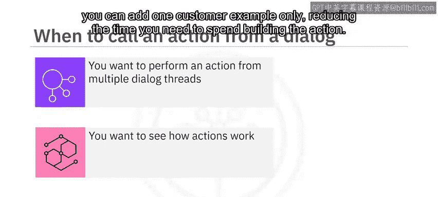

## 如何从对话节点调用操作

要从对话节点调用操作，请点击该对话节点的“自定义”选项。将“调用Web钩子/操作”设置为“开启”。现在，选择“调用操作”。当你添加对操作的调用时，系统会自动为该对话节点启用多个条件响应。点击“应用”，然后在对话节点中选择你想要调用的操作。

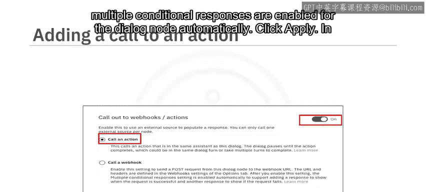

在“然后调用我的操作”部分，选择其中一个操作标题。请注意，你需要先有一个操作，才能选择调用它。

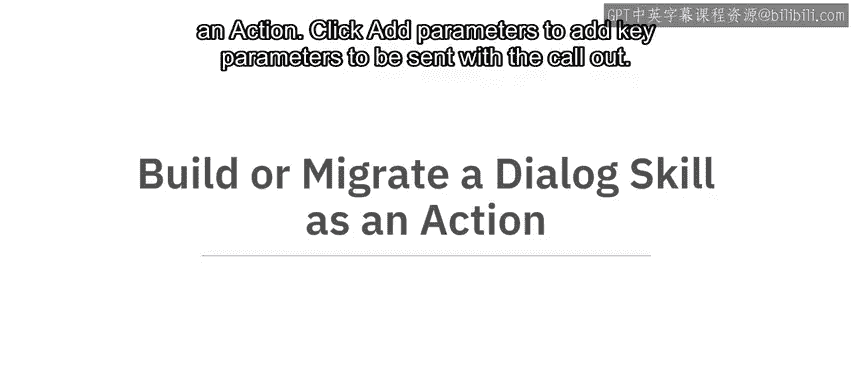

点击“添加参数”以添加随调用一起发送的关键参数。

## 构建或迁移对话技能为操作

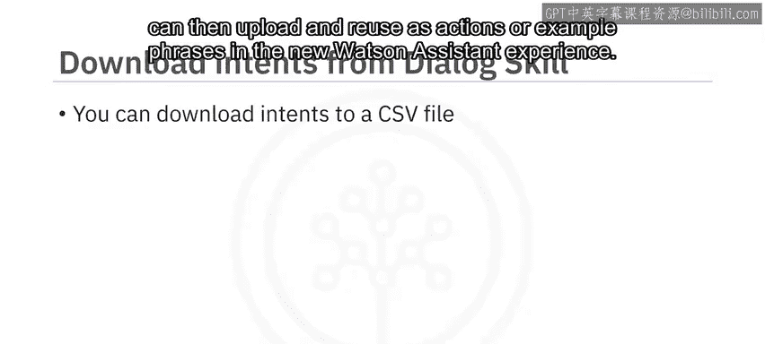

接下来，让我们看看如何将对话技能构建或迁移为操作。

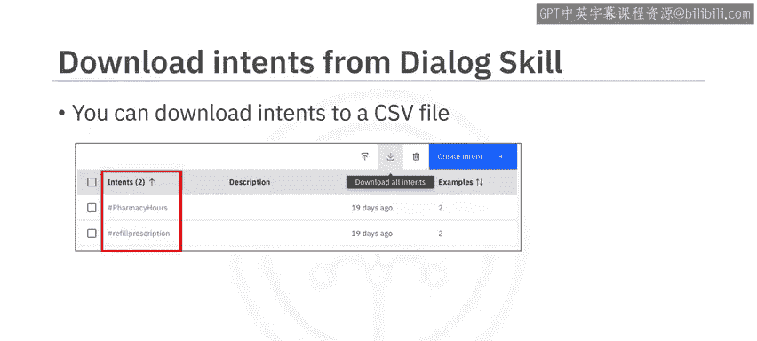

你可以将意图和实体从经典版Watson Assistant体验迁移到新版Watson Assistant体验。

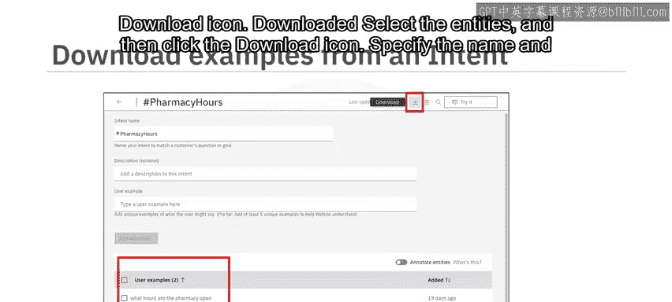

你可以将意图下载为CSV文件，然后在新版Watson Assistant体验中将其作为操作或示例短语上传和重用。

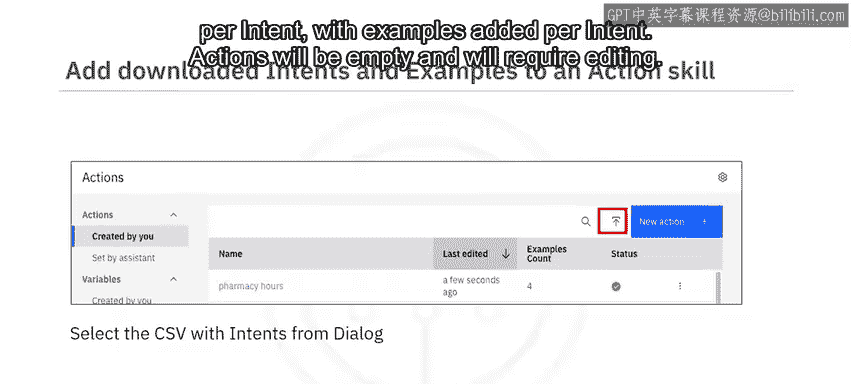

**以下是迁移意图和实体的步骤：**

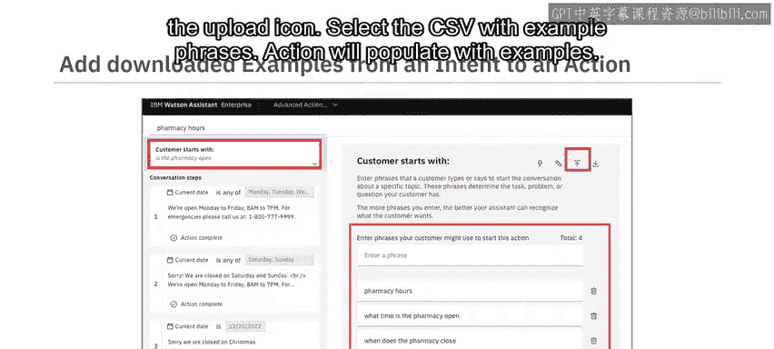

*   **下载意图**：转到意图页面。选择你想要下载的意图，然后点击下载图标。下载的示例将保存在一个CSV文件中。
*   **下载实体**：转到实体页面，选择实体，然后点击下载图标。指定CSV文件的名称和保存位置，然后点击“保存”。
*   **上传意图作为操作**：现在，转到新版Watson Assistant的操作表。点击上传图标。选择包含来自对话的意图的CSV文件。系统将为每个意图创建一个新的操作，并为每个意图添加示例。
*   **上传示例短语到操作**：操作创建后将是空的，需要编辑。现在，转到新版Watson Assistant的操作表，选择一个操作，点击上传图标，选择包含示例短语的CSV文件，操作将填充这些示例。
*   **上传实体作为保存的响应**：现在转到新版Watson Assistant的“保存的响应”表，点击上传图标，选择包含所需实体的CSV文件。该表将用实体作为保存的响应进行填充。

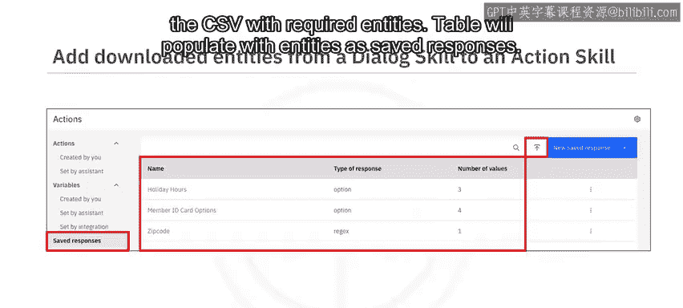

## 迁移注意事项

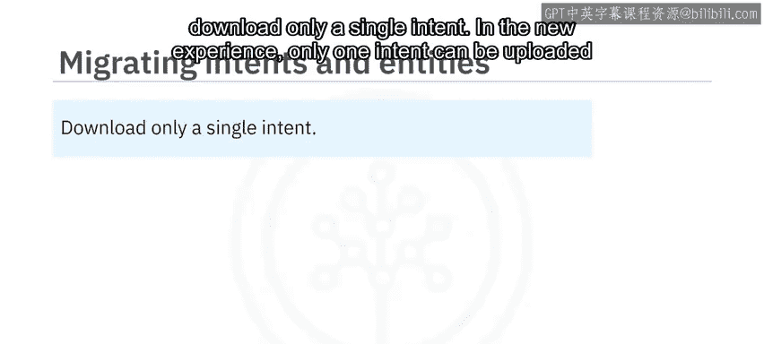

如果你计划使用下载的意图文件为特定操作上传示例短语，请在新体验中仅下载单个意图。每个操作只能上传一个意图。

指定要存储生成的CSV文件的名称和位置，然后点击“保存”。

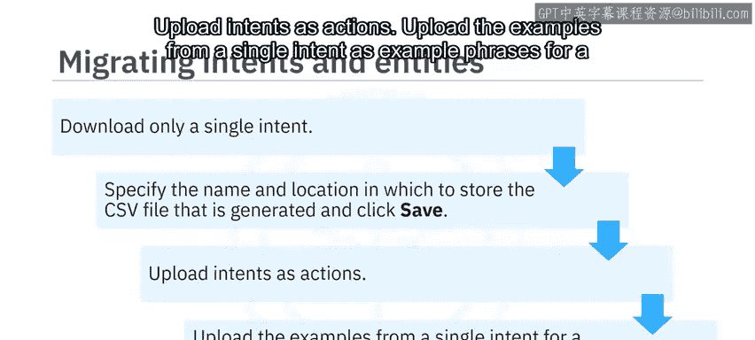

你现在可以执行以下任务将信息迁移到新版Watson Assistant：将意图作为操作上传，并将单个意图中的示例作为特定操作的示例短语上传。

## 课程总结

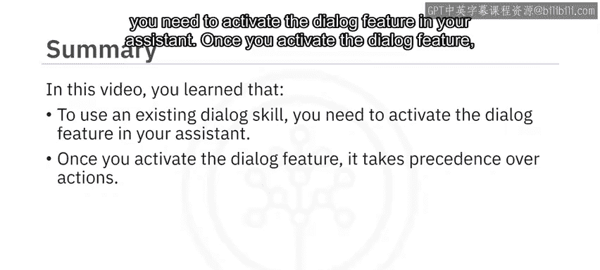

本节课中，我们一起学习了如何将对话技能迁移到Watson操作。你了解到，要使用现有的对话技能，你需要在助手中激活对话功能。一旦激活对话功能，它将优先于操作。你可以将意图和实体从经典版Watson Assistant体验迁移到新版Watson Assistant体验。一个对话节点可以调用一个操作来执行任务，然后返回到对话。