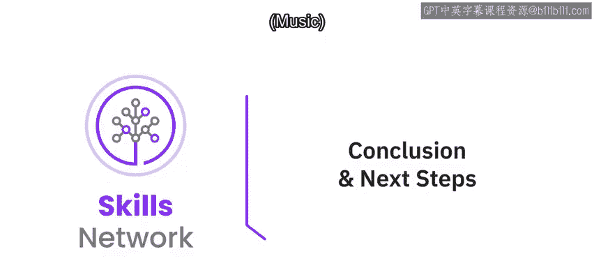
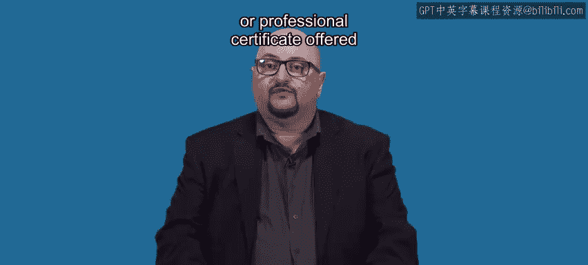

# 065：最终建议与后续学习路径 🎯

在本节课中，我们将回顾整个课程的核心内容，并提供明确的后续学习建议，帮助你从入门迈向进阶。

---

恭喜你完成了这门关于无需编程构建聊天机器人的课程。现在，你应该对聊天机器人的重要性、它们带来的商业机会以及如何创建它们有了更清晰的认识。本课程为你奠定了基础，展示了如何利用 **Watson Assistant** 创建简单但实用的聊天机器人。

既然你已经掌握了基础知识，你可能会想知道接下来该做什么。

我的建议是你开始构建自己的聊天机器人。

以下是你可以立即着手的方向：

*   为你的个人主页创建一个私人聊天机器人。
*   开发一个服务于特定业务需求的聊天机器人。

真实的实践是无法替代的。除此之外，我建议你继续深化聊天机器人的学习。

你可以学习我的另一门名为 **《使用 Watson API 构建 AI 应用》** 的课程。这是一门逻辑上的进阶课程，它教你如何通过将 Watson Assistant 与其他 AI 服务（如 Discovery 和 Speech API）集成，来创建更高级的 AI 应用和聊天机器人。这门课程能让你运用新获得的聊天机器人构建技能，并通过引入一些编码知识将其提升到新的水平。

事实上，如果你喜欢这门课程并看到了 AI 的潜力，我建议你通过注册 Coursera 上 IBM 提供的 **AI 专项课程或专业证书** 来使自己脱颖而出。

我期待看到你取得成功。

---

本节课中，我们一起回顾了课程成就，并规划了从实践构建到学习集成开发、直至获取专业认证的清晰进阶路径。持续学习和动手实践是掌握 AI 应用开发的关键。