# 068：Python 字符串操作入门教程 🧵

在本节课中，我们将要学习 Python 中字符串的基本概念和操作方法。字符串是编程中最常用的数据类型之一，理解如何操作字符串是构建任何应用程序的基础。

---

## 什么是字符串？🔤

在 Python 中，字符串是一个字符序列。一个字符串被包含在两个引号内。

```python
my_string = "Hello World"
```

你也可以使用单引号。

```python
my_string = 'Hello World'
```

一个字符串可以包含空格或数字。

```python
my_string = "123 Main Street"
```

字符串也可以包含特殊字符。

```python
my_string = "Hello! @#$%"
```

我们可以将一个字符串绑定或赋值给另一个变量。

```python
name = "Michael Jackson"
artist = name
```

将字符串视为一个有序序列是很有帮助的。序列中的每个元素都可以使用一个由数字数组表示的索引来访问。

---

## 字符串索引与切片 🗂️

上一节我们介绍了字符串的基本概念，本节中我们来看看如何访问字符串中的特定字符。

第一个索引可以按如下方式访问。

```python
name = "Michael Jackson"
first_char = name[0] # 结果为 'M'
```

我们可以访问索引 6。

```python
sixth_char = name[6] # 结果为 'l' (注意：索引从0开始)
```

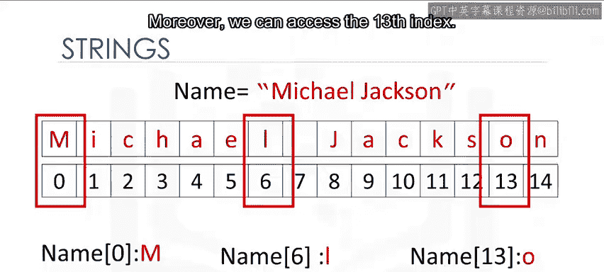

此外，我们还可以访问第 13 个索引。

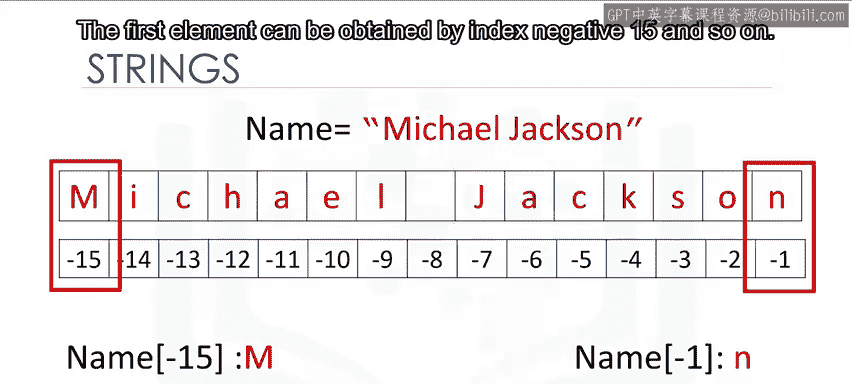

```python
thirteenth_char = name[13] # 结果为 'o'
```

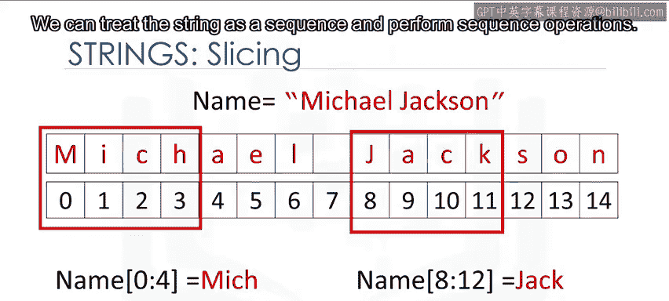

我们也可以对字符串使用负索引。最后一个元素由索引 **-1** 给出。

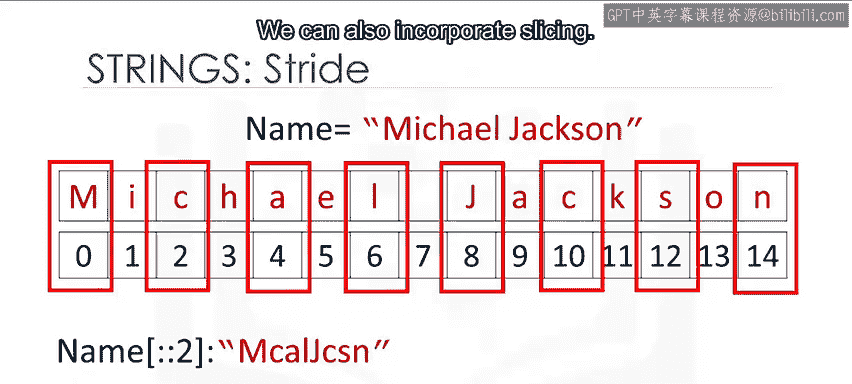

```python
last_char = name[-1] # 结果为 'n'
```

第一个元素可以通过索引 **-15** 获得，依此类推。

```python
first_char_negative = name[-15] # 结果为 'M'
```

我们可以将字符串视为列表或元组。我们可以将字符串作为序列处理并执行序列操作。

我们还可以按如下方式输入步长值。数字 2 表示我们每两个字符选择一个。

```python
every_second = name[::2] # 结果为 'McalJcsn'
```

我们也可以结合切片。在这种情况下，我们返回直到索引 4 之前的每第二个值。

```python
slice_example = name[:4:2] # 结果为 'Mc'
```

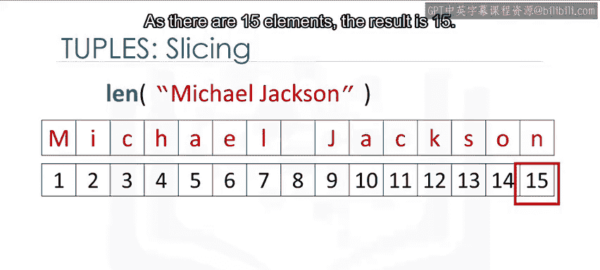

我们可以使用 `len` 命令来获取字符串的长度。

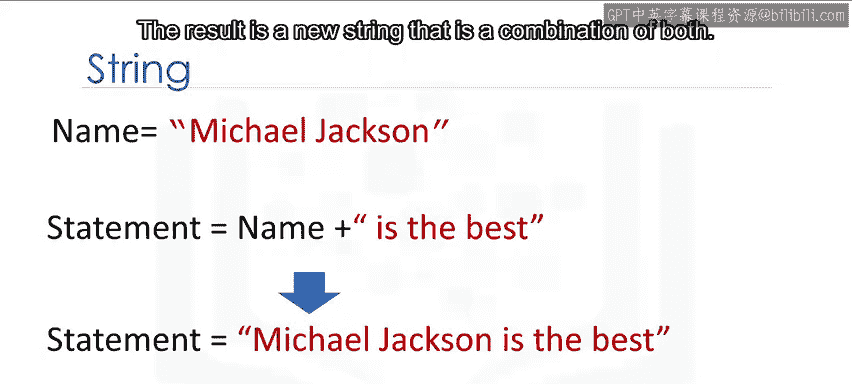

```python
length = len(name) # 结果为 15
```

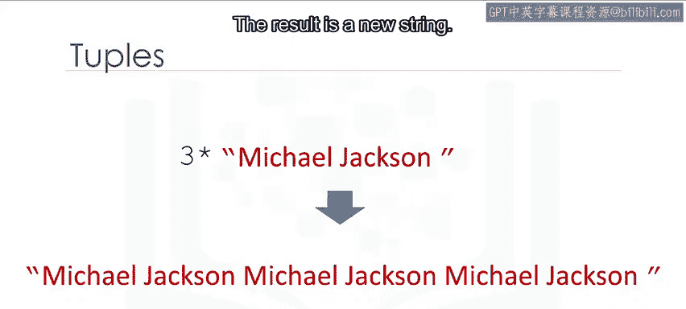

---

## 字符串的运算 ➕✖️

了解了如何访问字符串后，现在我们来学习如何组合和复制字符串。

我们可以连接或组合字符串。我们使用加号符号。

```python
greeting = "Hello" + " " + "World" # 结果为 "Hello World"
```

结果是一个结合了双方的新字符串。

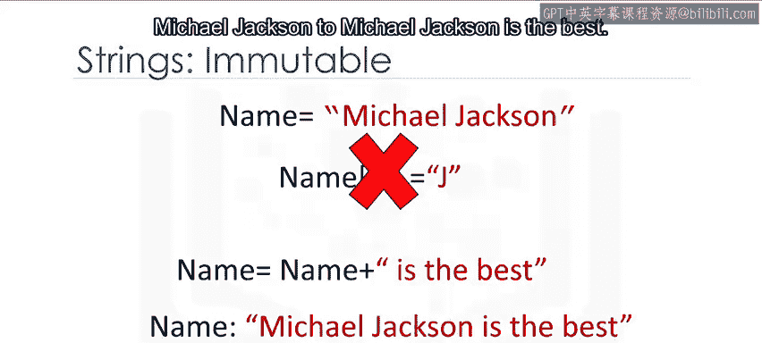

我们可以复制字符串的值。我们只需将字符串乘以我们希望复制的次数。

```python
repeated = "Ha" * 3 # 结果为 "HaHaHa"
```

在这种情况下，数字是 3。结果是一个新字符串。这个新字符串由原始字符串的三个副本组成。

---

## 字符串的不可变性与转义序列 🔒

字符串是不可变的。这意味着你不能改变字符串的值，但你可以创建一个新的字符串。

例如，你可以通过将其设置为原始变量并与一个新字符串连接来创建一个新字符串。

```python
name = "Michael Jackson"
new_name = name + " is the best" # 结果为 "Michael Jackson is the best"
```

反斜杠表示转义序列的开始。转义序列表示可能难以直接输入的字符串。

例如，`\n` 代表一个换行符。

```python
print("Hello\nWorld")
# 输出:
# Hello
# World
```

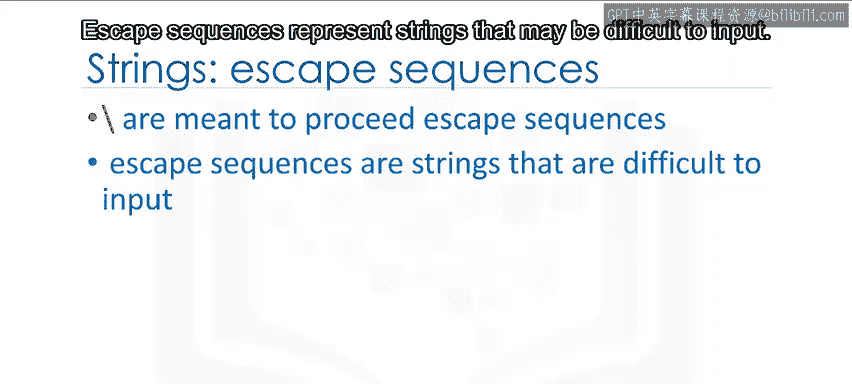

当遇到 `\n` 后，输出会换行。

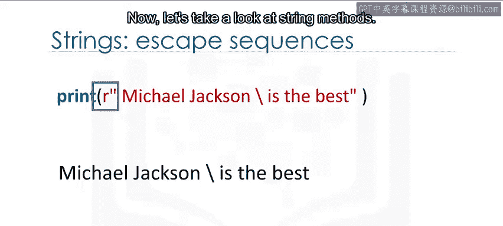

类似地，`\t` 代表一个制表符。

```python
print("Name:\tJohn")
# 输出: Name:    John
```

输出在反斜杠 T 出现的地方会有一个制表符。

如果你想在字符串中放置一个反斜杠，请使用双反斜杠。

```python
path = "C:\\Users\\Name" # 结果为 "C:\Users\Name"
```

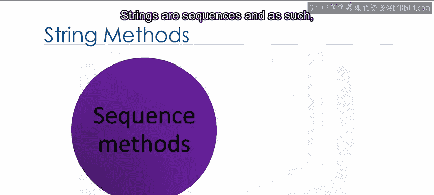

转义序列后的结果是一个反斜杠。

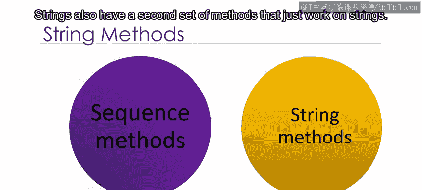

我们也可以在字符串前面放一个 `r` 来创建原始字符串，忽略转义序列。

```python
raw_string = r"Hello\nWorld" # 结果为 "Hello\\nWorld"，\n不会被转义
```

---

## 字符串方法 📚

字符串是序列，因此具有适用于列表和元组的方法。此外，字符串还有第二套专门用于字符串的方法。

当我们对字符串 A 应用一个方法时，我们会得到一个与 A 不同的新字符串 B。

让我们看一些例子。让我们尝试 `upper` 方法。这个方法将小写字符转换为大写字符。

在这个例子中，我们将变量 A 设置为以下值。

```python
A = "Thriller is the seventh studio album"
```

我们应用 `upper` 方法并将其赋值给 B。

```python
B = A.upper() # 结果为 "THRILLER IS THE SEVENTH STUDIO ALBUM"
```

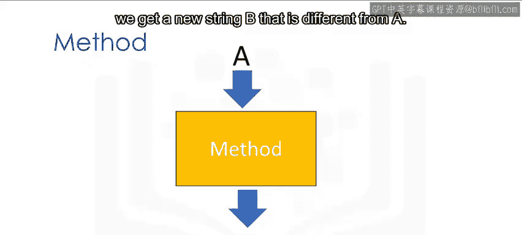

B 的值与 A 相似，但所有字符都是大写的。

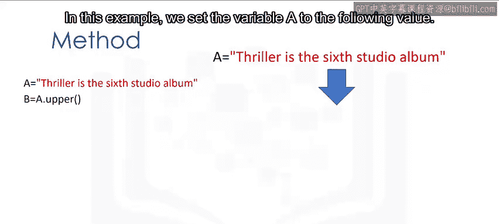

`replace` 方法将字符串的一个片段（即子字符串）替换为一个新字符串。我们输入想要更改的字符串部分。

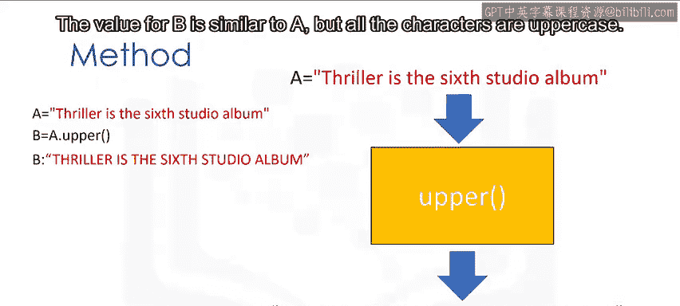

```python
new_string = A.replace("seventh", "sixth")
# 结果为 "Thriller is the sixth studio album"
```

第二个参数是我们想要用来交换该片段的内容。结果是一个片段被更改的新字符串。

`find` 方法用于查找子字符串。参数是您想要查找的子字符串。输出是该子序列第一次出现的索引。

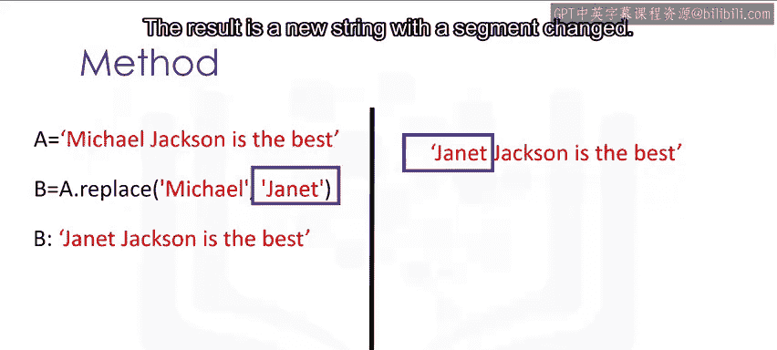

```python
index = A.find("studio") # 结果为 25
```

我们可以查找子字符串 “jack”。

```python
index = A.find("jack") # 结果为 -1，因为未找到
```

如果子字符串不在字符串中，则输出为 **-1**。请查看实验部分以获取更多示例。

---

## 总结 📝

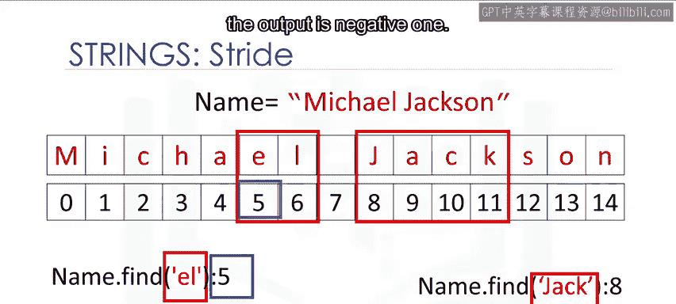

本节课中我们一起学习了 Python 字符串的核心操作。我们首先了解了字符串的定义和基本特性，然后学习了如何使用索引和切片来访问字符串的特定部分。接着，我们探索了字符串的连接、复制运算，并理解了字符串不可变性的概念。我们还介绍了转义序列的用法。最后，我们学习了几种常用的字符串方法，如 `upper()`、`replace()` 和 `find()`，它们能帮助我们有效地处理和转换字符串数据。掌握这些基础知识是进行更复杂文本处理的第一步。