# 070：Python字典详解 📚

在本节课中，我们将要学习Python中一个非常重要的数据结构——**字典**。我们将了解字典的基本概念、如何创建和操作字典，以及它与列表等其他数据结构的区别。

---

## 字典是什么？🔑

上一节我们介绍了列表，它是一种使用整数索引的集合。本节中我们来看看字典。

字典是Python中的一种集合类型。与列表不同，字典使用**键**和**值**来存储数据。你可以把键想象成地址，但它不必是整数，通常是字符串。值则类似于列表中的元素，用于存储具体信息。

一个简单的类比是：列表像一排有编号的储物柜，而字典像一本通讯录，你通过人名（键）来查找电话号码（值）。

---

## 创建字典

要创建一个字典，我们使用花括号 `{}`。

以下是创建字典的规则和语法：
*   **键**是第一个元素，必须是**不可变**且**唯一**的。
*   每个键后面跟着一个冒号 `:`，然后是**值**。
*   值可以是任何类型的数据，可以是不可变的、可变的，并且允许重复。
*   每个键值对之间用逗号 `,` 分隔。

考虑以下这个以专辑名为键、发行年份为值的字典例子：

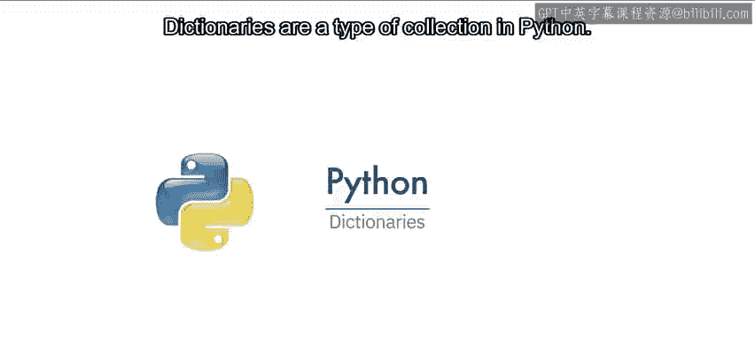

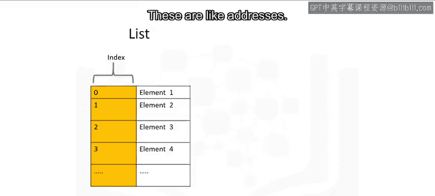

```python
# 创建一个字典并赋值给变量 album_dict
album_dict = {
    "Back in Black": 1980,
    "The Dark Side of the Moon": 1973,
    "The Bodyguard": 1992,
    "Thriller": 1982
}
```

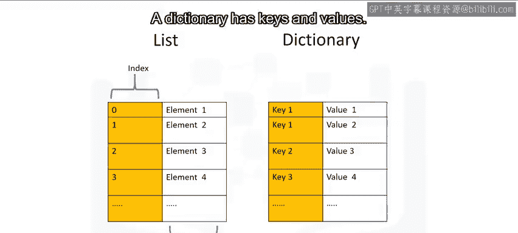

我们可以用一个表格来可视化这个字典，第一列代表键，第二列代表值。


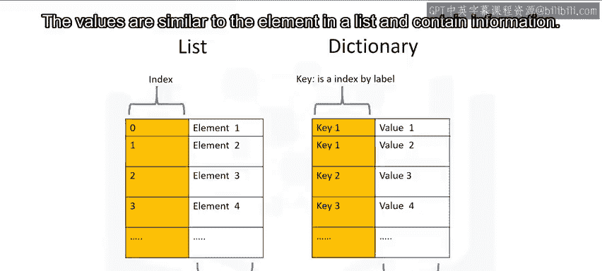

| 键 (Key) | 值 (Value) |
| :--- | :--- |
| “Back in Black” | 1980 |
| “The Dark Side of the Moon” | 1973 |
| “The Bodyguard” | 1992 |
| “Thriller” | 1982 |

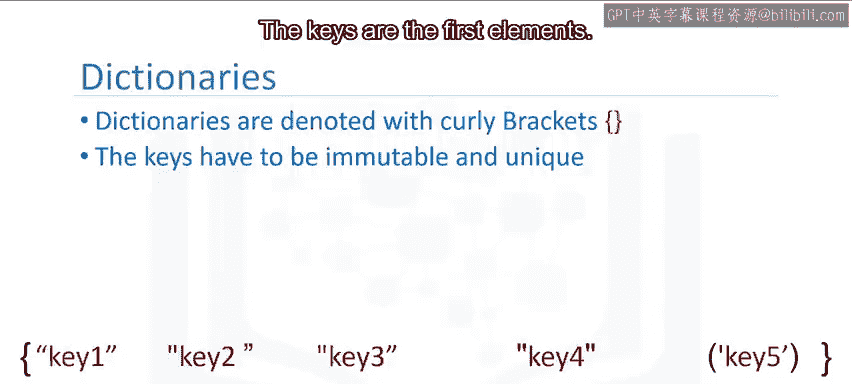

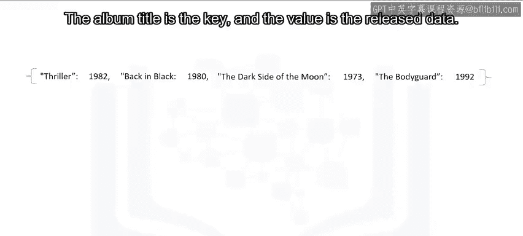

---

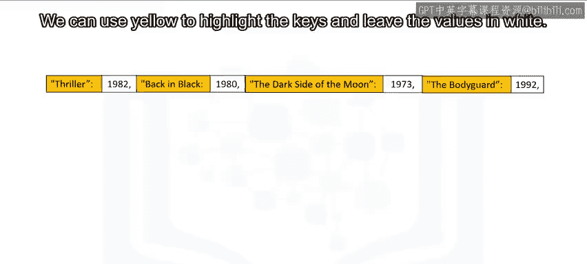

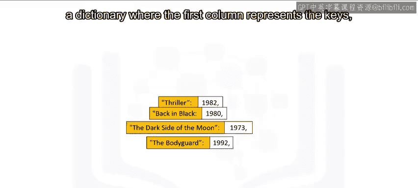

## 访问和修改字典

### 访问值

我们使用方括号 `[]` 并通过**键**来查找对应的值。

```python
# 使用键“Back in Black”来访问值
print(album_dict["Back in Black"])  # 输出：1980
print(album_dict["The Dark Side of the Moon"])  # 输出：1973
```

### 添加新条目

我们可以直接为一个新的键赋值，从而在字典中添加新的键值对。

```python
# 添加一个新条目，键为“Graduation”，值为2007
album_dict["Graduation"] = 2007
```

### 删除条目

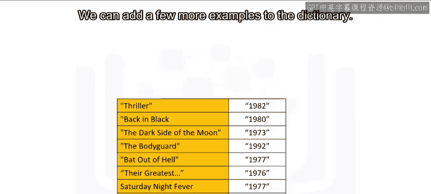

使用 `del` 语句可以删除字典中指定的键及其对应的值。

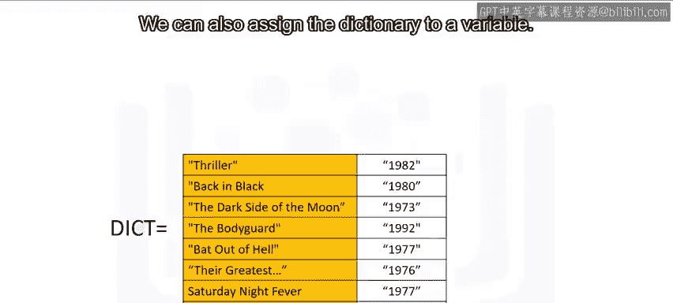

```python
# 删除键为“Thriller”的条目
del album_dict["Thriller"]
```

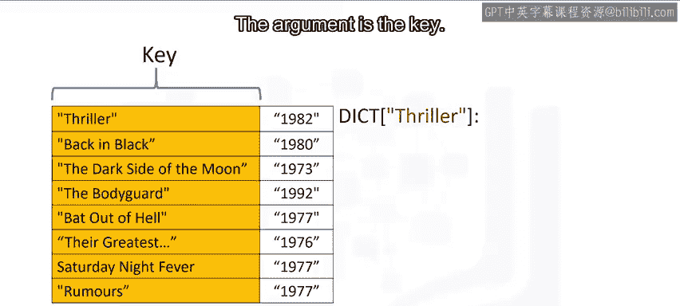

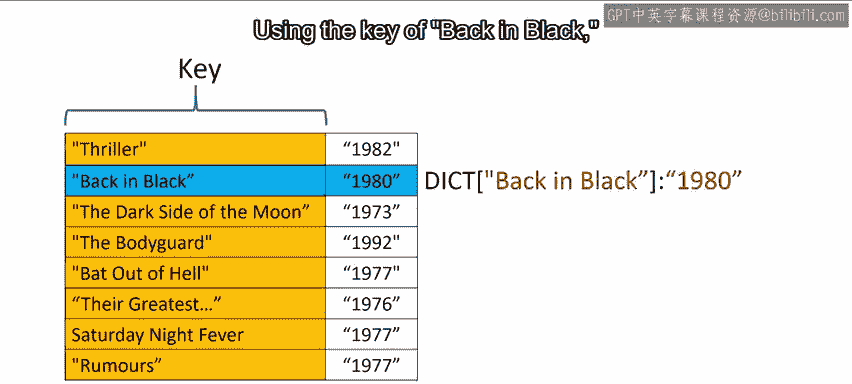

---

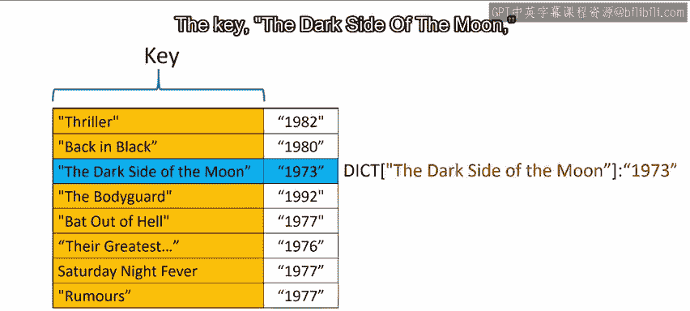

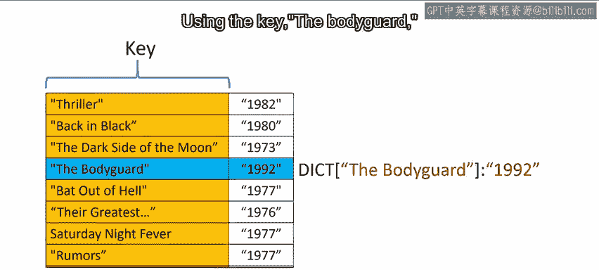

## 检查键是否存在

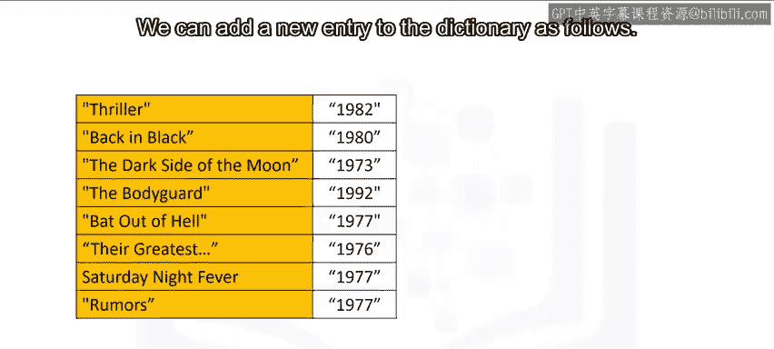

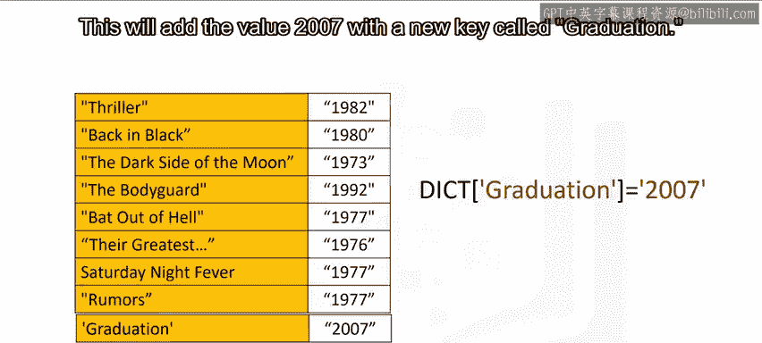

我们可以使用 `in` 命令来检查一个键是否存在于字典中。这个命令只检查键，不检查值。

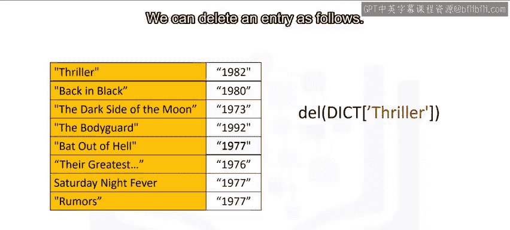

```python
# 检查“Back in Black”是否在字典的键中
print("Back in Black" in album_dict)  # 输出：True

# 检查一个不存在的键
print("Nevermind" in album_dict)  # 输出：False
```

---

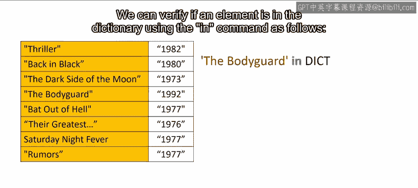

## 获取所有键和值

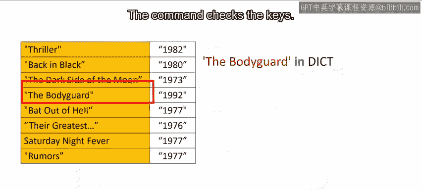

为了查看字典中的所有键，我们可以使用 `.keys()` 方法。它会返回一个类似列表的对象，包含所有键。

```python
# 获取字典的所有键
keys = album_dict.keys()
print(keys)  # 输出类似：dict_keys(['Back in Black', 'The Dark Side of the Moon', ...])
```

同样地，我们可以使用 `.values()` 方法来获取字典中的所有值。

```python
# 获取字典的所有值
values = album_dict.values()
print(values)  # 输出类似：dict_values([1980, 1973, ...])
```

---

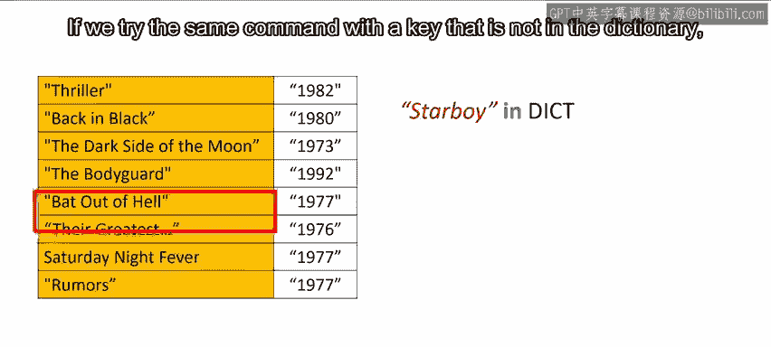

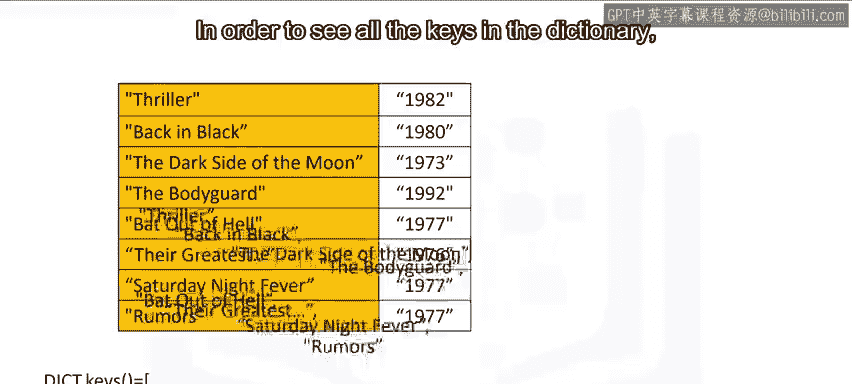

## 总结

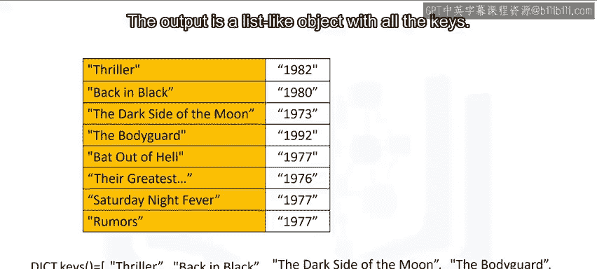

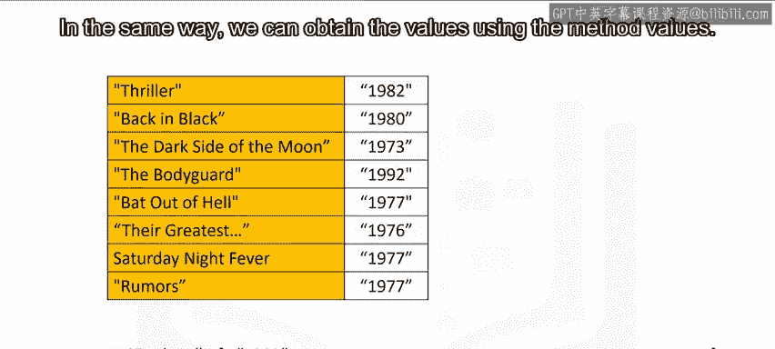

本节课中我们一起学习了Python字典的核心知识。我们了解到字典是一种通过**键-值对**存储数据的集合，键必须是唯一且不可变的。我们掌握了如何**创建**字典、通过键**访问**和**修改**值、**添加**或**删除**条目，以及如何**检查**键是否存在和获取所有**键**与**值**。

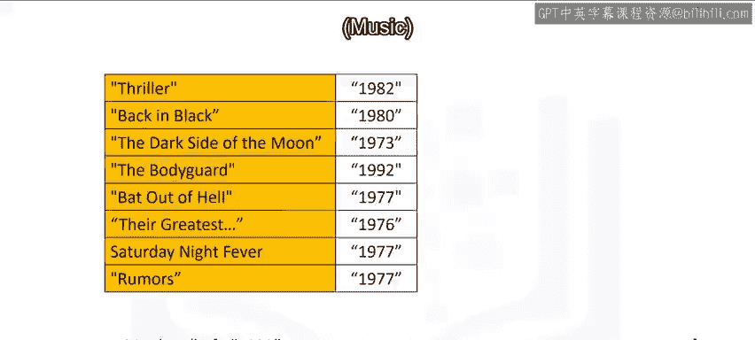

字典是构建复杂数据结构和处理映射关系（如ID对应信息、单词对应翻译）的利器，请务必在实验练习中多加运用以巩固理解。