# 071：Python集合详解 📚

在本节课中，我们将要学习Python中的另一种数据结构——集合。我们将了解集合的定义、特性、创建方法以及如何对集合进行各种操作，例如添加、删除元素以及执行数学集合运算。

---

## 什么是集合？ 🧩

集合也是一种集合类型。这意味着，像列表和元组一样，你可以向其中放入不同的Python数据类型。

与列表和元组不同，集合是无序的。这意味着集合不记录元素的位置。

集合中的元素是唯一的。这意味着在同一个集合中，一个特定的元素只会出现一次。

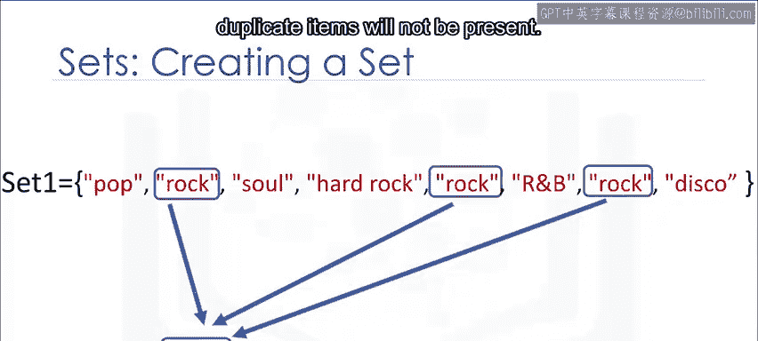

---

## 如何创建集合？ ➕

要定义一个集合，你需要使用花括号 `{}`。你将集合的元素放在花括号内。

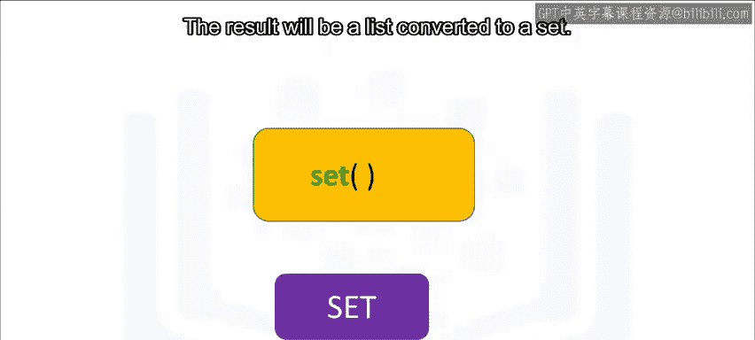

你可能会注意到列表中有重复项。当实际的集合被创建时，重复项将不会出现。

```python
# 定义一个集合
my_set = {1, 2, 3, 3, 4}
print(my_set)  # 输出: {1, 2, 3, 4}
```

你可以使用 `set()` 函数将一个列表转换为集合。这被称为类型转换。

你只需将列表作为 `set()` 函数的输入参数。结果将是一个由列表转换而来的集合。

```python
# 将列表转换为集合
my_list = [1, 2, 2, 3, 4]
converted_set = set(my_list)
print(converted_set)  # 输出: {1, 2, 3, 4}
```

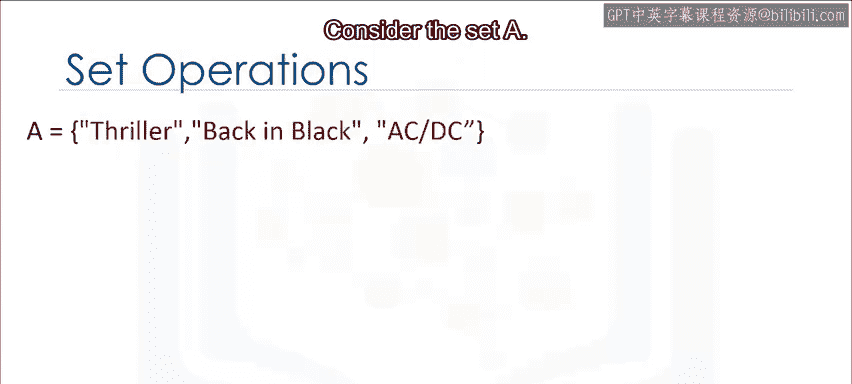

让我们看一个例子。我们从一个列表开始。我们将这个列表输入到 `set()` 函数中。`set()` 函数返回一个集合。请注意，结果中没有重复的元素。

---

## 集合的基本操作 🔧

上一节我们介绍了如何创建集合，本节中我们来看看如何修改集合。这些操作可以用来改变集合。

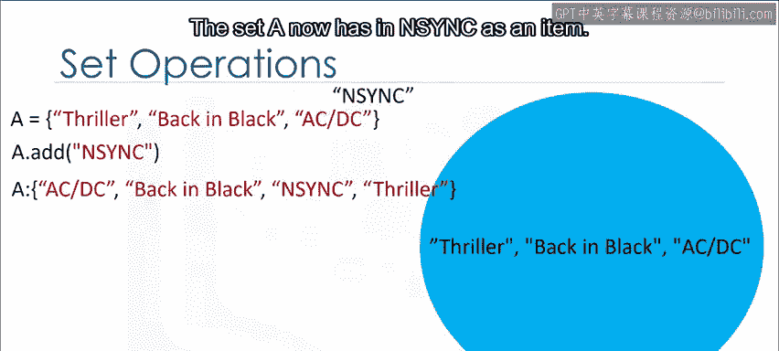

考虑一个集合A。如果你熟悉集合论，可以用一个圆圈来表示这个集合，这可以是维恩图的一部分。

维恩图是一种使用形状（通常是圆形）来表示集合的工具。

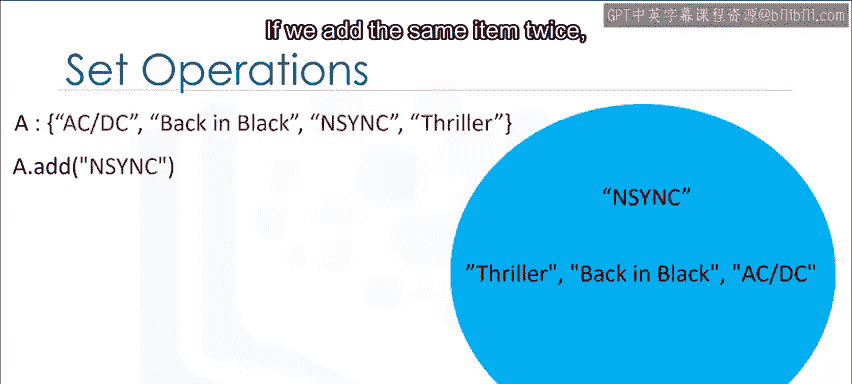

### 添加元素

我们可以使用 `add` 方法向集合中添加一个项目。我们只需在集合名称后加上一个点 `.`，然后是 `add` 方法。参数是我们想要添加到集合中的新元素。

```python
# 向集合添加元素
set_a = {1, 2, 3}
set_a.add(4)
print(set_a)  # 输出: {1, 2, 3, 4}
```

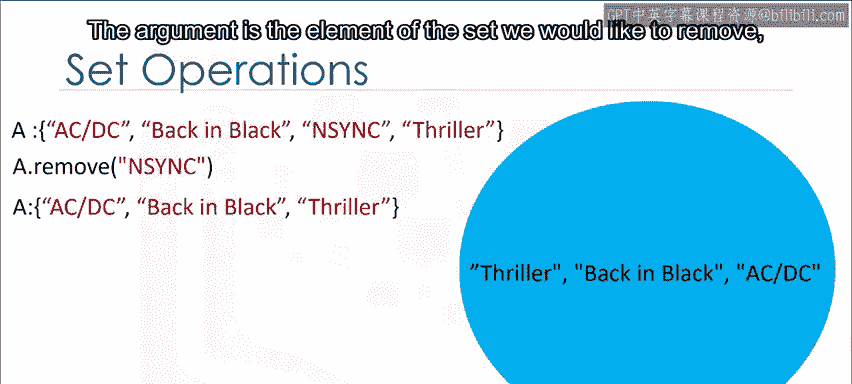

如果我们尝试添加相同的元素两次，什么也不会发生，因为集合中不能有重复项。

### 删除元素

假设我们想从集合A中移除元素4。

我们可以使用 `remove` 方法从集合中移除一个项目。我们只需在集合名称后加上一个点 `.`，然后是 `remove` 方法。参数是我们想要从集合中移除的元素。

```python
# 从集合中移除元素
set_a.remove(4)
print(set_a)  # 输出: {1, 2, 3}
```

将 `remove` 方法应用于集合后，集合A就不再包含该元素。你可以对集合中的任何元素使用此方法。

### 检查元素是否存在

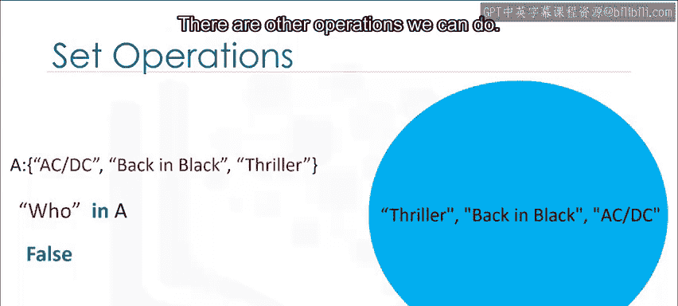

我们可以使用 `in` 命令来验证一个元素是否在集合中，如下所示。该命令检查项目（例如 `2`）是否在集合中。如果项目在集合中，则返回 `True`。

```python
# 检查元素是否在集合中
print(2 in set_a)  # 输出: True
print(5 in set_a)  # 输出: False
```

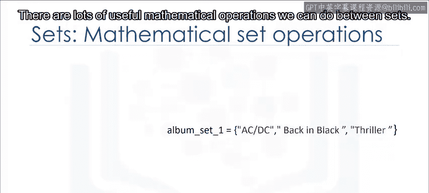

如果我们寻找一个不在集合中的项目（例如 `5`），由于该项目不在集合中，我们将得到 `False`。

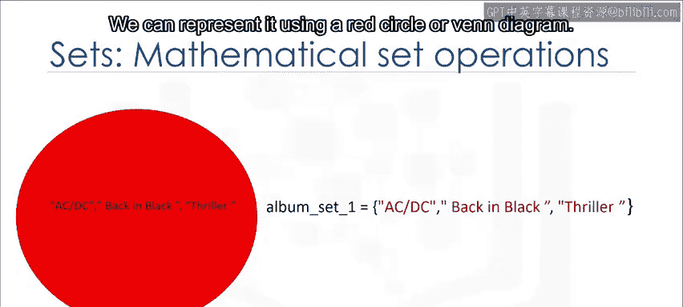

---

## 集合的数学运算 ➗

这些是数学集合运算的类型。我们还可以进行其他操作。

我们可以在集合之间进行许多有用的数学运算。

让我们定义集合 `album_set1`。我们可以用一个红色的圆圈或维恩图来表示它。

```python
album_set1 = {"AC/DC", "Back in Black", "Thriller"}
```

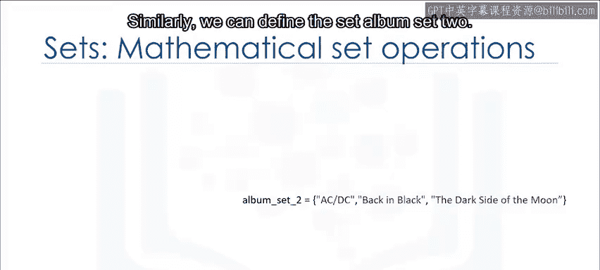

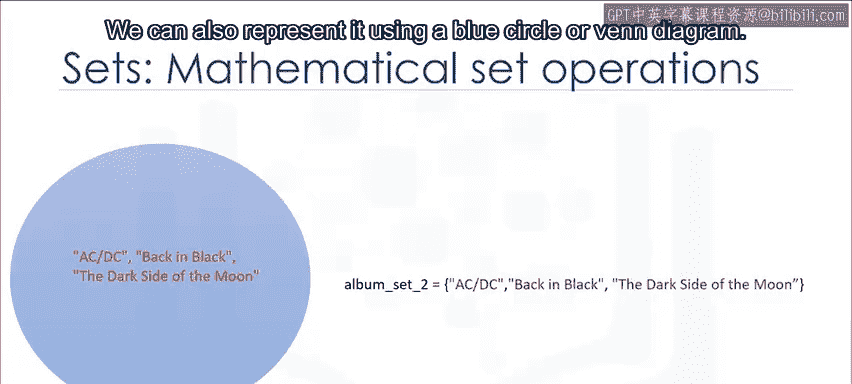

同样，我们可以定义集合 `album_set2`。我们也可以用一个蓝色的圆圈或维恩图来表示它。

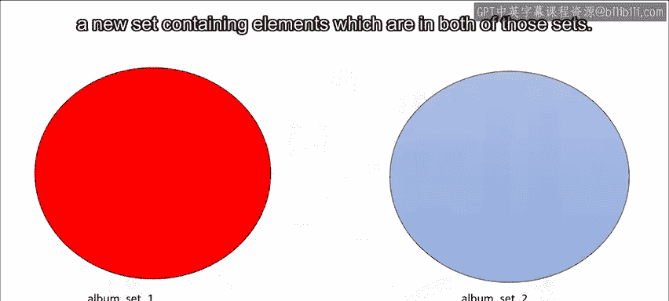

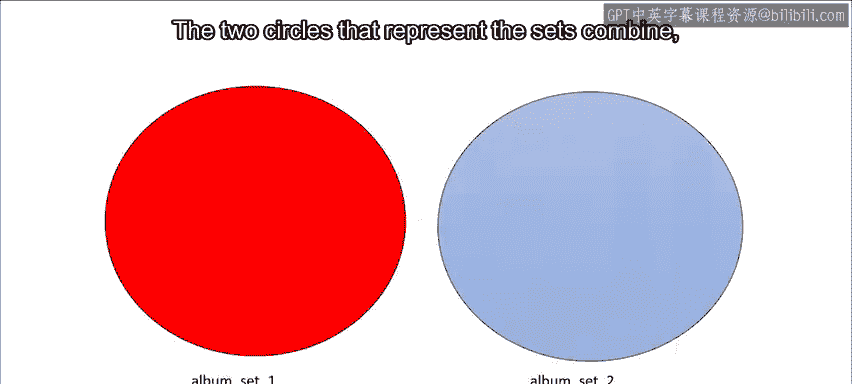

```python
album_set2 = {"AC/DC", "Back in Black", "The Dark Side of the Moon"}
```

### 交集

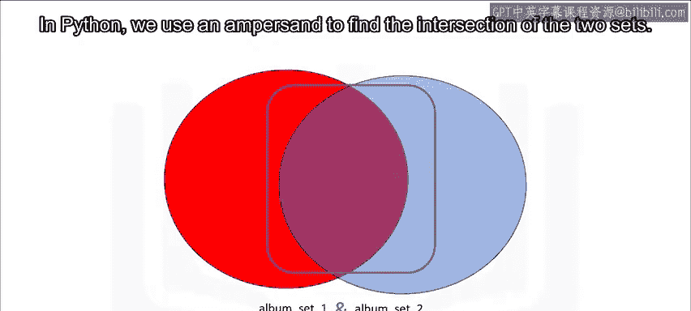

两个集合的交集是一个新的集合，包含同时存在于这两个集合中的元素。使用维恩图会很有帮助。代表两个集合的圆圈结合在一起，重叠部分代表新的集合。由于重叠部分由红色圆圈和蓝色圆圈共同构成，我们用“与”的关系来定义交集。

在Python中，我们使用 `&` 符号来求两个集合的交集。

```python
# 求两个集合的交集
album_set3 = album_set1 & album_set2
print(album_set3)  # 输出: {'AC/DC', 'Back in Black'}
```

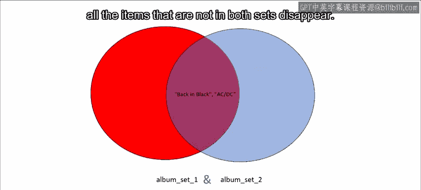

如果我们把集合的值覆盖在圆圈上，将公共元素放在重叠区域，在执行交集操作后，我们看到所有不同时存在于两个集合中的项目都消失了。

### 并集

两个集合的并集是一个新的集合，包含两个集合中的所有项目。我们可以如下找到集合 `album_set1` 和 `album_set2` 的并集。

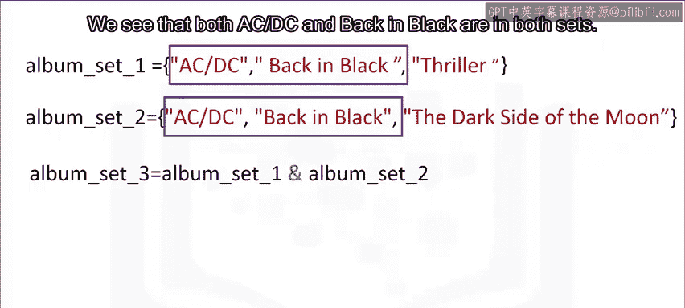

在Python中，我们使用 `|` 符号或 `union()` 方法来求并集。

```python
# 求两个集合的并集
album_set_union = album_set1 | album_set2
# 或者使用 union() 方法
# album_set_union = album_set1.union(album_set2)
print(album_set_union)  # 输出: {'AC/DC', 'Back in Black', 'Thriller', 'The Dark Side of the Moon'}
```

结果是一个包含 `album_set1` 和 `album_set2` 所有元素的新集合。

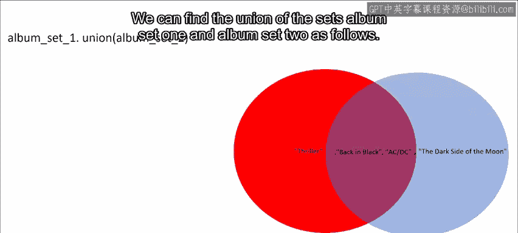

### 子集

考虑新的集合 `album_set3`。该集合包含元素 `AC/DC` 和 `Back in Black`。我们可以用维恩图来表示它，因为 `album_set3` 中的所有元素都在 `album_set1` 中。

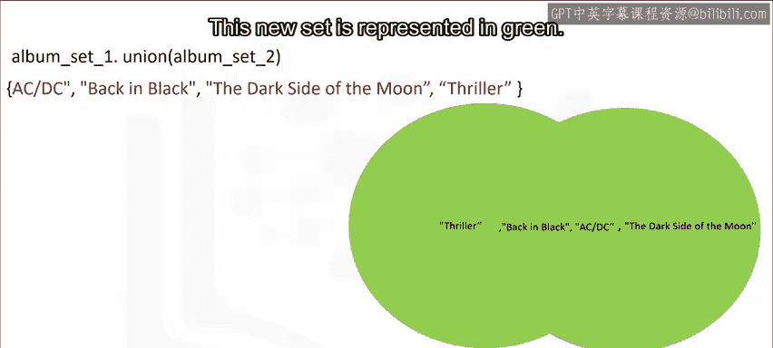

代表 `album_set1` 的圆圈包裹着代表 `album_set3` 的圆圈。

我们可以使用 `issubset` 方法检查一个集合是否是另一个集合的子集。

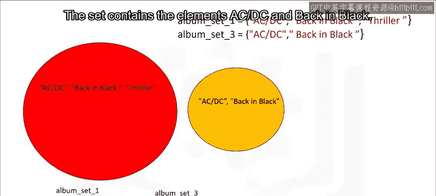

```python
# 检查子集关系
print(album_set3.issubset(album_set1))  # 输出: True
```

由于 `album_set3` 是 `album_set1` 的子集，结果为 `True`。

---

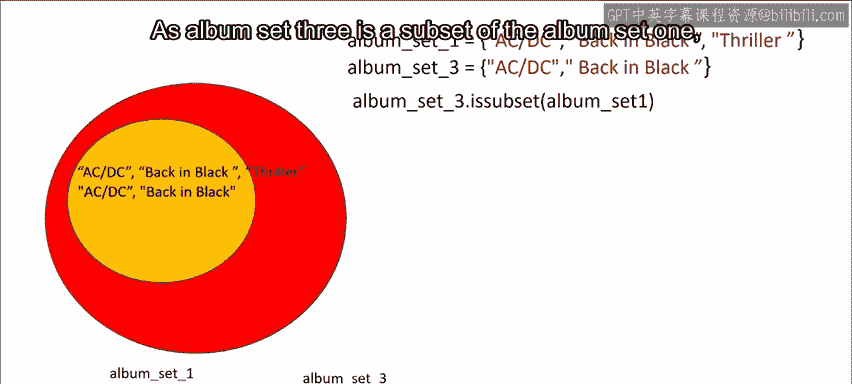

## 总结 ✨

本节课中我们一起学习了Python集合。我们了解了集合是一种无序且元素唯一的数据结构。我们学习了如何创建集合、添加和删除元素、检查元素是否存在，以及执行重要的数学集合运算，如求交集、并集和判断子集关系。


关于集合还有很多可以探索的内容，建议通过实践练习来巩固这些知识。