# 072：条件与分支 🧠

在本节课中，我们将要学习编程中的**条件**与**分支**。它们是让程序能够根据不同的情况做出不同决策的核心概念。通过学习比较操作、布尔值以及 `if`、`else`、`elif` 等语句，你将能够编写出更加智能和灵活的程序。

## 比较操作

上一节我们介绍了课程概述，本节中我们来看看**比较操作**。比较操作会对两个值进行比较，然后根据比较结果产生一个布尔值（`True` 或 `False`）。

例如，我们给变量 `a` 赋值为 6：
```python
a = 6
```
我们可以使用双等号 `==` 这个**相等运算符**来判断两个值是否相等：
```python
a == 7
```
由于 6 不等于 7，所以这个表达式的结果是 `False`。

如果我们判断 `a` 是否等于 6：
```python
a == 6
```
因为两个值相等，所以结果是 `True`。

除了相等，我们还可以进行大小比较。考虑以下使用大于运算符 `>` 的例子：
```python
i > 5
```
如果左边操作数（变量 `i`）的值大于右边操作数（5），条件就为 `True`，否则为 `False`。

我们可以用数轴来可视化这个过程。当 `i` 的值大于 5 时，在数轴上标记为绿色（真）；否则标记为红色（假）。

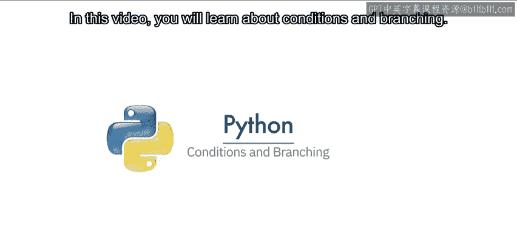


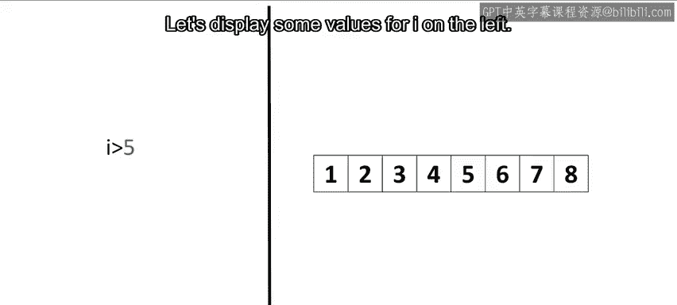


如果我们设置 `i = 6`，可以看到 6 大于 5，因此结果为 `True`。这些操作同样适用于浮点数。

我们也可以使用“大于或等于”运算符 `>=`：
```python
i >= 5
```
此时，条件在 `i` 大于或等于 5 时为真。在数轴上，数字 5 本身也会被包含在绿色区域中。

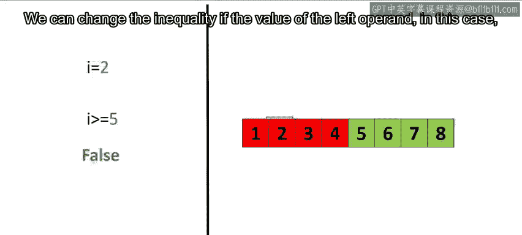

如果 `i = 5`，运算符产生 `True`。如果 `i = 2`，因为 2 小于 5，所以结果为 `False`。

同理，还有小于运算符 `<`：
```python
i < 6
```
如果左边操作数 `i` 的值小于右边操作数 6，则条件为真。


“不等于”运算符使用感叹号加等号表示 `!=`。如果两个操作数不相等，则条件为真。
```python
i != 6
```

字符串也可以进行比较。例如，比较字符串 “AC/DC” 和 “Michael Jackson” 是否相等：
```python
"AC/DC" == "Michael Jackson"  # 结果为 False
```
使用不等于测试：
```python
"AC/DC" != "Michael Jackson"  # 结果为 True
```
因为字符串不同。

## 分支：`if` 语句

理解了比较操作后，我们来看看如何利用其结果来控制程序流程，这就是**分支**。分支允许我们为不同的输入运行不同的语句。

可以把 `if` 语句想象成一个上锁的房间。**如果**条件语句为 `True`，你就能进入房间，程序执行预定义的任务。**如果**条件为 `False`，你的程序就会跳过这个任务。

举个例子，想象一个代表 AC/DC 演唱会的蓝色矩形。规则是：如果个人年龄大于或等于 18 岁，他可以进入演唱会；如果小于 18 岁，则不能进入。

*   如果一个人年龄是 17 岁，条件为假，他无法进入演唱会，只能离开。
*   如果一个人年龄是 19 岁，条件为真，他可以进入演唱会，然后离开。

`if` 语句的语法如下：
```python
if condition:
    # 如果条件为 True 则执行的表达式
```
`condition` 是一个可以评估为真或假的表达式。括号不是必须的，但冒号 `:` 和缩进是必需的。无论 `if` 条件真假，`if` 语句块之后的代码都会继续执行。

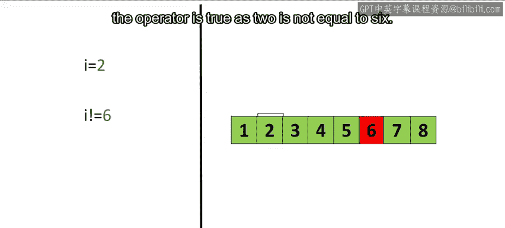

**以下是具体案例：**

当年龄为 17 时：
```python
age = 17
if age >= 18:
    print(“你可以进入”)
print(“继续前进”)
```
程序检查 `if` 语句，条件为 `False`，因此不会执行打印“你可以进入”的语句，只会打印“继续前进”。

当年龄为 19 时：
```python
age = 19
if age >= 18:
    print(“你可以进入”)
print(“继续前进”)
```
`if` 语句条件为 `True`，因此程序会执行打印“你可以进入”，然后打印“继续前进”。

## `else` 语句

`else` 语句允许我们在条件为 `False` 时运行另一段代码块。

继续使用演唱会类比：如果用户 17 岁，他不能去 AC/DC 演唱会，但可以去 Meatloaf 演唱会（用紫色方块代表）。如果用户 19 岁，条件为真，他可以进入 AC/DC 演唱会，然后离开。

`else` 语句的语法很简单，只需在 `if` 语句后添加 `else:` 和相应的缩进代码块。

**以下是具体案例：**

当年龄为 17 时：
```python
age = 17
if age >= 18:
    print(“你可以进入 AC/DC 演唱会”)
else:
    print(“去看 Meatloaf 演唱会吧”)
print(“继续前进”)
```
`if` 语句条件为 `False`，因此程序执行 `else` 语句块，打印“去看 Meatloaf 演唱会吧”，然后继续执行后续代码。

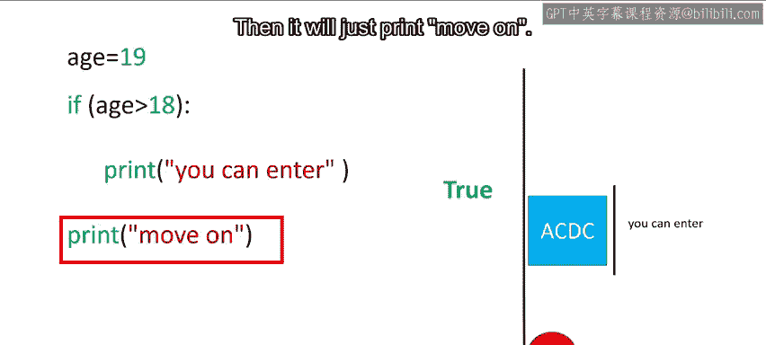

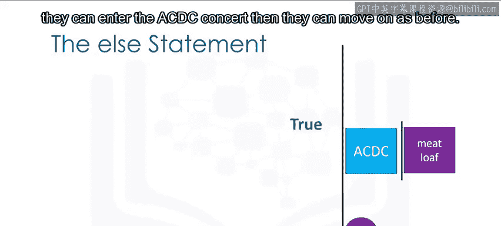

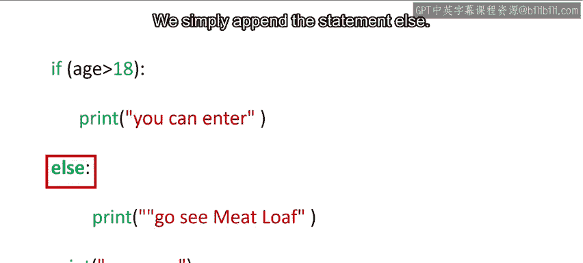

当年龄为 19 时：
```python
age = 19
if age >= 18:
    print(“你可以进入 AC/DC 演唱会”)
else:
    print(“去看 Meatloaf 演唱会吧”)
print(“继续前进”)
```
`if` 语句条件为 `True`，程序执行打印“你可以进入 AC/DC 演唱会”，跳过 `else` 块，然后打印“继续前进”。

## `elif` 语句

`elif` 是 `else if` 的缩写，它允许我们在前面的条件为 `False` 时，检查额外的条件。如果 `elif` 的条件为 `True`，则执行其对应的代码块。

考虑演唱会例子：如果一个人刚好 18 岁，他既不能看 AC/DC（要求大于18岁），也不该去看 Meatloaf（`else` 默认选项），而是应该去看 Pink Floyd 演唱会。

一个 18 岁的人进入：他不超过 19 岁，所以不能看 AC/DC。但因为他是 18 岁，所以去看 Pink Floyd。看完后离开。

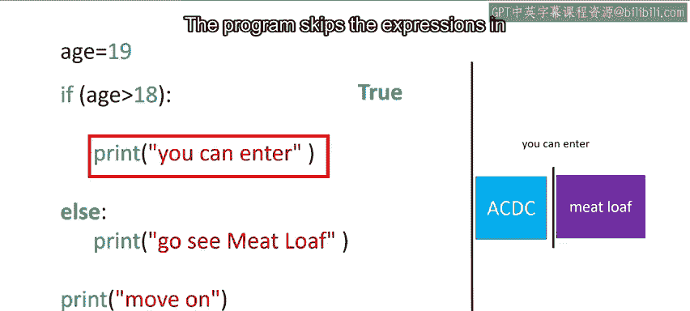

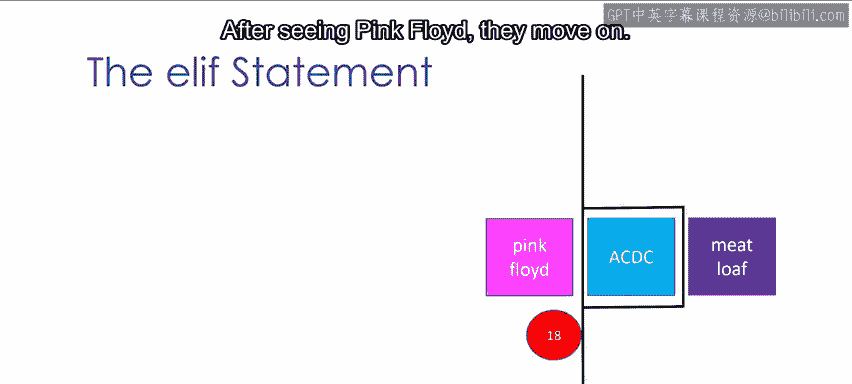


`elif` 语句的语法如下：
```python
if condition1:
    # 执行语句1
elif condition2:
    # 执行语句2
else:
    # 执行语句3
```


**以下是具体案例：**

对于一个 18 岁的人：
```python
age = 18
if age > 18:
    print(“你可以进入”)
elif age == 18:
    print(“去看 Pink Floyd 吧”)
else:
    print(“去看 Meatloaf 吧”)
print(“继续前进”)
```
第一个条件 `age > 18` 为 `False`，因此检查 `elif` 条件 `age == 18`，结果为 `True`，所以打印“去看 Pink Floyd 吧”，然后继续执行。

如果 `age` 是 17，则会执行 `else` 块，打印“去看 Meatloaf 吧”。如果 `age` 大于 18，则会执行 `if` 块，打印“你可以进入”。

## 逻辑运算符

除了简单的比较，我们还可以使用**逻辑运算符**将多个布尔值组合起来，产生新的布尔值。首先是 `not` 运算符。

`not` 运算符会反转布尔值：
*   如果输入是 `True`，结果是 `False`。
*   如果输入是 `False`，结果是 `True`。

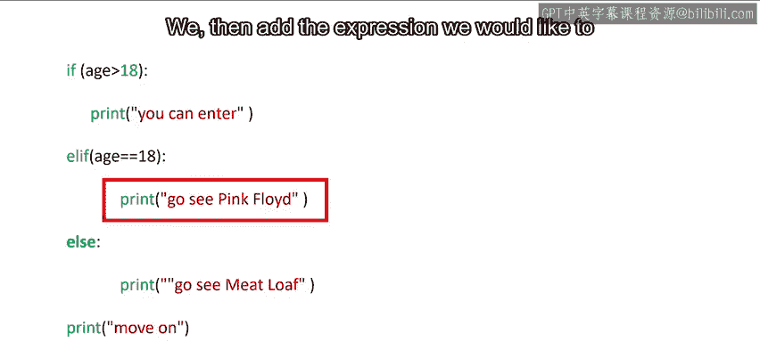


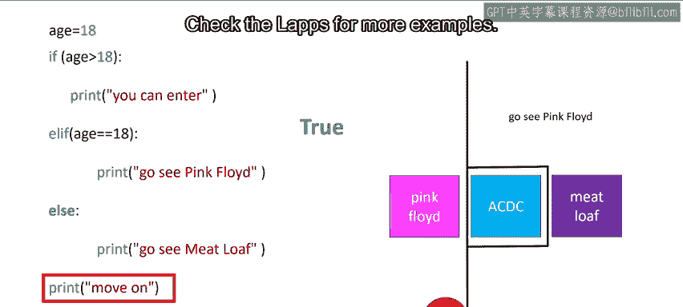

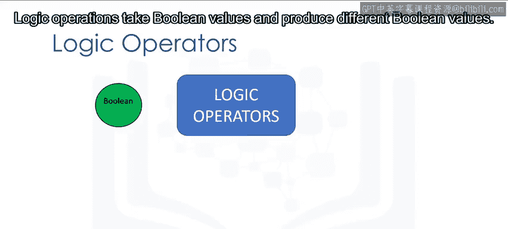

### `or` 运算符

`or` 运算符接受两个布尔值，并产生一个新的布尔值。我们可以用真值表来表示：

| A | B | A or B |
|---|---|--------|
| True | True | True |
| True | False | True |
| False | True | True |
| False | False | False |

可以看到，`or` 运算符只有在**所有**布尔值都为 `False` 时，才产生 `False`。

以下代码会在专辑年份不在 80 年代（即小于1980或大于1989）时，打印信息：
```python
album_year = 1990
if album_year < 1980 or album_year > 1989:
    print(“这张专辑制作于70年代或90年代。”)
else:
    print(“这张专辑制作于80年代。”)
```
让我们看看当 `album_year` 设为 1990 时的情况。使用彩色数轴，绿色表示条件为真，红色表示假。

第一个条件 `album_year < 1980`（1990 < 1980）为假（红）。
第二个条件 `album_year > 1989`（1990 > 1989）为真（绿）。


在最终的数轴上，绿色区域表示**至少有一个**语句为真的区域。1990 落在这个区域，因此条件为真，执行 `print` 语句。


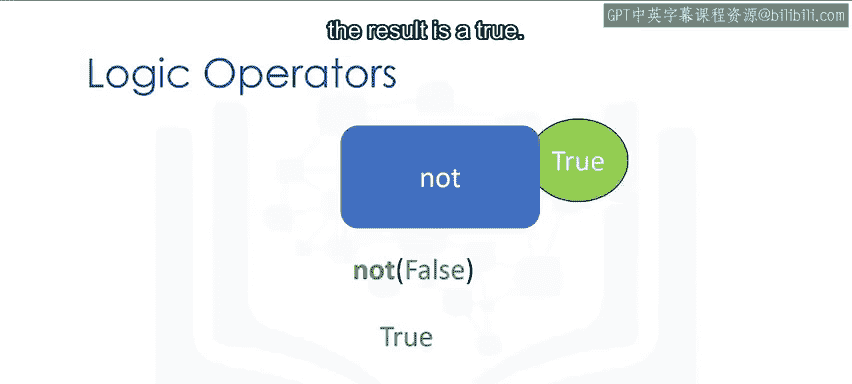

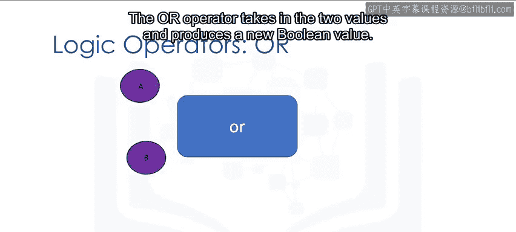

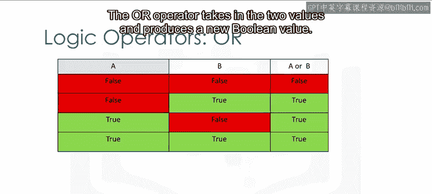

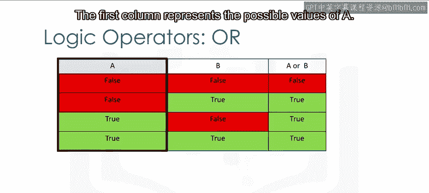

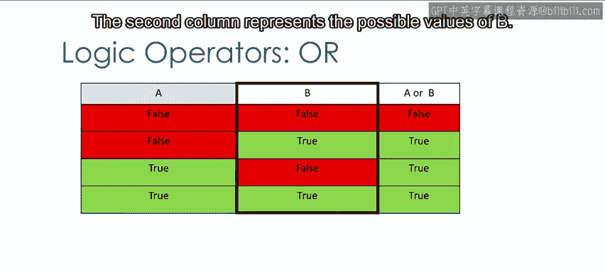

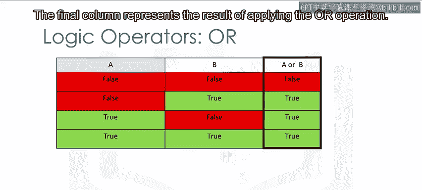

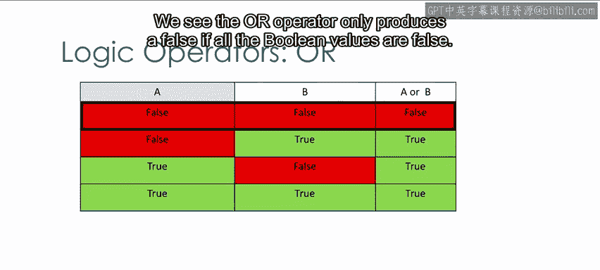

### `and` 运算符


`and` 运算符也接受两个布尔值，并产生一个新的布尔值。其真值表如下：


| A | B | A and B |
|---|---|--------|
| True | True | True |
| True | False | False |
| False | True | False |
| False | False | False |


可以看到，`and` 运算符只有在**所有**布尔值都为 `True` 时，才产生 `True`。

以下代码会在专辑年份在 1980 到 1989 年之间（含）时，打印信息：
```python
album_year = 1983
if album_year >= 1980 and album_year <= 1989:
    print(“这张专辑制作于80年代。”)
else:
    print(“这张专辑不是制作于80年代。”)
```
让我们看看当 `album_year` 设为 1983 时的情况。

第一个条件 `album_year >= 1980`（1983 >= 1980）为真（绿）。
第二个条件 `album_year <= 1989`（1983 <= 1989）为真（绿）。

在最终的数轴上，绿色区域表示**两个**语句都为真的区域。1983 落在这个区域，因此条件为真，执行 `print` 语句。

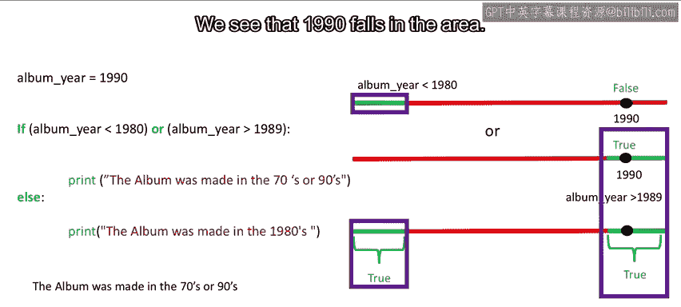

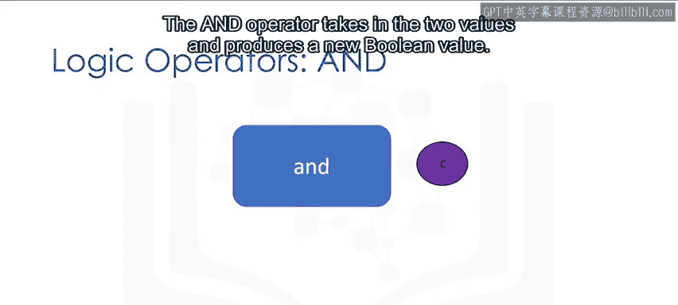

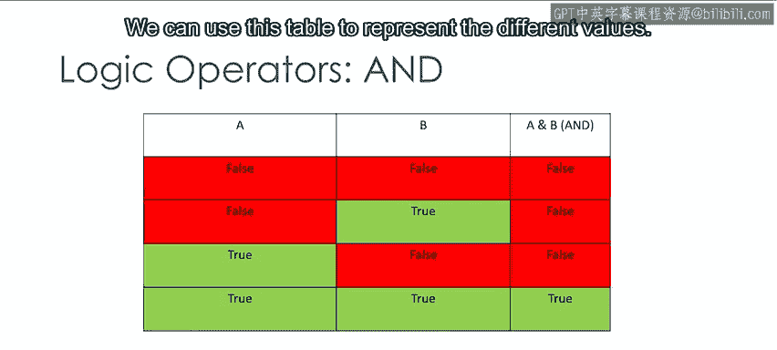

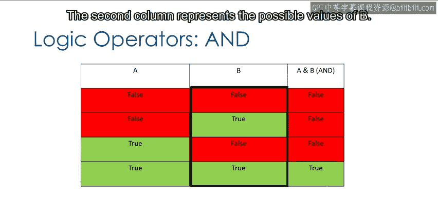

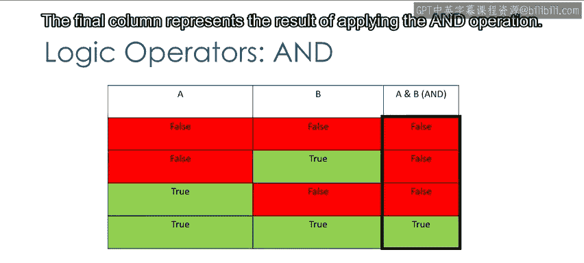


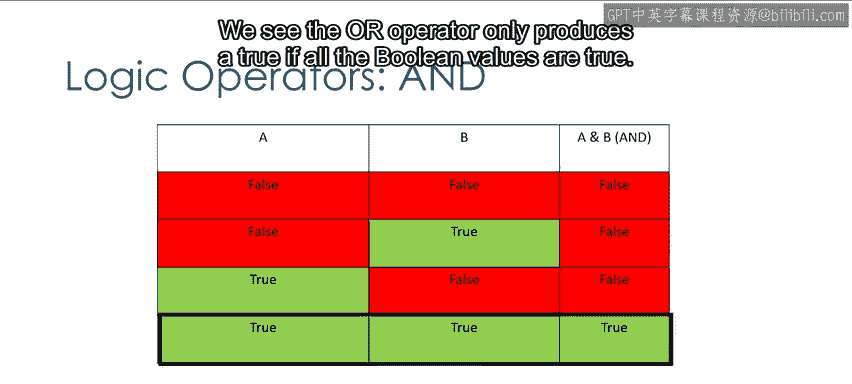


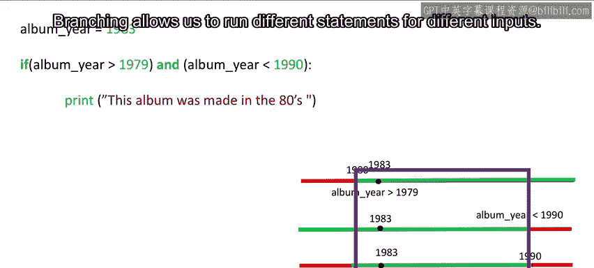


## 总结

本节课中我们一起学习了编程中至关重要的**条件与分支**。

我们首先学习了如何使用比较运算符（如 `==`， `>`， `<`， `>=`， `<=`， `!=`）来比较数值和字符串，并产生布尔值结果。

接着，我们深入探讨了如何利用这些布尔值通过 `if`、`else` 和 `elif` 语句来实现分支逻辑，让程序能够根据不同的条件执行不同的代码路径。

最后，我们介绍了逻辑运算符 `not`、`or` 和 `and`，它们允许我们组合多个条件，构建出更复杂的判断逻辑。


掌握这些概念是编写动态、响应式程序的基础，它们使得程序能够像我们一样进行“思考”和“决策”。