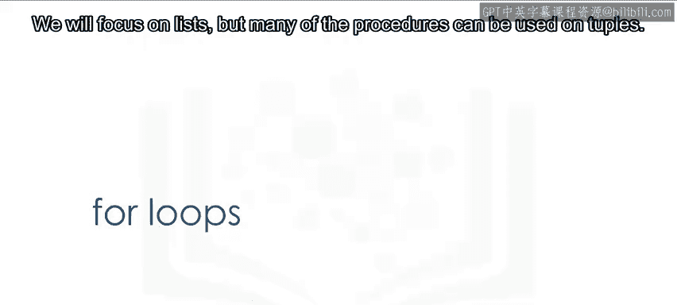
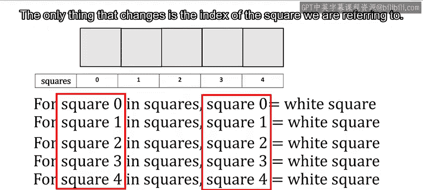
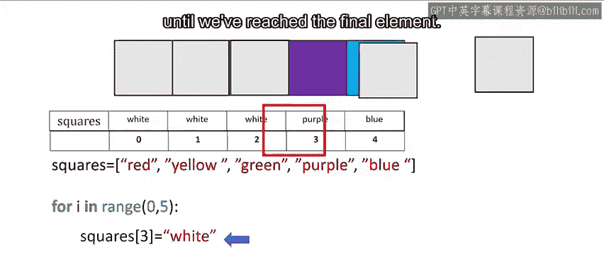
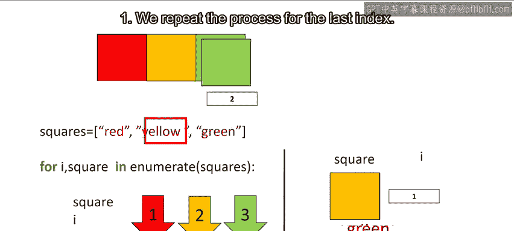
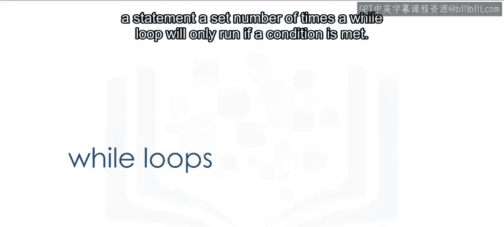
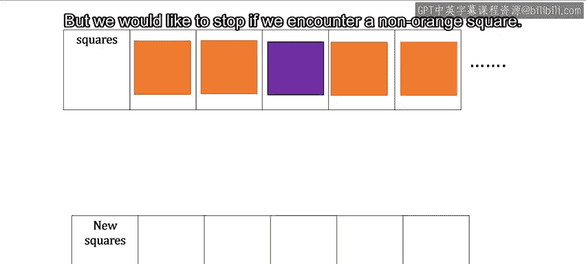
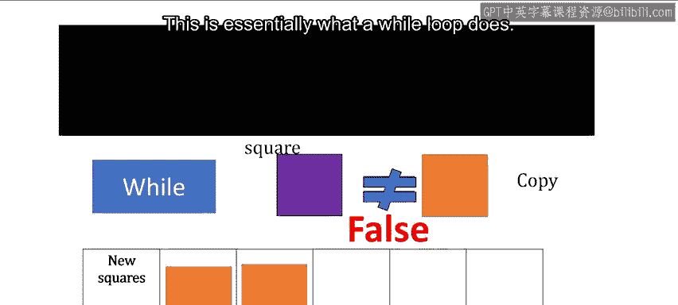
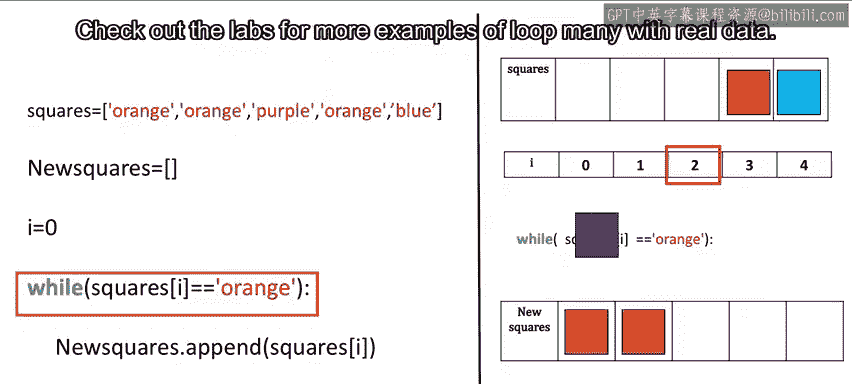

# 073：循环 🔄

在本节课中，我们将学习循环，特别是 `for` 循环和 `while` 循环。我们将通过直观的例子来理解它们的工作原理，并了解如何使用 `range` 函数来生成序列。

---

## 概述 📋

循环是编程中用于重复执行特定任务的结构。本节课将介绍两种主要的循环类型：`for` 循环和 `while` 循环。我们将从 `range` 函数开始，它是创建数字序列的有用工具，然后深入探讨每种循环的语法和应用场景。

---

## `range` 函数

在讨论循环之前，我们先来了解 `range` 函数。`range` 函数输出一个有序序列。

如果输入是一个正整数，输出是一个序列。该序列包含的元素数量与输入相同，但从 0 开始计数。

例如，如果输入是 3，输出序列是 0, 1, 2。

如果 `range` 函数有两个输入，且第一个输入小于第二个输入，输出序列从第一个输入值开始，迭代到但不包括第二个数字。

对于输入 10 和 15，我们得到以下序列：10, 11, 12, 13, 14。

更多 `range` 函数的功能请参见实验部分。请注意，如果您使用 Python 3，`range` 函数不会像 Python 2 那样显式生成列表。

---

## `for` 循环

上一节我们介绍了 `range` 函数，本节中我们来看看 `for` 循环。我们将重点放在列表上，但许多过程也可以用于元组。

循环反复执行一项任务。考虑一组彩色方块。

假设我们想将每个彩色方块替换为白色方块。

为了简化，我们给每个方块编号，并将所有方块组称为 `squares`。

如果我们想告诉某人将方块 0 替换为白色方块，我们会说：`squares[0] = "white"`。

类似地，对于下一个方块，我们可以说：`squares[1] = "white"`。

对于再下一个方块，我们可以说：`squares[2] = "white"`。

我们对每个方块重复此过程。唯一变化的是我们引用的方块的索引。

如果要在 Python 中执行类似任务，我们不能使用实际的方块。因此，让我们使用一个列表来表示这些盒子。列表中的每个元素都是一个表示颜色的字符串。

我们想将每个元素中的颜色名称更改为白色。列表中的每个元素都有以下索引。

这是在 Python 中执行循环的语法。注意缩进。

`range` 函数生成一个列表。代码将简单地重复缩进内的所有内容五次。

如果您将值更改为 6，它将执行六次。但是，每次 `i` 的值都会增加 1。

在这个片段中，我们将列表的第 `i` 个元素更改为字符串 `"white"`。`i` 的值设置为 0。

循环的每次迭代从缩进的开头开始。然后我们运行缩进内的所有内容。列表的第一个元素被设置为 `"white"`。

然后我们回到缩进的开头。我们逐行向下执行。当我们到达更改列表值的那一行时，我们将索引 1 的值设置为 `"white"`。`i` 的值增加 1。

我们对索引 2 重复此过程。该过程继续到下一个索引，直到我们到达最后一个元素。

我们也可以在 Python 中直接遍历列表或元组。我们甚至不需要使用索引。

以下是列表 `squares`。列表的每次迭代，我们将列表 `squares` 的一个元素传递给变量 `square`。

让我们在本节中显示变量 `square` 的值。对于第一次迭代，`square` 的值是 `"red"`。

然后我们开始第二次迭代。对于第二次迭代，`square` 的值是 `"yellow"`。

然后我们开始第三次迭代，即最后一次迭代。`square` 的值是 `"green"`。

一个用于迭代数据的有用函数是 `enumerate`。它可以用于获取列表中元素的索引和元素本身。

让我们使用带有数字的盒子类比，数字代表每个方块的索引。

这是遍历列表并提供每个元素索引的语法。

我们使用列表 `squares`，并使用颜色名称来表示彩色方块。函数 `enumerate` 的参数是列表，在本例中是 `squares`。

变量 `i` 是索引，变量 `square` 是列表中对应的元素。

让我们使用屏幕左侧来显示循环不同迭代中变量 `square` 和 `i` 的不同值。

对于第一次迭代，变量的值是 `"red"`，对应于第 0 个索引，`i` 的值是 0。

对于第二次迭代，变量 `square` 的值是 `"yellow"`，`i` 的值对应于其索引，即 1。

我们对最后一个索引重复此过程。

---

## `while` 循环

`while` 循环与 `for` 循环类似，但不是执行固定次数的语句，`while` 循环只有在满足条件时才会运行。

假设我们想将列表 `squares` 中的所有橙色方块复制到列表 `new_squares` 中，但如果我们遇到非橙色方块，我们希望停止。

我们事先不知道方块的值。只要方块是橙色的，我们就继续这个过程，或者检查方块是否等于橙色。如果不是，我们就停止。

对于第一个例子，我们检查方块是否为橙色。它满足条件，所以我们复制方块。

我们对第二个方块重复此过程。条件满足，所以我们复制方块。

在下一次迭代中，我们遇到一个紫色方块。条件不满足，所以我们停止过程。

这基本上就是 `while` 循环的作用。让我们使用左侧的图来表示代码。

我们将使用带有颜色名称的列表来表示不同的方块。我们创建一个空列表 `new_squares`。实际上，列表的大小是不确定的。

我们将索引 `i` 从 0 开始。`while` 语句将重复执行缩进内的语句，直到括号内的条件为假。

我们将列表 `squares` 的第一个元素的值附加到列表 `new_squares` 中。我们将 `i` 的值增加 1。

我们将列表 `squares` 的第二个元素的值附加到列表 `new_squares` 中。我们增加 `i` 的值。

现在，数组 `squares` 中的值是 `"purple"`。因此，`while` 语句的条件为假，我们退出循环。

请查看实验部分以获取更多循环示例，其中许多涉及真实数据。

---

## 总结 🎯

本节课中我们一起学习了循环。我们首先介绍了 `range` 函数，它可以生成数字序列。然后，我们深入探讨了 `for` 循环，它用于遍历序列（如列表或元组）中的每个元素。我们还学习了 `while` 循环，它在满足特定条件时重复执行代码块。理解这些循环结构对于编写高效和动态的 Python 程序至关重要。