# 074：Python函数 🧩

在本节课中，我们将要学习Python中的函数。你将了解如何使用Python的一些内置函数，以及如何构建自己的函数。

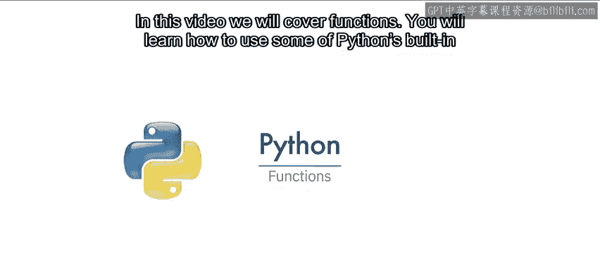

---

## 什么是函数？🤔

函数接收一些输入，然后产生一些输出或引发一些改变。函数本质上是一段可以重复使用的代码。你可以实现自己的函数，但在许多情况下，你会使用他人编写的函数。这时，你只需要知道函数如何工作，以及在某些情况下如何导入函数。

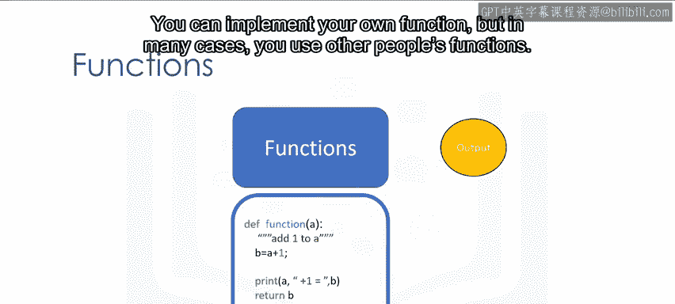

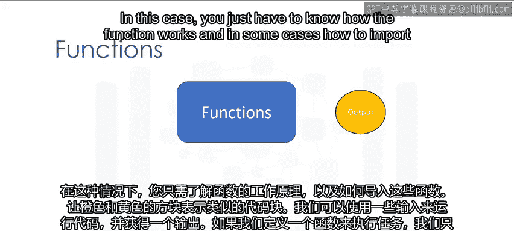

上一节我们介绍了函数的基本概念，本节中我们来看看函数如何简化代码。

## 函数如何简化代码

假设橙色和黄色的方块代表相似的代码块。我们可以运行这些代码，传入一些输入并获得输出。如果我们定义一个函数来执行这个任务，我们只需要调用这个函数。让小的方块代表用于调用函数的代码行。

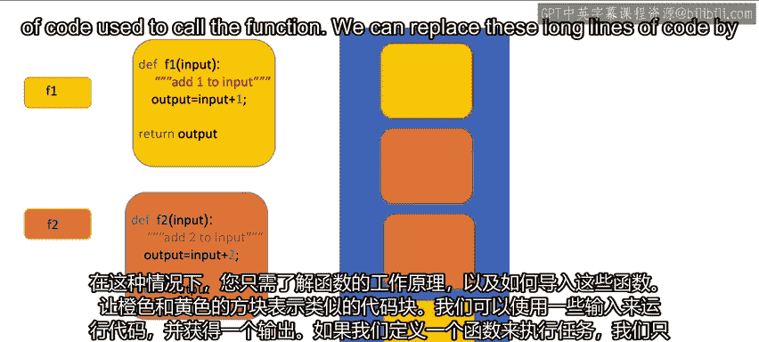

我们可以通过多次调用函数来替换这些冗长的代码行。现在，我们只需调用函数，代码就变得简短得多，但执行的任务完全相同。

## 函数的工作流程

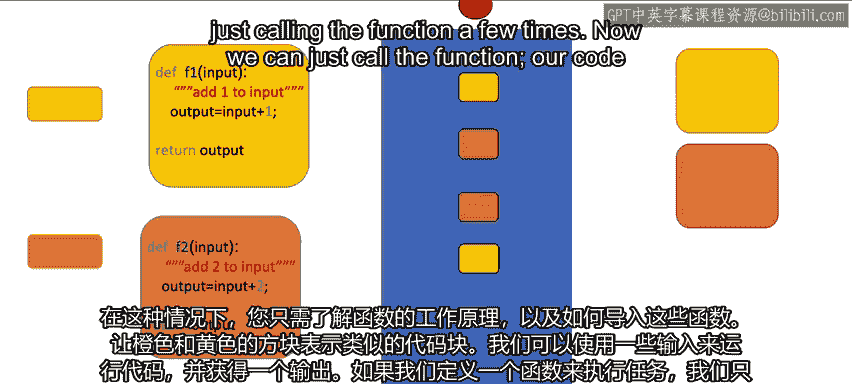

你可以将这个过程想象成这样：当我们调用函数 `F1` 时，我们将一个输入传递给函数。这些值被传递给你编写的所有代码行。函数返回一个值，你可以使用这个值。例如，你可以将这个值输入到一个新函数 `F2` 中。当我们调用这个新函数 `F2` 时，该值被传递到另一组代码行。函数返回一个值。这个过程不断重复，将值传递给你调用的函数。你可以保存这些函数并重复使用，或者使用他人的函数。

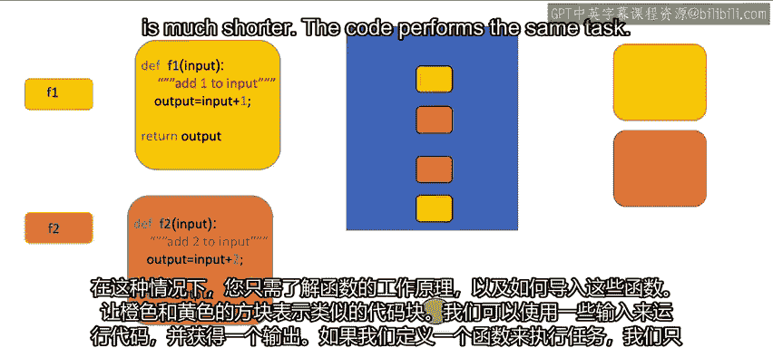

---

## Python内置函数

Python有许多内置函数。你不需要知道这些函数内部如何工作，只需要知道它们执行什么任务。

以下是几个常用内置函数的例子：

### `len()` 函数

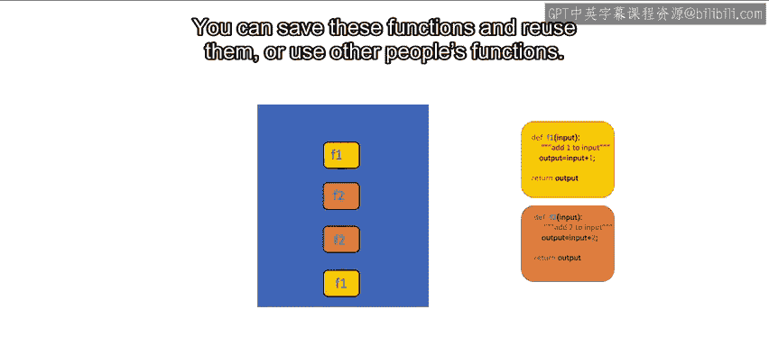

`len()` 函数接收一个序列类型（如字符串或列表）或集合类型（如字典或集合）的输入，并返回该序列或集合的长度。

考虑以下列表：

```python
album_ratings = [10.0, 8.5, 9.5, 7.0, 7.0, 9.5, 9.0, 9.5]
```

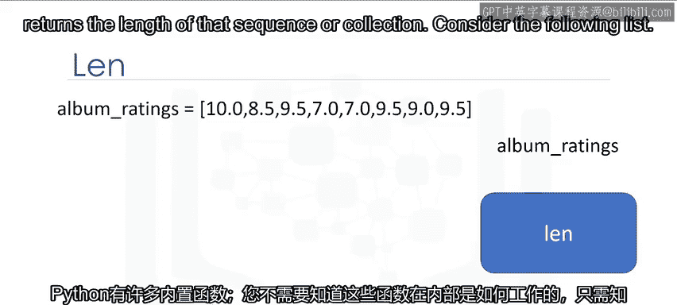

`len()` 函数将此列表作为参数，我们将结果赋值给变量 `L`。函数确定列表中有8个项目，然后返回列表的长度，即 `8`。

### `sum()` 函数

`sum()` 函数接收一个可迭代对象（如元组或列表），并返回所有元素的总和。

考虑以下列表：

```python
ratings_sum = sum(album_ratings)
```

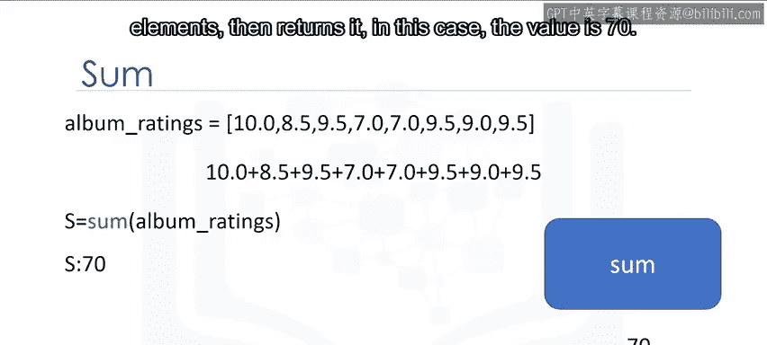

我们将列表传入 `sum()` 函数，并将结果赋值给变量 `S`。函数确定所有元素的总和，然后返回它。在这个例子中，值是 `70`。

---

## 列表排序的两种方法

有两种方法可以对列表进行排序。第一种是使用 `sorted()` 函数，第二种是使用列表的 `sort()` 方法。方法与函数类似。

让我们用一个例子来说明它们的区别。

### 使用 `sorted()` 函数

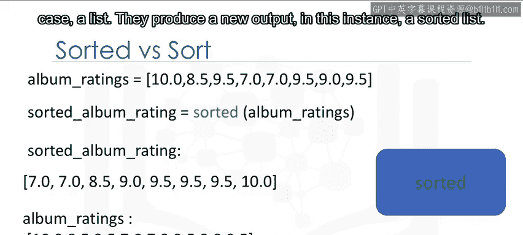

`sorted()` 函数返回一个新的已排序列表或元组。考虑列表 `album_ratings`：

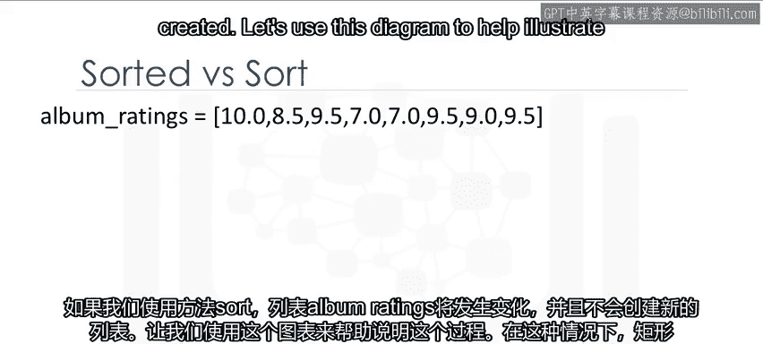

```python
sorted_album_ratings = sorted(album_ratings)
```

我们可以对列表 `album_ratings` 应用 `sorted()` 函数，得到一个新的列表 `sorted_album_rating`。结果是一个新的已排序列表。如果我们查看原始列表 `album_ratings`，它没有改变。

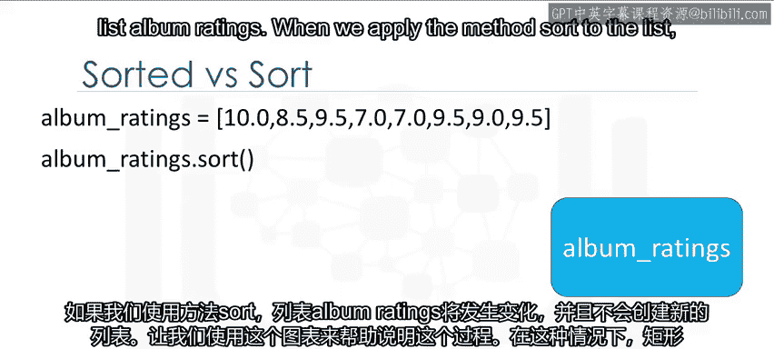

通常，函数接收一个输入（这里是一个列表），并产生一个新的输出（这里是一个已排序的列表）。

### 使用 `sort()` 方法

如果我们使用 `sort()` 方法，列表 `album_ratings` 本身会改变，并且不会创建新的列表。

```python
album_ratings.sort()
```

让我们用图表来帮助说明这个过程。在这个例子中，矩形代表列表 `album_ratings`。当我们对列表应用 `sort()` 方法时，列表 `album_ratings` 发生了变化。

与之前的情况不同，我们看到列表 `album_ratings` 已经改变。在这种情况下，没有创建新的列表。

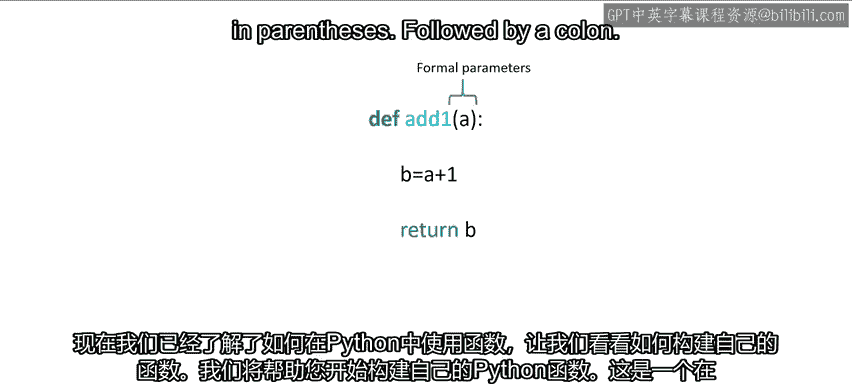

---

## 构建自己的函数

现在我们已经介绍了如何在Python中使用函数，让我们看看如何构建自己的函数。

我们将引导你开始在Python中构建自己的函数。

### 一个简单的函数示例

这是一个Python函数的例子，它返回输入值加一的结果。要定义一个函数，我们以关键字 `def` 开始。

函数名应描述其功能。我们在括号内有函数的形式参数 `a`，后面跟着一个冒号。

```python
def add_one(a):
    b = a + 1
    return b
```

我们有一个带缩进的代码块。在这个例子中，我们将 `a` 加一，并将结果赋值给 `b`。然后我们返回或输出 `b` 的值。

定义函数后，我们可以调用它。

```python
result = add_one(5)
# result 现在是 6
```

函数会将1加到5上，并返回6。我们可以再次调用这个函数，这次将其赋值给变量 `c`。

```python
c = add_one(10)
# c 现在是 11
```

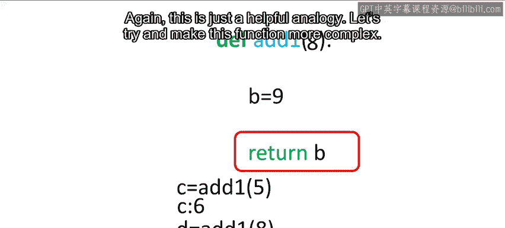

### 函数调用过程详解

让我们详细了解一下调用函数时的过程。需要注意的是，这是Python的一个简化模型，Python底层的工作方式并非完全如此。

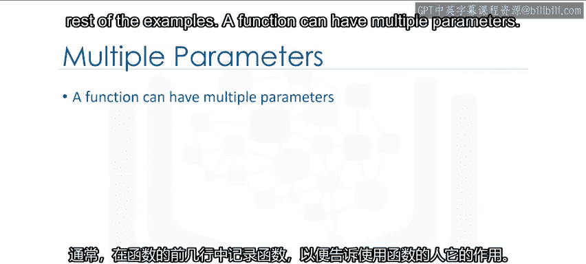

我们调用函数，并给它输入 `5`。可以认为值 `5` 被传递给了函数。现在，执行一系列命令。`a` 的值是 `5`，`b` 将被赋值为 `6`。然后我们返回 `b` 的值。在这种情况下，由于 `b` 被赋值为 `6`，函数返回 `6`。

如果我们再次调用该函数，过程会重新开始。我们传入一个 `8`，执行后续操作。上一次调用中发生的一切都会再次发生，只是 `a` 的值不同。函数返回一个值，这里是 `9`。再次强调，这只是一个有帮助的类比。

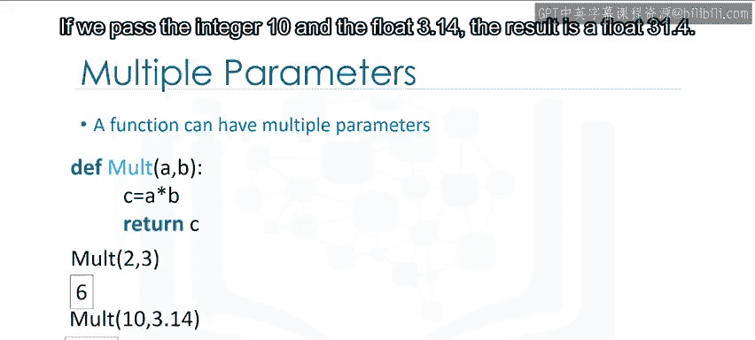

### 添加函数文档

让我们尝试让这个函数更复杂一些。习惯上，在函数的前几行编写文档。这告诉任何使用该函数的人它的作用。这个文档用三引号包围。

你可以使用 `help` 命令在函数上显示文档，如下所示：

```python
def add_one(a):
    """
    此函数接收一个数字，并返回该数字加一的结果。
    """
    b = a + 1
    return b

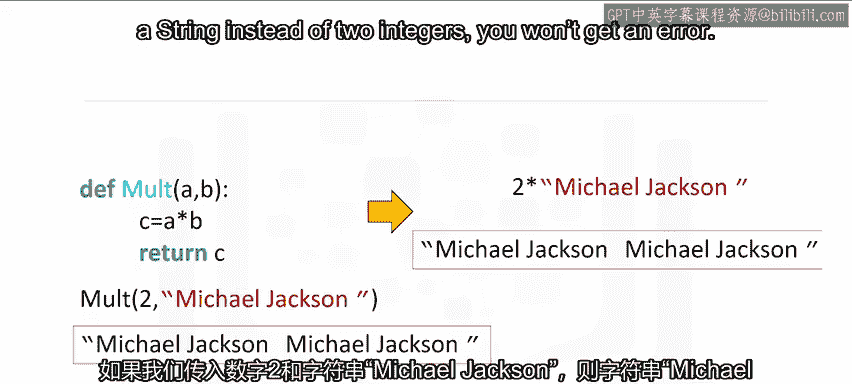

help(add_one)
```

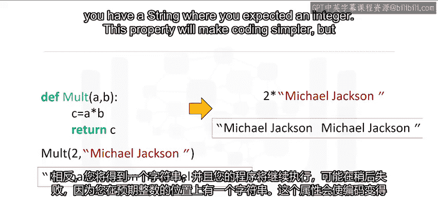

这将打印出函数名和文档。在其余示例中，我们将不包含文档。

### 具有多个参数的函数

一个函数可以有多个参数。函数 `mult` 将两个数字相乘，换句话说，它找到它们的乘积。

```python
def mult(a, b):
    c = a * b
    return c
```

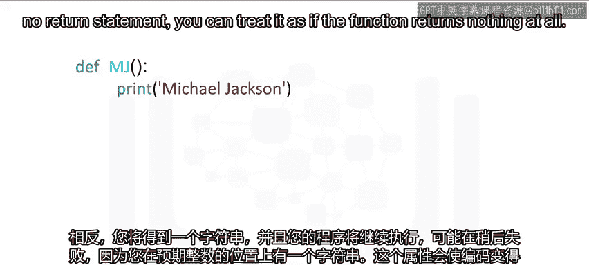

如果我们传入整数 `2` 和 `3`，结果是一个新的整数 `6`。如果我们传入整数 `10` 和浮点数 `3.14`，结果是一个浮点数 `31.4`。

如果我们传入整数 `2` 和字符串 `"Michael Jackson"`，字符串 `"Michael Jackson"` 会被重复两次。这是因为乘法符号也可以表示重复一个序列。

如果你不小心用一个整数乘以一个字符串，而不是两个整数相乘，你不会得到错误。相反，你会得到一个字符串，你的程序可能会继续运行，但之后可能会失败，因为你在期望整数的地方得到了一个字符串。

这个特性会使编码更简单，但你必须更彻底地测试你的代码。

---

## 没有返回语句的函数

在许多情况下，函数没有 `return` 语句。在这些情况下，Python将返回特殊的 `None` 对象。实际上，如果你的函数没有 `return` 语句，你可以将其视为函数根本不返回任何内容。

函数 `MJ` 只是打印名字 `"Michael Jackson"`。我们调用该函数，函数打印出 `"Michael Jackson"`。

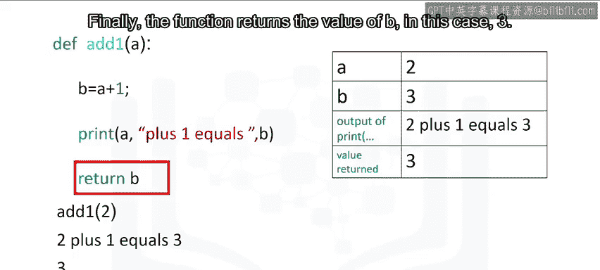

```python
def MJ():
    print("Michael Jackson")

MJ()
```

让我们定义一个函数 `no_work`，它不执行任何任务。Python不允许函数有空的主体，所以我们可以使用关键字 `pass`，它不做任何事情，但满足非空主体的要求。

```python
def no_work():
    pass

print(no_work())
```

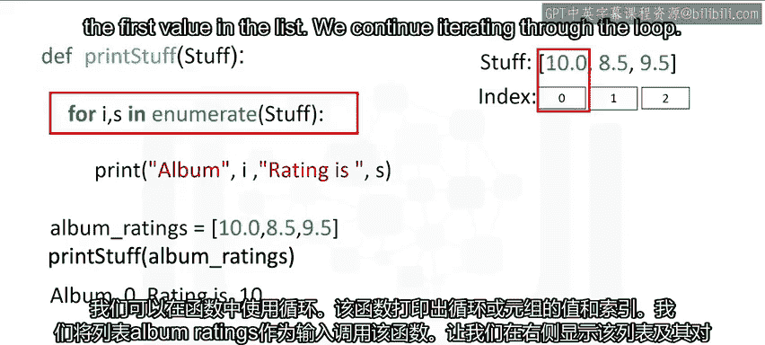

如果我们调用这个函数并打印它，函数返回 `None`。在后台，如果没有调用 `return` 语句，Python会自动返回 `None`。

将函数 `no_work` 视为具有以下 `return` 语句是有帮助的：

```python
def no_work():
    return None
```

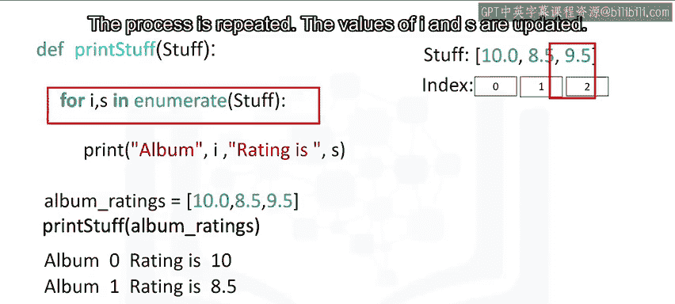

通常，函数执行多个任务。这个函数打印一条语句，然后返回一个值。

```python
def print_and_return(a):
    b = a + 1
    print(f"输入是 {a}，输出是 {b}")
    return b
```

让我们用这个表格来表示函数被调用时的不同值。我们以输入 `2` 调用函数。我们找到 `b` 的值。函数打印带有 `a` 和 `b` 值的语句。最后，函数返回 `b` 的值，在这个例子中是 `3`。

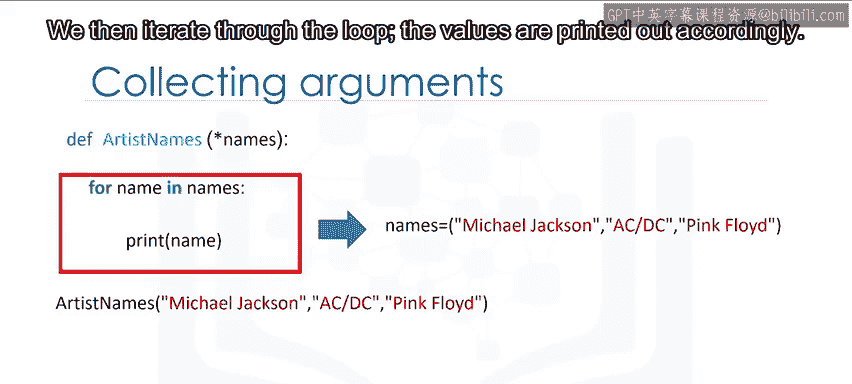

---

## 在函数中使用循环

这个函数打印出列表或元组的值和索引。我们以列表 `album_ratings` 作为输入调用该函数。

```python
def print_ratings(ratings):
    for i, s in enumerate(ratings):
        print(f"索引 {i}: 评分 {s}")

album_ratings = [10.0, 8.5, 9.5, 7.0, 7.0, 9.5, 9.0, 9.5]
print_ratings(album_ratings)
```

让我们在右侧显示列表及其对应的索引。`st` 用作函数 `enumerate` 的输入。这个操作会将索引传递给 `i`，将列表中的值传递给 `s`。

函数将开始遍历循环。函数将打印第一个索引和列表中的第一个值。我们继续遍历循环。`i` 和 `s` 的值被更新。到达 `print` 语句。类似地，打印列表和索引的下一个值。重复这个过程，直到打印出列表中的最终值。

---

## 可变参数

可变参数允许我们输入可变数量的元素。考虑以下函数。该函数在参数名 `names` 前有一个星号。

```python
def print_names(*names):
    for name in names:
        print(name)

print_names("Michael", "Janet", "Tito")
```

当我们调用该函数时，三个参数被打包到元组 `names` 中。然后我们遍历循环，相应地打印出值。

如果我们用仅两个参数作为输入调用同一个函数，变量 `names` 只包含两个元素。结果是只打印出两个值。

---

## 变量的作用域

变量的作用域是程序中该变量可被访问的部分。在任何函数外部定义的变量被称为在全局作用域内，这意味着在它们定义之后，可以在任何地方访问它们。

这里我们有一个函数，它将字符串 `"DC"` 添加到参数 `x` 中。当我们到达将 `x` 的值设置为 `"AC"` 的部分时，这是在全局作用域内，意味着 `x` 在定义后可以在任何地方访问。

在全局作用域内定义的变量称为全局变量。当我们调用函数时，我们进入一个新的作用域，即 `add_DC` 的作用域。我们传递一个参数给 `add_DC` 函数，在这个例子中是 `"AC"`。在函数的作用域内，`x` 的值被设置为 `"ACDC"`。函数返回值并赋值给 `z`。在全局作用域内，`z` 的值被设置为 `"A, DC"`。返回值后，函数的作用域被删除。

局部变量只存在于函数的作用域内。考虑函数 `thriller`。局部变量 `date` 被设置为 `1982`。当我们调用该函数时，我们创建了一个新的作用域。在那个函数的作用域内，`date` 的值被设置为 `1982`。`date` 的值在全局作用域内不存在。

全局作用域内的变量可以与局部作用域内的变量同名，而不会发生冲突。考虑函数 `thriller`。局部变量 `date` 被设置为 `1982`。全局变量 `date` 被设置为 `2017`。当我们调用该函数时，我们创建了一个新的作用域。在那个作用域内，`date` 的值被设置为 `1982`。如果我们调用该函数，它返回局部作用域内 `date` 的值，即 `1982`。当我们在全局作用域内打印时，我们使用全局变量的值。全局变量的值是 `2017`，因此该值被设置为 `2017`。

如果变量在函数内没有定义，Python将检查全局作用域。考虑函数 `ACDC`。该函数有一个变量 `rating`，但没有赋值。如果我们在全局作用域内定义变量 `rating`，然后调用该函数，Python会看到变量 `rating` 没有值。因此，Python会离开作用域，并检查变量 `ratings` 是否存在于全局作用域中。它将在 `ACDC` 的作用域内使用全局作用域中 `ratings` 的值。

在函数内部将打印出 `9`。全局作用域中 `z` 的值将是 `10`，因为我们加了一。`rating` 的值在全局作用域内将保持不变。

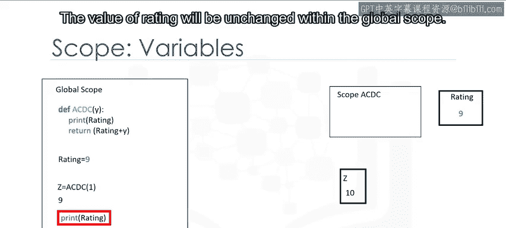

考虑函数 `pink_Floyd`。如果我们用关键字 `global` 定义变量 `claimed_sales`，该变量将是一个全局变量。我们调用函数 `pink_Floyd`。变量 `claimed_sales` 在全局作用域中被设置为字符串 `"45 million"`。当我们打印该变量时，我们得到的值是 `"45 million"`。

---

## 总结

本节课中我们一起学习了Python函数的核心概念。我们了解了函数如何接收输入并产生输出，从而简化代码。我们探讨了Python的内置函数，如 `len()` 和 `sum()`，以及列表排序的两种方法。更重要的是，我们学习了如何定义自己的函数，包括添加参数、编写文档以及理解变量的作用域。函数是构建复杂程序的基础模块，掌握它们对于后续的AI和机器人编程至关重要。

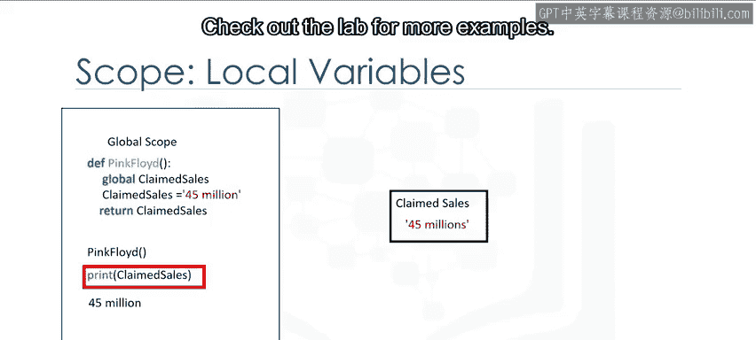

关于函数，你还可以做更多事情，请查看实验部分以获取更多示例。