# 076：Python中的对象与类 🧱

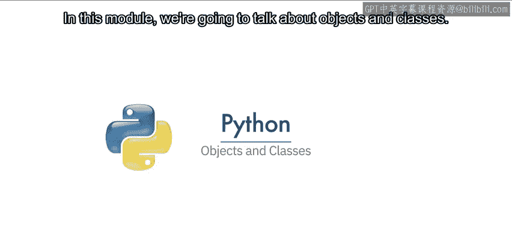

在本节课中，我们将要学习Python编程中两个核心概念：**对象**和**类**。我们将了解什么是对象，什么是类，以及如何创建和使用它们来构建更复杂、更有组织的程序。

---

## 概述：什么是对象？

Python中有许多不同的数据类型，例如整数、浮点数、字符串、列表和字典。在Python中，**每一种数据类型都是一个对象**。

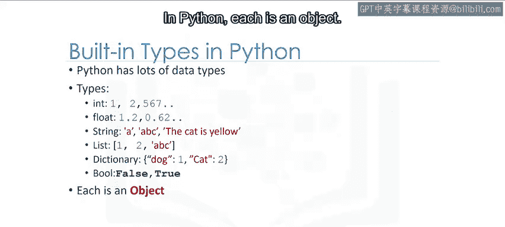

每个对象都包含以下内容：
*   **类型**：标识对象的种类。
*   **内部表示**：对象内部如何存储数据。
*   **方法**：一组用于与对象数据交互的函数。

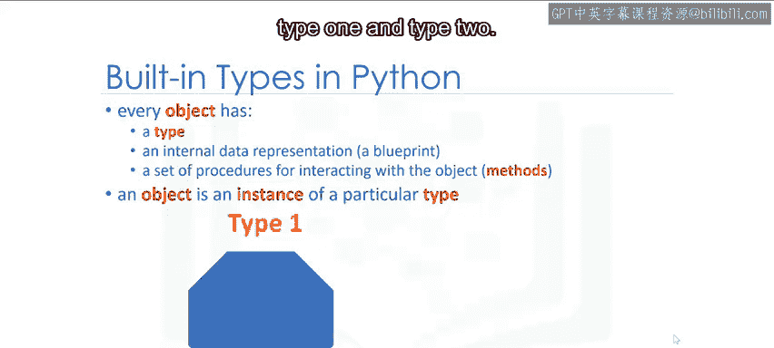

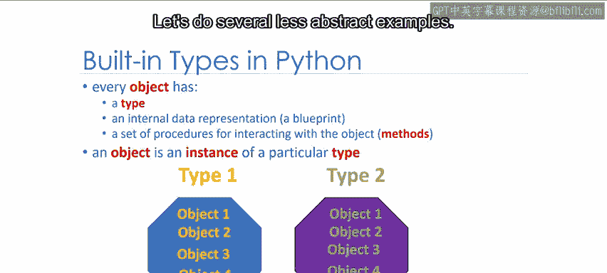

一个对象是某个特定类型的**实例**。例如，我们可以有“类型1”和“类型2”。可以有多个“类型1”的实例（对象），每个都是“类型1”的一个具体体现。

---

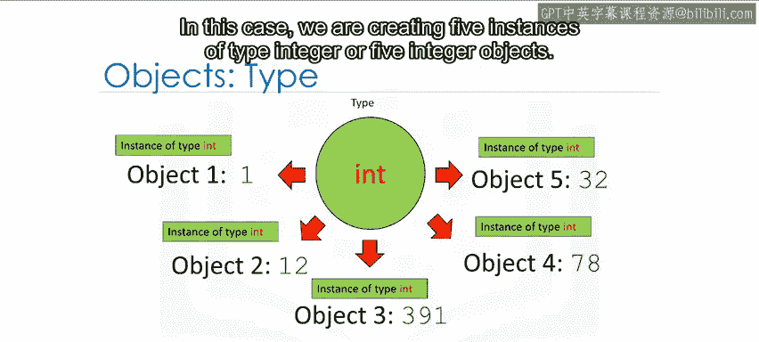

## 对象的实例

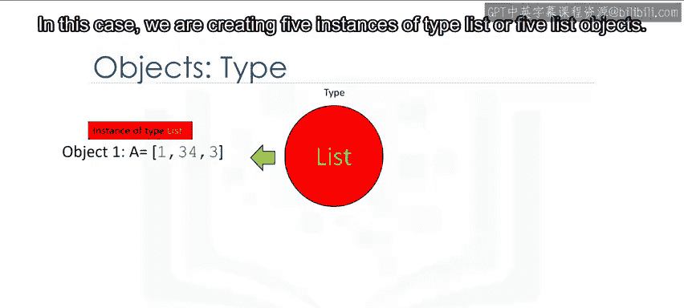

让我们看一些不那么抽象的例子。

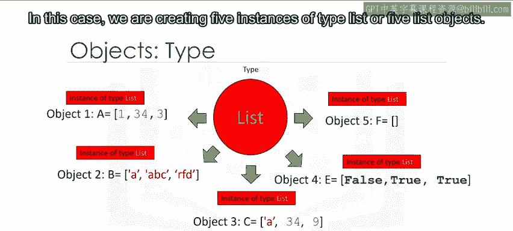

### 整数对象

每次创建一个整数时，我们都在创建一个整数类型的实例，或者说一个整数对象。例如，`5`、`10`、`-3` 等都是整数对象。

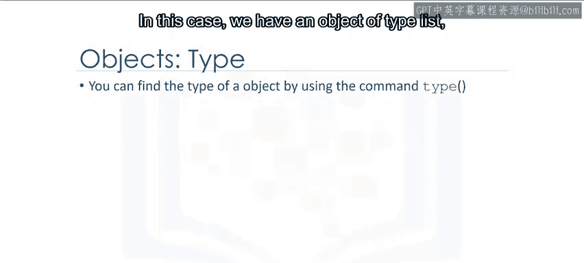

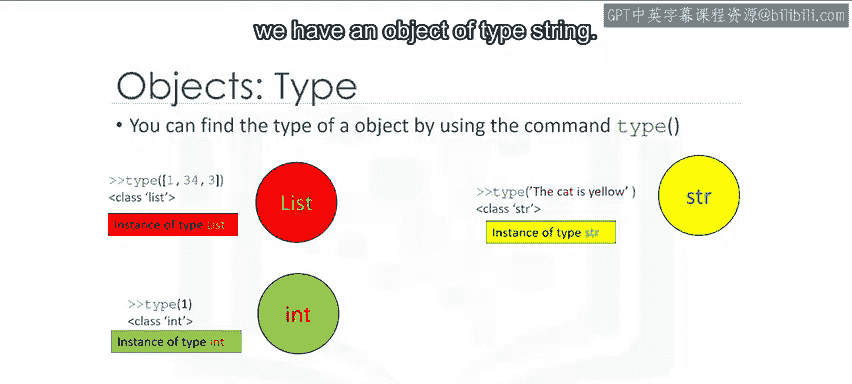

```python
x = 5  # 创建一个整数对象
```

### 列表对象

同样，每次创建一个列表时，我们都在创建一个列表类型的实例，或者说一个列表对象。

```python
my_list = [1, 2, 3]  # 创建一个列表对象
```

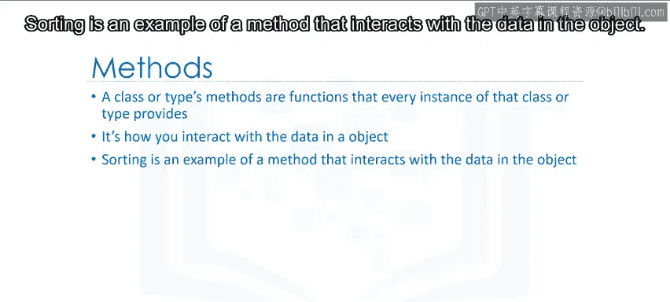

---

## 使用 `type()` 命令

我们可以使用 `type()` 命令来查看一个对象的类型。

```python
print(type([1, 2, 3]))   # 输出：<class 'list'>
print(type(5))           # 输出：<class 'int'>
print(type("hello"))     # 输出：<class 'str'>
print(type({"a": 1}))    # 输出：<class 'dict'>
```

---

## 什么是方法？

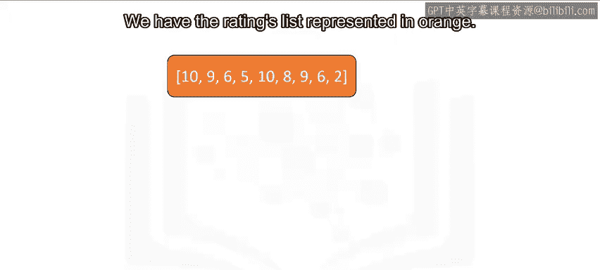

上一节我们介绍了对象的基本概念，本节中我们来看看如何与对象交互。**方法**是类或类型提供的函数，是该类所有实例都可以使用的功能。我们一直在使用方法。

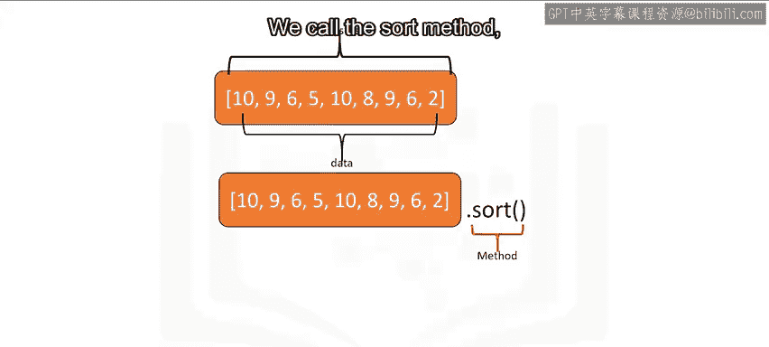

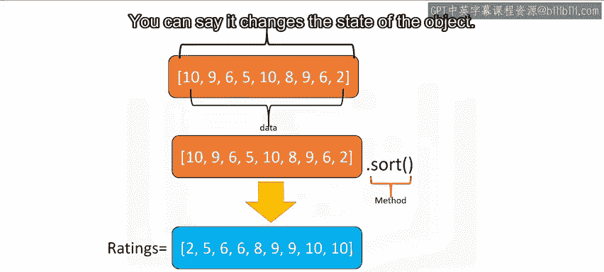

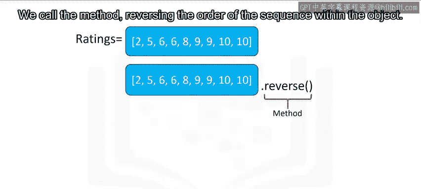

例如，列表有一个 `sort()` 方法，它可以与列表对象中的数据交互。

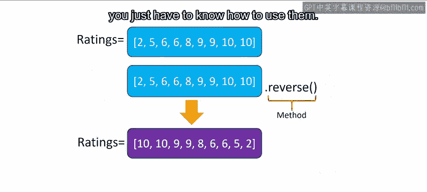

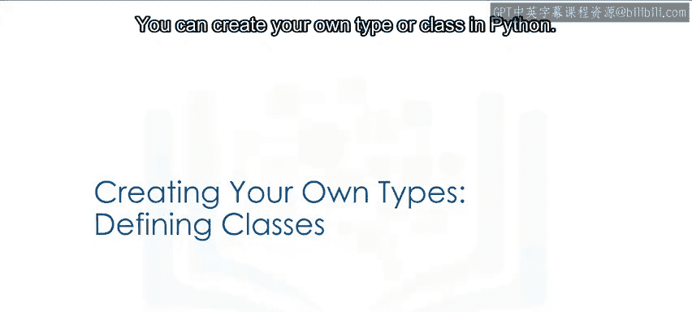

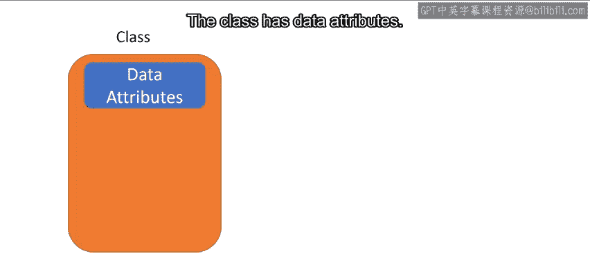

考虑一个列表 `ratings`，其数据是包含在列表中的一系列数字。`sort()` 方法会改变对象内部的数据（即改变对象的状态）。

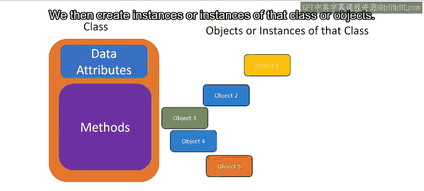

我们通过在对象名称后加一个点 `.`，然后跟上方法名和括号 `()` 来调用方法。

```python
ratings = [2, 5, 3, 1, 4]
ratings.sort()  # 调用 sort 方法，改变列表内部顺序
print(ratings)  # 输出：[1, 2, 3, 4, 5]
```

我们还可以调用 `reverse()` 方法，再次改变列表。

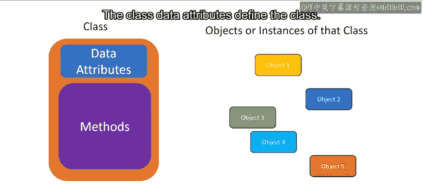

在许多情况下，你不需要了解类及其方法的内部工作原理，只需要知道如何使用它们。

---

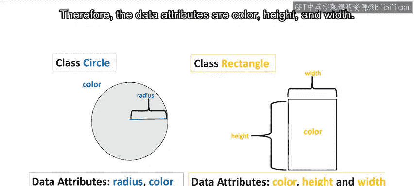

## 创建自定义类

接下来，我们将介绍如何构建你自己的类。你可以在Python中创建自己的类型或类。

在这一节，你将学习：
*   创建一个类。
*   为类定义**数据属性**。
*   为类定义**方法**。
*   然后创建该类的实例（即对象）。

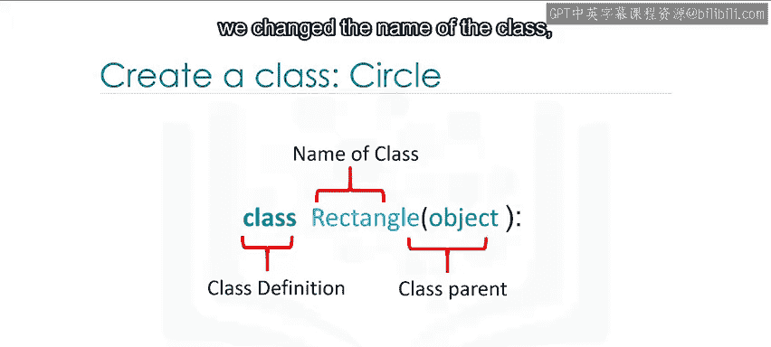

### 定义类的数据属性

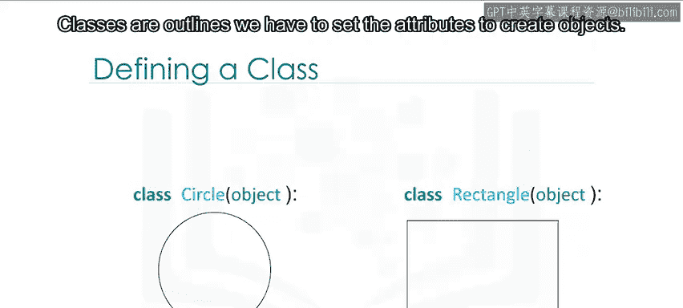

类的数据属性定义了类的构成。让我们创建两个类：`Circle`（圆形）和 `Rectangle`（矩形）。

**对于圆形**：观察图像，我们只需要一个**半径**来定义一个圆。我们还可以添加**颜色**属性，以便后期更容易区分类的不同实例。
因此，`Circle` 类的数据属性是：`radius`（半径）和 `color`（颜色）。

**对于矩形**：为了定义一个矩形，我们需要**高度**和**宽度**。同样，我们添加**颜色**属性以便区分。
因此，`Rectangle` 类的数据属性是：`color`（颜色）、`height`（高度）和 `width`（宽度）。

### 编写类定义

要创建 `Circle` 类，你需要包含类定义。这告诉Python你正在创建自己的类。

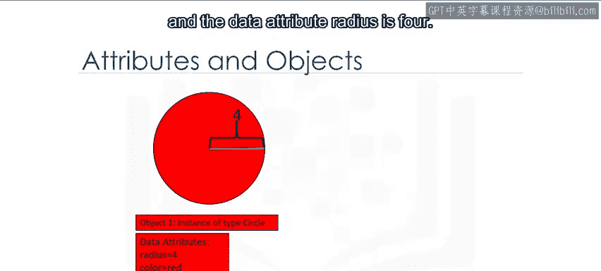

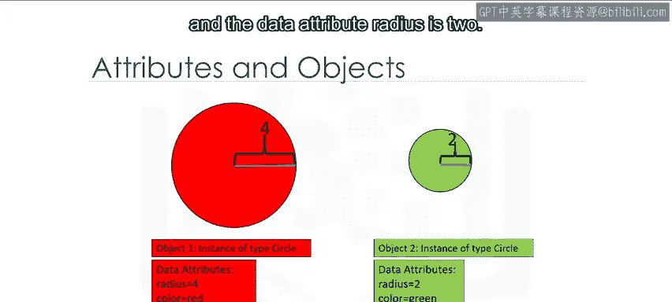

```python
class Circle(object):
    # 类的内容将在这里定义
```

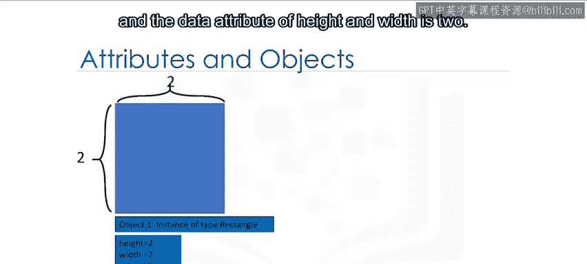

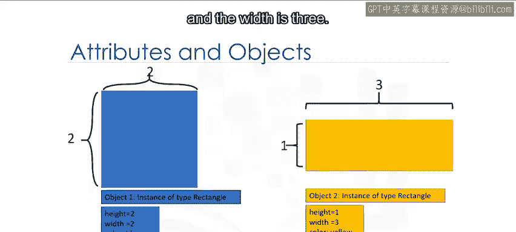

对于 `Rectangle` 类，我们改变类名，但结构相同。

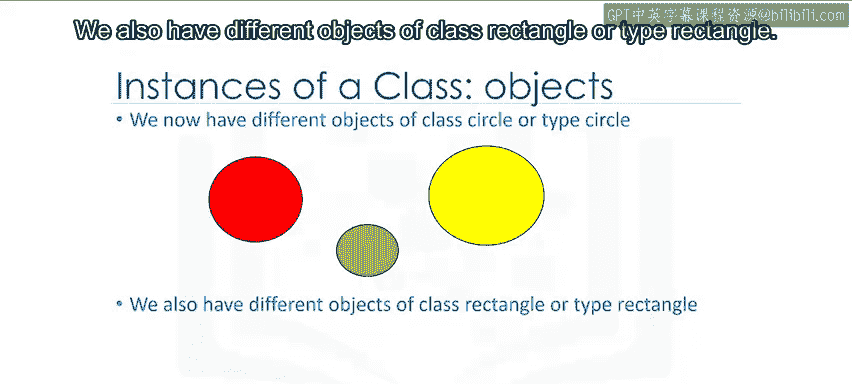

```python
class Rectangle(object):
    # 类的内容将在这里定义
```

类是一个蓝图，我们需要设置属性来创建对象。

---

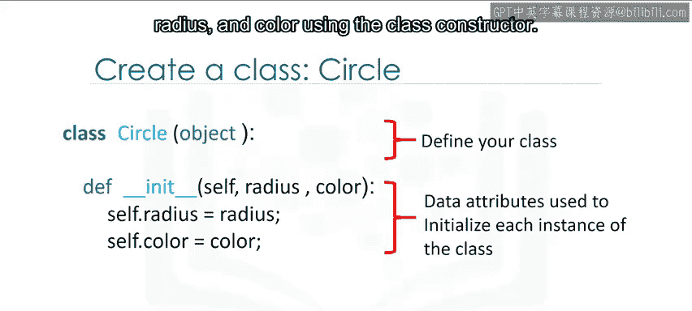

## 初始化对象：构造函数

让我们继续在Python中构建 `Circle` 类。我们定义类，然后使用类构造函数 `__init__` 来初始化每个类的实例。

`__init__` 函数是一个**构造函数**，它是一个特殊函数，告诉Python你正在创建一个新类。

```python
class Circle(object):
    def __init__(self, radius, color):
        self.radius = radius
        self.color = color
```

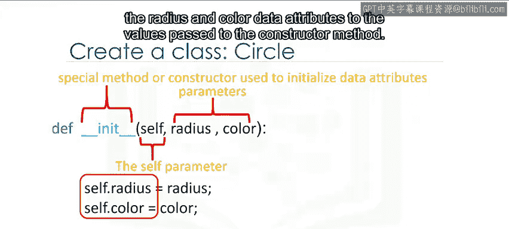

*   `self` 参数指的是新创建的类实例。
*   `radius` 和 `color` 参数用于初始化类实例的 `radius` 和 `color` 数据属性。

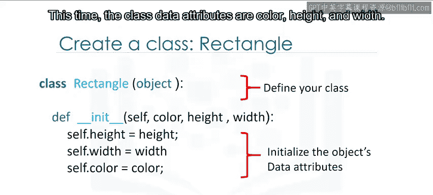

类似地，我们可以定义 `Rectangle` 类：

```python
class Rectangle(object):
    def __init__(self, color, height, width):
        self.color = color
        self.height = height
        self.width = width
```

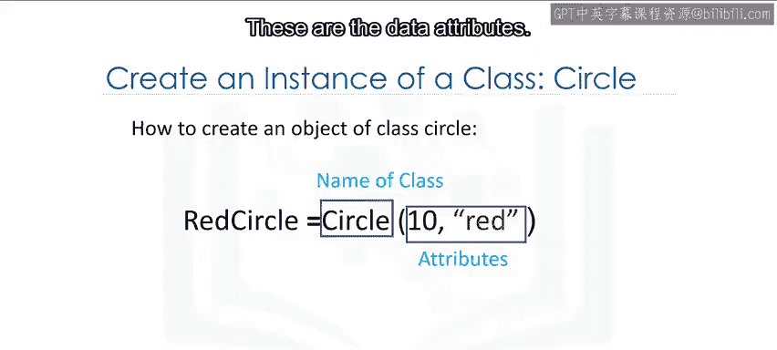

---

## 创建对象实例

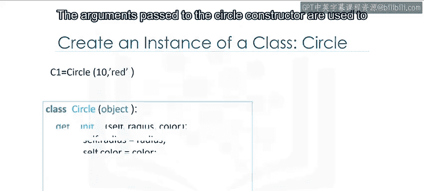

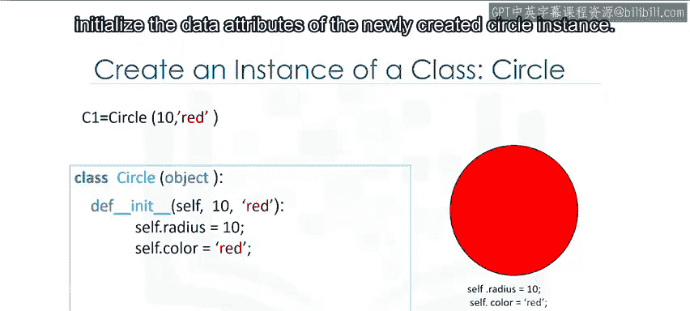

创建类之后，为了创建一个 `Circle` 类的对象，我们引入一个变量作为对象名，然后使用对象构造函数。

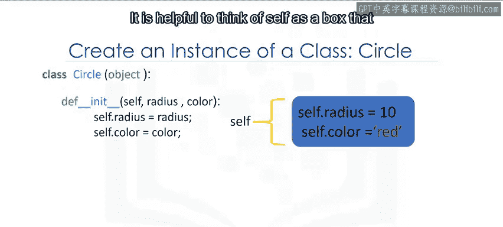

对象构造函数由类名和参数（即数据属性）组成。

```python
# 创建一个 Circle 对象
RedCircle = Circle(10, "red")
```

当我们创建一个圆对象时，我们像调用函数一样调用代码。传递给 `Circle` 构造函数的参数用于初始化新创建的圆实例的数据属性。

可以将 `self` 想象成一个包含对象所有数据属性的盒子。

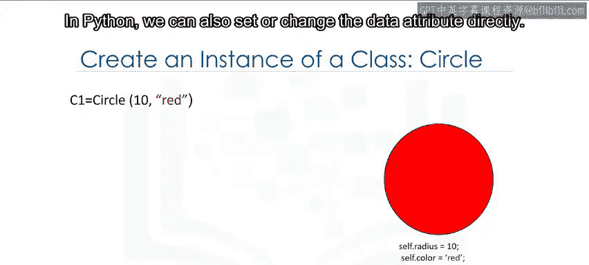

---

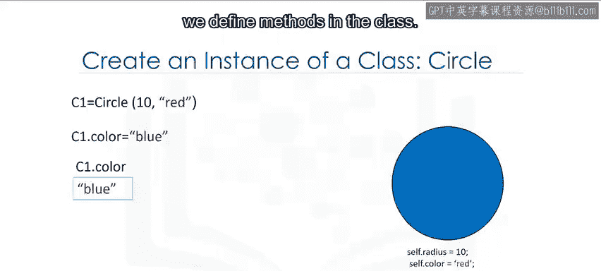

## 访问和修改属性

输入对象名，后跟一个点 `.` 和数据属性名，可以获取数据属性的值。

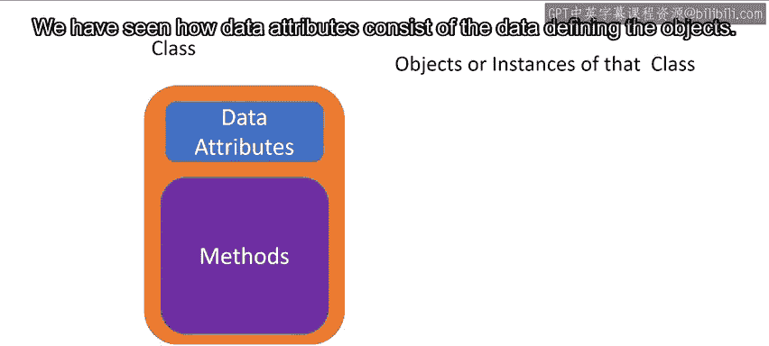

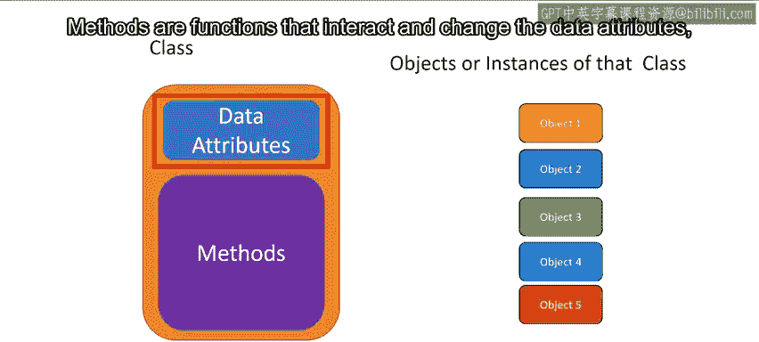

```python
print(RedCircle.radius)  # 输出：10
print(RedCircle.color)   # 输出：'red'
```

在Python中，我们也可以直接设置或更改数据属性。

```python
RedCircle.color = "blue"  # 直接修改颜色属性
print(RedCircle.color)    # 输出：'blue'
```

通常，为了改变对象中的数据，我们在类中定义方法。让我们来讨论方法。

---

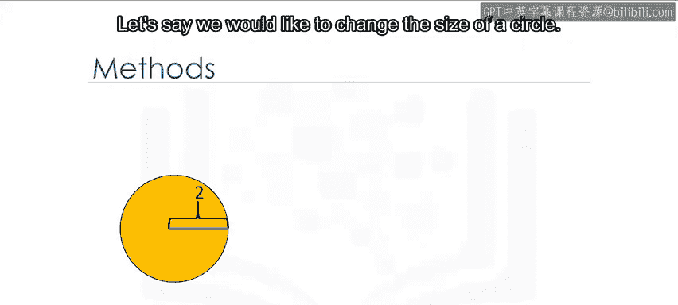

## 为类添加方法

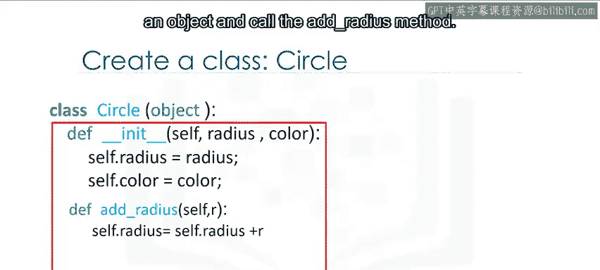

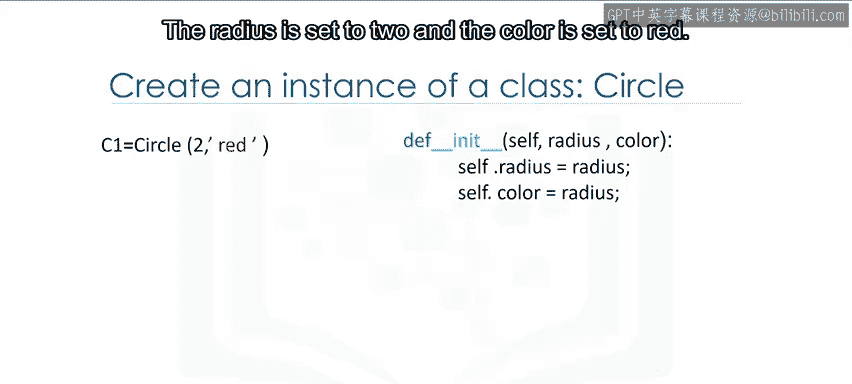

我们已经看到数据属性如何构成定义对象的数据。**方法**是与数据属性交互并改变它们的函数。

假设我们想改变一个圆的大小，这涉及到改变 `radius` 属性。我们给 `Circle` 类添加一个 `add_radius` 方法。

```python
class Circle(object):
    def __init__(self, radius, color):
        self.radius = radius
        self.color = color

    def add_radius(self, r):
        self.radius = self.radius + r
```

该方法是一个函数，需要 `self` 参数以及其他参数（这里是 `r`）。它将 `r` 的值加到数据属性 `radius` 上。

让我们看看这部分代码在创建对象和调用 `add_radius` 方法时如何工作。

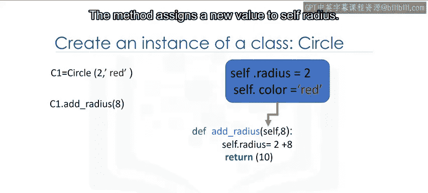

```python
# 创建对象
RedCircle = Circle(2, "red")

# 调用方法
RedCircle.add_radius(8)
print(RedCircle.radius)  # 输出：10
```

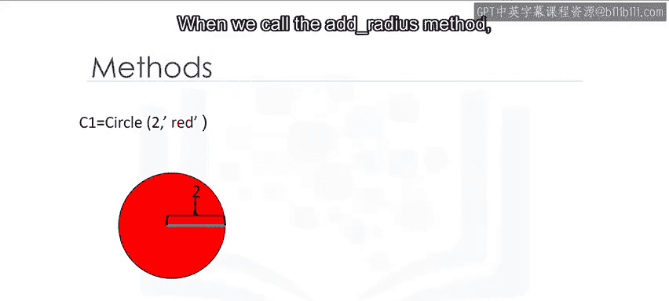

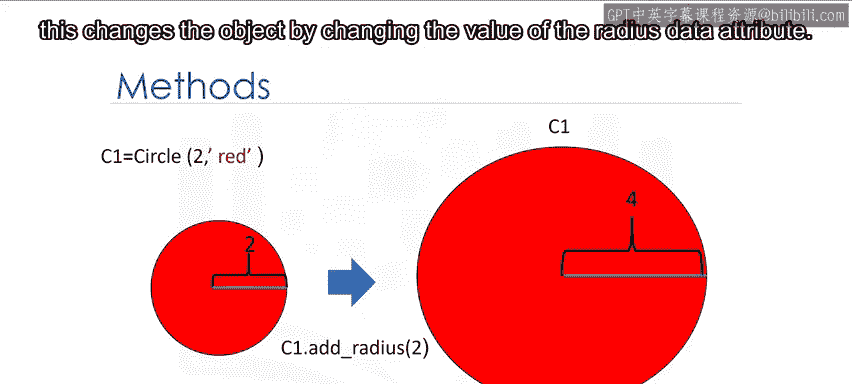

我们通过添加点 `.` 后跟方法名和括号来调用方法。调用方法时，我们不需要担心 `self` 参数，Python会为我们处理。

---

## 实践示例与总结

在实验环节，我们还会创建一个名为 `draw_circle` 的方法（具体实现见实验）。我们可以创建新的 `Circle` 类型对象，访问其数据属性，并使用方法。

以下是创建和使用对象的总结步骤：

1.  **创建 Circle 对象**：
    ```python
    RedCircle = Circle(3, "red")
    BlueCircle = Circle(10, "blue")
    ```

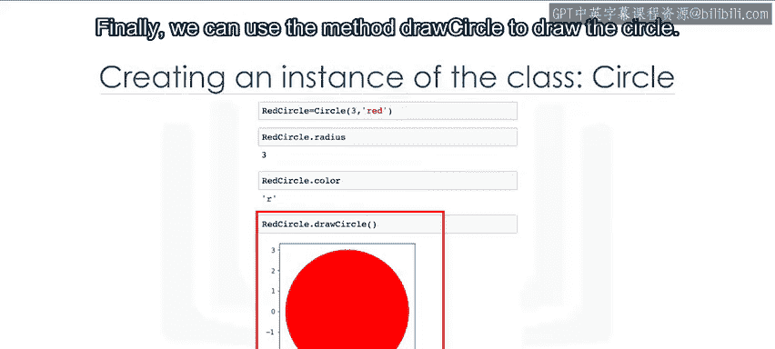

2.  **访问数据属性**：
    ```python
    print(RedCircle.radius)  # 输出：3
    print(BlueCircle.color)  # 输出：'blue'
    ```

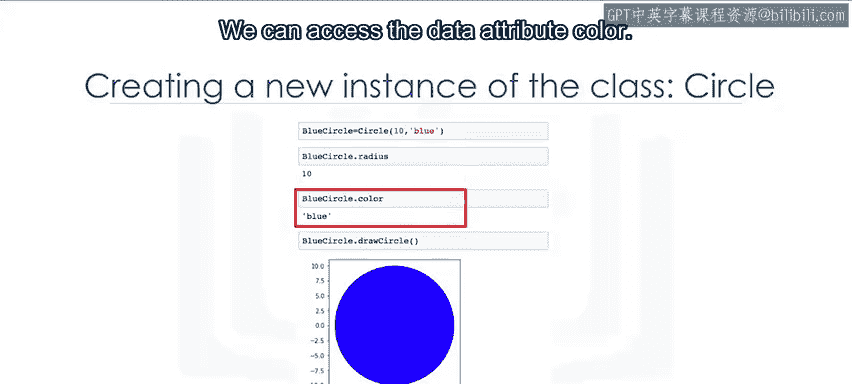

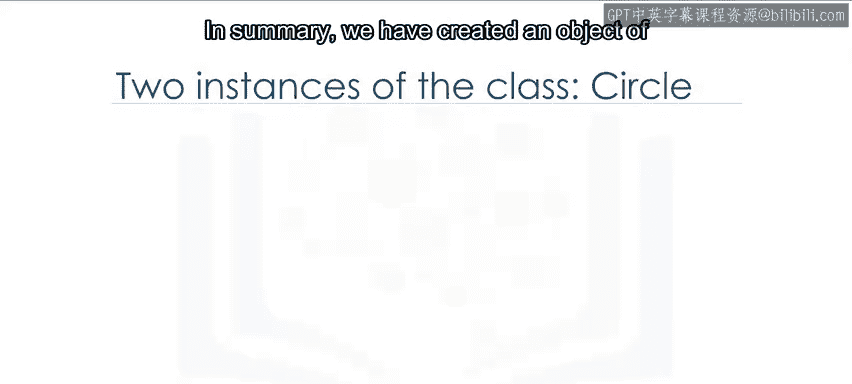

3.  **调用方法**：
    ```python
    RedCircle.draw_circle()  # 绘制圆形
    ```

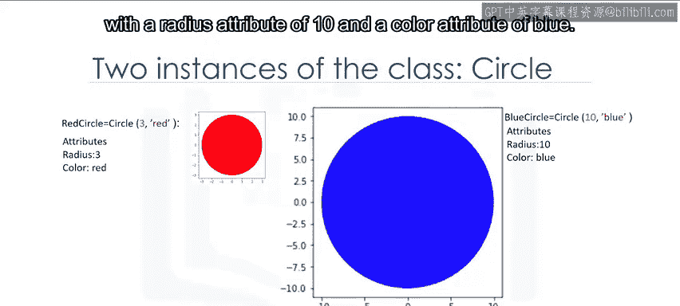

对于 `Rectangle` 类也是类似的，我们可以创建对象，访问 `height`、`width`、`color` 属性，并调用 `draw_rectangle` 方法。

---

## 使用 `dir()` 函数

`dir()` 函数对于获取与类相关的数据属性和方法列表非常有用。将你感兴趣的对象作为参数传递，返回值是该对象的数据属性和方法列表。

```python
print(dir(RedCircle))
```

被下划线包围的属性（如 `__init__`）是内部使用的，通常不需要担心。那些看起来常规的属性才是你应该关注的，它们是对象的方法和数据属性。

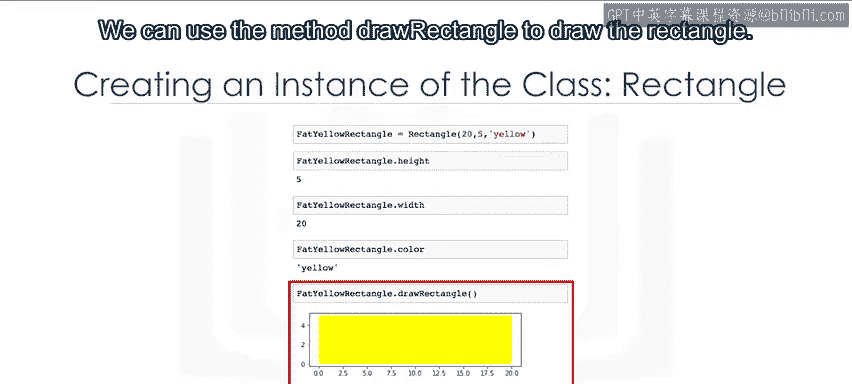

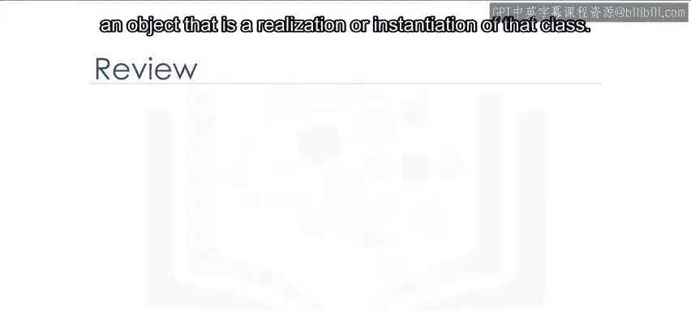

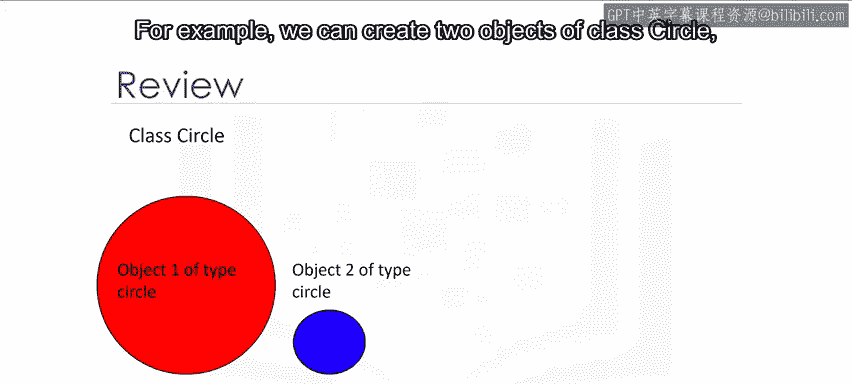

---

## 总结

在本节课中，我们一起学习了：
*   **对象**是Python中数据的具体实例，拥有类型、内部数据和方法。
*   **类**是创建对象的蓝图或模板，定义了对象将拥有哪些数据属性和方法。
*   如何使用 `__init__` **构造函数**来初始化新对象。
*   如何定义和调用**方法**来与对象的数据进行交互。
*   如何创建类的多个**实例**（对象）。
*   使用 `dir()` 函数来探索对象的属性和方法。

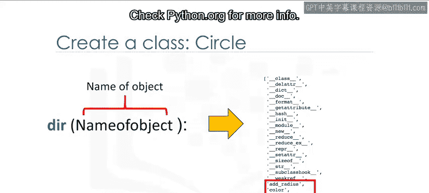

掌握对象和类是进行面向对象编程的基础，它能帮助你构建更模块化、可重用和易于维护的代码。Python官方文档是获取更多信息的绝佳资源。