# 078：使用open函数写入文件 📝

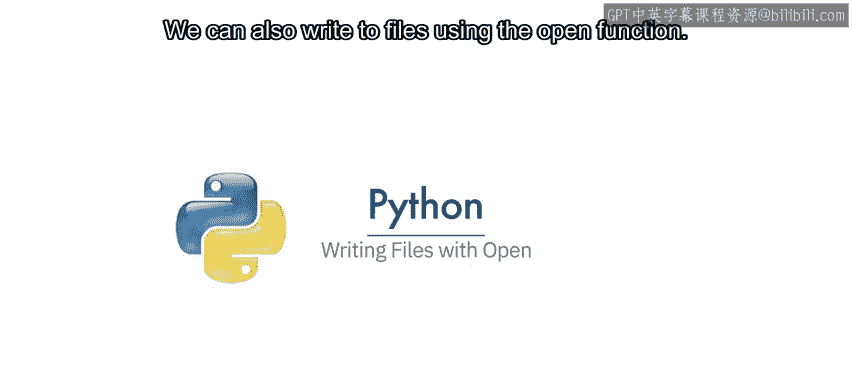

在本节课中，我们将学习如何使用Python的`open`函数向文件写入数据。我们将涵盖创建新文件、写入文本、追加内容以及复制文件等基本操作。

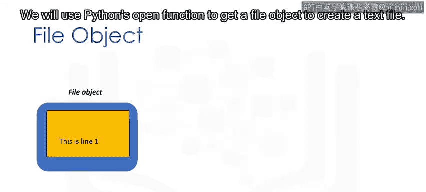

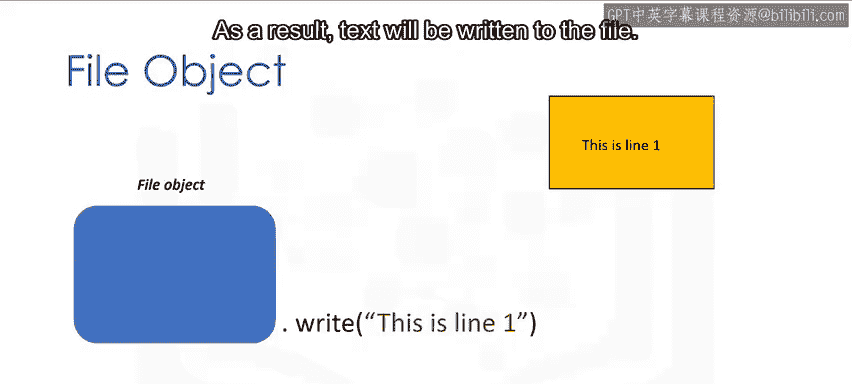

---

## 使用open函数写入文件

我们同样可以使用`open`函数来写入文件。

我们将使用Python的`open`函数获取一个文件对象，以创建一个文本文件。我们可以应用`write`方法将数据写入该文件。最终，文本将被写入文件中。

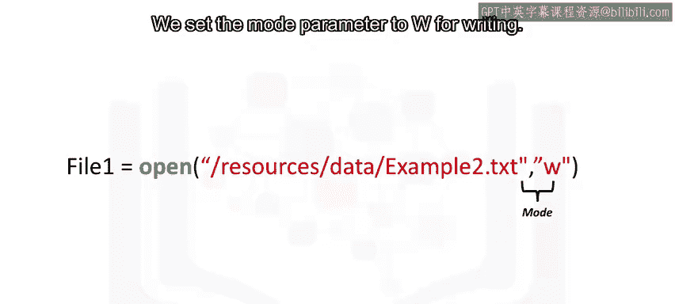

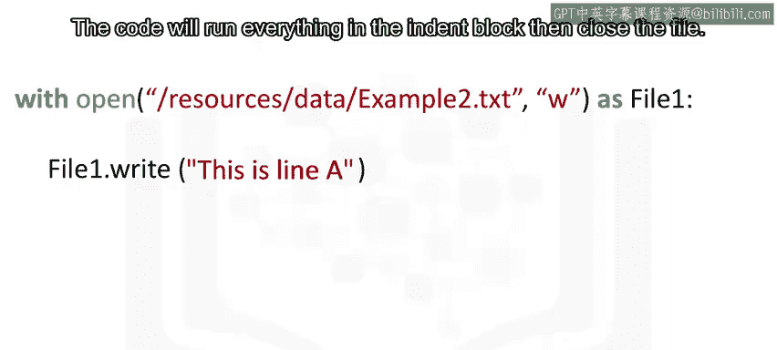

以下是创建文件`example2.txt`的步骤。我们使用`open`函数，第一个参数是文件路径，它由文件名组成。如果该文件已存在于您的目录中，它将被覆盖。我们将模式参数设置为`"w"`以表示写入。最后，我们获得文件对象。

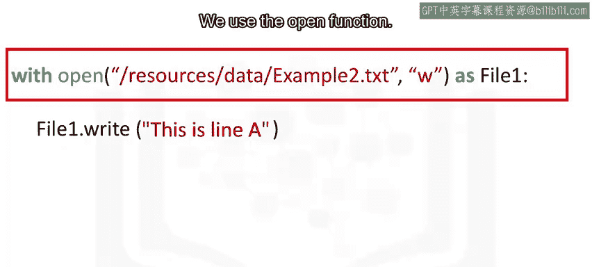

与之前一样，我们使用`with`语句。代码将运行缩进块中的所有内容，然后关闭文件。我们创建文件对象`file1`。

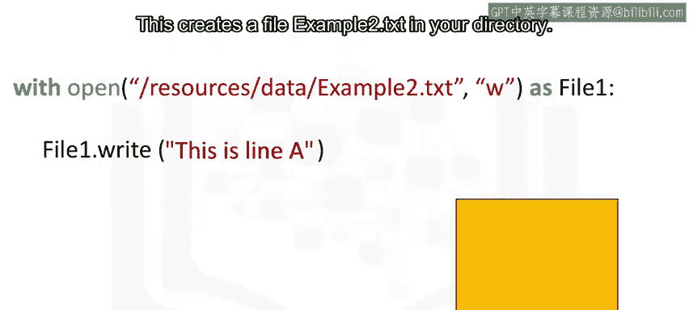

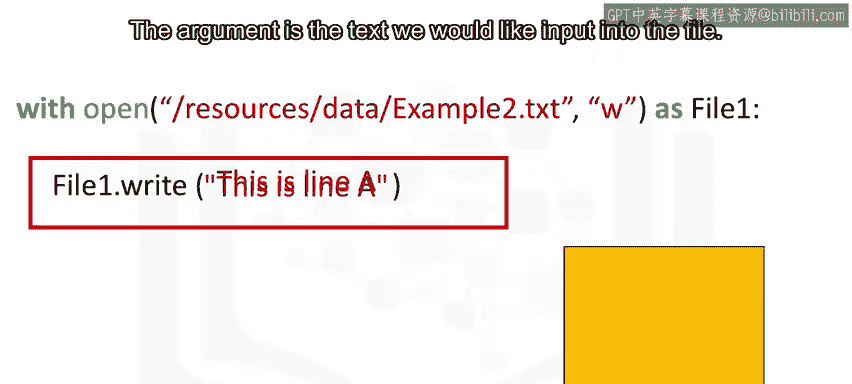

我们使用`open`函数。这将在您的目录中创建一个名为`example2.txt`的文件。我们使用`write`方法将数据写入文件。

该方法的参数是我们希望输入到文件中的文本。

如果我们连续使用`write`方法，每次调用时它都会写入文件。第一次调用时，我们将写入`"this is line A\n"`，其中`\n`表示新的一行。第二次调用该方法时，它将写入`"this is line B"`。然后文件将被关闭。

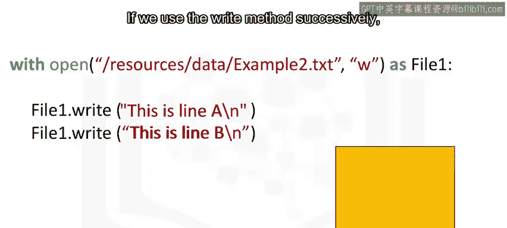

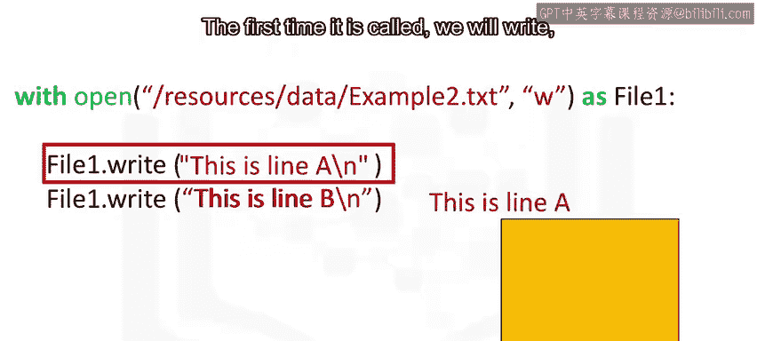

---

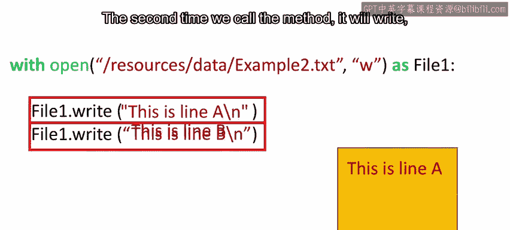

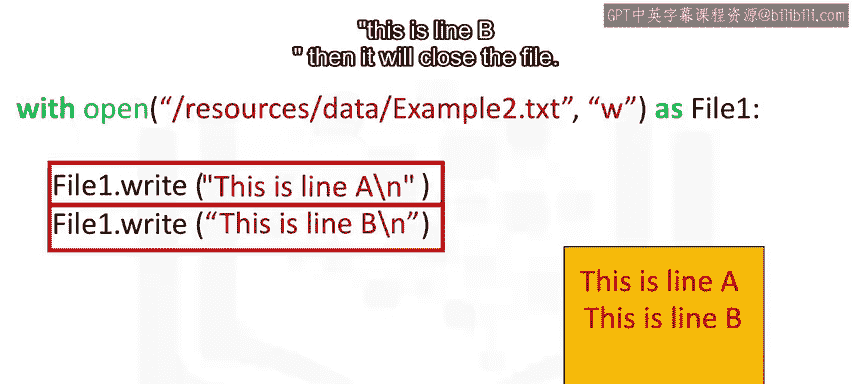

## 将列表内容写入文件

我们可以将列表中的每个元素写入文件。

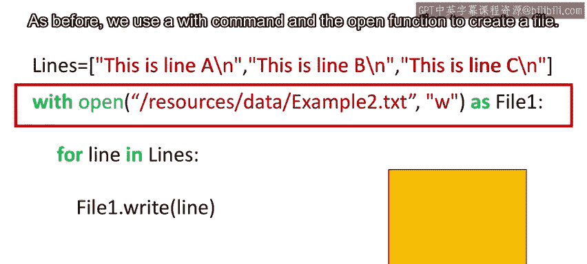

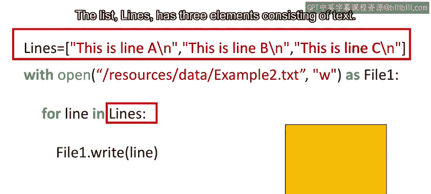

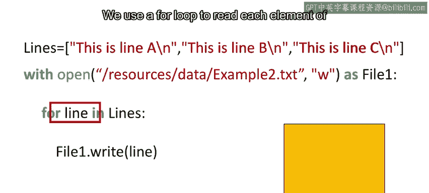

与之前一样，我们使用`with`命令和`open`函数来创建一个文件。列表`lines`包含三个文本元素。我们使用`for`循环读取列表`lines`的每个元素，并将其传递给变量`line`。

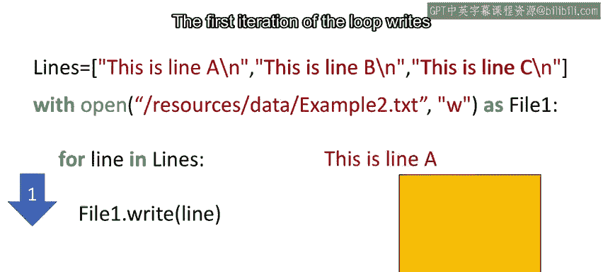

循环的第一次迭代将列表的第一个元素写入文件`example2`。第二次迭代写入列表的第二个元素，依此类推。循环结束时，文件将被关闭。

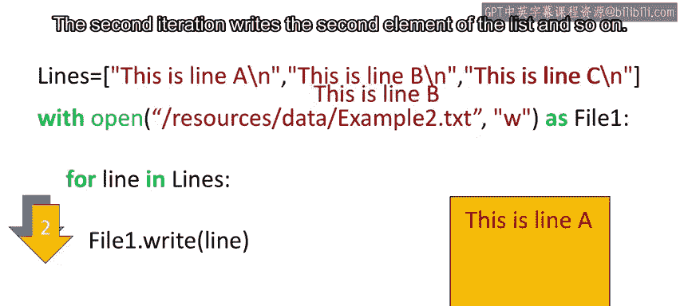

---

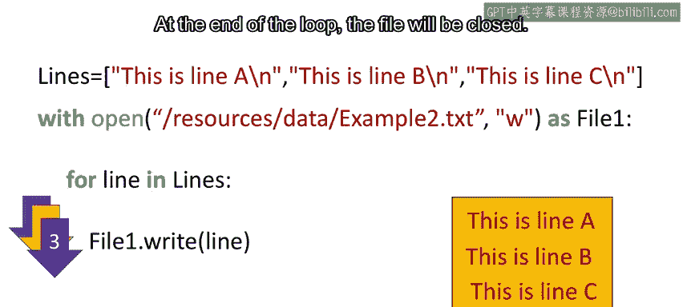

## 追加模式

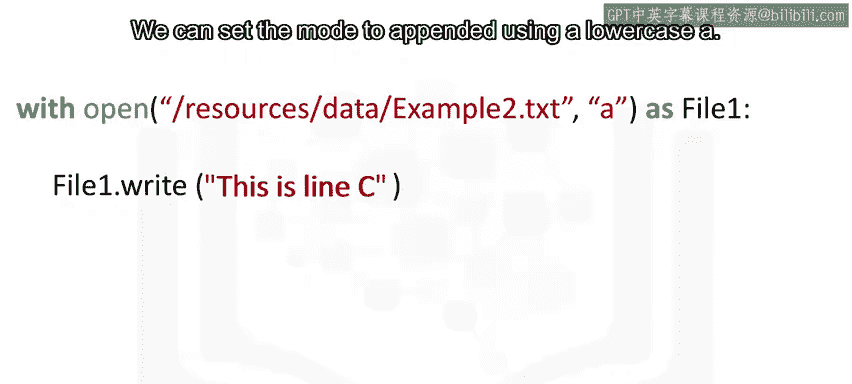

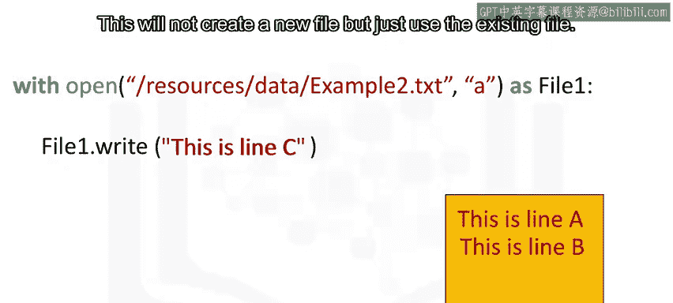

我们可以将模式设置为使用小写字母`"a"`的追加模式。这不会创建新文件，而是使用现有文件。如果我们调用`write`方法，它只会写入现有文件，然后添加`"this is line C"`，最后关闭文件。

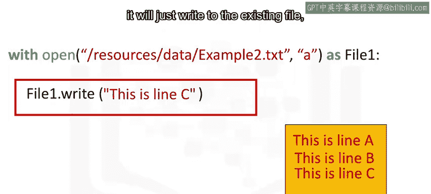

---

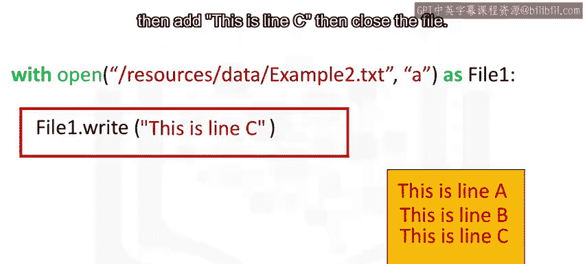

## 复制文件

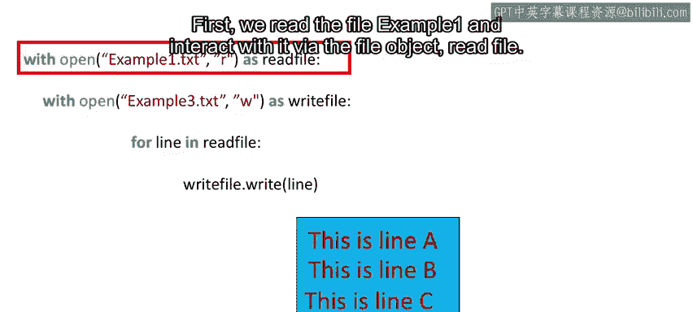

我们可以按以下方式将一个文件复制到新文件。首先，我们读取文件`example1`并通过文件对象`read_file`与其交互。然后，我们创建一个新文件`example3`，并使用文件对象`write_file`与其交互。

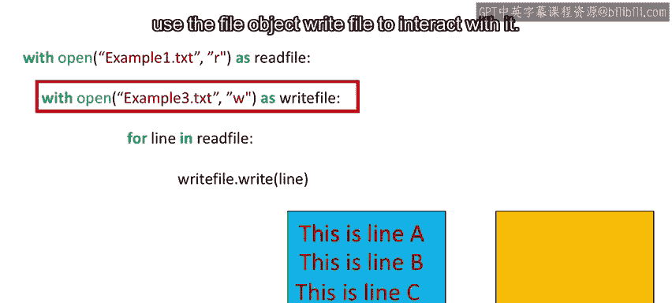

`for`循环从文件对象`read_file`中读取一行，并使用文件对象`write_file`将其存储到文件`example3`中。第一次迭代复制第一行。第二次迭代复制第二行，直到文件结束。然后两个文件都将被关闭。

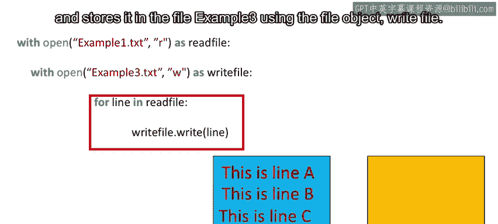

---

## 总结

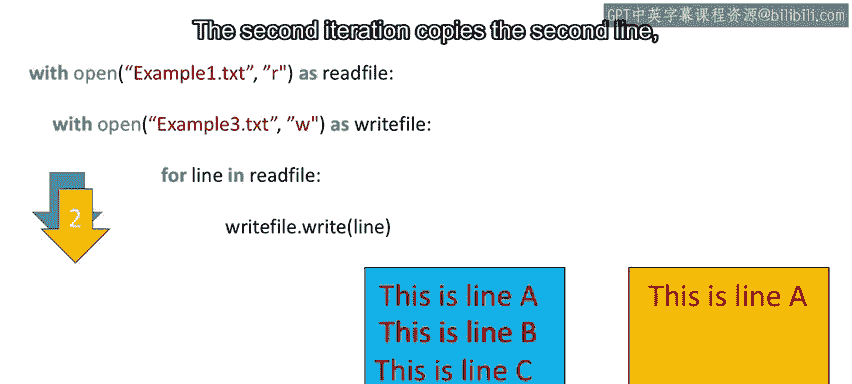

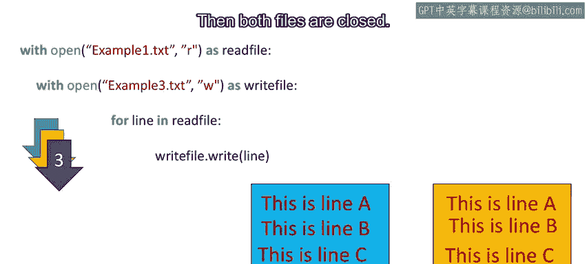

在本节课中，我们一起学习了如何使用Python的`open`函数进行文件写入操作。我们掌握了创建新文件、写入文本、追加内容以及复制文件的基本方法。请查看实验部分以获取更多示例。