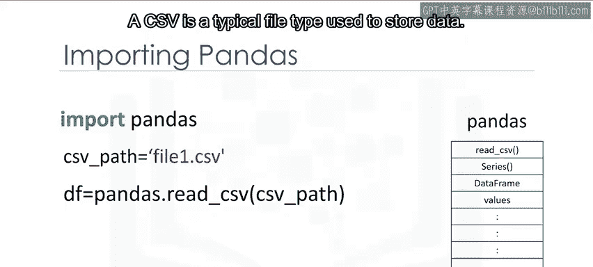
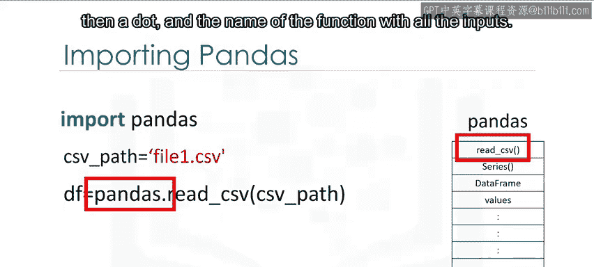
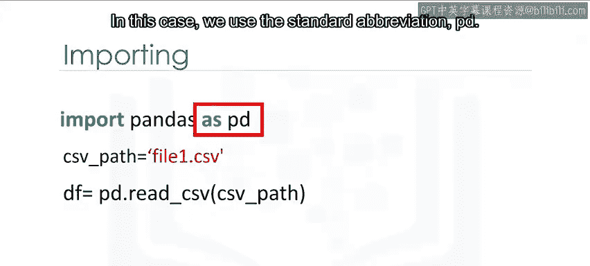
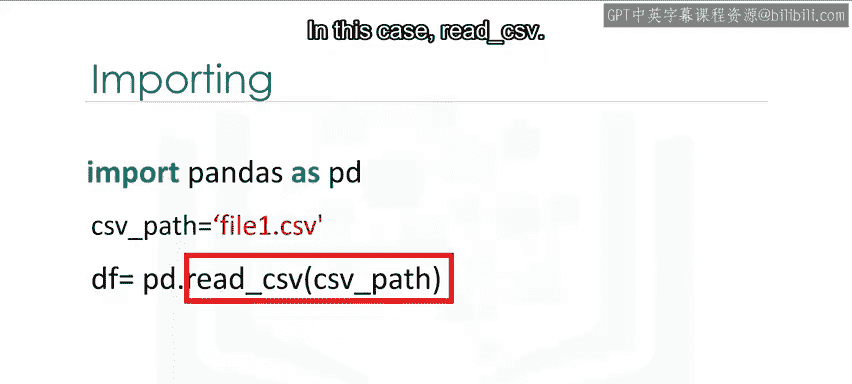
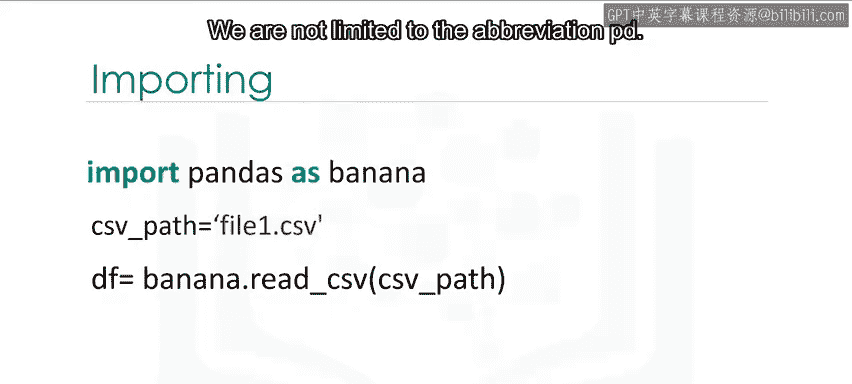
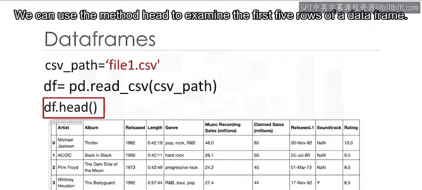
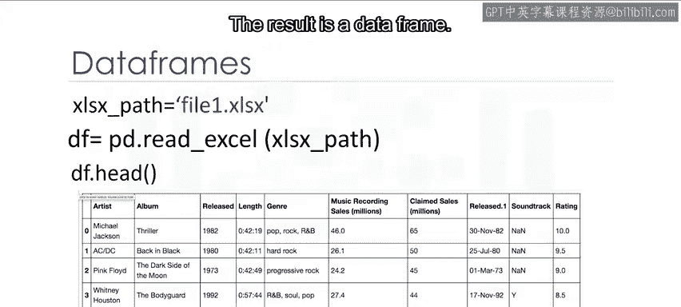

# 079：使用Pandas加载数据 📊

在本节课中，我们将要学习如何使用Python的Pandas库来加载和处理数据。Pandas是一个强大的数据分析库，它提供了简单易用的数据结构和数据分析工具，是进行数据科学和人工智能项目的基础。


## 概述：什么是依赖库？


依赖库或库是预先编写好的代码，用于帮助解决特定问题。在数据分析领域，Pandas是一个非常流行的库。

## 导入Pandas库

要使用Pandas，我们首先需要将其导入到Python环境中。我们使用`import`命令，后跟库的名称。

```python
import pandas
```

执行此命令后，我们就可以访问Pandas中大量预构建的类和函数。这假设该库已经安装在我们的环境中。在本课程的实验环境中，所有必要的库都已预先安装。

为了简化代码，我们通常使用`as`语句为库创建一个简短的别名。对于Pandas，标准的别名是`pd`。

```python
import pandas as pd
```

现在，我们可以使用`pd`来调用Pandas的所有功能，这比每次都输入`pandas`要方便得多。


## 加载CSV文件


CSV（逗号分隔值）是一种常用于存储数据的文件格式。Pandas提供了`read_csv()`函数来读取这种文件。




以下是加载CSV文件的基本步骤：
1.  指定CSV文件的路径。
2.  使用`pd.read_csv()`函数读取文件。
3.  将读取的结果存储在一个变量中，这个变量通常被称为**数据框**。




```python
path = ‘file.csv‘
df = pd.read_csv(path)
```




在上面的代码中：
*   `path`变量存储了CSV文件的路径。
*   `pd.read_csv(path)`是调用读取CSV文件的函数。
*   `df`是存储结果的变量，它是“data frame”（数据框）的缩写。



现在，数据已经加载到名为`df`的数据框中，我们可以开始对其进行操作。例如，使用`.head()`方法可以查看数据框的前五行。

```python
df.head()
```




## 加载Excel文件

加载Excel文件的过程与加载CSV文件类似。我们使用`read_excel()`函数，并传入Excel文件的路径。


```python
path = ‘file.xlsx‘
df_excel = pd.read_excel(path)
```

同样，结果`df_excel`也是一个Pandas数据框。


## 理解数据框


数据框是Pandas的核心数据结构，它由行和列组成，类似于一个电子表格或SQL表。


我们不仅可以从文件创建数据框，还可以直接从Python字典创建。在字典中，键（keys）对应数据框的列标签，值（values）是对应行的数据列表。

```python
# 创建一个字典
data = {
    ‘Name‘: [‘Alice‘, ‘Bob‘, ‘Charlie‘],
    ‘Age‘: [25, 30, 35],
    ‘City‘: [‘New York‘, ‘London‘, ‘Tokyo‘]
}

# 将字典转换为数据框
df_from_dict = pd.DataFrame(data)
```




创建的数据框`df_from_dict`将直接反映字典的结构：键成为列标题，列表成为行数据。



## 从数据框中选择列

创建或加载数据框后，我们经常需要从中选择特定的列进行分析。

以下是选择单列的方法。我们使用数据框的名称，后跟用双括号括起来的列名。

```python
single_column_df = df[[‘Column_Name‘]]
```

结果`single_column_df`是一个新的数据框，只包含原始数据框中的指定列。

同样，我们可以选择多列。只需在双括号内列出所有需要的列名。

```python
multiple_columns_df = df[[‘Column1‘, ‘Column2‘, ‘Column3‘]]
```

结果`multiple_columns_df`是一个由指定列组成的新数据框。


## 总结

本节课中我们一起学习了Pandas库的基础知识。我们了解了如何导入Pandas库并使用别名`pd`，掌握了使用`read_csv()`和`read_excel()`函数从文件加载数据到数据框的方法。我们还学习了数据框的基本概念，如何从字典创建数据框，以及如何从已有的数据框中选择单列或多列数据。这些是使用Pandas进行数据处理和分析的第一步。