# 080：Pandas数据处理与保存 📊

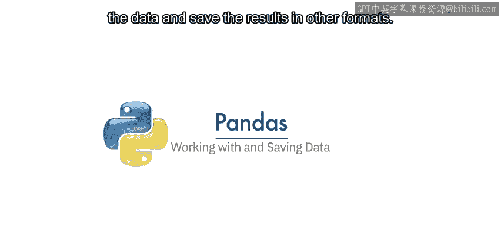

在本节课中，我们将学习如何使用Pandas库处理和保存数据。我们将重点介绍如何从数据框中提取唯一值、基于条件筛选数据，以及如何将处理后的结果保存到文件中。

---


上一节我们介绍了数据框的基本概念。本节中，我们来看看如何对数据框中的数据进行具体操作。


当我们拥有一个数据框时，我们可以处理其中的数据，并将结果保存为其他格式。


考虑一堆由13个不同颜色方块组成的积木。我们可以看到其中包含三种独特的颜色。

假设你想找出数据框某一列中有多少个唯一元素。当数据量从13个元素增加到数百万个时，这项任务会变得困难得多。

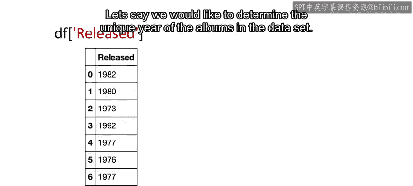

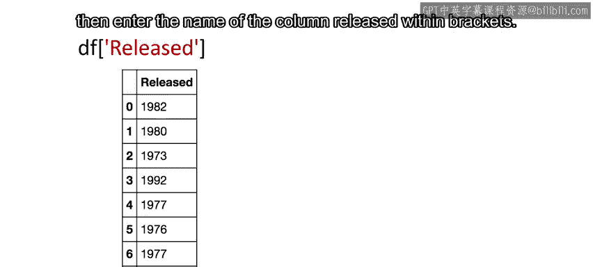

Pandas提供了 `unique` 方法来确定数据框某一列中的唯一元素。

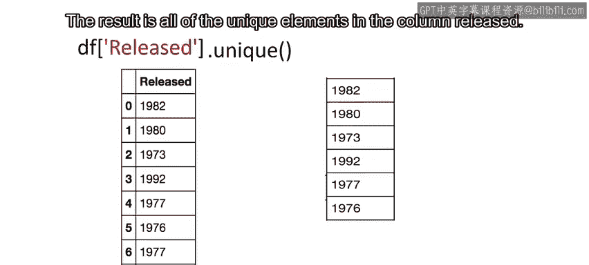

假设我们想确定数据集中专辑发行年份的唯一值。我们输入数据框的名称，然后在方括号内输入列名 `released`。接着，我们应用 `unique` 方法。结果就是 `released` 列中的所有唯一元素。

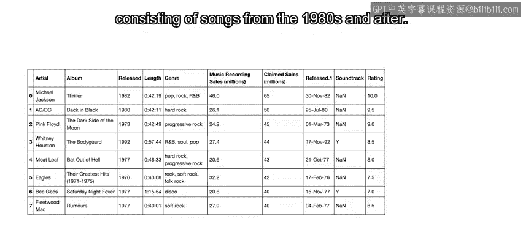

以下是获取唯一值的代码示例：
```python
unique_years = df['released'].unique()
```

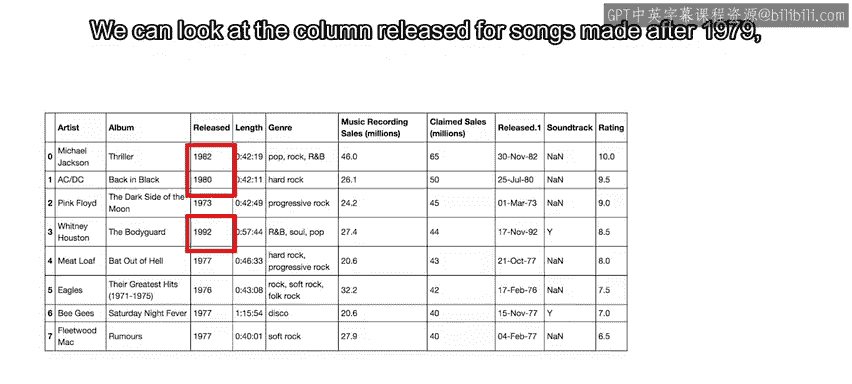

假设我们想创建一个由1980年代歌曲组成的新数据库。我们可以先查看 `released` 列中发行年份晚于1979年的歌曲，然后选择对应的行。

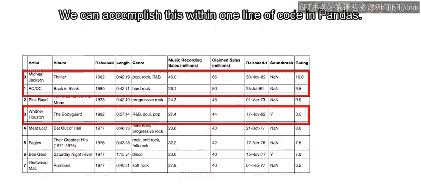

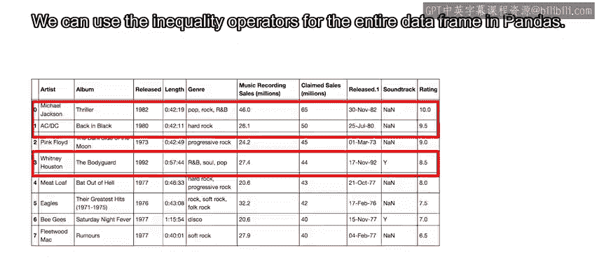

我们可以在Pandas中用一行代码完成这个操作，但让我们先分解步骤。

我们可以在Pandas中对整个数据框使用不等式运算符。结果是一个布尔值序列。在我们的例子中，我们只需指定 `released` 列以及“晚于1979年”的不等式条件。结果是一个布尔值序列，当条件为真时结果为 `True`，否则为 `False`。

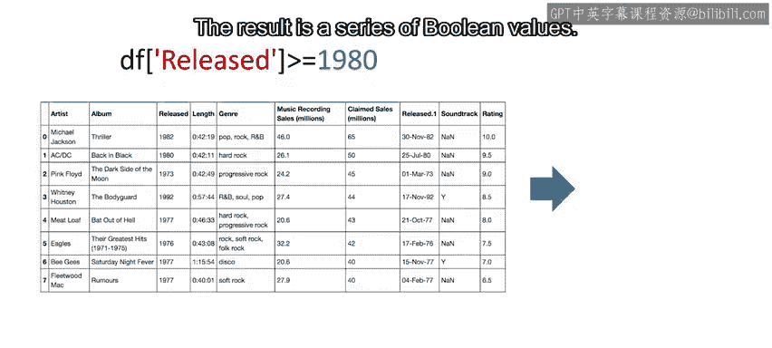

以下是创建布尔掩码的代码示例：
```python
mask = df['released'] > 1979
```

我们可以在一行代码中选择指定的列。我们只需使用数据框的名称，并在方括号中放入前面提到的不等式条件，然后将其赋值给变量 `DF1`。现在，我们得到了一个新的数据框，其中每张专辑的发行年份都晚于1979年。

以下是筛选数据的代码示例：
```python
DF1 = df[df['released'] > 1979]
```

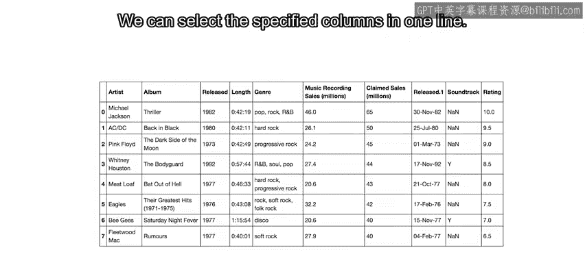

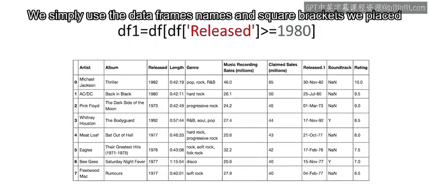

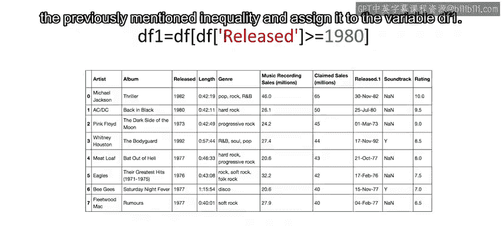

我们可以使用 `to_csv` 方法保存新的数据框。参数是CSV文件的名称。请确保包含 `.csv` 扩展名。还有其他函数可以将数据框保存为其他格式。

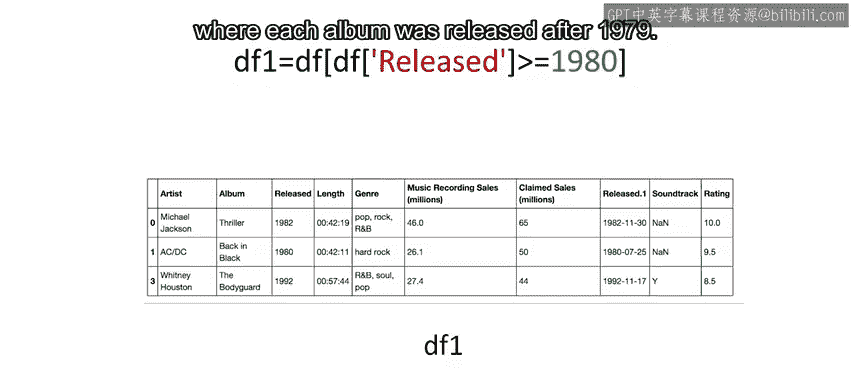

以下是保存数据框的代码示例：
```python
DF1.to_csv('songs_after_1979.csv')
```

---


本节课中，我们一起学习了如何使用Pandas的 `unique` 方法查找列中的唯一值，如何通过布尔索引基于条件筛选数据行，以及如何使用 `to_csv` 方法将处理后的数据框保存为CSV文件。这些是数据清洗和预处理中的基础且重要的操作。