# 083：简单API 第1部分 🚀

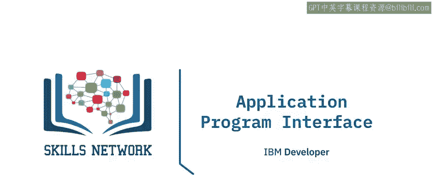

在本节课中，我们将学习应用程序接口，简称API。我们将探讨API是什么、API库、REST API（包括请求和响应），并通过一个使用Pycoin Gecko的实例来加深理解。

## 什么是API？🤔

API让两个软件组件能够相互通信。例如，你有一个程序、一些数据以及其他软件组件。你可以通过API，利用输入和输出来与其他软件通信。这就像一个函数，你无需了解API的内部工作原理，只需知道其输入和输出即可。

Pandas库实际上就是一组软件组件，其中许多甚至不是用Python编写的。你有一些数据和一组软件组件，通过Pandas API与其他软件组件通信来处理数据。

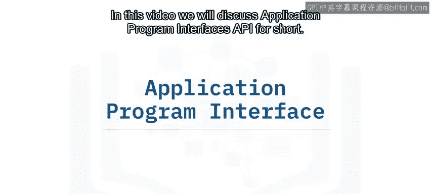

## API库示例：Pandas 📊

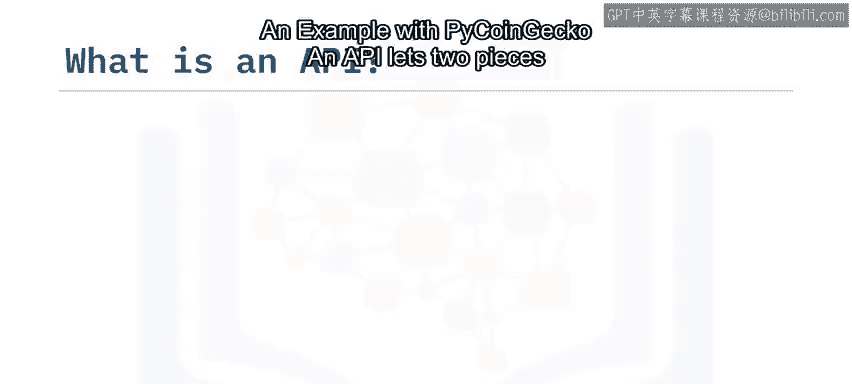

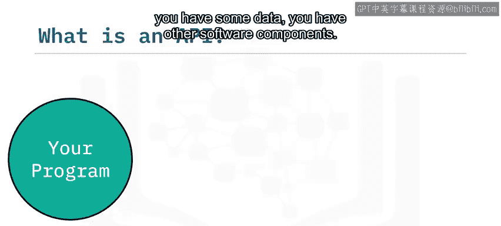

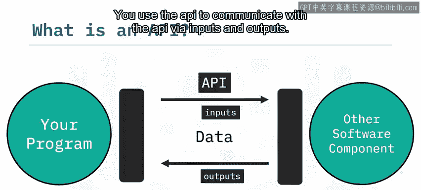

让我们通过一个图表来理清概念。当你创建一个字典，然后使用DataFrame构造函数创建一个Pandas对象时，这在API术语中称为一个**实例**。字典中的数据被传递给Pandas API。然后，你使用这个DataFrame对象与API通信。

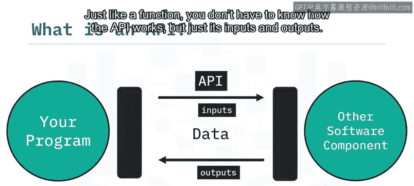

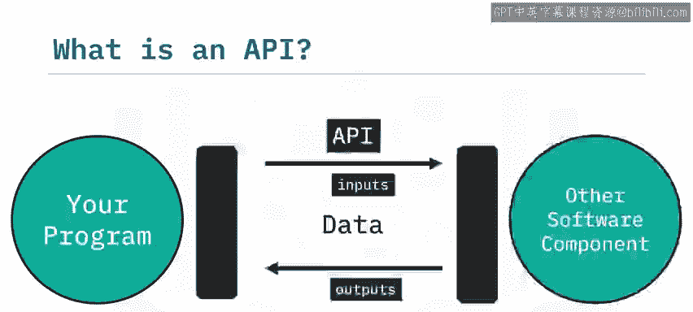

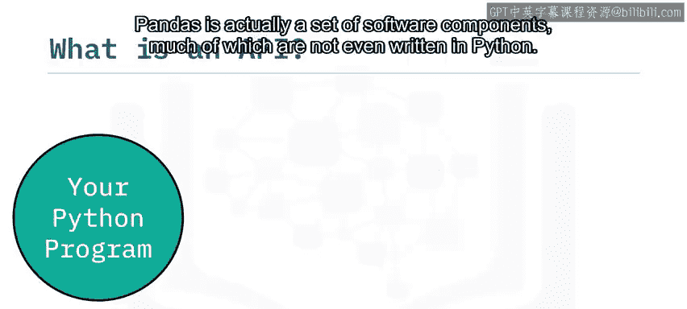

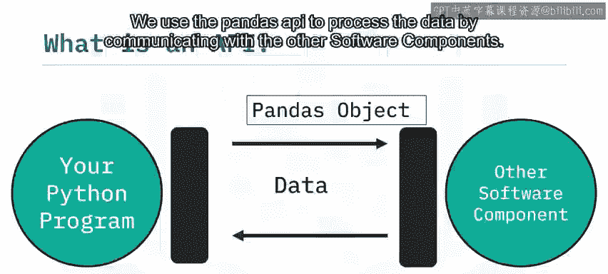

以下是使用Pandas API的典型步骤：

1.  创建数据字典并实例化DataFrame。
2.  调用`head`方法时，DataFrame与API通信，显示数据的前几行。
3.  调用`mean`方法时，API会计算平均值并返回结果。

```python
import pandas as pd

# 1. 创建数据字典并实例化DataFrame
data = {'列A': [1, 2, 3], '列B': [4, 5, 6]}
df = pd.DataFrame(data)  # 这是一个API实例

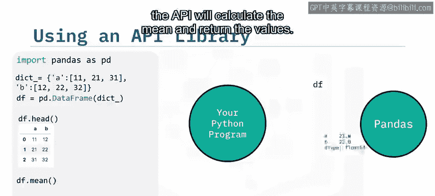

# 2. 使用head方法
print(df.head())

# 3. 使用mean方法
print(df.mean())
```

## 理解REST API 🌐

上一节我们介绍了通用的API概念，本节中我们来看看另一种流行的API类型：REST API。REST API允许你通过互联网进行通信，从而利用远程资源，如存储空间、更多数据、人工智能算法等。

REST代表**表征状态转移**。在REST API中，你的程序被称为**客户端**。API通过互联网与你调用的**Web服务**进行通信。通信遵循一套关于输入（即**请求**）和输出（即**响应**）的规则。

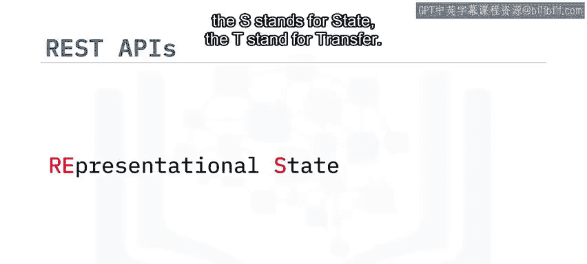

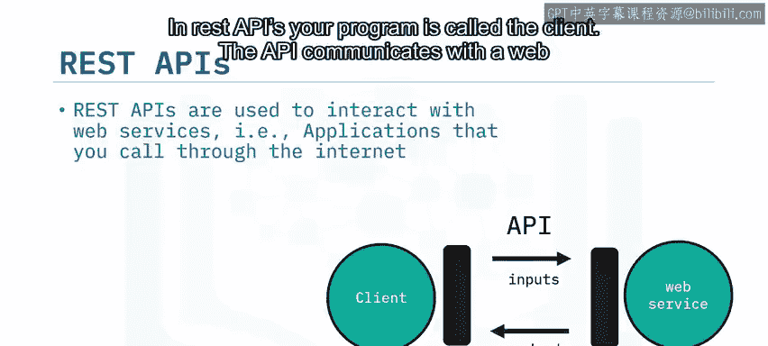

以下是REST API中的一些常见术语：

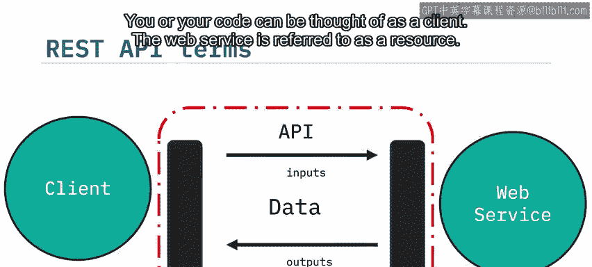

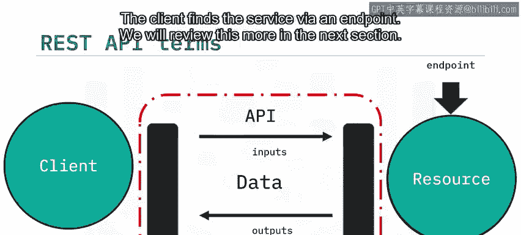

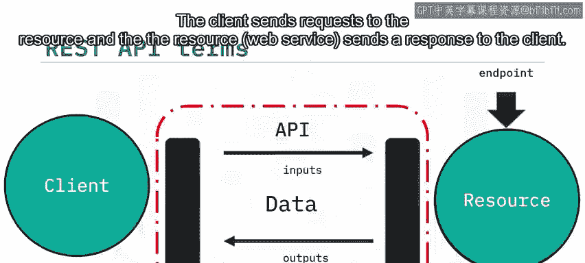

*   **客户端**：指你或你的代码。
*   **资源**：指Web服务。
*   **端点**：客户端通过端点找到服务（我们将在下一节详细讨论）。
*   **请求**：客户端发送给资源的信息。
*   **响应**：资源返回给客户端的信息。

## HTTP方法与请求响应 🔄

我们通过发送**请求**来告诉REST API要执行什么操作。请求通常通过HTTP消息传输，该消息通常包含一个JSON文件，其中包含我们希望服务执行的操作指令。这个操作通过互联网传输到Web服务，服务执行操作。

类似地，Web服务通过HTTP消息返回**响应**，信息通常以JSON文件形式返回，并传输回客户端。

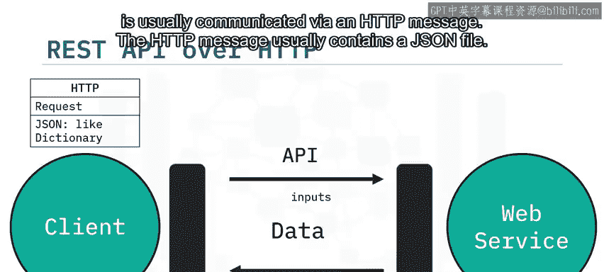

## 实践：使用Pycoin Gecko API获取加密货币数据 💹

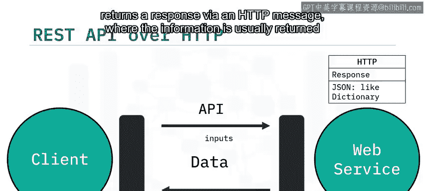

加密货币数据非常适合用于API实践，因为它不断更新且对交易至关重要。我们将使用Pycoin Gecko（CoinGecko API的Python客户端或封装器）来获取数据，该数据由CoinGecko每分钟更新。

我们使用这个封装器是因为它易于使用，让你可以专注于数据收集任务。我们还将介绍Pandas的时间序列函数来处理时间序列数据。

使用Pycoin Gecko收集数据很简单，只需三个步骤：

1.  安装并导入库。
2.  创建一个客户端对象。
3.  使用函数请求数据。

在下面的函数调用中，我们获取比特币过去30天以美元计价的数据。响应是一个JSON文件，在Python中表示为嵌套列表的字典，包含价格、市值和总交易量等数据，其中包含Unix时间戳和对应时间点的价格。

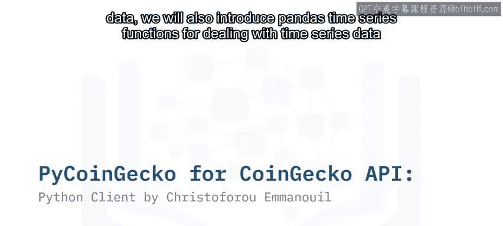

```python
# 示例代码结构
from pycoingecko import CoinGeckoAPI
import pandas as pd

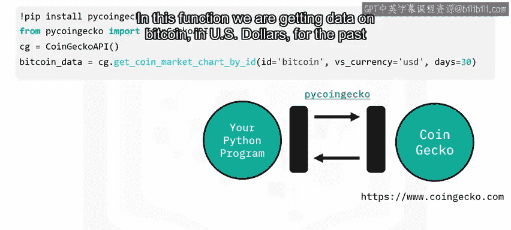

# 1. 创建客户端实例
cg = CoinGeckoAPI()

# 2. 请求数据
bitcoin_data = cg.get_coin_market_chart_by_id(id='bitcoin', vs_currency='usd', days=30)
# bitcoin_data 是一个包含‘prices’等键的字典
```

我们只关注价格数据，因此使用键`'prices'`来选取。为了简化操作，我们可以将嵌套列表转换为具有`timestamp`和`price`两列的DataFrame。

时间戳列不易阅读，我们将使用Pandas的`to_datetime`函数将其转换为更可读的格式。通过此函数，我们创建可读的时间数据，输入是时间戳列，时间单位设置为毫秒。我们将输出附加到新的`date`列。

为了绘制K线图，我们需要获取每日的K线数据。我们将按日期分组，找出每日的最低、最高、开盘（首笔）和收盘（末笔）价格。

最后，我们将使用Plotly库创建K线图并进行绘制。现在，我们可以通过打开生成的HTML文件并在浏览器标签页左上方点击“信任HTML”来查看K线图。

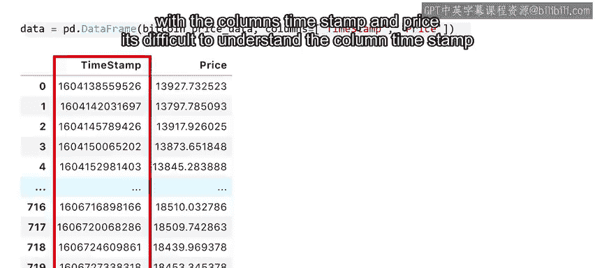


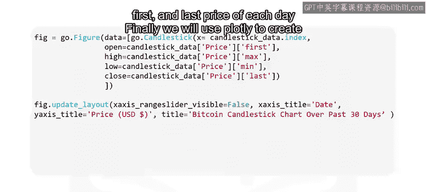

## 总结 📝


本节课我们一起学习了API的核心概念。我们首先了解了API如何作为软件组件间的通信桥梁，然后以Pandas为例探讨了API库的使用。接着，我们深入介绍了允许通过互联网进行通信的REST API，包括其客户端-服务器模型以及请求与响应的过程。最后，我们通过一个实际的Pycoin Gecko API案例，演示了如何获取、处理加密货币数据并绘制K线图，将理论应用于实践。